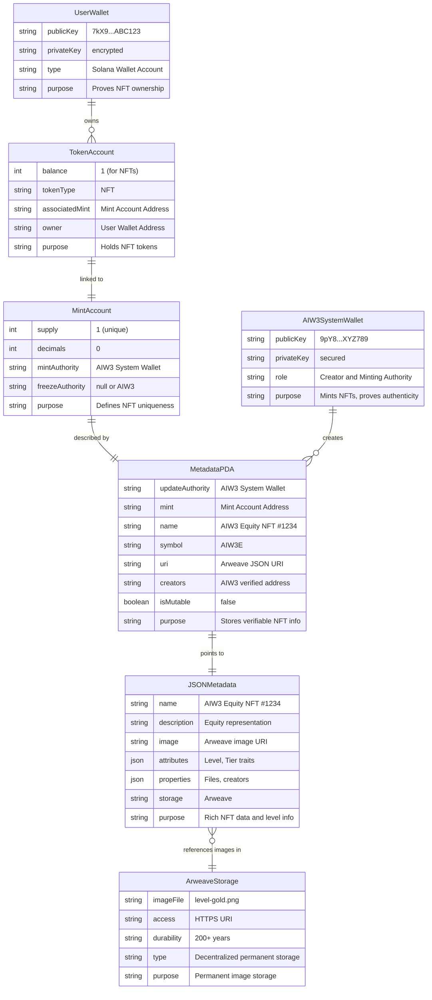

# AIW3 NFT Ecosystem Integration: Decentralized Level Storage and Authenticity Verification

## Executive Summary
This document analyzes the optimal hybrid approach for AIW3's Equity NFT lifecycle management, where the AIW3 system mints NFTs directly to user wallets (ensuring creator authenticity) while users retain full control over burning their NFTs. This hybrid model solves the critical authenticity verification challenge by maintaining a consistent, verifiable creator address while preserving user autonomy. The document evaluates alternative approaches for comprehensive decision-making and explains why this hybrid model is the recommended solution.

## NFT Lifecycle Overview

The complete AIW3 NFT lifecycle consists of three phases:
1. **MINT**: Creation of NFTs with embedded level/tier information
2. **USE**: Ecosystem integration where partners verify authenticity and access NFT data
3. **BURN**: Destruction of NFTs when users upgrade or exit

**Current Focus**: This document primarily addresses the **USE** phase (ecosystem integration), while also analyzing viable patterns for the complete lifecycle.

## NFT Lifecycle Patterns Analysis

### Minting Patterns

| Pattern | Description | AIW3 Implementation | Pros | Cons |
|---------|-------------|---------------------|------|------|
| **System-Direct Minting** | AIW3 system mints NFTs directly to user wallets without transfer | ✅ **Current Approach** | No ownership transfer needed, efficient, lower gas costs | System controls minting authority |
| **User-Initiated Minting** | Users trigger minting themselves, paying fees | Not adopted | Users have control, decentralized | Higher user friction, gas costs borne by users |
| **Delegated Minting** | Third-party services mint on behalf of AIW3 | Not adopted | Outsourced complexity | Trust dependency, coordination overhead |
| **Batch Minting** | Multiple NFTs minted in single transaction | Possible enhancement | Cost-efficient for bulk operations | More complex implementation |

**Key Point**: With Solana/Metaplex, when minting an NFT, you can specify the owner wallet directly during creation. This means **no ownership transfer occurs** - the user becomes the initial and immediate owner upon minting.

### Burning Patterns

| Pattern | Description | AIW3 Implementation | Pros | Cons |
|---------|-------------|---------------------|------|------|
| **User-Controlled Burning** | NFT owners burn their own NFTs | ✅ **Current Approach** | User autonomy, truly decentralized | Users must initiate and pay fees |
| **System-Triggered Burning** | AIW3 system burns NFTs (requires user approval) | Not adopted | Automated workflows possible | Requires complex permission system |
| **Time-Based Burning** | NFTs auto-burn after expiration | Not adopted | Automatic cleanup | Smart contract complexity |
| **Conditional Burning** | Burn triggered by specific events/conditions | Not adopted | Advanced automation | High complexity, potential bugs |

### Use Phase Integration Patterns

| Pattern | Description | Implementation Status | Ecosystem Benefit |
|---------|-------------|----------------------|-------------------|
| **Metadata-Based Verification** | Partners read level from NFT metadata | ✅ **Recommended** | Standard, widely supported |
| **Smart Contract Registry** | On-chain registry for authenticity verification | 📋 **Planned** | Trustless verification |
| **API Gateway** | Centralized API for ecosystem integration | 🔄 **Optional** | Easy integration for traditional systems |
| **Direct Blockchain Queries** | Partners query blockchain directly | ✅ **Always Available** | No intermediaries, most decentralized |

### Recommended Lifecycle Pattern for AIW3

```
1. MINT: System-Direct Minting
   └── AIW3 system mints NFT directly to user wallet
   └── User becomes immediate owner (no transfer)
   └── Level embedded in metadata as trait
   └── Image stored on Arweave with URI in metadata

2. USE: Creator + Metadata Verification
   └── Partners verify authenticity via creator field check
   └── Level queried from metadata attributes
   └── Images retrieved via Arweave URIs in metadata
   └── Optional API for traditional system integration

3. BURN: User-Controlled Burning
   └── User initiates burn transaction
   └── Associated Token Account closed
   └── Burn verifiable via blockchain state
```

## Solana NFT Data Structure and Ownership (Metaplex Standard)

To correctly implement the solution, it's crucial to understand how Solana NFTs work. An NFT isn't a single object but a system of related accounts on the blockchain, governed by standards like Metaplex Token Metadata. This structure clearly separates the NFT's descriptive data from its ownership.

### Core Concepts and Relationships

1.  **Who owns the NFT? (The Token Account)**: The actual owner of an NFT is the wallet that holds the **Token Account** associated with that NFT's Mint. This Token Account contains a balance of 1 token. For our use case, when the **AIW3 system mints the NFT**, it creates the Mint and then directly creates the associated Token Account in the **user's wallet**, making them the immediate owner. There is no separate "owner" field in the metadata; ownership is proven by possession of the token.

2.  **What is the NFT? (The Mint Account)**: This is a standard Solana Token Program account that defines the NFT as a unique asset. It has a total supply of 1 and 0 decimal places. Its public key (address) serves as the unique ID for the NFT.

3.  **What describes the NFT? (The On-Chain Metadata PDA)**: This is a Program Derived Address (PDA) account controlled by the Metaplex Token Metadata program. It's linked to the Mint Account and stores essential, verifiable data directly on the Solana blockchain.

4.  **Where is the rich data? (The Off-Chain JSON Metadata)**: The on-chain Metadata PDA contains a `uri` field. This URI points to an external JSON file stored on a decentralized network like Arweave. This JSON file contains richer details like the description, image link, and custom attributes (e.g., "Level").

### Data Flow for Verification

Here is the step-by-step flow a third-party partner would use to verify an NFT and get its level:

```
1. User presents their Wallet Address.
   │
   └── 2. Partner queries the Solana blockchain for all Token Accounts owned by that wallet.
       │
       └── 3. Filter for tokens with a supply of 1 (these are NFTs). For a specific NFT, get its Mint Address.
           │
           └── 4. Find the On-Chain Metadata PDA associated with the Mint Address.
               │
               ├── 5. Verify Authenticity: Check if the `creators` array in the on-chain metadata contains AIW3's official public key and is marked as `verified: true`.
               │
               └── 6. Get Rich Data: Read the `uri` field from the on-chain metadata.
                   │
                   └── 7. Fetch the Off-Chain JSON file from the `uri` (e.g., from Arweave).
                       │
                       ├── 8. Read NFT Level: Parse the JSON and read the `value` from the `attributes` array where `trait_type` is "Level".
                       │
                       └── 9. Retrieve NFT Image: Parse the JSON and get the URI from the `image` field to display the corresponding image.
```

### 1. On-Chain Metadata Account Details

This data is stored directly on the Solana blockchain and is the foundation of trust.

| Field | Type | Source | Required | Description & AIW3 Usage |
|---|---|---|---|---|
| `update_authority` | `Pubkey` | AIW3 | Yes | The public key authorized to change this metadata. This will be the AIW3 system wallet. After minting, this authority can be revoked to make the NFT immutable. |
| `mint` | `Pubkey` | Solana | Yes | The public key of the NFT's Mint Account. This is the unique identifier for the NFT, generated by Solana during the minting process. |
| `data.name` | `String` | AIW3 | Yes | The name of the NFT (e.g., "AIW3 Equity NFT #1234"). |
| `data.symbol` | `String` | AIW3 | Yes | The symbol for the NFT collection (e.g., "AIW3E"). |
| `data.uri` | `String` | AIW3 | Yes | The URI pointing to the off-chain JSON metadata file stored on Arweave. This links the on-chain and off-chain worlds. |
| `data.creators` | `Vec<Creator>` | AIW3 | Yes | A list of creators. **This is the core of authenticity verification.** The first creator will be the AIW3 system's public key, which must be signed and verified (`verified: true`) during the minting process. Partners check this verified address. |
| `is_mutable` | `bool` | AIW3 | Yes | A flag indicating if the metadata can be changed. For AIW3 Equity NFTs, this should be set to `false` after minting to guarantee data permanence and trust. |

### 2. Off-Chain JSON Metadata Details

The `uri` from the on-chain data points to this JSON file. Its structure should follow the Metaplex Token Metadata Standard to ensure compatibility with wallets, explorers, and marketplaces. While you can add custom attributes, the base structure is conventional.

**Example JSON Structure (Stored on Arweave):**

```json
{
  "name": "AIW3 Equity NFT #1234",
  "symbol": "AIW3E",
  "description": "Represents a user's equity and status within the AIW3 ecosystem. Authenticity is verified by the creator address on-chain.",
  "image": "https://arweave.net/ARWEAVE_IMAGE_HASH",
  "external_url": "https://aiw3.io",
  "attributes": [
    {
      "trait_type": "Level",
      "value": "Gold"
    },
    {
      "trait_type": "Tier",
      "value": "3"
    }
  ],
  "properties": {
    "files": [
      {
        "uri": "https://arweave.net/ARWEAVE_IMAGE_HASH",
        "type": "image/png"
      }
    ],
    "creators": [
      {
        "address": "AIW3_SYSTEM_WALLET_PUBLIC_KEY",
        "share": 100
      }
    ]
  }
}
```

### How NFT Images are Handled

Just like the "Level" attribute, the NFT's image is linked via the off-chain JSON metadata. Storing large files like images directly on the blockchain is prohibitively expensive.

The process is as follows:
1.  **Upload Image**: The image file for each level (e.g., `level-gold.png`) is uploaded to a permanent, decentralized storage network like Arweave. This upload provides a unique and immutable URI for the image (e.g., `https://arweave.net/ARWEAVE_IMAGE_HASH`).
2.  **Link in JSON**: This Arweave URI is placed into the `image` field of the off-chain JSON metadata file. The `properties.files` array also references this URI, providing additional context like the file type.
3.  **Link to On-Chain**: The JSON file itself is then uploaded to Arweave, and its URI is stored in the `data.uri` field of the on-chain metadata account during the minting process.

This creates a verifiable chain of pointers:
`On-Chain Metadata` → `Off-Chain JSON URI` → `JSON File` → `Image URI` → `Image File`

An ecosystem partner, wallet, or marketplace follows this chain to reliably fetch and display the correct image for the NFT, ensuring the visual representation matches the on-chain asset.

**Clarification on Storing NFT Level:**
The NFT "Level" is **not stored directly on-chain**. It is stored in the `attributes` array of the **off-chain** JSON metadata file. Third parties access this information by following the data flow described above: they get the `uri` from the on-chain data and then fetch the JSON file from that `uri` to read the level. This is the standard, scalable, and cost-effective method used across the NFT ecosystem.

This structure directly enables the recommended solution:
- **Authenticity Verification**: Partners check the `creators` array in the **on-chain** metadata for a verified AIW3 address.
- **Level Information Storage**: Partners read the `attributes` array from the **off-chain** JSON metadata to find the "Level" or "Tier".

## AIW3 NFT Ecosystem Entity Relationship Diagram



### Verification Flow Diagram

```mermaid
flowchart TD
    A["User provides Wallet Address"] --> B["Query Solana: Find Token Accounts"]
    B --> C["Filter: Token Accounts with balance = 1"]
    C --> D["Extract: Mint Account addresses"]
    D --> E["Derive: Metadata PDA from Mint"]
    E --> F["Verify: creators[0] == AIW3 address && verified == true"]
    F --> |Valid| G["Read: URI field from metadata"]
    F --> |Invalid| H["❌ Reject: Not authentic AIW3 NFT"]
    G --> I["Fetch: JSON metadata from Arweave URI"]
    I --> J["Extract: Level from attributes array"]
    I --> K["Extract: Image URI from image field"]
    J --> L["✅ Display: User's NFT level"]
    K --> M["✅ Display: NFT image"]

    style A fill:#e1f5fe
    style L fill:#c8e6c9
    style M fill:#c8e6c9
    style H fill:#ffcdd2
```



### Data Flow Architecture


### Key Relationships and Principles

**Entity Relationships:**
- `User Wallet` **1:N** `Token Account` (one wallet can own multiple NFTs)
- `Token Account` **1:1** `Mint Account` (each token account holds one specific mint)
- `Mint Account` **1:1** `Metadata PDA` (each NFT has one metadata account)
- `AIW3 System Wallet` **1:N** `Metadata PDA` (system creates multiple NFTs)
- `Metadata PDA` **1:1** `JSON Metadata` (each metadata points to one JSON file)
- `JSON Metadata` **N:1** `Arweave Storage` (multiple JSONs can reference same images)

**Key Principles:**
- **Ownership**: Proven by Token Account possession in User Wallet
- **Authenticity**: Verified through AIW3 address in Metadata PDA creators field
- **Level Data**: Stored as attributes in off-chain JSON Metadata
- **Images**: Referenced via URIs pointing to Arweave Storage
- **No Transfer**: Direct minting to user wallet ensures immediate ownership

## Key Challenges
1. **Level Information Storage**: Efficiently storing and accessing NFT level information without centralized bottlenecks
2. **Authenticity Verification**: Ensuring third parties can validate that an NFT originated from AIW3 and not another platform
3. **Image/Artwork Storage**: Properly storing visual assets while maintaining decentralization and cost-effectiveness
4. **Ecosystem Integration**: Enabling seamless verification by DeFi protocols, marketplaces, and other blockchain applications

## Image/Artwork Storage Solutions

### Challenge Overview
Each AIW3 Equity NFT requires visual representation (artwork/images) that must be:
- Permanently accessible
- Tamper-resistant
- Cost-effective to store
- Decentralized to avoid single points of failure

### Storage Options Analysis

#### Option 1: Arweave Permanent Storage
- **Description**: Store images on Arweave's permanent, pay-once storage network
- **Advantages**:
  - Truly permanent storage (200+ years guaranteed)
  - Decentralized network with global replication
  - One-time payment model
  - Cryptographically verifiable content
- **Disadvantages**:
  - Higher upfront cost (~$5-20 per MB depending on network conditions)
  - Less flexible for updates (immutable by design)
- **Evaluation**:
  - **Decentralization**: Excellent ✅
  - **Permanence**: Excellent ✅
  - **Cost**: Moderate (one-time) 💰💰
  - **Recommendation**: **✅ Recommended** for high-value, permanent NFTs

#### Option 2: IPFS (InterPlanetary File System)
- **Description**: Store images on IPFS, the distributed peer-to-peer file system
- **Sub-options**:
  - **2a. IPFS with Pinning Services**: Use services like Pinata, Infura, or Web3.Storage
  - **2b. Self-hosted IPFS Nodes**: Run your own IPFS infrastructure
  - **2c. Community Pinning**: Rely on community nodes (higher risk)
- **Advantages**:
  - Content-addressed storage (tamper-evident)
  - Lower initial costs than Arweave
  - Excellent ecosystem support
  - Flexible deployment options
  - Can be accessed via HTTP gateways
  - Popular choice in NFT ecosystem
- **Disadvantages**:
  - Requires ongoing maintenance/pinning costs
  - Risk of content becoming unavailable if not properly pinned
  - Less permanent than Arweave without proper redundancy
  - Gateway dependency for web access
- **Evaluation**:
  - **Decentralization**: Good ✅
  - **Permanence**: Moderate (depends on pinning strategy) ⚠️
  - **Cost**: Lower ongoing 💰
  - **Ecosystem Support**: Excellent ✅
  - **Recommendation**: **✅ Recommended** for projects prioritizing cost-effectiveness and ecosystem compatibility

#### Option 3: Hybrid Approach
- **Description**: Use IPFS for immediate availability, migrate to Arweave for permanence
- **Advantages**:
  - Best of both worlds
  - Cost optimization over time
  - Flexible migration strategy
- **Disadvantages**:
  - More complex implementation
  - Requires migration logic
- **Evaluation**:
  - **Flexibility**: Excellent ✅
  - **Complexity**: Higher 🔴
  - **Recommendation**: For sophisticated implementations

### **Recommended Image Storage Strategy**

**For AIW3 Equity NFTs**: Use **Arweave** for the following reasons:
1. **Permanence**: Equity NFTs represent long-term value and status
2. **Trust**: Partners need confidence that images won't disappear
3. **Ecosystem Integration**: Many Solana NFT tools expect Arweave URIs
4. **Cost Justification**: One-time cost for permanent storage aligns with NFT value proposition

## Level Information Storage Solutions

### 1. Metadata Attributes (Recommended)
- **Description**: Use the existing Metaplex Metadata standard to include "Level" as a trait in each NFT's off-chain JSON metadata, following industry standards.
- **How it addresses requirements**:
  - **Issuer Verification**: Check the creator field in on-chain NFT metadata against known AIW3 system public key
  - **NFT Tier Access**: Read level/tier from off-chain JSON metadata attributes/traits
  - **Image Retrieval**: Access image URI stored in off-chain JSON metadata, pointing to Arweave storage
- **Advantages**:
  - Decentralized access to level information via standard metadata queries
  - Fully compatible with existing NFT ecosystem tools and wallets
  - Cost-effective as level data is stored in off-chain JSON (not directly on blockchain)
  - Leverages proven Metaplex Token Metadata standard
- **Evaluation**:
  - **Trust**: High, with authenticity verified via on-chain creator address
  - **Compatibility**: Excellent - works with all standard NFT tools
  - **Cost**: Very low - no additional blockchain storage costs
  - **Recommendation**: **✅ Recommended** as the primary solution

### 2. Smart Contract Verification
- **Description**: Deploy a smart contract on Solana specifically to manage and verify NFT level information.
- **How it addresses requirements**:
  - **Issuer Verification**: Smart contract maintains registry of authorized AIW3 mints and creators
  - **NFT Tier Access**: Contract functions return tier/level for any given NFT mint address
  - **Image Retrieval**: Contract can store or reference image URIs, or work with metadata
- **Advantages**:
  - Complete decentralization, eliminating reliance on off-chain data.
  - On-chain API enables real-time level verification by any network participant.
- **Disadvantages**:
  - **High Development Cost**: Smart contract development, testing, and auditing fees
  - **Ongoing Maintenance**: Contract upgrades and maintenance overhead
  - **Interaction Fees**: Additional transaction costs for partners to query contracts
  - **Unnecessary Complexity**: Creator address verification achieves the same goal more simply
- **Evaluation**:
  - **Trust**: Very high, but not significantly better than creator verification
  - **Cost-Effectiveness**: Poor due to development and maintenance overhead
  - **Recommendation**: **❌ Not Recommended** - Creator address verification is simpler and equally effective

### 3. Ecosystem Validation API (Supplementary)
- **Description**: Build a standardized REST API that provides additional validation and convenience features for ecosystem partners.
- **How it addresses requirements**:
  - **Issuer Verification**: API validates NFT against AIW3's registry while also checking on-chain creator data
  - **NFT Tier Access**: API endpoints return tier information parsed from on-chain metadata
  - **Image Retrieval**: API provides direct image URLs or proxies to Arweave storage
- **Advantages**:
  - Easy integration for traditional systems not yet blockchain-native
  - Can provide additional business logic and validation layers
  - Caches frequently accessed data for performance
  - Abstracts blockchain complexity for traditional developers
- **Disadvantages**:
  - Introduces centralization dependency
  - Requires additional infrastructure and maintenance
  - Should complement, not replace, direct blockchain verification
- **Evaluation**:
  - **Trust**: Moderate - provides convenience but partners should verify directly on-chain for critical operations
  - **Integration**: Excellent for traditional systems
  - **Recommendation**: **🔄 Optional** - Implement as supplementary service, not primary verification method

## Solution Architecture Analysis

### MECE Framework Application

**Mutually Exclusive Categories:**
1. **On-Chain Verification** (Creator address check)
2. **Off-Chain Data Storage** (JSON metadata with level attributes)  
3. **Permanent Storage** (Arweave for images and JSON)
4. **Optional API Layer** (REST API for traditional integrations)

**Collectively Exhaustive Coverage:**
- ✅ **Authenticity**: Covered by on-chain creator verification
- ✅ **Level Access**: Covered by off-chain JSON metadata attributes
- ✅ **Image Storage**: Covered by Arweave permanent storage
- ✅ **Integration**: Covered by direct blockchain access + optional API
- ✅ **Cost Efficiency**: Covered by hybrid on-chain/off-chain approach
- ✅ **Decentralization**: Covered by avoiding custom smart contracts
- ✅ **Standards Compliance**: Covered by Metaplex Token Metadata standard

### Solution Comparison Table

| Solution                   | Verify Issuer        | NFT Tier Query        | Image Retrieval       |
|----------------------------|----------------------|-----------------------|-----------------------|
| **On-Chain Creator Check** | Check creator field in NFT metadata. Requires a known public key. | Read level from off-chain JSON metadata attributes. | Yes, if URI is stored in metadata (typically via Arweave/IPFS). |
| **Smart Contract Registry**| Deploy a smart contract to record and verify issuers. | Can query using contract functions. | Yes, if images' URIs are stored on-chain. |
| **Smart Contract Signature** | NFT signed by AIW3's private key. Verify using AIW3's public key. | Not applicable; separate solution needed. | Not directly related; complementary metadata needed. |
| **Metadata with Attributes**| Use known attributes (e.g., creator ID) in metadata. | Include level as a metadata trait in off-chain JSON. | Common practice to include URI in metadata. |
| **Ecosystem Validation API** | Centralized API checks NFT authenticity via AIW3 registry. | API can provide tier info. | API can serve or link images. |

### SWOT Analysis by Solution

| Solution                   | Strengths                     | Weaknesses                | Opportunities              | Threats                         |
|----------------------------|-------------------------------|---------------------------|----------------------------|---------------------------------|
| **On-Chain Creator Check** | Fully decentralized, reliable | Requires known public key | Leverages existing metadata | Possible public key compromise. |
| **Smart Contract Registry**| Transparent, trustless        | High development/maintenance costs | Enhances on-chain trust   | Smart contract bugs             |
| **Smart Contract Signature** | Provides cryptographic proof | Not scalable alone        | Enhances credibility         | Key management issues           |
| **Metadata with Attributes**| Simple to implement          | Relies on off-chain data  | Wide tool support            | Manipulation of metadata        |
| **Ecosystem Validation API** | Easy integration            | Centralized control       | Provides additional context  | API may become obsolete         |

### Recommended Solution

**Primary Approach**: **Metadata Attributes + Creator Address Verification**

1. **Metadata Attributes**: Store tier/level information in off-chain JSON metadata as traits
2. **Creator Address Verification**: Partners verify authenticity by checking the creator field against AIW3's well-known system address
3. **Arweave Storage**: Use Arweave URIs in metadata for permanent image storage

**Key Benefits**:
- ✅ **Cost-Effective**: No smart contract development, audit, or maintenance costs
- ✅ **Simple Integration**: Partners can easily verify using standard Metaplex metadata
- ✅ **Fully Decentralized**: No additional on-chain infrastructure required
- ✅ **Industry Standard**: Leverages existing NFT verification patterns

**Implementation Requirements**:
- Maintain a consistent, well-known AIW3 system address for minting
- Publish the official AIW3 creator address publicly for partner verification
- Embed tier information as standard metadata traits in off-chain JSON

**Alternative Supplementary Approach**: **Ecosystem Validation API**
- Can be implemented as an optional integration layer for traditional systems
- Provides centralized convenience while maintaining on-chain verification as primary method
- Useful for partners who prefer REST API integration over direct blockchain queries

---

## Implementation Requirements Summary

### A. For AIW3 System Implementation:

**1. System Wallet Management**
- Maintain consistent public key for creator verification across all NFT mints
- Secure private key storage and access controls
- Document and publish official creator address for ecosystem partner verification

**2. Metadata Standards Compliance**  
- Follow Metaplex Token Metadata standard for full ecosystem compatibility
- Structure off-chain JSON metadata with required fields: name, symbol, description, image, attributes
- Include level information as trait in attributes array: `{"trait_type": "Level", "value": "Gold"}`

**3. Storage Implementation**
- Upload images to Arweave before minting to obtain permanent storage URIs
- Upload JSON metadata files to Arweave to obtain metadata URIs  
- Store metadata URI in on-chain `data.uri` field during minting process

**4. Minting Process**
- Set `is_mutable: false` after minting to guarantee permanence
- Include AIW3 system wallet as first creator with `verified: true`
- Mint directly to user wallet (no ownership transfer required)

### B. For Ecosystem Partners Integration:

**1. Authenticity Verification Process**
- Query user's wallet for Token Accounts with balance = 1 (NFTs)
- Derive Metadata PDA from NFT Mint Account address
- Verify `creators[0].address` matches published AIW3 address AND `verified == true`

**2. Level Data Access**
- Read `uri` field from verified on-chain metadata
- Fetch JSON metadata from Arweave URI
- Parse `attributes` array to find trait where `trait_type == "Level"`
- Extract level value for business logic implementation

**3. Image Display**
- Extract `image` field URI from JSON metadata
- Display image directly from Arweave permanent storage
- Implement fallback handling for network connectivity issues

**4. Error Handling & Fallbacks**
- Implement retry logic for Arweave network requests
- Cache frequently accessed metadata for performance
- Provide graceful degradation when off-chain data temporarily unavailable

### C. Technical Implementation Details:

**1. Required Dependencies**
- Solana Web3.js or Rust SDK for blockchain interactions
- Metaplex SDK for metadata operations  
- HTTP client for Arweave requests
- JSON parsing capabilities

**2. Key Functions Needed**
- `getTokenAccountsByOwner()` - Find user's NFTs
- `findMetadataPda()` - Derive metadata account address
- `getAccountInfo()` - Read on-chain metadata
- `fetch()` - Retrieve off-chain JSON from Arweave
- `parseAttributes()` - Extract level from metadata traits

**3. Integration Patterns**
- **Direct Integration**: Query blockchain directly for maximum decentralization
- **API Integration**: Use optional AIW3 validation API for simplified implementation
- **Hybrid Approach**: Combine direct verification with API convenience features

### Final Recommendation & Next Steps

The recommended approach prioritizes **simplicity, cost-effectiveness, and standards compliance** while maintaining full decentralization. 

**Primary Solution: Creator Address Verification + Metadata Attributes**
- Leverages existing Solana/Metaplex standards for maximum ecosystem compatibility
- Minimizes development complexity and ongoing maintenance costs
- Provides robust authenticity verification without custom smart contract overhead
- Stores level data efficiently in off-chain JSON metadata following industry patterns

**Implementation Priority:**
1. **Phase 1**: Implement core metadata-based verification system
2. **Phase 2**: Deploy optional REST API for traditional system integrations  
3. **Phase 3**: Develop SDK/libraries for common integration patterns

**Success Metrics:**
- Partner integration time < 2 weeks for blockchain-native systems
- Partner integration time < 1 week for API-based integrations
- 99.9% uptime for level data access via Arweave storage
- Zero custom smart contract vulnerabilities (by avoiding custom contracts)

This approach ensures AIW3 NFTs integrate seamlessly with the broader Solana ecosystem while providing partners with reliable, decentralized access to authenticity verification and level information.

