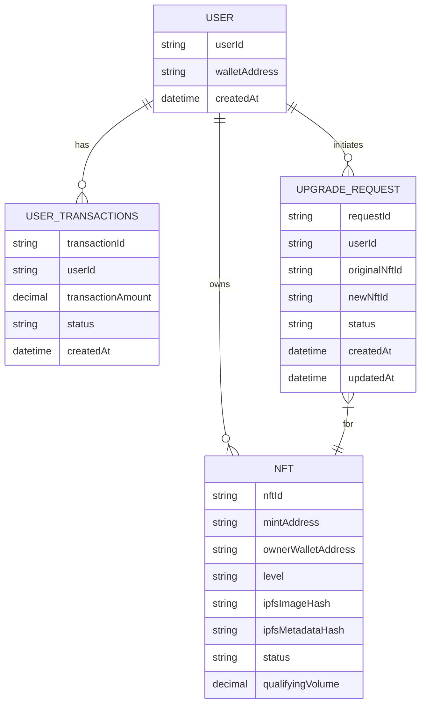

# AIW3 NFT Data Model

---

## Table of Contents

1. [On-Chain Data](#on-chain-data)
2. [Off-Chain Data](#off-chain-data)
3. [Data Model Relationships](#data-model-relationships)
4. [On-Chain Interaction Mapping](#on-chain-interaction-mapping)

---

## On-Chain Data

This section describes the data stored directly on the Solana blockchain for maximum security, decentralization, and trust.

### On-Chain Metadata Account Details

Data stored directly on **Solana blockchain** for trust and authenticity verification:

| Field | Type | Source | Required | Description & AIW3 Usage |
|-------|------|--------|----------|--------------------------|
| `update_authority` | `Pubkey` | AIW3 System Wallet | Yes | AIW3 System Wallet public key |
| `mint` | `Pubkey` | Solana | Yes | NFT's unique identifier |
| `data.name` | `String` | AIW3 System Wallet | Yes | NFT name (e.g., "Tech Chicken", "Quant Ape") |
| `data.symbol` | `String` | AIW3 System Wallet | Yes | Collection symbol (e.g., "AIW3E") |
| `data.uri` | `String` | AIW3 System Wallet | Yes | IPFS via Pinata URI for off-chain JSON |
| `data.creators` | `Vec<Creator>` | AIW3 System Wallet | Yes | **Core authenticity verification** |
| `is_mutable` | `bool` | AIW3 System Wallet | Yes | Set to `false` for permanence |

---

## Off-Chain Data

This section describes the data stored off-chain to provide flexibility and richer content.

### Off-Chain JSON Metadata Details

The `uri` field in the on-chain metadata contains an IPFS via Pinata link to this JSON file where the **actual Level data is stored** and **images are referenced via IPFS**:

```json
{
  "name": "On-chain Hunter",
  "symbol": "AIW3E",
  "description": "Represents Level 3 equity and status within the AIW3 ecosystem.",
  "image": "https://gateway.pinata.cloud/ipfs/QmImageHashExample123",
  "external_url": "https://aiw3.io",
  "attributes": [
    {
      "trait_type": "Level",
      "value": "3",
      "display_type": "number"
    },
    {
      "trait_type": "Name",
      "value": "On-chain Hunter",
      "display_type": "string"
    }
  ],
  "properties": {
    "files": [
      {
        "uri": "https://gateway.pinata.cloud/ipfs/QmImageHashExample123",
        "type": "image/png"
      }
    ],
    "creators": [
      {
        "address": "AIW3_SYSTEM_WALLET_PUBLIC_KEY",
        "share": 100
      }
    ]
  }
}
```

---

## Data Model Relationships

This diagram illustrates the relationships between the different data entities in the backend database.



---

## On-Chain Interaction Mapping

The AIW3 system interacts with the Solana blockchain in two ways: by calling custom-built smart contract functions for its unique business logic, and by utilizing standard Solana programs (like the SPL Token program) for common tasks.

| User Operation                  | On-Chain Interaction            | Interaction Type                | Description |
|---------------------------------|---------------------------------|---------------------------------|-------------|
| **Claiming a New NFT**          | `claim_nft(level)`              | **Custom Smart Contract**       | The AIW3 backend authorizes a user to call this function, which mints a new NFT of a specific level to their wallet. This is used for the initial Lv.1 claim and for system-awarded NFTs. |
| **Unlocking an Equity NFT**     | `unlock_tier(level)`            | **Custom Smart Contract**       | The core progression function. The AIW3 backend first verifies off-chain criteria (trading volume). If met, it authorizes the user to call this function. The program then performs on-chain checks: verifies ownership of the required *bound* Badge NFTs, confirms the user is unlocking the next sequential level, transfers the CGas fee, and mints the new Equity NFT directly into the `Active` state by calling the SPL Token program. |
| **Binding a Badge NFT**         | `bind_badge(badge_mint)`        | **Custom Smart Contract**       | A user calls this to "lock" a specific Badge NFT to their account, making it eligible to be counted toward an `unlock_tier` requirement. This prevents a single Badge NFT from being used for multiple simultaneous upgrades. |
| **Selling/Transferring an NFT** | `transfer(...)`                 | **Standard SPL Token Program**  | This is a standard token transfer. The AIW3 system does not need a custom function for this. Users can freely trade their NFTs on any marketplace that supports Solana NFTs. |
| **Burning an NFT**              | `burn(...)`                     | **Standard SPL Token Program**  | This is a standard token burn. It is used in the **Synthesis** process to destroy the lower-level NFT before the higher-level one is minted. |
