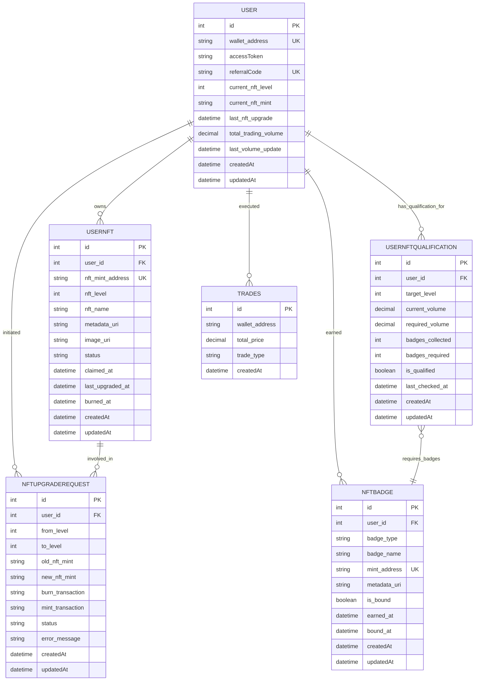

# AIW3 NFT Data Model

**Data Model Scope**: This document provides comprehensive specifications for data structures supporting all NFT business flows documented in **AIW3 NFT Business Flows and Processes**, ensuring complete prototype alignment.

This document provides comprehensive specifications for data structures in the AIW3 NFT system, designed for seamless integration with the existing lastmemefi-api backend. It covers database extensions, API response formats, and data relationships optimized for the Sails.js/MySQL infrastructure.

---

## Table of Contents

1. [Database Schema Extensions](#database-schema-extensions)
2. [API Response Data Formats](#api-response-data-formats)
3. [On-Chain Data Structures](#on-chain-data-structures)
4. [Off-Chain Data Storage](#off-chain-data-storage)
5. [Data Model Relationships](#data-model-relationships)
6. [WebSocket Event Formats](#websocket-event-formats)

---

## Database Schema Extensions

This section defines the new database models and extensions to existing models required for NFT integration with lastmemefi-api.

### New Models

#### UserNFT Model (api/models/UserNFT.js)

```javascript
module.exports = {
  attributes: {
    // Primary key
    id: { type: 'number', autoIncrement: true },
    
    // User relationship
    user_id: { 
      model: 'user',
      required: true,
      description: 'Reference to the User who owns this NFT'
    },
    
    // NFT identification
    nft_mint_address: { 
      type: 'string', 
      required: true,
      unique: true,
      maxLength: 44,
      description: 'Solana mint address of the NFT'
    },
    
    nft_level: { 
      type: 'number', 
      required: true,
      min: 1,
      max: 6,
      description: 'NFT tier level (1-5 regular, 6 special)'
    },
    
    nft_name: { 
      type: 'string',
      required: true,
      maxLength: 100,
      description: 'Human-readable NFT name (Tech Chicken, Quant Ape, etc.)'
    },
    
    // Metadata
    metadata_uri: { 
      type: 'string',
      maxLength: 500,
      description: 'IPFS URI for NFT metadata JSON'
    },
    
    image_uri: {
      type: 'string',
      maxLength: 500,
      description: 'IPFS URI for NFT image'
    },
    
    // Status tracking
    status: {
      type: 'string',
      isIn: ['active', 'inactive', 'burned'],
      defaultsTo: 'active',
      description: 'Current status of the NFT'
    },
    
    // Timestamps
    claimed_at: { 
      type: 'ref', 
      columnType: 'datetime',
      description: 'When the NFT was first claimed'
    },
    
    last_upgraded_at: { 
      type: 'ref', 
      columnType: 'datetime',
      description: 'When the NFT was last upgraded'
    },
    
    burned_at: {
      type: 'ref',
      columnType: 'datetime',
      allowNull: true,
      description: 'When the NFT was burned (for upgrades)'
    },
    
    // Waterline standard timestamps
    createdAt: { type: 'ref', columnType: 'datetime' },
    updatedAt: { type: 'ref', columnType: 'datetime' }
  }
};
```

#### UserNFTQualification Model (api/models/UserNFTQualification.js)

```javascript
module.exports = {
  attributes: {
    id: { type: 'number', autoIncrement: true },
    
    user_id: { 
      model: 'user',
      required: true
    },
    
    target_level: { 
      type: 'number', 
      required: true,
      min: 1,
      max: 6
    },
    
    // Volume tracking
    current_volume: { 
      type: 'number', 
      columnType: 'DECIMAL(30,10)',
      defaultsTo: 0,
      description: 'User current trading volume in USDT'
    },
    
    required_volume: { 
      type: 'number', 
      columnType: 'DECIMAL(30,10)',
      required: true,
      description: 'Required volume for target level'
    },
    
    // Badge tracking
    badges_collected: { 
      type: 'number', 
      defaultsTo: 0,
      description: 'Number of badges user has collected'
    },
    
    badges_required: { 
      type: 'number',
      defaultsTo: 0,
      description: 'Number of badges required for target level'
    },
    
    // Qualification status
    is_qualified: { 
      type: 'boolean', 
      defaultsTo: false,
      description: 'Whether user meets all requirements'
    },
    
    last_checked_at: { 
      type: 'ref', 
      columnType: 'datetime',
      description: 'When qualification was last calculated'
    },
    
    // Standard timestamps
    createdAt: { type: 'ref', columnType: 'datetime' },
    updatedAt: { type: 'ref', columnType: 'datetime' }
  }
};
```

#### NFTBadge Model (api/models/NFTBadge.js)

```javascript
module.exports = {
  attributes: {
    id: { type: 'number', autoIncrement: true },
    
    user_id: { 
      model: 'user',
      required: true
    },
    
    badge_type: {
      type: 'string',
      required: true,
      isIn: ['micro_badge', 'achievement_badge', 'event_badge', 'special_badge'],
      description: 'Type of badge'
    },
    
    badge_name: {
      type: 'string',
      required: true,
      maxLength: 100,
      description: 'Human-readable badge name'
    },
    
    mint_address: {
      type: 'string',
      required: true,
      unique: true,
      maxLength: 44,
      description: 'Solana mint address of the badge NFT'
    },
    
    metadata_uri: {
      type: 'string',
      maxLength: 500,
      description: 'IPFS URI for badge metadata'
    },
    
    is_bound: {
      type: 'boolean',
      defaultsTo: false,
      description: 'Whether badge is bound for NFT qualification'
    },
    
    earned_at: {
      type: 'ref',
      columnType: 'datetime',
      description: 'When the badge was earned'
    },
    
    bound_at: {
      type: 'ref',
      columnType: 'datetime',
      allowNull: true,
      description: 'When the badge was bound'
    },
    
    // Standard timestamps
    createdAt: { type: 'ref', columnType: 'datetime' },
    updatedAt: { type: 'ref', columnType: 'datetime' }
  }
};
```

#### NFTUpgradeRequest Model (api/models/NFTUpgradeRequest.js)

```javascript
module.exports = {
  attributes: {
    id: { type: 'number', autoIncrement: true },
    
    user_id: {
      model: 'user',
      required: true
    },
    
    from_level: {
      type: 'number',
      required: true,
      min: 1,
      max: 5
    },
    
    to_level: {
      type: 'number',
      required: true,
      min: 2,
      max: 6
    },
    
    old_nft_mint: {
      type: 'string',
      required: true,
      maxLength: 44,
      description: 'Mint address of NFT being burned'
    },
    
    new_nft_mint: {
      type: 'string',
      allowNull: true,
      maxLength: 44,
      description: 'Mint address of new NFT (when created)'
    },
    
    // Transaction tracking
    burn_transaction: {
      type: 'string',
      allowNull: true,
      maxLength: 88,
      description: 'Solana transaction signature for burn'
    },
    
    mint_transaction: {
      type: 'string',
      allowNull: true,
      maxLength: 88,
      description: 'Solana transaction signature for mint'
    },
    
    status: {
      type: 'string',
      isIn: ['pending', 'burn_confirmed', 'mint_confirmed', 'completed', 'failed'],
      defaultsTo: 'pending',
      description: 'Current status of upgrade process'
    },
    
    error_message: {
      type: 'string',
      allowNull: true,
      maxLength: 500,
      description: 'Error message if upgrade failed'
    },
    
    // Standard timestamps
    createdAt: { type: 'ref', columnType: 'datetime' },
    updatedAt: { type: 'ref', columnType: 'datetime' }
  }
};
```

### Extended User Model

**Note**: The NFT qualification logic will calculate trading volume by aggregating `total_usd_price` from the existing `trades` table. The User model does not contain a `total_trading_volume` field. The extensions below are for tracking NFT-specific state and relationships.

#### User Model Extensions (api/models/User.js)

// Extensions to existing User model for NFT integration
// NOTE: The actual User model already contains these fields:
// - wallet_address, accessToken, referralCode, points, energy, quick_amount, auto_amount

module.exports = {
  attributes: {
    // ... existing User attributes (wallet_address, accessToken, referralCode, etc.) ...
    
    // NFT-related extensions (NEW FIELDS TO ADD)
    current_nft_level: {
      type: 'number',
      allowNull: true,
      min: 0,
      max: 6,
      description: 'Current highest NFT level owned by user (1-5 regular, 6 special)'
    },
    
    last_active_nft_id: {
      model: 'usernft',
      allowNull: true,
      description: 'Reference to user\'s currently active/primary NFT'
    },
    
    // Cached trading volume for performance (calculated from Trades model)
    cached_trading_volume: {
      type: 'number',
      columnType: 'DECIMAL(30,10)',
      defaultsTo: 0,
      description: 'Cached total trading volume for quick NFT qualification checks (calculated from trades table)'
    },
    
    last_volume_update: {
      type: 'ref',
      columnType: 'datetime',
      allowNull: true,
      description: 'Timestamp of last trading volume cache update'
    },
    
    // Relationships
    nfts: {
      collection: 'usernft',
      via: 'user_id'
    },
    
    badges: {
      collection: 'nftbadge',
      via: 'user_id'
    },
    
    qualifications: {
      collection: 'usernftqualification',
      via: 'user_id'
    },
    
    upgradeRequests: {
      collection: 'nftupgraderequest',
      via: 'user_id'
    }
  }
};
```

### Database Migration Scripts

#### Migration 1: Create NFT Tables

```sql
-- Create UserNFT table
CREATE TABLE usernft (
  id INT AUTO_INCREMENT PRIMARY KEY,
  user_id INT NOT NULL,
  nft_mint_address VARCHAR(44) NOT NULL UNIQUE,
  nft_level TINYINT NOT NULL CHECK (nft_level BETWEEN 1 AND 6),
  nft_name VARCHAR(100) NOT NULL,
  metadata_uri VARCHAR(500),
  image_uri VARCHAR(500),
  status ENUM('active', 'inactive', 'burned') DEFAULT 'active',
  claimed_at DATETIME,
  last_upgraded_at DATETIME,
  burned_at DATETIME NULL,
  createdAt DATETIME DEFAULT CURRENT_TIMESTAMP,
  updatedAt DATETIME DEFAULT CURRENT_TIMESTAMP ON UPDATE CURRENT_TIMESTAMP,
  
  FOREIGN KEY (user_id) REFERENCES user(id) ON DELETE CASCADE,
  INDEX idx_user_id (user_id),
  INDEX idx_nft_level (nft_level),
  INDEX idx_status (status)
);

-- Create UserNFTQualification table
CREATE TABLE usernftqualification (
  id INT AUTO_INCREMENT PRIMARY KEY,
  user_id INT NOT NULL,
  target_level TINYINT NOT NULL CHECK (target_level BETWEEN 1 AND 6),
  current_volume DECIMAL(30,10) DEFAULT 0,
  required_volume DECIMAL(30,10) NOT NULL,
  badges_collected INT DEFAULT 0,
  badges_required INT DEFAULT 0,
  is_qualified BOOLEAN DEFAULT FALSE,
  last_checked_at DATETIME,
  createdAt DATETIME DEFAULT CURRENT_TIMESTAMP,
  updatedAt DATETIME DEFAULT CURRENT_TIMESTAMP ON UPDATE CURRENT_TIMESTAMP,
  
  FOREIGN KEY (user_id) REFERENCES user(id) ON DELETE CASCADE,
  UNIQUE KEY unique_user_target (user_id, target_level),
  INDEX idx_qualified (is_qualified),
  INDEX idx_last_checked (last_checked_at)
);

-- Create NFTBadge table
CREATE TABLE nftbadge (
  id INT AUTO_INCREMENT PRIMARY KEY,
  user_id INT NOT NULL,
  badge_type ENUM('micro_badge', 'achievement_badge', 'event_badge', 'special_badge') NOT NULL,
  badge_name VARCHAR(100) NOT NULL,
  mint_address VARCHAR(44) NOT NULL UNIQUE,
  metadata_uri VARCHAR(500),
  is_bound BOOLEAN DEFAULT FALSE,
  earned_at DATETIME,
  bound_at DATETIME NULL,
  createdAt DATETIME DEFAULT CURRENT_TIMESTAMP,
  updatedAt DATETIME DEFAULT CURRENT_TIMESTAMP ON UPDATE CURRENT_TIMESTAMP,
  
  FOREIGN KEY (user_id) REFERENCES user(id) ON DELETE CASCADE,
  INDEX idx_user_id (user_id),
  INDEX idx_badge_type (badge_type),
  INDEX idx_is_bound (is_bound)
);

-- Create NFTUpgradeRequest table
CREATE TABLE nftupgraderequest (
  id INT AUTO_INCREMENT PRIMARY KEY,
  user_id INT NOT NULL,
  from_level TINYINT NOT NULL CHECK (from_level BETWEEN 1 AND 5),
  to_level TINYINT NOT NULL CHECK (to_level BETWEEN 2 AND 6),
  old_nft_mint VARCHAR(44) NOT NULL,
  new_nft_mint VARCHAR(44) NULL,
  burn_transaction VARCHAR(88) NULL,
  mint_transaction VARCHAR(88) NULL,
  status ENUM('pending', 'burn_confirmed', 'mint_confirmed', 'completed', 'failed') DEFAULT 'pending',
  error_message VARCHAR(500) NULL,
  createdAt DATETIME DEFAULT CURRENT_TIMESTAMP,
  updatedAt DATETIME DEFAULT CURRENT_TIMESTAMP ON UPDATE CURRENT_TIMESTAMP,
  
  FOREIGN KEY (user_id) REFERENCES user(id) ON DELETE CASCADE,
  INDEX idx_user_id (user_id),
  INDEX idx_status (status),
  INDEX idx_created_at (createdAt)
);
```

#### Migration 2: Extend User Table

```sql
-- Add NFT-related columns to existing user table
-- NOTE: The following fields already exist in the backend User model:
-- wallet_address, accessToken, referralCode, points, energy, quick_amount, auto_amount

ALTER TABLE user
ADD COLUMN current_nft_level TINYINT DEFAULT 0 COMMENT 'Current highest NFT level owned by user (1-5 regular, 6 special)',
ADD COLUMN last_active_nft_id INT NULL COMMENT 'Reference to user\'s currently active/primary NFT',
ADD COLUMN cached_trading_volume DECIMAL(30,10) DEFAULT 0 COMMENT 'Cached total trading volume (calculated from trades table)',
ADD COLUMN last_volume_update DATETIME NULL COMMENT 'Timestamp of last trading volume cache update',
ADD INDEX idx_nft_level (current_nft_level),
ADD INDEX idx_cached_volume (cached_trading_volume),
ADD FOREIGN KEY (last_active_nft_id) REFERENCES usernft(id) ON DELETE SET NULL;
```

---

## On-Chain Data

This section describes the data stored directly on the Solana blockchain for maximum security, decentralization, and trust.

### On-Chain Metadata Account Details

Data stored directly on **Solana blockchain** for trust and authenticity verification:

| Field | Type | Source | Required | Description & AIW3 Usage |
|-------|------|--------|----------|--------------------------|
| `update_authority` | `Pubkey` | AIW3 System Wallet | Yes | AIW3 System Wallet public key |
| `mint` | `Pubkey` | Solana | Yes | NFT's unique identifier |
| `data.name` | `String` | AIW3 System Wallet | Yes | NFT name (e.g., "Tech Chicken", "Quant Ape") |
| `data.symbol` | `String` | AIW3 System Wallet | Yes | Collection symbol (e.g., "AIW3E") |
| `data.uri` | `String` | AIW3 System Wallet | Yes | IPFS via Pinata URI for off-chain JSON |
| `data.creators` | `Vec<Creator>` | AIW3 System Wallet | Yes | **Core authenticity verification** |
| `is_mutable` | `bool` | AIW3 System Wallet | Yes | Set to `false` for permanence |

---

## Off-Chain Data

This section describes the data stored off-chain to provide flexibility and richer content.

### Off-Chain JSON Metadata Details

The `uri` field in the on-chain metadata contains an IPFS via Pinata link to this JSON file where the **actual Level data is stored** and **images are referenced via IPFS**:

```json
{
  "name": "On-chain Hunter",
  "symbol": "AIW3E",
  "description": "Represents Level 3 equity and status within the AIW3 ecosystem.",
  "image": "https://gateway.pinata.cloud/ipfs/QmImageHashExample123",
  "external_url": "https://aiw3.io",
  "attributes": [
    {
      "trait_type": "Level",
      "value": "3",
      "display_type": "number"
    },
    {
      "trait_type": "Name",
      "value": "On-chain Hunter",
      "display_type": "string"
    }
  ],
  "properties": {
    "files": [
      {
        "uri": "https://gateway.pinata.cloud/ipfs/QmImageHashExample123",
        "type": "image/png"
      }
    ],
    "creators": [
      {
        "address": "AIW3_SYSTEM_WALLET_PUBLIC_KEY",
        "share": 100
      }
    ]
  }
}
```

---

## Data Model Relationships

This diagram illustrates the relationships between the different data entities in the backend database.



---

## On-Chain Interaction Mapping

The AIW3 system interacts with the Solana blockchain using **only standard Solana programs** (SPL Token Program and Metaplex Token Metadata Program) without requiring any custom smart contract development. All business logic is handled off-chain in the backend services.

| User Operation                  | On-Chain Interaction            | Interaction Type                | Description |
|---------------------------------|---------------------------------|---------------------------------|-------------|
| **Minting a New NFT**           | `mintTo(...)`                   | **Standard SPL Token Program**  | The AIW3 backend uses the system wallet to mint new NFTs directly to user wallets using standard SPL Token operations. All business logic verification (trading volume, tier eligibility) is handled off-chain before minting. |
| **Upgrading an Equity NFT**     | `burn(...)` + `mintTo(...)`     | **Standard SPL Token Program**  | The upgrade process uses standard token operations: user burns their current NFT, then the system mints the new tier NFT. The AIW3 backend verifies all off-chain criteria (trading volume, badge requirements) before authorizing the upgrade. |
| **Managing Badge NFTs**         | Standard NFT operations         | **Standard SPL Token Program**  | Badge NFTs are managed using standard NFT operations. The backend tracks badge ownership through standard token account queries and enforces binding requirements through off-chain business logic. |
| **Selling/Transferring an NFT** | `transfer(...)`                 | **Standard SPL Token Program**  | This is a standard token transfer. The AIW3 system does not need a custom function for this. Users can freely trade their NFTs on any marketplace that supports Solana NFTs. |
| **Burning an NFT**              | `burn(...)`                     | **Standard SPL Token Program**  | This is a standard token burn. It is used in the **Synthesis** process to destroy the lower-level NFT before the higher-level one is minted. |

---

## API Response Data Formats

This section defines the standardized API response formats for frontend-backend integration, following existing `lastmemefi-api` patterns.

### NFT Status Response Format

```json
{
  "success": true,
  "data": {
    "currentNFT": {
      "level": 1,
      "tierName": "Tech Chicken",
      "mintAddress": "ABC123...",
      "benefits": {
        "feeReduction": 0.05,
        "agentUses": 10
      }
    },
    "qualification": {
      "nextLevel": 2,
      "progress": 0.75,
      "requirements": {
        "tradingVolume": 50000,
        "badges": ["early_adopter"]
      }
    }
  },
  "meta": {
    "timestamp": "2024-01-01T00:00:00Z",
    "version": "v1"
  }
}
```

### WebSocket Event Data Formats

```json
// NFT Status Changed Event
{
  "event": "nft:status_changed",
  "userId": "user123",
  "data": {
    "newLevel": 2,
    "tierName": "Quant Ape",
    "benefits": {
      "feeReduction": 0.10,
      "agentUses": 20
    }
  },
  "timestamp": "2024-01-01T00:00:00Z"
}

// Transaction Status Event
{
  "event": "nft:transaction_status",
  "userId": "user123",
  "data": {
    "transactionId": "5J7...",
    "status": "confirmed",
    "step": "mint_completed",
    "progress": 100
  },
  "timestamp": "2024-01-01T00:00:00Z"
}
```

### Error Response Format

```json
{
  "success": false,
  "error": {
    "code": "NFT_UPGRADE_FAILED",
    "message": "Insufficient trading volume for upgrade",
    "details": {
      "required": 100000,
      "current": 75000,
      "shortfall": 25000
    }
  },
  "meta": {
    "timestamp": "2024-01-01T00:00:00Z",
    "requestId": "req_123"
  }
}
```

---

## Related Documents

For comprehensive information about the AIW3 NFT system, please refer to these related documents:

### Core Documentation
- **[AIW3 NFT System Design](./AIW3-NFT-System-Design.md)**: High-level technical architecture and lifecycle management overview
- **[AIW3 NFT Implementation Guide](./AIW3-NFT-Implementation-Guide.md)**: Step-by-step developer guide with process flows and code-level details
- **[AIW3 NFT Tiers and Policies](./AIW3-NFT-Tiers-and-Policies.md)**: Business rules, tier requirements, and user policies for the NFT system
- **[AIW3 NFT Appendix](./AIW3-NFT-Appendix.md)**: Glossary of terms and external references

### Integration & Implementation
- **[AIW3 NFT Legacy Backend Integration](./AIW3-NFT-Legacy-Backend-Integration.md)**: Comprehensive analysis and strategy for integrating NFT services with existing `lastmemefi-api` backend, including service architecture and infrastructure reuse
- **[AIW3 NFT Integration Issues & PRs](./AIW3-NFT-Integration-Issues-PRs.md)**: Detailed phased implementation plan with frontend-backend integration requirements, API contracts, WebSocket events, and collaborative development guidance
