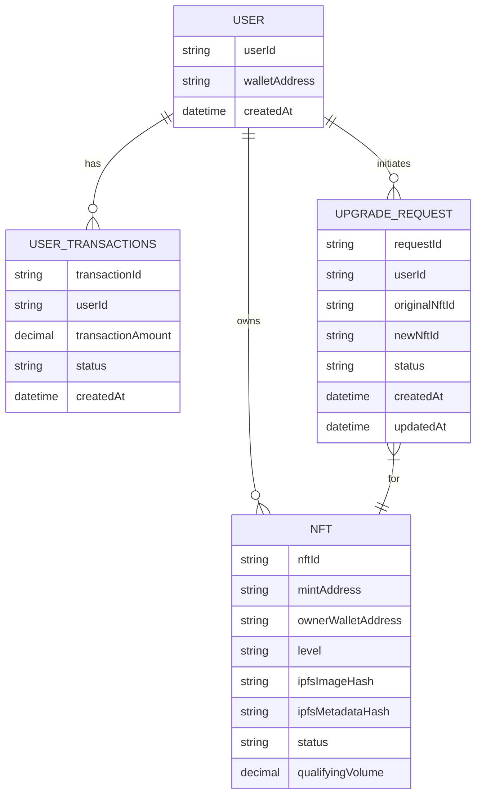

# AIW3 NFT Data Model

This document provides comprehensive specifications for the data structures used in the AIW3 NFT system, covering both on-chain and off-chain data models. It serves as a technical reference for developers implementing the system and partners integrating with the AIW3 NFT ecosystem.

---

## Table of Contents

1. [On-Chain Data](#on-chain-data)
2. [Off-Chain Data](#off-chain-data)
3. [Data Model Relationships](#data-model-relationships)
4. [On-Chain Interaction Mapping](#on-chain-interaction-mapping)

---

## On-Chain Data

This section describes the data stored directly on the Solana blockchain for maximum security, decentralization, and trust.

### On-Chain Metadata Account Details

Data stored directly on **Solana blockchain** for trust and authenticity verification:

| Field | Type | Source | Required | Description & AIW3 Usage |
|-------|------|--------|----------|--------------------------|
| `update_authority` | `Pubkey` | AIW3 System Wallet | Yes | AIW3 System Wallet public key |
| `mint` | `Pubkey` | Solana | Yes | NFT's unique identifier |
| `data.name` | `String` | AIW3 System Wallet | Yes | NFT name (e.g., "Tech Chicken", "Quant Ape") |
| `data.symbol` | `String` | AIW3 System Wallet | Yes | Collection symbol (e.g., "AIW3E") |
| `data.uri` | `String` | AIW3 System Wallet | Yes | IPFS via Pinata URI for off-chain JSON |
| `data.creators` | `Vec<Creator>` | AIW3 System Wallet | Yes | **Core authenticity verification** |
| `is_mutable` | `bool` | AIW3 System Wallet | Yes | Set to `false` for permanence |

---

## Off-Chain Data

This section describes the data stored off-chain to provide flexibility and richer content.

### Off-Chain JSON Metadata Details

The `uri` field in the on-chain metadata contains an IPFS via Pinata link to this JSON file where the **actual Level data is stored** and **images are referenced via IPFS**:

```json
{
  "name": "On-chain Hunter",
  "symbol": "AIW3E",
  "description": "Represents Level 3 equity and status within the AIW3 ecosystem.",
  "image": "https://gateway.pinata.cloud/ipfs/QmImageHashExample123",
  "external_url": "https://aiw3.io",
  "attributes": [
    {
      "trait_type": "Level",
      "value": "3",
      "display_type": "number"
    },
    {
      "trait_type": "Name",
      "value": "On-chain Hunter",
      "display_type": "string"
    }
  ],
  "properties": {
    "files": [
      {
        "uri": "https://gateway.pinata.cloud/ipfs/QmImageHashExample123",
        "type": "image/png"
      }
    ],
    "creators": [
      {
        "address": "AIW3_SYSTEM_WALLET_PUBLIC_KEY",
        "share": 100
      }
    ]
  }
}
```

---

## Data Model Relationships

This diagram illustrates the relationships between the different data entities in the backend database.



---

## On-Chain Interaction Mapping

The AIW3 system interacts with the Solana blockchain using **only standard Solana programs** (SPL Token Program and Metaplex Token Metadata Program) without requiring any custom smart contract development. All business logic is handled off-chain in the backend services.

| User Operation                  | On-Chain Interaction            | Interaction Type                | Description |
|---------------------------------|---------------------------------|---------------------------------|-------------|
| **Minting a New NFT**           | `mintTo(...)`                   | **Standard SPL Token Program**  | The AIW3 backend uses the system wallet to mint new NFTs directly to user wallets using standard SPL Token operations. All business logic verification (trading volume, tier eligibility) is handled off-chain before minting. |
| **Upgrading an Equity NFT**     | `burn(...)` + `mintTo(...)`     | **Standard SPL Token Program**  | The upgrade process uses standard token operations: user burns their current NFT, then the system mints the new tier NFT. The AIW3 backend verifies all off-chain criteria (trading volume, badge requirements) before authorizing the upgrade. |
| **Managing Badge NFTs**         | Standard NFT operations         | **Standard SPL Token Program**  | Badge NFTs are managed using standard NFT operations. The backend tracks badge ownership through standard token account queries and enforces binding requirements through off-chain business logic. |
| **Selling/Transferring an NFT** | `transfer(...)`                 | **Standard SPL Token Program**  | This is a standard token transfer. The AIW3 system does not need a custom function for this. Users can freely trade their NFTs on any marketplace that supports Solana NFTs. |
| **Burning an NFT**              | `burn(...)`                     | **Standard SPL Token Program**  | This is a standard token burn. It is used in the **Synthesis** process to destroy the lower-level NFT before the higher-level one is minted. |

---

## Related Documents

For comprehensive information about the AIW3 NFT system, please refer to these related documents:

- **[AIW3 NFT System Design](./AIW3-NFT-System-Design.md)**: High-level technical architecture and lifecycle management overview
- **[AIW3 NFT Implementation Guide](./AIW3-NFT-Implementation-Guide.md)**: Step-by-step developer guide with process flows and code-level details
- **[AIW3 NFT Tiers and Policies](./AIW3-NFT-Tiers-and-Policies.md)**: Business rules, tier requirements, and user policies for the NFT system
- **[AIW3 NFT Appendix](./AIW3-NFT-Appendix.md)**: Glossary of terms and external references
