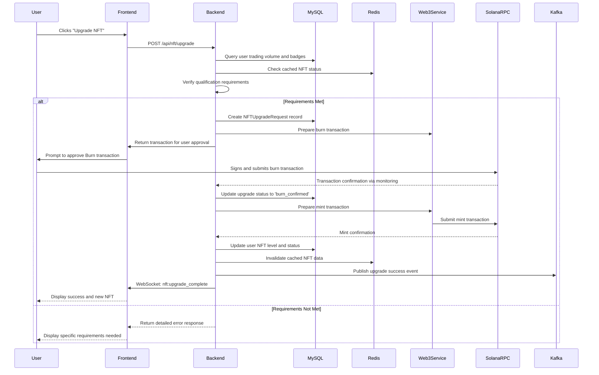
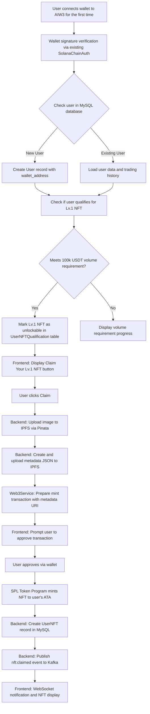
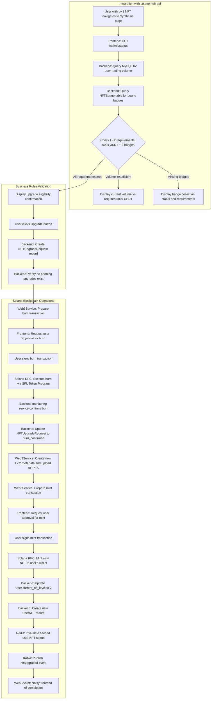
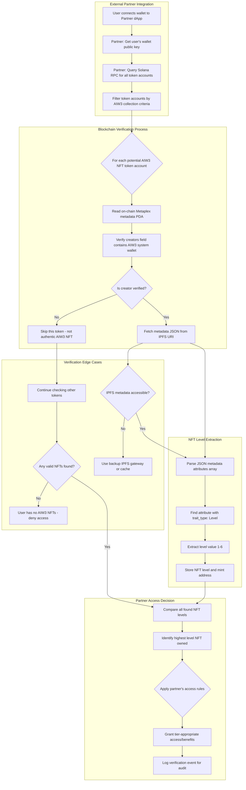

# AIW3 NFT Implementation Guide

This document provides comprehensive implementation guidelines for the AIW3 NFT system, emphasizing integration with the lastmemefi-api backend. It outlines standard program integration, backend service utilization, frontend application development, and process flows.

---

## Table of Contents

1. [Standard Solana Programs Integration](#standard-solana-programs-integration)
2. [Backend Services Integration](#backend-services-integration)
3. [Frontend Application Development](#frontend-application-development)
4. [NFT Upgrade and Burn Strategy](#nft-upgrade-and-burn-strategy)
5. [Integration Process Flows](#integration-process-flows)

---

## Standard Solana Programs Integration

The AIW3 NFT system uses **only standard Solana programs** without requiring any custom smart contract development. This approach leverages battle-tested blockchain functionality while eliminating development complexity and security risks.

### 1. **Standard Program Dependencies**
- **Action:** Integrate with existing Solana programs using standard libraries and SDKs.
  - **SPL Token Program:** Use for all NFT minting, burning, and transfer operations
  - **Metaplex Token Metadata Program:** Use for NFT metadata management and creator verification
  - **Associated Token Account Program:** Use for user wallet NFT storage
- **Rationale:** Using standard programs eliminates custom development complexity, reduces security risks, and ensures compatibility with the entire Solana ecosystem.

### 2. **Backend Business Logic Implementation**
- **Action:** Implement all business rules in the backend service layer, not on-chain.
  - **Level Verification:** Backend verifies user qualifications before authorizing minting operations
  - **Upgrade Logic:** Backend orchestrates the burn-and-mint process using standard token operations
  - **Access Control:** Backend controls system wallet operations and user authorization
- **Rationale:** Off-chain business logic provides flexibility for rule changes while on-chain operations remain simple and standard.

### 3. **Security Through Standard Programs**
- **Action:** Leverage the security of battle-tested standard Solana programs.
  - **Proven Security:** SPL Token and Metaplex programs have been extensively audited and tested
  - **Access Controls:** Use standard token authority patterns for secure operations
  - **No Custom Attack Vectors:** Eliminates security risks from custom smart contract code
- **Rationale:** Standard programs provide enterprise-grade security without the risks and costs of custom smart contract development and auditing.

### 4. **Integration Testing and Deployment**
- **Action:** Test integration with standard Solana programs and deploy backend services.
  - **Standard Program Integration Tests:** Test interactions with SPL Token and Metaplex programs
  - **Backend Service Tests:** Test business logic and standard program interactions
  - **Deployment Scripts:** Automate backend service deployment and configuration
- **Rationale:** Testing focuses on integration with proven standard programs rather than custom contract logic, reducing complexity and risk.

---

## Backend Services

The backend is the intermediary between the user-facing frontend and the standard Solana programs.

### 1. **Standard Program Integration**
- **Action:** Integrate with existing Solana programs using standard libraries and SDKs.
  - **SPL Token Program:** Use for all NFT minting, burning, and transfer operations.
  - **Metaplex Token Metadata:** Use for NFT metadata management and creator verification.
  - **Associated Token Account Program:** Use for user wallet NFT storage.
- **Rationale:** Using standard programs eliminates custom development complexity, reduces security risks, and ensures compatibility with the entire Solana ecosystem.

### 2. **API Endpoint Creation & Frontend Integration**
- **Action:** Develop a comprehensive REST API with standardized endpoints and real-time communication for seamless frontend integration.

#### Core API Endpoints
  - `GET /api/nft/status`: Returns user's current NFT, qualification progress, and benefits with standardized JSON format
  - `POST /api/nft/claim`: Initiates first NFT claim with transaction status tracking and WebSocket progress events
  - `POST /api/nft/upgrade`: Executes burn-and-mint upgrade process with multi-step progress tracking
  - `GET /api/nft/benefits`: Returns current benefits and fee reductions
  - `GET /api/nft/badges`: Returns user's badge collection with unlock status
  - `POST /api/nft/badges/claim`: Claims new badges affecting upgrade qualification

#### Frontend Integration Features
  - **Standardized Response Format**: Consistent success/error responses following existing `lastmemefi-api` patterns
  - **Real-time Updates**: WebSocket events (`nft:status_changed`, `nft:upgrade_progress`, `nft:qualification_updated`, `nft:transaction_status`)
  - **Transaction Tracking**: Solana transaction signatures returned for frontend monitoring
  - **Authentication**: Integration with existing JWT middleware from `AccessTokenService`
  - **Error Handling**: User-friendly error messages with technical details for debugging

#### API Documentation & Testing Support
  - **Interactive Documentation**: Swagger UI at `/docs/nft` with live examples
  - **Mock Data**: Sandbox endpoints with `/api/nft/sandbox/` prefix for development
  - **Code Examples**: JavaScript, React, Vue.js integration samples
  - **Client SDK**: JavaScript library for easy WebSocket and API integration

- **Rationale:** Comprehensive API design with frontend integration support ensures seamless end-to-end functionality and developer productivity.

### 3. **Solana Integration**
- **Action:** Use the `@solana/web3.js` library to communicate with the Solana network.
  - **RPC Communication:** Connect to a Solana RPC node to read on-chain data and submit transactions.
  - **Standard Operations:** Use SPL Token Program instructions for minting, burning, and transferring NFTs.
  - **Metadata Management:** Use Metaplex Token Metadata Program for NFT metadata operations.
- **Rationale:** Direct integration with standard Solana programs allows the backend to verify on-chain state and execute transactions without custom smart contract complexity.

### 4. **Monitoring Service**
- **Action:** Develop a background service to monitor the blockchain for relevant events.
  - **Event Listener:** Use WebSocket connections to listen for `Mint` and `Burn` events related to the NFT collection.
  - **Database Updates:** Update the `nft_ownership` cache table in real-time as events occur.
- **Rationale:** A monitoring service ensures that the off-chain database remains synchronized with the on-chain state, providing users with an accurate and up-to-date view of their assets.

---

## Frontend Application Development

This section outlines the structure and key components of the user-facing application, with the **Personal Center** as its core feature. The design should align with the user experience flows detailed in the `aiw3-prototypes`.

### 1. **The Personal Center: A Central Hub**

The Personal Center is the primary interface for users to manage their NFTs, track progress, and interact with the AIW3 community. It provides a consolidated view of a user's status and achievements.

**Key Features:**
- **NFT Status Display:** Clearly visualizes the user's currently held NFT, its tier, and associated benefits. It must handle two primary states based on the prototypes:
  - **Unlocked:** Displays the NFT the user owns, along with options for synthesis.
  - **Unlockable:** Shows the next available NFT tier and the requirements to obtain it.
- **Synthesis (Upgrade) Interface:** A dedicated module where users can initiate the burn-and-mint upgrade process. The UI must clearly communicate the requirements and outcomes, as seen in `4. Synthesis.png` and `5. VIP2 Synthesis Success.png`.
- **Badge-Type NFT Display:** A section to display collected badges (`6. Micro Badge.png`), which are prerequisites for certain NFT tier upgrades.
- **Community Hub Integration:** Features a link to the user's public-facing "Mini Homepage" (`9. Community-Mini Homepage.png`) to foster social interaction and display achievements to others.

### 2. **Wallet Integration**
- **Action:** Integrate a wallet adapter library (e.g., `@solana/wallet-adapter`).
  - **Supported Wallets:** Add support for popular wallets like Phantom, Solflare, and Backpack.
- **Rationale:** A robust wallet adapter is crucial for secure and seamless user interaction with the Solana blockchain.

### 3. **API Integration**
- **Action:** Connect the frontend components to the backend API endpoints.
  - **Data Fetching:** Use `GET /api/nft/status` to populate the Personal Center with the user's NFT data, progress, and eligibility.
  - **Transaction Submission:** When a user initiates an upgrade, call the `POST` endpoint to have the backend construct and submit the on-chain transaction.
- **Rationale:** API integration links the user interface to the underlying business logic, creating a fully functional application.

---

## Comprehensive NFT Business Flows

### Overview

This section is dedicated to ensuring every NFT-related business flow and process is thoroughly documented. It references the in-depth breakdown in the newly created **AIW3 NFT Business Flows and Processes** document, focusing purely on actionable components and major tasks relating to NFT management.

## Frontend Application

The frontend is the user's primary interface for interacting with the AIW3 NFT system.

### 1. **UI/UX Mockup Translation**
- **Action:** Convert the static prototype images into interactive UI components using a framework like React or Vue.
  - **Personal Center:** A dashboard displaying the user's current NFT, benefits, and progress.
  - **Synthesis Flow:** A step-by-step modal or page that guides the user through the process of unlocking a new tier.
- **Rationale:** A clean and intuitive UI is essential for a positive user experience, especially for complex processes like NFT upgrades.

### 2. **Wallet Integration**
- **Action:** Integrate a wallet adapter library (e.g., `@solana/wallet-adapter`).
  - **Supported Wallets:** Add support for popular wallets like Phantom, Solflare, and Backpack.
  - **Connection Management:** Handle wallet connection, disconnection, and account change events.
- **Rationale:** Wallet integration is the foundation of any dApp, allowing users to securely manage their keys and sign transactions.

### 3. **Component Development**
- **Action:** Build the core React/Vue components that make up the user interface.
  - `NftCard`: A reusable component to display an NFT's image, name, and level.
  - `ProgressBar`: A visual indicator of the user's progress toward the next tier's trading volume requirement.
  - `BenefitList`: A component that dynamically displays the benefits associated with the user's current NFT tier.
- **Rationale:** A component-based architecture promotes code reuse and makes the application easier to maintain and scale.

### 4. **API Integration**
- **Action:** Connect the frontend components to the backend REST API.
  - **Data Fetching:** Use a library like `axios` or `fetch` to call the `GET` endpoints and display the data.
  - **Transaction Submission:** When a user initiates an upgrade, call the `POST` endpoint to have the backend construct and submit the on-chain transaction.
- **Rationale:** API integration links the user interface to the underlying business logic, creating a fully functional application.

---

## NFT Upgrade and Burn Strategy

This section outlines the recommended strategy for handling NFT upgrades, focusing on a **Burn-and-Mint** model to ensure system integrity and prevent duplicate benefits.

### Recommended Model: Burn-and-Mint

The most secure and straightforward approach is to require the user to **burn** their lower-level NFT before the system **mints** the new, higher-level NFT.

**Key Advantages:**
- **Prevents Double-Dipping:** It is impossible for a user to hold two different levels of Equity NFTs simultaneously, ensuring they cannot claim benefits from both.
- **Atomic State Transition:** The state change is clear and unambiguous. The user either has the old NFT or the new one, never both.
- **Simplified Auditing:** It is easy to verify on-chain that the old NFT was destroyed before the new one was created.

### Alternative Model (Not Recommended): In-Place Update

An alternative would be to have a mutable NFT whose metadata is updated by the system. This is **not recommended** for the following reasons:
- **Breaks Immutability:** It violates the core principle that NFTs should be immutable records.
- **Complex and Error-Prone:** Would require custom smart contract development with authority to modify NFT metadata, which is more complex and introduces potential security risks. Our approach avoids this entirely by using standard programs.
- **Poor Ecosystem Compatibility:** Many wallets and marketplaces are not designed to handle NFTs whose metadata changes, which could lead to display issues or user confusion.

### Burn-and-Mint Workflow

### User Experience Considerations

- **Clear Communication:** The UI must clearly explain to the user that their old NFT will be permanently destroyed as part of the upgrade process.
- **Two-Step Approval:** The user should be required to approve two separate actions:
  1.  An initial confirmation in the UI (e.g., a checkbox saying, "I understand my Lv.1 NFT will be burned").
  2.  The final transaction approval in their wallet.
- **Transaction Status Tracking:** The frontend should provide real-time feedback on the status of the burn and mint transactions, so the user is not left wondering what is happening.

---

## Detailed Process Flows

This section provides detailed, step-by-step flows for the key processes in the NFT system.

### 1. New User Onboarding and First NFT Claim

**Goal:** A new user joins the platform and claims their initial Lv.1 Equity NFT.

### 2. NFT Synthesis (Upgrade) Flow

**Goal:** An existing user with a Lv.1 NFT upgrades to a Lv.2 NFT.

### 3. Third-Party Verification Flow

**Goal:** An external partner (e.g., another dApp) wants to verify a user's NFT level to grant them special access.

---

## Related Documents

For comprehensive information about the AIW3 NFT system, please refer to these related documents:

### Core Documentation
- **[AIW3 NFT System Design](./AIW3-NFT-System-Design.md)**: High-level technical architecture and lifecycle management overview
- **[AIW3 NFT Tiers and Policies](./AIW3-NFT-Tiers-and-Policies.md)**: Business rules, tier requirements, and user policies for the NFT system
- **[AIW3 NFT Data Model](./AIW3-NFT-Data-Model.md)**: On-chain and off-chain data structures, schemas, and metadata specifications
- **[AIW3 NFT Appendix](./AIW3-NFT-Appendix.md)**: Glossary of terms and external references

### Integration & Implementation
- **[AIW3 NFT Legacy Backend Integration](./AIW3-NFT-Legacy-Backend-Integration.md)**: Comprehensive analysis and strategy for integrating NFT services with existing `lastmemefi-api` backend, including service architecture and infrastructure reuse
- **[AIW3 NFT Integration Issues & PRs](./AIW3-NFT-Integration-Issues-PRs.md)**: Detailed phased implementation plan with frontend-backend integration requirements, API contracts, WebSocket events, and collaborative development guidance
