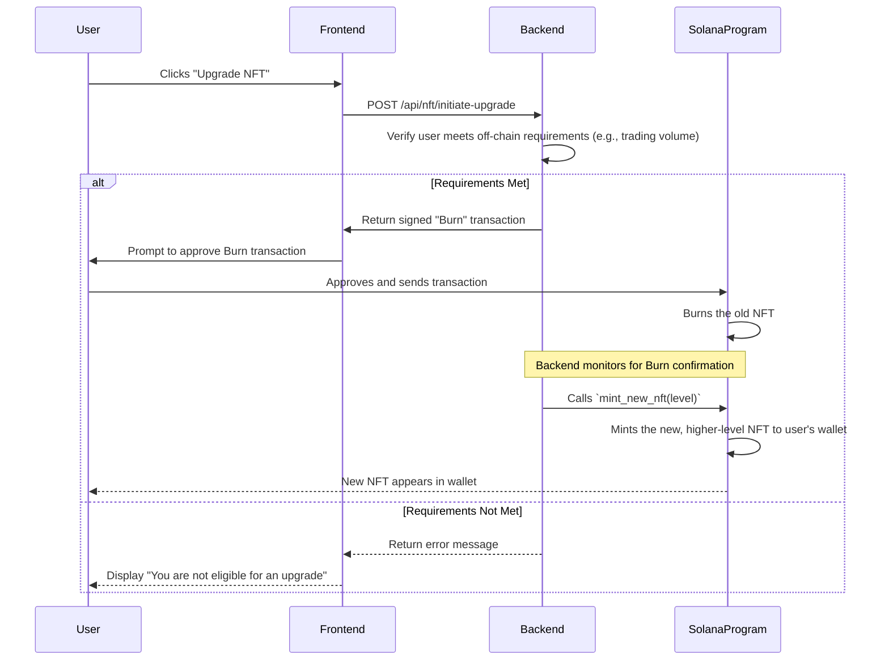
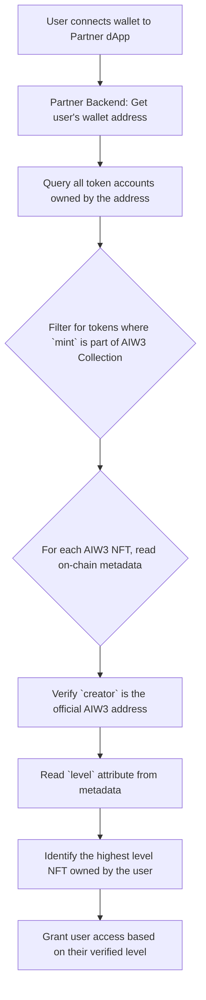

# AIW3 NFT Implementation Guide

---

## Table of Contents

1. [On-Chain Program (Smart Contract)](#on-chain-program-smart-contract)
2. [Backend Services](#backend-services)
3. [Frontend Application](#frontend-application)
4. [NFT Upgrade and Burn Strategy](#nft-upgrade-and-burn-strategy)
5. [Detailed Process Flows](#detailed-process-flows)

---

## On-Chain Program (Smart Contract)

This section details the implementation steps for the on-chain program, which is the core of the NFT system's logic and security.

### 1. **Project Scaffolding**
- **Action:** Initialize a new Anchor project.
  ```bash
  anchor init aiw3-nft-program
  ```
- **Rationale:** Anchor provides a secure and idiomatic framework for Solana program development, reducing boilerplate and preventing common security vulnerabilities.

### 2. **Define Account Structs**
- **Action:** In `lib.rs`, define the Rust structs that represent on-chain accounts.
  - `UserNftState`: Stores the user's current NFT level and a list of bound badge NFTs.
  - `TierConfiguration`: A system-level account storing the requirements for each NFT tier (e.g., required transaction volume, number of badges).
- **Rationale:** These structs define the on-chain data schema, ensuring data is stored in a structured and predictable way.

### 3. **Implement Instruction Logic**
- **Action:** Implement the core business logic functions.
  - `initialize(ctx, tier_config)`: Sets up the initial `TierConfiguration` account. Can only be called by the program's deployer.
  - `unlock_tier(ctx, level)`: The main user-facing function. Verifies that the user meets the off-chain (trading volume) and on-chain (badge ownership) requirements before minting the new NFT.
  - `bind_badge(ctx, badge_mint_address)`: Allows a user to "bind" a special Badge NFT to their account, making it eligible for use in tier upgrades.
- **Rationale:** These functions translate the business rules defined in the **AIW3 NFT Tiers and Policies** document into executable on-chain logic.

### 4. **Write Comprehensive Tests**
- **Action:** Create a suite of tests in the `tests/` directory.
  - **Unit Tests:** Test individual functions in isolation.
  - **Integration Tests:** Test the full user flow (e.g., initializing, binding badges, unlocking a new tier).
- **Rationale:** Rigorous testing is critical for on-chain programs, as bugs can lead to financial loss and are difficult to fix after deployment.

---

## Backend Services

The backend is the intermediary between the user-facing frontend and the on-chain program.

### 1. **Database Schema Design**
- **Action:** Design and create the necessary MySQL tables.
  - `users`: Stores user profile information.
  - `user_transactions`: Aggregates user trading volume.
  - `nft_ownership`: Caches on-chain NFT ownership data for faster lookups.
- **Rationale:** A well-designed database provides a reliable and performant way to store and query the off-chain data needed to support the NFT system.

### 2. **API Endpoint Creation**
- **Action:** Develop a REST API with endpoints for the frontend.
  - `GET /api/user/nft-status`: Returns the user's current NFT level and progress toward the next tier.
  - `POST /api/nft/unlock-tier`: Initiates the on-chain `unlock_tier` instruction after verifying off-chain requirements.
  - `GET /api/user/badges`: Lists the user's owned and bound Badge NFTs.
- **Rationale:** The API provides a secure and controlled interface for the frontend to interact with backend services and, indirectly, the blockchain.

### 3. **Solana Integration**
- **Action:** Use the `@solana/web3.js` library to communicate with the Solana network.
  - **RPC Communication:** Connect to a Solana RPC node to read on-chain data and submit transactions.
  - **Instruction Building:** Construct and serialize the `unlock_tier` and `bind_badge` instructions to be sent to the on-chain program.
- **Rationale:** Direct blockchain integration allows the backend to verify on-chain state and execute transactions on behalf of the user.

### 4. **Monitoring Service**
- **Action:** Develop a background service to monitor the blockchain for relevant events.
  - **Event Listener:** Use WebSocket connections to listen for `Mint` and `Burn` events related to the NFT collection.
  - **Database Updates:** Update the `nft_ownership` cache table in real-time as events occur.
- **Rationale:** A monitoring service ensures that the off-chain database remains synchronized with the on-chain state, providing users with an accurate and up-to-date view of their assets.

---

## Frontend Application

The frontend is the user's primary interface for interacting with the AIW3 NFT system.

### 1. **UI/UX Mockup Translation**
- **Action:** Convert the static prototype images into interactive UI components using a framework like React or Vue.
  - **Personal Center:** A dashboard displaying the user's current NFT, benefits, and progress.
  - **Synthesis Flow:** A step-by-step modal or page that guides the user through the process of unlocking a new tier.
- **Rationale:** A clean and intuitive UI is essential for a positive user experience, especially for complex processes like NFT upgrades.

### 2. **Wallet Integration**
- **Action:** Integrate a wallet adapter library (e.g., `@solana/wallet-adapter`).
  - **Supported Wallets:** Add support for popular wallets like Phantom, Solflare, and Backpack.
  - **Connection Management:** Handle wallet connection, disconnection, and account change events.
- **Rationale:** Wallet integration is the foundation of any dApp, allowing users to securely manage their keys and sign transactions.

### 3. **Component Development**
- **Action:** Build the core React/Vue components that make up the user interface.
  - `NftCard`: A reusable component to display an NFT's image, name, and level.
  - `ProgressBar`: A visual indicator of the user's progress toward the next tier's trading volume requirement.
  - `BenefitList`: A component that dynamically displays the benefits associated with the user's current NFT tier.
- **Rationale:** A component-based architecture promotes code reuse and makes the application easier to maintain and scale.

### 4. **API Integration**
- **Action:** Connect the frontend components to the backend REST API.
  - **Data Fetching:** Use a library like `axios` or `fetch` to call the `GET` endpoints and display the data.
  - **Transaction Submission:** When a user initiates an upgrade, call the `POST` endpoint to have the backend construct and submit the on-chain transaction.
- **Rationale:** API integration links the user interface to the underlying business logic, creating a fully functional application.

---

## NFT Upgrade and Burn Strategy

This section outlines the recommended strategy for handling NFT upgrades, focusing on a **Burn-and-Mint** model to ensure system integrity and prevent duplicate benefits.

### Recommended Model: Burn-and-Mint

The most secure and straightforward approach is to require the user to **burn** their lower-level NFT before the system **mints** the new, higher-level NFT.

**Key Advantages:**
- **Prevents Double-Dipping:** It is impossible for a user to hold two different levels of Equity NFTs simultaneously, ensuring they cannot claim benefits from both.
- **Atomic State Transition:** The state change is clear and unambiguous. The user either has the old NFT or the new one, never both.
- **Simplified Auditing:** It is easy to verify on-chain that the old NFT was destroyed before the new one was created.

### Alternative Model (Not Recommended): In-Place Update

An alternative would be to have a mutable NFT whose metadata is updated by the system. This is **not recommended** for the following reasons:
- **Breaks Immutability:** It violates the core principle that NFTs should be immutable records.
- **Complex and Error-Prone:** Requires a custom smart contract with authority to modify NFT metadata, which is more complex and introduces potential security risks.
- **Poor Ecosystem Compatibility:** Many wallets and marketplaces are not designed to handle NFTs whose metadata changes, which could lead to display issues or user confusion.

### Burn-and-Mint Workflow



### User Experience Considerations

- **Clear Communication:** The UI must clearly explain to the user that their old NFT will be permanently destroyed as part of the upgrade process.
- **Two-Step Approval:** The user should be required to approve two separate actions:
  1.  An initial confirmation in the UI (e.g., a checkbox saying, "I understand my Lv.1 NFT will be burned").
  2.  The final transaction approval in their wallet.
- **Transaction Status Tracking:** The frontend should provide real-time feedback on the status of the burn and mint transactions, so the user is not left wondering what is happening.

---

## Detailed Process Flows

This section provides detailed, step-by-step flows for the key processes in the NFT system.

### 1. New User Onboarding and First NFT Claim

**Goal:** A new user joins the platform and claims their initial Lv.1 Equity NFT.

```mermaid
flowchart TD
    A[User connects wallet to AIW3 for the first time] --> B{Backend: Is this a new user?}
    B -->|Yes| C[Create new user record in database]
    B -->|No| D[Load existing user data]
    C --> E[Mark Lv.1 NFT as "Unlockable" for the user]
    D --> F{Frontend: Display "Claim Your Lv.1 NFT" button}
    E --> F
    F --> G[User clicks "Claim"]
    G --> H[Backend: Construct and sign `claim_nft(level=1)` transaction]
    H --> I[Frontend: Prompt user to approve transaction in wallet]
    I --> J[User approves]
    J --> K[Transaction sent to Solana program]
    K --> L[Program mints Lv.1 NFT to user's wallet]
    L --> M[Frontend: Display success message and show new NFT]
```

### 2. NFT Synthesis (Upgrade) Flow

**Goal:** An existing user with a Lv.1 NFT upgrades to a Lv.2 NFT.

```mermaid
flowchart TD
    subgraph "Off-Chain Verification"
        A[User with Lv.1 NFT navigates to Synthesis page] --> B{Backend: Check eligibility for Lv.2}
        B -->|Trading volume sufficient?| C{User has required Badge NFTs?}
        B -->|No| D[Frontend: Display "More trading volume needed"]
        C -->|No| E[Frontend: Display "You need to acquire more Badge NFTs"]
    end

    subgraph "On-Chain Execution"
        C -->|Yes| F[Frontend: Display "You are eligible! Click to upgrade"]
        F --> G[User clicks "Upgrade"]
        G --> H[Backend: Prepare `burn` transaction for Lv.1 NFT]
        H --> I[Frontend: Prompt user to approve Burn]
        I --> J[User approves; Lv.1 NFT is burned]
        J --> K{Backend: Monitor blockchain for burn confirmation}
        K -->|Confirmed| L[Backend: Prepare `mint` transaction for Lv.2 NFT]
        L --> M[Frontend: Prompt user to approve Mint]
        M --> N[User approves; Lv.2 NFT is minted]
        N --> O[Frontend: Show success animation and new Lv.2 NFT]
    end
```

### 3. Third-Party Verification Flow

**Goal:** An external partner (e.g., another dApp) wants to verify a user's NFT level to grant them special access.


