# AIW3 NFT Implementation Guide
## Complete Lifecycle Management for Solana-Based Equity NFTs

---

## 📋 Table of Contents

1. [Executive Summary](#executive-summary)
2. [NFT Lifecycle Overview](#nft-lifecycle-overview)
3. [Technical Architecture](#technical-architecture)
4. [Implementation Guide](#implementation-guide)
5. [Integration Patterns](#integration-patterns)
6. [Detailed Process Flows](#detailed-process-flows)
7. [Source Code References](#source-code-references)
8. [Recommendations](#recommendations)
9. [Lifecycle Cost Considerations: Rent, Fees, and Storage](#lifecycle-cost-considerations-rent-fees-and-storage)

---

## 🎯 Executive Summary

This document provides a comprehensive technical guide for implementing AIW3's Equity NFT system on Solana. The recommended approach uses **system-direct minting** combined with **user-controlled burning**, leveraging the Metaplex Token Metadata standard for maximum ecosystem compatibility.

### Key Benefits
- ✅ **Authenticity Guaranteed**: Creator verification through on-chain metadata
- ✅ **User Autonomy**: Full user control over NFT ownership and burning
- ✅ **Cost Effective**: No custom smart contracts required
- ✅ **Industry Standard**: Compatible with all major Solana NFT tools

---

## 🔄 NFT Lifecycle Overview

The AIW3 NFT ecosystem operates through three distinct phases:

| Phase | Description | Control | Key Technology |
|-------|-------------|---------|----------------|
| **🏗️ MINT** | NFT creation with embedded level data | AIW3 System | Solana Token Program + Metaplex |
| **🔍 USE** | Verification and data access by partners | Ecosystem Partners | Metadata queries + Arweave |
| **🔥 BURN** | NFT destruction for upgrades/exits | User Wallet | User-initiated transactions |

---

## 📊 Integration Patterns

### Lifecycle Pattern Analysis

#### 🏗️ Minting Patterns

| Pattern | Description | AIW3 Implementation | Pros | Cons |
|---------|-------------|---------------------|------|------|
| **System-Direct Minting** | AIW3 system mints NFTs directly to user wallets without transfer | ✅ **Current Approach** | No ownership transfer needed, efficient, lower gas costs | System controls minting authority |
| **User-Initiated Minting** | Users trigger minting themselves, paying fees | Not adopted | Users have control, decentralized | Higher user friction, gas costs borne by users |
| **Delegated Minting** | Third-party services mint on behalf of AIW3 | Not adopted | Outsourced complexity | Trust dependency, coordination overhead |
| **Batch Minting** | Multiple NFTs minted in single transaction | Possible enhancement | Cost-efficient for bulk operations | More complex implementation |

**Key Point**: With Solana/Metaplex, when minting an NFT, you can specify the owner wallet directly during creation. This means **no ownership transfer occurs** - the user becomes the initial and immediate owner upon minting.

#### 🔥 Burning Patterns

| Pattern | Description | AIW3 Implementation | Pros | Cons |
|---------|-------------|---------------------|------|------|
| **User-Controlled Burning** | NFT owners burn their own NFTs | ✅ **Current Approach** | User autonomy, truly decentralized | Users must initiate and pay fees |
| **System-Triggered Burning** | AIW3 system burns NFTs (requires user approval) | Not adopted | Automated workflows possible | Requires complex permission system |
| **Time-Based Burning** | NFTs auto-burn after expiration | Not adopted | Automatic cleanup | Smart contract complexity |
| **Conditional Burning** | Burn triggered by specific events/conditions | Not adopted | Advanced automation | High complexity, potential bugs |

#### 🔍 Use Phase Integration Patterns

| Pattern | Description | Implementation Status | Ecosystem Benefit |
|---------|-------------|----------------------|-------------------|
| **Metadata-Based Verification** | Partners read level from NFT metadata | ✅ **Recommended** | Standard, widely supported |
| **Smart Contract Registry** | On-chain registry for authenticity verification | 📋 **Planned** | Trustless verification |
| **API Gateway** | Centralized API for ecosystem integration | 🔄 **Optional** | Easy integration for traditional systems |
| **Direct Blockchain Queries** | Partners query blockchain directly | ✅ **Always Available** | No intermediaries, most decentralized |

### ⭐ Recommended AIW3 NFT Lifecycle Implementation

The optimal approach for AIW3 uses a **hybrid lifecycle pattern** that balances authenticity, user autonomy, and ecosystem compatibility:

```mermaid
graph TD
    subgraph "Phase 1: 🏗️ MINT (System-Controlled)"
        A1[AIW3 system mints NFT directly to user wallet]
        A2[User becomes immediate owner - no transfer]
        A3[Level data stored in off-chain JSON metadata]
        A4[Images stored on Arweave with URIs in off-chain JSON]
        A5[Creator verification data embedded in on-chain metadata]
    end
    
    subgraph "Phase 2: 🔍 USE (Partner-Initiated)"
        B1[Partners verify authenticity via on-chain creator field]
        B2[Level queried from off-chain JSON metadata attributes]
        B3[Images retrieved via Arweave URIs in off-chain JSON]
        B4[Optional API for traditional system integration]
    end
    
    subgraph "Phase 3: 🔥 BURN (User-Controlled)"
        C1[User initiates burn transaction]
        C2[Token supply reduced to zero]
        C3[Associated Token Account closed]
        C4[SOL rent returned to user]
    end
    
    A1 --> A2 --> A3 --> A4 --> A5
    A5 --> B1
    B1 --> B2 --> B3 --> B4
    B4 --> C1
    C1 --> C2 --> C3 --> C4
    
    style A1 fill:#fff3e0
    style B1 fill:#f3e5f5  
    style C1 fill:#ffebee
```



**Key Characteristics:**
- **🏗️ MINT Phase**: System-controlled for authenticity guarantee
  - Creator address stored in **on-chain** Solana metadata for verification
  - Level data stored in **off-chain** JSON metadata for cost efficiency
- **🔍 USE Phase**: Partner-driven verification and data access
  - Authenticity verified via **on-chain** creator field check
  - Level information accessed from **off-chain** JSON metadata
- **🔥 BURN Phase**: User-controlled for true ownership autonomy

---

## 🏗️ Technical Architecture

### 📚 Solana NFT Data Structure (Metaplex Standard)

To correctly implement the solution, it's crucial to understand how Solana NFTs work. An NFT isn't a single object but a system of related accounts on the blockchain, governed by standards like Metaplex Token Metadata. This structure clearly separates the NFT's descriptive data from its ownership.

#### 🔑 Core Concepts and Relationships

1.  **Who owns the NFT? (The Token Account)**: The actual owner of an NFT is the wallet that holds the **Token Account** associated with that NFT's Mint. This Token Account contains a balance of 1 token. For our use case, when the **AIW3 system mints the NFT**, it creates the Mint and then directly creates the associated Token Account in the **user's wallet**, making them the immediate owner. There is no separate "owner" field in the metadata; ownership is proven by possession of the token.

2.  **What is the NFT? (The Mint Account)**: This is a standard Solana Token Program account that defines the NFT as a unique asset. It has a total supply of 1 and 0 decimal places. Its public key (address) serves as the unique ID for the NFT.

3.  **What describes the NFT? (The On-Chain Metadata PDA)**: This is a Program Derived Address (PDA) account controlled by the Metaplex Token Metadata program. It's linked to the Mint Account and stores essential, verifiable data directly on the Solana blockchain.

4.  **Where is the rich data? (The Off-Chain JSON Metadata)**: The on-chain Metadata PDA contains a `uri` field. This URI points to an external JSON file stored on a decentralized network like Arweave. This JSON file contains richer details like the description, image link, and custom attributes (e.g., "Level").

#### 🔄 Data Flow for Verification

Here is the step-by-step flow a third-party partner would use to verify an NFT and get its level:

```
1. User presents their Wallet Address.
   │
   └── 2. Partner queries the Solana blockchain for all Token Accounts owned by that wallet.
       │
       └── 3. Filter for tokens with a supply of 1 (these are NFTs). For a specific NFT, get its Mint Address.
           │
           └── 4. Find the On-Chain Metadata PDA associated with the Mint Address.
               │
               ├── 5. Verify Authenticity: Check if the `creators` array in the on-chain metadata contains AIW3's official public key and is marked as `verified: true`.
               │
               └── 6. Get Rich Data: Read the `uri` field from the on-chain metadata.
                   │
                   └── 7. Fetch the Off-Chain JSON file from the `uri` (e.g., from Arweave).
                       │
                       ├── 8. Read NFT Level: Parse the JSON and read the `value` from the `attributes` array where `trait_type` is "Level".
                       │
                       └── 9. Retrieve NFT Image: Parse the JSON and get the URI from the `image` field to display the corresponding image.
```

#### 📊 On-Chain Metadata Account Details

This data is stored directly on the **Solana blockchain** and serves as the foundation of trust and authenticity verification. **Note**: Level information is NOT stored here - it's in the off-chain JSON file referenced by the `uri` field.

| Field | Type | Source | Required | Description & AIW3 Usage |
|---|---|---|---|---|
| `update_authority` | `Pubkey` | AIW3 | Yes | The public key authorized to change this metadata. This will be the AIW3 system wallet. After minting, this authority can be revoked to make the NFT immutable. |
| `mint` | `Pubkey` | Solana | Yes | The public key of the NFT's Mint Account. This is the unique identifier for the NFT, generated by Solana during the minting process. |
| `data.name` | `String` | AIW3 | Yes | The name of the NFT (e.g., "AIW3 Equity NFT #1234"). |
| `data.symbol` | `String` | AIW3 | Yes | The symbol for the NFT collection (e.g., "AIW3E"). |
| `data.uri` | `String` | AIW3 | Yes | The URI pointing to the off-chain JSON metadata file stored on Arweave. This links the on-chain and off-chain worlds. |
| `data.creators` | `Vec<Creator>` | AIW3 | Yes | A list of creators. **This is the core of authenticity verification.** The first creator will be the AIW3 system's public key, which must be signed and verified (`verified: true`) during the minting process. Partners check this verified address. |
| `is_mutable` | `bool` | AIW3 | Yes | A flag indicating if the metadata can be changed. For AIW3 Equity NFTs, this should be set to `false` after minting to guarantee data permanence and trust. |

#### 📄 Off-Chain JSON Metadata Details

The `uri` from the **on-chain Solana metadata** points to this JSON file stored on decentralized storage (Arweave/IPFS). **This is where the Level information is actually stored.**
+**Note**: Both the off-chain JSON metadata file and the image assets it references are stored on decentralized networks such as Arweave or IPFS.

**Example JSON Structure (Stored on Arweave/IPFS):**

```json
{
  "name": "AIW3 Equity NFT #1234",
  "symbol": "AIW3E",
  "description": "Represents a user's equity and status within the AIW3 ecosystem. Authenticity is verified by the creator address in on-chain Solana metadata.",
  "image": "https://arweave.net/ARWEAVE_IMAGE_HASH",
  "external_url": "https://aiw3.io",
  "attributes": [
    {
      "trait_type": "Level",
      "value": "Gold",
      "display_type": "string"
    },
    {
      "trait_type": "Tier", 
      "value": "3",
      "display_type": "number"
    }
  ],
  "properties": {
    "files": [
      {
        "uri": "https://arweave.net/ARWEAVE_IMAGE_HASH",
        "type": "image/png"
      }
    ],
    "creators": [
      {
        "address": "AIW3_SYSTEM_WALLET_PUBLIC_KEY",
        "share": 100
      }
    ]
  }
}
```

#### 🖼️ How NFT Images are Handled

- Just like the "Level" attribute, the NFT's image is linked via the off-chain JSON metadata. +Both the JSON metadata and the image files themselves can be hosted on Arweave or IPFS, ensuring decentralized storage of all off-chain assets. Storing large files like images directly on the blockchain is prohibitively expensive.

The process is as follows:
1.  **Upload Image**: The image file for each level (e.g., `level-gold.png`) is uploaded to a permanent, decentralized storage network like Arweave. This upload provides a unique and immutable URI for the image (e.g., `https://arweave.net/ARWEAVE_IMAGE_HASH`).
2.  **Link in JSON**: This Arweave URI is placed into the `image` field of the off-chain JSON metadata file. The `properties.files` array also references this URI, providing additional context like the file type.
3.  **Link to On-Chain**: The JSON file itself is then uploaded to Arweave/IPFS, and its URI is stored in the `data.uri` field of the **on-chain Solana metadata account** during the minting process.

This creates a verifiable chain of pointers:
`On-Chain Solana Metadata` → `Off-Chain JSON URI` → `JSON File (Arweave/IPFS)` → `Image URI` → `Image File`

An ecosystem partner, wallet, or marketplace follows this chain to reliably fetch and display the correct image for the NFT, ensuring the visual representation matches the on-chain asset.

**Clarification on Storing NFT Level:**
The NFT "Level" is **NOT stored directly on the Solana blockchain**. It is stored in the `attributes` array of the **off-chain** JSON metadata file hosted on Arweave/IPFS. Third parties access this information by following the data flow described above: they get the `uri` from the **on-chain** Solana metadata and then fetch the JSON file from that `uri` to read the level. This hybrid approach is the standard, scalable, and cost-effective method used across the NFT ecosystem.

**Two-Layer Architecture:**
- **On-Chain (Solana)**: Creator verification, ownership proof, URI pointer to off-chain data
- **Off-Chain (Arweave/IPFS)**: Level attributes, images, rich metadata content

This structure directly enables the recommended solution:
- **Authenticity Verification**: Partners check the `creators` array in the **on-chain Solana metadata** for a verified AIW3 address
- **Level Information Storage**: Partners read the `attributes` array from the **off-chain JSON metadata** to find the "Level" or "Tier"

---

## 📈 Visual Architecture Diagrams

### 🏛️ AIW3 NFT Ecosystem Entity Relationship Diagram


### 🔍 Verification Flow Diagram

```mermaid
flowchart TD
    A["User provides Wallet Address"] --> B["Query Solana: Find Token Accounts"]
    B --> C["Filter: Token Accounts with balance = 1"]
    C --> D["Extract: Mint Account addresses"]
    D --> E["Derive: Metadata PDA from Mint"]
    E --> F["Verify: creators[0] == AIW3 address && verified == true"]
    F --> |Valid| G["Read: URI field from metadata"]
    F --> |Invalid| H["❌ Reject: Not authentic AIW3 NFT"]
    G --> I["Fetch: JSON metadata from Arweave URI"]
    I --> J["Extract: Level from attributes array"]
    I --> K["Extract: Image URI from image field"]
    J --> L["✅ Display: User's NFT level"]
    K --> M["✅ Display: NFT image"]

    style A fill:#e1f5fe
    style L fill:#c8e6c9
    style M fill:#c8e6c9
    style H fill:#ffcdd2
```



### 🔄 Data Flow Architecture


### 🏗️ Minting Flow Diagram


### 🔥 Burning Flow Diagram


### 🔗 Key Relationships and Principles

**Entity Relationships:**
- `User Wallet` **1:N** `Token Account` (one wallet can own multiple NFTs)
- `Token Account` **1:1** `Mint Account` (each token account holds one specific mint)
- `Mint Account` **1:1** `Metadata PDA` (each NFT has one metadata account)
- `AIW3 System Wallet` **1:N** `Metadata PDA` (system creates multiple NFTs)
- `Metadata PDA` **1:1** `JSON Metadata` (each metadata points to one JSON file)
- `JSON Metadata` **N:1** `Arweave Storage` (multiple JSONs can reference same images)

**Key Principles:**
- **Ownership**: Proven by Token Account possession in User Wallet
- **Authenticity**: Verified through AIW3 address in Metadata PDA creators field
- **Level Data**: Stored as attributes in off-chain JSON metadata
- **Images**: Referenced via URIs pointing to Arweave Storage
- **No Transfer**: Direct minting to user wallet ensures immediate ownership

---

## 🎯 Implementation Guide

### 🚧 Key Challenges
1. **Level Information Storage**: Efficiently storing and accessing NFT level information without centralized bottlenecks
2. **Authenticity Verification**: Ensuring third parties can validate that an NFT originated from AIW3 and not another platform
3. **Image/Artwork Storage**: Properly storing visual assets while maintaining decentralization and cost-effectiveness
4. **Ecosystem Integration**: Enabling seamless verification by DeFi protocols, marketplaces, and other blockchain applications

### 🖼️ Image/Artwork Storage Solutions

#### 🎯 Challenge Overview
Each AIW3 Equity NFT requires visual representation (artwork/images) that must be:
- Permanently accessible
- Tamper-resistant
- Cost-effective to store
- Decentralized to avoid single points of failure

#### 📊 Storage Options Analysis

##### Option 1: Arweave Permanent Storage
- **Description**: Store images on Arweave's permanent, pay-once storage network
- **Advantages**:
  - Truly permanent storage (200+ years guaranteed)
  - Decentralized network with global replication
  - One-time payment model
  - Cryptographically verifiable content
- **Disadvantages**:
  - Higher upfront cost (~$5-20 per MB depending on network conditions)
  - Less flexible for updates (immutable by design)
- **Evaluation**:
  - **Decentralization**: Excellent ✅
  - **Permanence**: Excellent ✅
  - **Cost**: Moderate (one-time) 💰💰
  - **Recommendation**: **✅ Recommended** for high-value, permanent NFTs

##### Option 2: IPFS (InterPlanetary File System)
- **Description**: Store images on IPFS, the distributed peer-to-peer file system
- **Sub-options**:
  - **2a. IPFS with Pinning Services**: Use services like Pinata, Infura, or Web3.Storage
  - **2b. Self-hosted IPFS Nodes**: Run your own IPFS infrastructure
  - **2c. Community Pinning**: Rely on community nodes (higher risk)
- **Advantages**:
  - Content-addressed storage (tamper-evident)
  - Lower initial costs than Arweave
  - Excellent ecosystem support
  - Flexible deployment options
  - Can be accessed via HTTP gateways
  - Popular choice in NFT ecosystem
- **Disadvantages**:
  - Requires ongoing maintenance/pinning costs
  - Risk of content becoming unavailable if not properly pinned
  - Less permanent than Arweave without proper redundancy
  - Gateway dependency for web access
- **Evaluation**:
  - **Decentralization**: Good ✅
  - **Permanence**: Moderate (depends on pinning strategy) ⚠️
  - **Cost**: Lower ongoing 💰
  - **Ecosystem Support**: Excellent ✅
  - **Recommendation**: **✅ Recommended** for projects prioritizing cost-effectiveness and ecosystem compatibility

##### Option 3: Hybrid Approach
- **Description**: Use IPFS for immediate availability, migrate to Arweave for permanence
- **Advantages**:
  - Best of both worlds
  - Cost optimization over time
  - Flexible migration strategy
- **Disadvantages**:
  - More complex implementation
  - Requires migration logic
- **Evaluation**:
  - **Flexibility**: Excellent ✅
  - **Complexity**: Higher 🔴
  - **Recommendation**: For sophisticated implementations

#### ⭐ **Recommended Image Storage Strategy**

**For AIW3 Equity NFTs**: Use **Arweave** for the following reasons:
1. **Permanence**: Equity NFTs represent long-term value and status
2. **Trust**: Partners need confidence that images won't disappear
3. **Ecosystem Integration**: Many Solana NFT tools expect Arweave URIs
4. **Cost Justification**: One-time cost for permanent storage aligns with NFT value proposition

### 📊 Level Information Storage Solutions

#### 1. ⭐ Metadata Attributes (Recommended)
- **Description**: Use the existing Metaplex Metadata standard to store Level information in off-chain JSON metadata as traits, while storing authenticity verification data in on-chain Solana metadata.
- **How it addresses requirements**:
  - **Issuer Verification**: Check the creator field in **on-chain Solana metadata** against known AIW3 system public key
  - **NFT Tier Access**: Read level from off-chain JSON metadata attributes stored on Arweave/IPFS
  - **Image Retrieval**: Access image URI stored in off-chain JSON metadata, pointing to Arweave/IPFS storage
- **Advantages**:
  - Decentralized access to level information via standard off-chain metadata queries
  - Authenticity verification through on-chain Solana metadata creator field
  - Fully compatible with existing NFT ecosystem tools and wallets
  - Cost-effective: level data stored off-chain, only verification data on-chain
  - Leverages proven Metaplex Token Metadata standard
- **Evaluation**:
  - **Trust**: High, with authenticity verified via on-chain Solana creator address
  - **Compatibility**: Excellent - works with all standard NFT tools
  - **Cost**: Very low - only verification data on-chain, level data off-chain
  - **Recommendation**: **✅ Recommended** as the primary solution

#### 2. ❌ Smart Contract Verification
- **Description**: Deploy a smart contract on Solana specifically to manage and verify NFT level information.
- **How it addresses requirements**:
  - **Issuer Verification**: Smart contract maintains registry of authorized AIW3 mints and creators
  - **NFT Tier Access**: Contract functions return tier/level for any given NFT mint address
  - **Image Retrieval**: Contract can store or reference image URIs, or work with metadata
- **Advantages**:
  - Complete decentralization, eliminating reliance on off-chain data.
  - On-chain API enables real-time level verification by any network participant.
- **Disadvantages**:
  - **High Development Cost**: Smart contract development, testing, and auditing fees
  - **Ongoing Maintenance**: Contract upgrades and maintenance overhead
  - **Interaction Fees**: Additional transaction costs for partners to query contracts
  - **Unnecessary Complexity**: Creator address verification achieves the same goal more simply
- **Evaluation**:
  - **Trust**: Very high, but not significantly better than creator verification
  - **Cost-Effectiveness**: Poor due to development and maintenance overhead
  - **Recommendation**: **❌ Not Recommended** - Creator address verification is simpler and equally effective

#### 3. 🔄 Ecosystem Validation API (Supplementary)
- **Description**: Build a standardized REST API that provides additional validation and convenience features for ecosystem partners.
- **How it addresses requirements**:
  - **Issuer Verification**: API validates NFT against AIW3's registry while also checking on-chain creator data
  - **NFT Tier Access**: API endpoints return tier information parsed from on-chain metadata
  - **Image Retrieval**: API provides direct image URLs or proxies to Arweave storage
- **Advantages**:
  - Easy integration for traditional systems not yet blockchain-native
  - Can provide additional business logic and validation layers
  - Caches frequently accessed data for performance
  - Abstracts blockchain complexity for traditional developers
- **Disadvantages**:
  - Introduces centralization dependency
  - Requires additional infrastructure and maintenance
  - Should complement, not replace, direct blockchain verification
- **Evaluation**:
  - **Trust**: Moderate - provides convenience but partners should verify directly on-chain for critical operations
  - **Integration**: Excellent for traditional systems
  - **Recommendation**: **🔄 Optional** - Implement as supplementary service, not primary verification method

---

## 📊 Solution Architecture Analysis

### 📋 MECE Framework Application

**Mutually Exclusive Categories:**
1. **On-Chain Verification** (Creator address check)
2. **Off-Chain Data Storage** (JSON metadata with level attributes)  
3. **Permanent Storage** (Arweave for images and JSON)
4. **Optional API Layer** (REST API for traditional integrations)

**Collectively Exhaustive Coverage:**
- ✅ **Authenticity**: Covered by on-chain creator verification
- ✅ **Level Access**: Covered by off-chain JSON metadata attributes
- ✅ **Image Storage**: Covered by Arweave permanent storage
- ✅ **Integration**: Covered by direct blockchain access + optional API
- ✅ **Cost Efficiency**: Covered by hybrid on-chain/off-chain approach
- ✅ **Decentralization**: Covered by avoiding custom smart contracts
- ✅ **Standards Compliance**: Covered by Metaplex Token Metadata standard

### 📊 Solution Comparison Table

| Solution                   | Verify Issuer        | NFT Tier Query        | Image Retrieval       |
|----------------------------|----------------------|-----------------------|-----------------------|
| **On-Chain Creator Check** | Check creator field in NFT metadata. Requires a known public key. | Read level from off-chain JSON metadata attributes. | Yes, if URI is stored in metadata (typically via Arweave/IPFS). |
| **Smart Contract Registry**| Deploy a smart contract to record and verify issuers. | Can query using contract functions. | Yes, if images' URIs are stored on-chain. |
| **Smart Contract Signature** | NFT signed by AIW3's private key. Verify using AIW3's public key. | Not applicable; separate solution needed. | Not directly related; complementary metadata needed. |
| **Metadata with Attributes**| Use known attributes (e.g., creator ID) in metadata. | Include level as a metadata trait in off-chain JSON. | Common practice to include URI in metadata. |
| **Ecosystem Validation API** | Centralized API checks NFT authenticity via AIW3 registry. | API can provide tier info. | API can serve or link images. |

### 📈 SWOT Analysis by Solution

| Solution                   | Strengths                     | Weaknesses                | Opportunities              | Threats                         |
|----------------------------|-------------------------------|---------------------------|----------------------------|---------------------------------|
| **On-Chain Creator Check** | Fully decentralized, reliable | Requires known public key | Leverages existing metadata | Possible public key compromise. |
| **Smart Contract Registry**| Transparent, trustless        | High development/maintenance costs | Enhances on-chain trust   | Smart contract bugs             |
| **Smart Contract Signature** | Provides cryptographic proof | Not scalable alone        | Enhances credibility         | Key management issues           |
| **Metadata with Attributes**| Simple to implement          | Relies on off-chain data  | Wide tool support            | Manipulation of metadata        |
| **Ecosystem Validation API** | Easy integration            | Centralized control       | Provides additional context  | API may become obsolete         |

---

## 🎯 Recommendations

### ⭐ Recommended Solution

**Primary Approach**: **Metadata Attributes + Creator Address Verification**

1. **Metadata Attributes**: Store tier/level information in **off-chain JSON metadata** as traits (on Arweave/IPFS)
2. **Creator Address Verification**: Partners verify authenticity by checking the creator field in **on-chain Solana metadata** against AIW3's well-known system address
3. **Arweave Storage**: Use Arweave URIs in **off-chain JSON metadata** for permanent image storage

**Key Benefits**:
- ✅ **Cost-Effective**: No smart contract development, audit, or maintenance costs
- ✅ **Simple Integration**: Partners can easily verify using standard Metaplex metadata
- ✅ **Fully Decentralized**: No additional on-chain infrastructure required
- ✅ **Industry Standard**: Leverages existing NFT verification patterns

**Implementation Requirements**:
- Maintain a consistent, well-known AIW3 system address for minting (stored in on-chain metadata)
- Publish the official AIW3 creator address publicly for partner verification
- Embed tier information as standard metadata traits in **off-chain JSON** files on Arweave/IPFS

**Alternative Supplementary Approach**: **Ecosystem Validation API**
- Can be implemented as an optional integration layer for traditional systems
- Provides centralized convenience while maintaining on-chain verification as primary method
- Useful for partners who prefer REST API integration over direct blockchain queries

---

---

## 📋 Implementation Requirements Summary

### A. 🏗️ For AIW3 System Implementation:

**1. System Wallet Management**
- Maintain consistent public key for creator verification across all NFT mints
- Secure private key storage and access controls
- Document and publish official creator address for ecosystem partner verification

**2. Metadata Standards Compliance**  
- Follow Metaplex Token Metadata standard for full ecosystem compatibility
- Structure off-chain JSON metadata with required fields: name, symbol, description, image, attributes
- Include level information as a trait in attributes array: `{"trait_type": "Level", "value": "Gold"}`

**3. Storage Implementation**
- Upload images to Arweave before minting to obtain permanent storage URIs
- Upload JSON metadata files to Arweave to obtain metadata URIs  
- Store metadata URI in on-chain `data.uri` field during minting process

**4. Minting Process**
- Set `is_mutable: false` after minting to guarantee permanence
- Include AIW3 system wallet as first creator with `verified: true`
- Mint directly to user wallet (no ownership transfer required)

### B. 🤝 For Ecosystem Partners Integration:

**1. Authenticity Verification Process**
- Query user's wallet for Token Accounts with balance = 1 (NFTs)
- Derive Metadata PDA from NFT Mint Account address
- Verify `creators[0].address` matches published AIW3 address AND `verified == true`

**2. Level Data Access**
- Read `uri` field from verified on-chain metadata
- Fetch JSON metadata from Arweave URI
- Parse `attributes` array to find trait where `trait_type` is "Level"
- Extract level value for business logic implementation

**3. Image Display**
- Extract `image` field URI from JSON metadata
- Display image directly from Arweave permanent storage
- Implement fallback handling for network connectivity issues

**4. Error Handling & Fallbacks**
- Implement retry logic for Arweave network requests
- Cache frequently accessed metadata for performance
- Provide graceful degradation when off-chain data temporarily unavailable

### C. 🔧 Technical Implementation Details:

**1. Required Dependencies**
- Solana Web3.js or Rust SDK for blockchain interactions
- Metaplex SDK for metadata operations  
- HTTP client for Arweave requests
- JSON parsing capabilities

**2. Key Functions Needed**
- `getTokenAccountsByOwner()` - Find user's NFTs
- `findMetadataPda()` - Derive metadata account address
- `getAccountInfo()` - Read on-chain metadata
- `fetch()` - Retrieve off-chain JSON from Arweave
- `parseAttributes()` - Extract level from metadata traits

**3. Integration Patterns**
- **Direct Integration**: Query blockchain directly for maximum decentralization
- **API Integration**: Use optional AIW3 validation API for simplified implementation
- **Hybrid Approach**: Combine direct verification with API convenience features

### 🎯 Final Recommendation & Next Steps

The recommended approach prioritizes **simplicity, cost-effectiveness, and standards compliance** while maintaining full decentralization. 

**Primary Solution: Creator Address Verification + Metadata Attributes**
- Leverages existing Solana/Metaplex standards for maximum ecosystem compatibility
- Minimizes development complexity and ongoing maintenance costs
- Provides robust authenticity verification without custom smart contract overhead
- Stores level data efficiently in off-chain JSON metadata following industry patterns

**Implementation Priority:**
1. **Phase 1**: Implement core metadata-based verification system
2. **Phase 2**: Deploy optional REST API for traditional system integrations  
3. **Phase 3**: Develop SDK/libraries for common integration patterns

**Success Metrics:**
- Partner integration time < 2 weeks for blockchain-native systems
- Partner integration time < 1 week for API-based integrations
- 99.9% uptime for level data access via Arweave storage
- Zero custom smart contract vulnerabilities (by avoiding custom contracts)

This approach ensures AIW3 NFTs integrate seamlessly with the broader Solana ecosystem while providing partners with reliable, decentralized access to authenticity verification and level information.

---

## 🔍 Detailed Process Flows

### 🏗️ How System-Direct Minting Works on Solana: A Deeper Look

The statement "the AIW3 system mints the NFT directly to the user's wallet" can seem counter-intuitive. How can one wallet (the system) create something inside another wallet (the user's) without having its private key? The answer lies in Solana's powerful and flexible account model, specifically through the **Associated Token Account (ATA) Program**.

Here is the step-by-step breakdown of what happens under the hood, detailed with pre-conditions, post-conditions, inputs, and outputs for clarity.

**Key Actors:**
*   **AIW3 System Wallet**: A standard Solana wallet with SOL tokens to pay for transaction fees and account creation costs (rent). It acts as the *payer* and initial *mint authority*.
*   **User Wallet**: The destination for the NFT. The system only needs the user's public key (wallet address), **not** their private key.

---

**The Process:**

#### **Step 1: Create the Mint Account**
The AIW3 system initiates the process by creating a **Mint Account**. This is a standard account on the Solana Token Program that defines the asset.

*   **Purpose**: To establish a unique identifier for the NFT series.
*   **Pre-conditions**:
    *   The AIW3 System Wallet has a sufficient SOL balance to pay for transaction fees and account rent.
*   **Inputs**:
    *   `Payer`: The AIW3 System Wallet, which will sign the transaction and pay the fees.
    *   `Mint Authority`: The public key of the AIW3 System Wallet.
    *   `Freeze Authority`: (Optional) Can also be the AIW3 System Wallet or set to `null`.
*   **Action**: The system calls the Solana Token Program to create a new account and initialize it as a Mint.
*   **Outputs**:
    *   A new **Mint Account** with a unique public key (this is the NFT's core identifier, or "Mint Address").
*   **Post-conditions**:
    *   A new Mint Account exists on the Solana blockchain.
    *   Its `Supply` is 0 (it will become 1 after minting).
    *   Its `Decimals` are 0 (making it indivisible).
    *   Its `Mint Authority` is set to the AIW3 System Wallet's public key.

---

#### **Step 2: Create the User's Associated Token Account (ATA)**
This is the most critical step where the "magic" happens. The AIW3 system creates a special token account **for the user**, which the user will own and control.

*   **Purpose**: To create a dedicated account in the user's wallet that can hold the new NFT.
*   **Pre-conditions**:
    *   The Mint Account from Step 1 exists.
    *   The AIW3 System Wallet knows the public key of the User's Wallet.
    *   The AIW3 System Wallet has enough SOL to pay for the transaction and rent.
*   **Inputs**:
    *   `Payer`: The AIW3 System Wallet.
    *   `Owner`: The public key of the **User's Wallet**.
    *   `Mint`: The public key of the Mint Account from Step 1.
*   **Action**: The system calls the `create` instruction on the Solana Associated Token Account Program. This program deterministically calculates the address for the new account based on the user's public key and the mint's public key.
*   **Outputs**:
    *   A new **Associated Token Account (ATA)** whose address is uniquely tied to the user and the mint.
*   **Post-conditions**:
    *   A new token account now exists, and its `owner` field is officially set to the **User's Wallet Address**.
    *   The system wallet that paid for the creation has no control over this account. Only the user's private key can authorize transactions from it.
    *   The account's token balance is 0.
    *   **Note on SOL Rent**: On Solana, each account must hold a SOL deposit to cover rent and remain on the blockchain. The AIW3 system wallet pays this one-time rent-exempt deposit (~0.002 SOL) when creating the ATA. This cost is handled by the system and is transparent to the user. The deposit is later refunded to the user when they choose to close the account after burning the NFT.

#### **Step 3: Mint the NFT into the User's ATA**
Now that the user has an account ready to receive the NFT, the AIW3 system executes the final minting instruction.

*   **Purpose**: To create the actual token and place it in the user's possession.
*   **Pre-conditions**:
    *   The Mint Account's `Mint Authority` is still the AIW3 System Wallet.
    *   The User's ATA from Step 2 exists.
*   **Inputs**:
    *   `Signer`: The AIW3 System Wallet (signing with its private key to prove it is the Mint Authority).
    *   `Mint Account Address`: The address of the mint to use.
    *   `Destination Account`: The address of the User's ATA from Step 2.
    *   `Amount`: 1.
*   **Action**: The system calls the `mintTo` function of the Solana Token Program.
*   **Outputs**:
    *   A successful transaction confirmation.
*   **Post-conditions**:
    *   The balance of the User's ATA for this specific mint changes from 0 to **1**.
    *   The total supply of the Mint Account is now 1.
    *   **The user now officially and cryptographically owns the NFT.**

---

#### **Step 4: Create and Link Metaplex Metadata**
To make this token a proper NFT recognized by wallets and marketplaces, the system creates and links its metadata.

*   **Purpose**: To attach rich data (name, symbol, and URI pointing to the off-chain JSON file) to the on-chain token.
*   **Pre-conditions**:
    *   The Mint Account from Step 1 exists.
    *   The off-chain JSON metadata file has been uploaded to Arweave and its URI is available.
*   **Inputs**:
    *   `Payer/Update Authority`: The AIW3 System Wallet.
    *   `Mint Account Address`: The address of the mint to link the metadata to.
    *   `Metadata Details`: Name, symbol, the Arweave `uri`, creators list (with AIW3's address marked as `verified: true`), etc.
*   **Action**: The system calls the Metaplex Token Metadata Program to create a new Metadata Program Derived Address (PDA) account.
*   **Outputs**:
    *   A new **Metadata PDA account**.
*   **Post-conditions**:
    *   The on-chain metadata account exists and is permanently linked to the Mint Account.
    *   This metadata provides the verifiable proof of authenticity through the `creators` field.

---

#### **Step 5: Finalize and Secure the NFT (Optional but Recommended)**
To guarantee the NFT is permanent and cannot be altered, the AIW3 system should revoke its authorities.

*   **Purpose**: To make the NFT and its metadata immutable, increasing trust.
*   **Pre-conditions**:
    *   The AIW3 System Wallet is still the `Mint Authority` for the Mint Account and the `Update Authority` for the Metadata Account.
*   **Inputs**:
    *   `Signer`: The AIW3 System Wallet.
    *   `Account to modify`: The Mint Account and/or the Metadata Account.
    *   `New Authority`: `null`.
*   **Action**: The system calls the `set_authority` instruction to transfer authority to `null`.
*   **Outputs**:
    *   A successful transaction confirmation.
*   **Post-conditions**:
    *   `Mint Authority` on the Mint Account is now `null`. No more tokens of this type can ever be created.
    *   `Update Authority` on the Metadata Account is now `null`. The on-chain metadata is now permanently frozen and cannot be changed.

This entire process happens in one or more transactions initiated and paid for by the AIW3 system. The user does nothing but provide their public wallet address. At the end of the process, the user is the sole, undisputed owner of the NFT, which was verifiably created by AIW3. There is no "transfer" of ownership; the user is the *first* and only owner.

---

---

## 💻 Source Code References

### 🏗️ Source Code Deep Dive: The On-Chain Instructions

To provide definitive evidence of the process described, this section presents the core functions from the official Solana and Metaplex program libraries that a developer would use to implement system-direct minting. These are not just examples; they are the foundational, on-chain instructions that execute the logic.

#### Step 1 & 3: Creating the Mint and Minting the Token (`spl-token`)

The Solana Program Library (`spl-token`) provides the instructions for creating a new token mint and then minting a token to a destination account.

**Source Code: `initialize_mint` and `mint_to`**

The following Rust code from the `spl-token` library shows the function used to build the raw transaction instructions.

```rust
// From the spl-token crate: /token/src/instruction.rs

/// Creates a `InitializeMint` instruction.
pub fn initialize_mint(
    token_program_id: &Pubkey,
    mint_pubkey: &Pubkey,
    mint_authority_pubkey: &Pubkey,
    freeze_authority_pubkey: Option<&Pubkey>,
    decimals: u8,
) -> Result<Instruction, ProgramError> {
    // ... implementation to build the instruction ...
}

/// Creates a `MintTo` instruction.
pub fn mint_to(
    token_program_id: &Pubkey,
    mint_pubkey: &Pubkey,
    account_pubkey: &Pubkey,
    owner_pubkey: &Pubkey,
    signer_pubkeys: &[&Pubkey],
    amount: u64,
) -> Result<Instruction, ProgramError> {
    // ... implementation to build the instruction ...
}
```

*   **Citation**:
    > Solana Labs. (2024). *Solana Program Library: Token Program*. GitHub. Retrieved August 2, 2025, from https://github.com/solana-labs/solana-program-library/blob/master/token/program/src/instruction.rs.

#### Step 2: Creating the Associated Token Account (`spl-associated-token-account`)

This program is responsible for creating the user's token account at a predictable address. The system wallet calls this to create the account on the user's behalf, assigning the user as the owner.

**Source Code: `create_associated_token_account`**

```rust
// From the spl-associated-token-account crate: /src/instruction.rs

/// Creates an instruction to create an associated token account.
pub fn create_associated_token_account(
    funding_address: &Pubkey,
    wallet_address: &Pubkey,
    token_mint_address: &Pubkey,
    token_program_id: &Pubkey,
) -> Instruction {
    // ... implementation to build the instruction ...
}
```

*   **Citation**:
    > Solana Labs. (2024). *Solana Program Library: Associated Token Account Program*. GitHub. Retrieved August 2, 2025, from https://github.com/solana-labs/solana-program-library/blob/master/associated-token-account/program/src/instruction.rs.

#### Step 4: Creating the Metaplex Metadata (`mpl-token-metadata`)

After the token exists in the user's ATA, the Metaplex Token Metadata program is called to attach the NFT-specific data, like the name, symbol, and URI pointing to the off-chain JSON file.

**Source Code: `CreateMetadataAccountV3` Instruction**

This is the modern instruction for creating an NFT's metadata, taken from the official Metaplex repository.

```rust
// From the mpl-token-metadata crate: /src/instruction.rs

pub fn create_metadata_accounts_v3(
    program_id: Pubkey,
    metadata_account: Pubkey,
    mint: Pubkey,
    mint_authority: Pubkey,
    payer: Pubkey,
    update_authority: Pubkey,
    name: String,
    symbol: String,
    uri: String,
    creators: Option<Vec<Creator>>,
    seller_fee_basis_points: u16,
    is_mutable: bool,
    collection_details: Option<CollectionDetails>,
) -> Instruction {
    // ... implementation to build the instruction ...
}
```

*   **Citation**:
    > Metaplex Foundation. (2024). *Metaplex Token Metadata*. GitHub. Retrieved August 2, 2025, from https://github.com/metaplex-foundation/mpl-token-metadata/blob/main/programs/token-metadata/program/src/instruction.rs.

#### Step 5: Revoking Authority (`spl-token`)

Finally, to make the NFT immutable, the system wallet can renounce its control over the mint and metadata accounts. This is done via the `set_authority` instruction.

**Source Code: `set_authority`**

```rust
// From the spl-token crate: /token/src/instruction.rs

pub fn set_authority(
    token_program_id: &Pubkey,
    owned_pubkey: &Pubkey,
    new_authority_pubkey: Option<&Pubkey>,
    authority_type: AuthorityType,
    owner_pubkey: &Pubkey,
    signer_pubkeys: &[&Pubkey],
) -> Result<Instruction, ProgramError> {
    // ... implementation to build the instruction ...
}
```

*   **Citation**:
    > Solana Labs. (2024). *Solana Program Library: Token Program*. GitHub. Retrieved August 2, 2025, from https://github.com/solana-labs/solana-program-library/blob/master/token/program/src/instruction.rs.

These code references demonstrate that the entire minting flow is constructed by calling a series of well-defined, open-source, and audited on-chain programs. The "magic" is a result of Solana's composable design, where programs like `spl-token` and `mpl-token-metadata` work together to create complex assets like NFTs.

---

### 🔥 How NFT Burning Works on Solana: A Deeper Look

Burning an NFT is the process of permanently destroying it. Unlike minting, which is initiated by the AIW3 system, burning is a user-controlled action. The owner of the NFT is the only one who can authorize its destruction. This ensures user autonomy and control over their digital assets. The process involves two main instructions: `burn` and `close_account`.

**Key Actors:**
*   **User Wallet**: The owner of the NFT. This wallet must sign the transaction to authorize the burn.
*   **Solana Token Program**: The on-chain program that handles the token's lifecycle, including its destruction.

---

**The Process:**

#### **Step 1: Burn the Token**
The user initiates the process from their wallet application (e.g., Phantom, Solflare). The wallet constructs and signs a transaction that calls the `burn` instruction on the Solana Token Program.

*   **Purpose**: To destroy the token itself, reducing its supply to zero.
*   **Pre-conditions**:
    *   The User's Associated Token Account (ATA) holds exactly 1 token of the NFT mint.
    *   The User Wallet has a sufficient SOL balance to pay for the transaction fee.
*   **Inputs**:
    *   `Signer`: The User Wallet, which owns the ATA.
    *   `Account to burn from`: The public key of the User's ATA.
    *   `Mint`: The public key of the NFT's Mint Account.
    *   `Amount`: 1.
*   **Action**: The user's wallet calls the `burn` instruction on the Solana Token Program. The program verifies that the transaction is signed by the rightful owner.
*   **Outputs**:
    *   A successful transaction confirmation.
*   **Post-conditions**:
    *   The balance of the User's ATA is reduced from 1 to **0**.
    *   The total supply of the Mint Account is reduced from 1 to **0**.
    *   The token is now considered destroyed. However, the empty ATA still exists on the blockchain.

---

#### **Step 2: Close the Associated Token Account**
After the token is burned, the Associated Token Account that held it is now empty and serves no purpose. The user can choose to close this account to reclaim the SOL that was locked for its rent.

*   **Purpose**: To remove the empty token account from the blockchain and recover the rent deposit.
*   **Pre-conditions**:
    *   The token account's balance is 0.
    *   The transaction is signed by the owner of the token account (the User Wallet).
*   **Inputs**:
    *   `Signer`: The User Wallet.
    *   `Account to close`: The public key of the empty ATA.
    *   `Destination for rent`: The public key of the User Wallet, which will receive the reclaimed SOL.
*   **Action**: The user's wallet calls the `close_account` instruction on the Solana Token Program.
*   **Outputs**:
    *   A successful transaction confirmation.
*   **Post-conditions**:
    *   The Associated Token Account is permanently removed from the Solana blockchain.
    *   The SOL deposit paid for rent is returned to the wallet specified in the `close_account` instruction, which is the user's wallet by default. This refund is an explicit part of the `close_account` transaction initiated by the user.

---

#### 🔥 Source Code Deep Dive: The On-Chain Instructions for Burning

The burning process is handled by the same `spl-token` library that governs minting.

**Source Code: `burn` and `close_account`**

```rust
// From the spl-token crate: /token/src/instruction.rs

/// Creates a `Burn` instruction.
pub fn burn(
    token_program_id: &Pubkey,
    account_pubkey: &Pubkey,
    mint_pubkey: &Pubkey,
    owner_pubkey: &Pubkey,
    signer_pubkeys: &[&Pubkey],
    amount: u64,
) -> Result<Instruction, ProgramError> {
    // ... implementation to build the instruction ...
}

/// Creates a `CloseAccount` instruction.
pub fn close_account(
    token_program_id: &Pubkey,
    account_pubkey: &Pubkey,
    destination_pubkey: &Pubkey,
    owner_pubkey: &Pubkey,
    signer_pubkeys: &[&Pubkey],
) -> Result<Instruction, ProgramError> {
    // ... implementation to build the instruction ...
}
```

*   **Citation**:
    > Solana Labs. (2024). *Solana Program Library: Token Program*. GitHub. Retrieved August 2, 2025, from https://github.com/solana-labs/solana-program-library/blob/master/token/program/src/instruction.rs.

This demonstrates that burning is a standard, user-initiated operation defined within the core Solana token standard, ensuring a predictable and secure process for all assets on the network.

---

### 🔍 How NFT Usage and Verification Works: A Deeper Look

This section details the process from the perspective of an ecosystem partner (e.g., a DeFi protocol, a game, or another application) that needs to verify the authenticity of an AIW3 NFT and access its data, such as the user's level. This flow combines on-chain verification with off-chain data retrieval from Arweave/IPFS.

**Key Actors:**
*   **User Wallet**: The wallet holding the NFT. The user presents their public key to the partner service.
*   **Partner Application**: The third-party service that needs to read the NFT data.
*   **Solana Blockchain**: The source of truth for on-chain data (ownership and authenticity).
*   **Arweave/IPFS**: The decentralized storage network holding the off-chain metadata (level, image, etc.).

---

**The Process:**

#### **Step 1: Find the NFT and its On-Chain Metadata**
The partner application starts by finding the user's NFT and its associated on-chain metadata account.

*   **Purpose**: To locate the NFT and its verifiable, on-chain data.
*   **Pre-conditions**:
    *   The partner application has access to a Solana RPC node.
    *   The user has provided their public wallet address.
*   **Inputs**:
    *   `User Wallet Address`: The public key of the user.
*   **Action**:
    1.  The partner application calls a Solana RPC method (e.g., `getTokenAccountsByOwner`) to get all token accounts owned by the user.
    2.  It filters these accounts to find NFTs (accounts with a balance of 1 and 0 decimals).
    3.  For each potential NFT, the application gets the **Mint Address**.
    4.  Using the Mint Address, it deterministically calculates the address of the **Metaplex Metadata PDA**.
    5.  It fetches the account data for the Metadata PDA.
*   **Outputs**:
    *   The decoded on-chain metadata for the NFT.
*   **Post-conditions**:
    *   The application has the authoritative on-chain data for the NFT, including the `creators` array and the `uri` field.

---

#### **Step 2: Verify Authenticity**
This is the most critical step for security. The partner must verify that the NFT was genuinely created by AIW3.

*   **Purpose**: To prevent counterfeit or fraudulent NFTs from being accepted.
*   **Pre-conditions**:
    *   The on-chain metadata has been fetched.
    *   The partner knows the official, published public key of the AIW3 System Wallet.
*   **Inputs**:
    *   `On-chain Metadata`: The data fetched in the previous step.
    *   `AIW3 Creator Address`: The known, trusted public key.
*   **Action**: The application inspects the `creators` array within the on-chain metadata. It checks two things:
    1.  Does the array contain the official AIW3 creator address?
    2.  Is the `verified` flag for that creator set to `true`?
*   **Outputs**:
    *   A boolean result: `true` if authentic, `false` if not.
*   **Post-conditions**:
    *   The partner application can be certain of the NFT's origin. If verification fails, the process stops here.

---

#### **Step 3: Fetch and Use Off-Chain Metadata**
Once the NFT is verified as authentic, the partner can safely retrieve and use the rich metadata stored off-chain.

*   **Purpose**: To access the NFT's attributes, such as its "Level" and image.
*   **Pre-conditions**:
    *   The NFT has been verified as authentic.
    *   The application has the `uri` from the on-chain metadata.
*   **Inputs**:
    *   `uri`: The URI from the on-chain metadata (e.g., an Arweave link).
*   **Action**:
    1.  The application makes an HTTP GET request to the `uri`.
    2.  It receives the JSON metadata file as a response.
    3.  It parses the JSON file to access its contents.
    4.  It reads the `attributes` array to find the object where `trait_type` is "Level" and extracts its `value`.
    5.  It reads the `image` field to get the URL for the NFT's artwork.
*   **Outputs**:
    *   The user's level, the image URL, and any other relevant metadata.
*   **Post-conditions**:
    *   The partner application now has all the necessary information to grant the user access, display their status, or perform other business logic based on their AIW3 NFT.

---

#### 🔍 Source Code Deep Dive: The Client-Side SDKs for Using NFTs

Unlike minting and burning, which are defined by on-chain programs, using an NFT is primarily a client-side process of reading and interpreting data. Developers typically use SDKs (Software Development Kits) to simplify these interactions.

**Key Libraries: Metaplex JS SDK and Solana Web3.js**

The Metaplex JS SDK (`@metaplex-foundation/js`) is the standard tool for this. It provides high-level functions that abstract away the complexity of finding, fetching, and parsing NFT data.

**Example Code Snippet (using Metaplex JS SDK):**

```typescript
// Using the Metaplex JS SDK in a TypeScript/JavaScript application

import { Metaplex, keypairIdentity, walletAdapterIdentity } from "@metaplex-foundation/js";
import { Connection, PublicKey } from "@solana/web3.js";

// Setup connection and Metaplex instance
const connection = new Connection("https://api.mainnet-beta.solana.com");
const metaplex = Metaplex.make(connection);

// The known, trusted creator address for AIW3
const AIW3_CREATOR_ADDRESS = new PublicKey("AIW3_SYSTEM_WALLET_PUBLIC_KEY");

async function verifyAndGetNftLevel(userWallet: PublicKey) {
    // 1. Find all NFTs owned by the user
    const userNfts = await metaplex.nfts().findAllByOwner({ owner: userWallet });

    for (const nft of userNfts) {
        // 2. Verify the creator
        const creator = nft.creators.find(
            (c) => c.address.equals(AIW3_CREATOR_ADDRESS) && c.verified
        );

        if (creator) {
            // 3. If verified, load the full off-chain metadata
            const metadata = await metaplex.nfts().load({ metadata: nft });
            
            // 4. Access the attributes
            const levelAttribute = metadata.json?.attributes?.find(
                (attr) => attr.trait_type === "Level"
            );

            if (levelAttribute) {
                console.log(`Found authentic AIW3 NFT: ${nft.name}`);
                console.log(`User Level: ${levelAttribute.value}`);
                return levelAttribute.value;
            }
        }
    }
    return null; // No authentic AIW3 NFT found
}
```

*   **Citation**:
    > Metaplex Foundation. (2024). *Metaplex JavaScript SDK*. GitHub. Retrieved August 2, 2025, from https://github.com/metaplex-foundation/js.

This client-side approach demonstrates how ecosystem partners can securely and reliably interact with AIW3 NFTs by combining on-chain verification with off-chain data retrieval, all made simpler by standard libraries like the Metaplex JS SDK.

---

##  Lifecycle Cost Considerations: Rent, Fees, and Storage

A complete understanding of the NFT lifecycle on Solana requires acknowledging the various costs involved. While generally low, these costs are important for system design and user transparency.

### 💰 Solana Rent (Account State Deposit)

**1. What is Rent?**
On Solana, "rent" is a one-time SOL deposit required to keep an account (like a Token Account or Mint Account) alive on the blockchain. It is not a recurring fee but rather a **refundable deposit**. If an account is closed, the SOL paid for its rent is returned to a designated wallet.

*   **Why it exists**: To prevent the blockchain from being filled with abandoned or unused accounts, which would increase the storage burden on validators.
*   **Rent-Exempt Balance**: By paying a deposit equivalent to two years' worth of rent, an account becomes "rent-exempt" and the deposit is locked for the life of the account. This is the standard practice for all NFT-related accounts.

**2. How much is the Rent?**
The rent is calculated based on the size of the data stored in the account. For a standard Associated Token Account (ATA), which is 165 bytes, the rent-exempt balance is approximately **0.00203928 SOL**.

*   **Citation**: This figure is commonly seen when funding new accounts via the `spl-token` command-line tool. For example: `spl-token transfer --fund-recipient ... (0.00203928 SOL)`.
*   **Is it costly?**: The cost in USD depends on the price of SOL. Historically, this has been a very small amount (often a few cents), making it highly cost-effective.

**3. The Rent Lifecycle for an AIW3 NFT:**
*   **Creation (Paid by AIW3 System)**: When the AIW3 system mints an NFT to a user, it creates the user's Associated Token Account (ATA) and pays the ~0.002 SOL rent deposit. This is a one-time operational cost for the AIW3 system.
*   **Closure (Refunded to the User)**: When a user burns their NFT, they can then choose to close the now-empty ATA. The `close_account` instruction requires the user to sign the transaction and specify a destination wallet for the refunded rent. By default and by convention, this destination is the user's own wallet.

**4. Can the rent be returned to the System Wallet?**
Technically, yes. The `close_account` instruction allows any valid Solana address to be set as the rent destination. However, this would require the **user** to knowingly sign a transaction that sends the refund to the AIW3 system wallet. This is not standard practice, would be confusing for the user, and is not the recommended flow. The wallet that owns the account and initiates its closure is the rightful recipient of the rent refund.

**5. Is the Refund Automatic?**
No. Reclaiming rent is an **explicit, user-initiated action**. The burning process is two steps:
1.  `burn`: The user signs a transaction to destroy the token. The ATA now has a balance of 0.
2.  `close_account`: The user signs a *second* transaction to close the empty ATA and reclaim the SOL rent.

**6. Does AIW3 System Need to Verify Account Closure?**
**Yes, for business logic purposes.** While the blockchain automatically makes account closure visible to all parties, the AIW3 system **must actively monitor and verify** account closures for critical business reasons:

*   **Equity NFT Upgrade Process**: When users burn lower-level NFTs to mint higher-level ones, the AIW3 system must ensure the old NFT is completely invalidated before granting new benefits.
*   **Rights Management**: To prevent users from continuing to receive benefits from NFTs that should be logically obsoleted after an upgrade.
*   **System Integrity**: To maintain the integrity of the tiered equity system where only valid, current NFTs should provide access to benefits and rights.

**Implementation Approach:**
*   The AIW3 system should monitor burn/close transactions and update internal registries
*   Before granting any benefits, verify that the user's current NFTs are still valid (accounts still exist)
*   Implement a workflow where upgrades are atomic: old NFT must be confirmed burned/closed before new NFT benefits activate

### 💸 Transaction Fees

Every action on Solana, from minting to burning to closing an account, requires a small transaction fee paid in SOL. These fees are typically a fraction of a cent.
*   **Minting Fees**: Paid by the AIW3 System Wallet.
*   **Burning/Closing Fees**: Paid by the User Wallet.

### 💾 Arweave/IPFS Storage Costs

Storing the off-chain JSON metadata and image files on a decentralized network also incurs a cost.
*   **Arweave**: A one-time, upfront payment for permanent storage. The cost is based on the size of the data.
*   **IPFS**: Typically involves recurring payments to a "pinning service" (like Pinata) to ensure the data remains available. Costs are usually based on storage size and duration.

For AIW3's high-value equity NFTs, the **pay-once permanence of Arweave is the recommended strategy**, despite a potentially higher initial cost.

---

## 💰 Quantitative Cost Analysis: 10 Million Users

### 📊 Cost Breakdown Summary

Based on current market conditions and assuming 10,000,000 users across all NFT tiers, here's a comprehensive cost analysis for the AIW3 NFT system:

| Cost Category | Per User | 10M Users Total | Notes |
|---------------|----------|-----------------|-------|
| **Solana Rent (ATA)** | 0.00203928 SOL | 20,392.8 SOL | ~$408K-$1.2M depending on SOL price |
| **Transaction Fees** | 0.000005 SOL | 50 SOL | ~$1K-$3K for minting transactions |
| **Arweave Storage** | $0.015-0.045 | $150K-$450K | For JSON metadata + images |
| **System Operations** | Variable | $50K-$200K/year | RPC costs, monitoring, APIs |
| **TOTAL ESTIMATED** | $0.056-$0.167 | **$558K-$1.67M** | One-time setup + annual ops |

### 🔍 Detailed Cost Analysis

#### **1. Solana Rent Costs (Associated Token Accounts)**

```typescript
// Cost calculation for ATA rent deposits
const RENT_PER_ATA = 0.00203928; // SOL per 165-byte ATA
const TOTAL_USERS = 10_000_000;
const TOTAL_RENT_SOL = RENT_PER_ATA * TOTAL_USERS; // 20,392.8 SOL

// USD equivalent at different SOL prices
const SOL_PRICE_SCENARIOS = {
    conservative: 20,  // $20 per SOL
    moderate: 60,      // $60 per SOL (historical average)
    optimistic: 200    // $200 per SOL (bull market)
};

const rentCostUSD = {
    conservative: 20392.8 * 20,  // $407,856
    moderate: 20392.8 * 60,      // $1,223,568
    optimistic: 20392.8 * 200    // $4,078,560
};
```

**Analysis:**
- **One-time cost**: Paid by AIW3 system during minting
- **Recoverable**: Users can reclaim rent when burning NFTs
- **Net cost to AIW3**: Effectively zero if users burn old NFTs during upgrades

#### **2. Transaction Fees**

```typescript
// Solana transaction fee analysis
const TX_FEE_PER_MINT = 0.000005; // SOL per transaction (typical)
const TRANSACTIONS_PER_USER = 1;   // Initial minting
const TOTAL_TX_FEES_SOL = TX_FEE_PER_MINT * TOTAL_USERS; // 50 SOL

const txFeeCostUSD = {
    conservative: 50 * 20,   // $1,000
    moderate: 50 * 60,       // $3,000
    optimistic: 50 * 200     // $10,000
};
```

**Analysis:**
- **Minimal impact**: Transaction fees are extremely low on Solana
- **Additional costs**: User-initiated burns/upgrades paid by users
- **Scaling efficiency**: Costs don't increase significantly with user growth

#### **3. Arweave Storage Costs**

```typescript
// Arweave storage cost calculation
const IMAGE_SIZE_KB = 500;           // 500KB per NFT image
const JSON_METADATA_SIZE_KB = 2;     // 2KB per JSON metadata file
const TOTAL_SIZE_PER_USER_KB = IMAGE_SIZE_KB + JSON_METADATA_SIZE_KB; // 502KB

const TOTAL_STORAGE_GB = (TOTAL_SIZE_PER_USER_KB * TOTAL_USERS) / (1024 * 1024); // ~4,768 GB

// Arweave pricing (varies with network demand)
const ARWEAVE_COST_PER_GB = {
    low: 30,      // $30/GB (network low demand)
    average: 60,  // $60/GB (typical)
    high: 90      // $90/GB (high demand periods)
};

const arweaveCostUSD = {
    low: TOTAL_STORAGE_GB * 30,      // ~$143,040
    average: TOTAL_STORAGE_GB * 60,  // ~$286,080  
    high: TOTAL_STORAGE_GB * 90      // ~$429,120
};
```

**Analysis:**
- **One-time cost**: Permanent storage, no recurring fees
- **Economies of scale**: Can potentially negotiate volume discounts
- **Alternative**: IPFS with pinning services (~$5-15/GB annually)

#### **4. Tier Distribution Impact**

```typescript
// Realistic user distribution across NFT tiers
const USER_DISTRIBUTION = {
    Bronze: 0.70,    // 70% - 7,000,000 users
    Silver: 0.20,    // 20% - 2,000,000 users  
    Gold: 0.08,      // 8%  - 800,000 users
    Platinum: 0.015, // 1.5% - 150,000 users
    Diamond: 0.005   // 0.5% - 50,000 users
};

// Different tiers might have different image/storage requirements
const TIER_STORAGE_MULTIPLIER = {
    Bronze: 1.0,     // Base storage
    Silver: 1.2,     // 20% larger images
    Gold: 1.5,       // 50% larger images  
    Platinum: 2.0,   // Premium artwork
    Diamond: 3.0     // Ultra-premium artwork
};

// Adjusted storage calculation
let adjustedStorageCost = 0;
Object.entries(USER_DISTRIBUTION).forEach(([tier, percentage]) => {
    const users = TOTAL_USERS * percentage;
    const multiplier = TIER_STORAGE_MULTIPLIER[tier];
    const tierStorageGB = (TOTAL_SIZE_PER_USER_KB * multiplier * users) / (1024 * 1024);
    adjustedStorageCost += tierStorageGB * 60; // Using average Arweave pricing
});

console.log(`Tier-adjusted storage cost: $${adjustedStorageCost.toLocaleString()}`);
// Result: ~$400,000-500,000 depending on tier distribution
```

#### **5. System Operations & Infrastructure**

```typescript
// Annual operational costs
const ANNUAL_OPERATIONS = {
    rpcCosts: {
        description: "Solana RPC node access for verification",
        costPerMonth: 2000,     // $2K/month for high-volume RPC
        annualCost: 24000       // $24K/year
    },
    
    monitoringAndAlerts: {
        description: "Blockchain monitoring, burn verification systems",
        costPerMonth: 1500,     // $1.5K/month
        annualCost: 18000       // $18K/year
    },
    
    apiInfrastructure: {
        description: "REST API for ecosystem partners",
        costPerMonth: 3000,     // $3K/month for scalable API
        annualCost: 36000       // $36K/year
    },
    
    dataStorage: {
        description: "User transaction history, volume tracking",
        costPerMonth: 1000,     // $1K/month for database
        annualCost: 12000       // $12K/year
    },
    
    staffAndMaintenance: {
        description: "DevOps, system maintenance, upgrades",
        costPerMonth: 8000,     // $8K/month (part-time specialists)
        annualCost: 96000       // $96K/year
    }
};

const TOTAL_ANNUAL_OPS = Object.values(ANNUAL_OPERATIONS)
    .reduce((sum, item) => sum + item.annualCost, 0); // $186K/year
```

### 📈 Cost Scenarios & Business Impact

#### **Scenario 1: Conservative (SOL @ $20)**
```
Initial Setup Costs:
- Rent deposits: $407,856 (recoverable)
- Transaction fees: $1,000
- Arweave storage: $286,080
- Setup & development: $50,000
TOTAL SETUP: $744,936

Annual Operating: $186,000
Cost per user (Year 1): $0.093
```

#### **Scenario 2: Moderate (SOL @ $60)**
```
Initial Setup Costs:
- Rent deposits: $1,223,568 (recoverable)
- Transaction fees: $3,000
- Arweave storage: $286,080
- Setup & development: $50,000
TOTAL SETUP: $1,562,648

Annual Operating: $186,000
Cost per user (Year 1): $0.175
```

#### **Scenario 3: Optimistic (SOL @ $200)**
```
Initial Setup Costs:
- Rent deposits: $4,078,560 (recoverable)
- Transaction fees: $10,000
- Arweave storage: $286,080
- Setup & development: $50,000
TOTAL SETUP: $4,424,640

Annual Operating: $186,000
Cost per user (Year 1): $0.461
```

### 💡 Cost Optimization Strategies

#### **1. Rent Deposit Recovery Program**
- Implement user incentives for burning old NFTs during upgrades
- Potential cost recovery: 80-95% of rent deposits
- Net rent cost: $40K-$240K instead of $400K-$4M

#### **2. Storage Optimization**
- Implement image compression (reduce file sizes by 30-50%)
- Use IPFS for lower tiers, Arweave for premium tiers
- Potential savings: $100K-200K in storage costs

#### **3. Operational Efficiency**
- Batch operations to reduce transaction costs
- Implement caching to reduce RPC calls
- Use efficient monitoring tools
- Potential savings: $50K-100K annually

### 🎯 ROI & Business Justification

```typescript
// Revenue potential from 10M users
const REVENUE_SCENARIOS = {
    tradingFeeIncrease: {
        description: "Increased trading volume from NFT holders",
        estimatedIncrease: 0.15,  // 15% increase in trading volume
        currentVolume: 1000000000, // $1B annual volume
        additionalRevenue: 150000000 * 0.001 // $150M * 0.1% fee = $150K
    },
    
    premiumServices: {
        description: "Premium features for higher tier holders",
        averageRevenuePerUser: 10, // $10/user/year for premium features
        totalRevenue: 10 * 10000000 // $100M/year
    }
};

const TOTAL_POTENTIAL_REVENUE = 150000 + 100000000; // $100.15M/year
const COST_TO_REVENUE_RATIO = 1562648 / 100150000;  // ~1.56% (excellent ROI)
```

**Business Impact:**
- **Setup cost**: $0.56M-$4.4M (depending on SOL price)
- **Annual revenue potential**: $100M+ (conservative estimate)
- **ROI timeframe**: 2-52 days to break even
- **Cost per user**: $0.056-$0.461 (extremely cost-effective)

This analysis demonstrates that even at the highest cost scenario, the AIW3 NFT system represents an excellent investment with rapid ROI and minimal per-user costs.

---

## 🔄 AIW3 NFT Upgrade Process: Business Logic Requirements

### 🎯 The Equity NFT Upgrade Challenge

AIW3 equity NFTs represent tiered access rights and benefits. When users upgrade from a lower-level NFT to a higher-level one, it's critical that:

1. **Old NFT Rights Are Revoked**: The burned NFT should immediately stop providing benefits
2. **No Double Benefits**: Users cannot claim benefits from both old and new NFTs during transition
3. **Atomic Upgrades**: The upgrade process should be verifiably complete before new benefits activate
4. **Transaction Volume Requirements**: Users must meet minimum transaction volume thresholds on the AIW3 platform to qualify for each NFT level

### 🔍 AIW3 System Verification Workflow

**The Business Requirement:**
Unlike simple NFT collections, AIW3 equity NFTs control access to real business benefits and rights. The system must actively verify multiple conditions before allowing upgrades:
- **Burned NFT Validation**: Ensure old NFTs are truly invalidated
- **Transaction Volume Verification**: Confirm user meets volume thresholds for target level
- **Platform Engagement**: Validate user's activity and participation on AIW3 platform

This prevents:
- Users continuing to receive benefits from "obsoleted" NFTs
- Double-claiming rights during upgrade transitions
- Unqualified users accessing higher tiers without meeting volume requirements
- System integrity violations in the tiered equity structure

**Recommended Implementation:**

#### **Step 1: User Initiates Upgrade Request**
- User requests upgrade from Level X to Level Y
- AIW3 system records the upgrade request and associated old NFT address
- System captures user wallet address for transaction history verification

#### **Step 2: Transaction Volume Verification**
```typescript
// Pseudo-code for AIW3 platform transaction volume verification
async function verifyTransactionVolumeRequirement(
    userWallet: PublicKey, 
    targetLevel: string
): Promise<{ qualified: boolean; currentVolume: number; requiredVolume: number }> {
    
    // Define volume thresholds for each NFT level
    const volumeThresholds = {
        "Bronze": 10000,    // $10,000 USD equivalent
        "Silver": 50000,    // $50,000 USD equivalent  
        "Gold": 150000,     // $150,000 USD equivalent
        "Platinum": 500000, // $500,000 USD equivalent
        "Diamond": 1000000  // $1,000,000 USD equivalent
    };
    
    // Query AIW3 platform transaction history
    const userTransactionHistory = await getAIW3TransactionHistory(userWallet);
    const totalVolume = calculateTotalVolume(userTransactionHistory);
    const requiredVolume = volumeThresholds[targetLevel];
    
    return {
        qualified: totalVolume >= requiredVolume,
        currentVolume: totalVolume,
        requiredVolume: requiredVolume
    };
}
```

#### **Step 3: NFT Burn Verification Loop**
```typescript
// Pseudo-code for AIW3 system verification
async function verifyNFTBurnCompletion(oldNftMintAddress: PublicKey): Promise<boolean> {
    // Check if the user's ATA for this mint still exists
    const ata = await getAssociatedTokenAddress(oldNftMintAddress, userWallet);
    const accountInfo = await connection.getAccountInfo(ata);
    
    return accountInfo === null; // Account closed = burn complete
}
```

#### **Step 4: Conditional New NFT Activation**
- Verify transaction volume requirements are met
- Confirm old NFT account closure (if upgrading from existing NFT)
- Only after all conditions are satisfied:
  - Mint new NFT to user wallet
  - Activate new NFT benefits in AIW3 system
  - Update user's access rights to reflect new tier

### 📊 Implementation Options for Verification

| Verification Type | Approach | Description | Advantages | Disadvantages |
|------------------|----------|-------------|------------|---------------|
| **Transaction Volume** | **Platform Database Query** | Query AIW3 internal database for user transaction history | Real-time data, comprehensive history | Centralized dependency |
| | **Blockchain Analysis** | Analyze on-chain transactions to/from user wallet | Fully decentralized verification | Complex implementation, gas costs |
| | **Hybrid Approach** | Platform data with blockchain validation | Balance of convenience and decentralization | More complex architecture |
| **NFT Burn Status** | **Polling** | AIW3 system regularly checks account status | Simple implementation | Potential delays in verification |
| | **Transaction Monitoring** | Monitor blockchain for close_account transactions | Real-time verification | More complex implementation |
| | **User-Initiated Proof** | User provides proof of account closure | Immediate verification | Requires user action |

### 💰 Example Volume Thresholds Structure

```typescript
// Example tiered volume requirements for AIW3 NFT levels
const VOLUME_THRESHOLDS = {
    "Bronze": {
        minVolume: 10000,      // $10K USD equivalent
        description: "Entry-level equity participation",
        benefits: ["Basic trading fee discounts", "Community access"]
    },
    "Silver": {
        minVolume: 50000,      // $50K USD equivalent  
        description: "Enhanced equity benefits",
        benefits: ["Higher fee discounts", "Priority support", "Exclusive events"]
    },
    "Gold": {
        minVolume: 150000,     // $150K USD equivalent
        description: "Premium equity tier",
        benefits: ["Maximum fee discounts", "VIP support", "Early access features"]
    },
    "Platinum": {
        minVolume: 500000,     // $500K USD equivalent
        description: "Elite equity partnership",
        benefits: ["Revenue sharing", "Governance voting", "Beta feature access"]
    },
    "Diamond": {
        minVolume: 1000000,    // $1M USD equivalent
        description: "Ultimate equity ownership",
        benefits: ["Maximum revenue share", "Advisory board access", "Custom features"]
    }
};
```

### ⚠️ Critical Business Considerations

**Why This Matters:**
- **Legal Compliance**: Ensures equity rights are properly transferred, not duplicated
- **Economic Integrity**: Prevents exploitation of the upgrade system through volume requirements
- **Merit-Based Access**: Only users who demonstrate platform engagement receive higher tiers
- **User Trust**: Demonstrates that the system properly manages digital equity ownership based on actual activity
- **Revenue Protection**: Volume thresholds ensure higher-tier benefits are earned, not gamed
- **Scalability**: Enables confident expansion of the equity NFT program with clear qualification criteria

**Implementation Considerations:**
- **Volume Calculation Period**: Define whether thresholds are based on all-time, rolling 12-month, or other time periods
- **Volume Types**: Specify which transactions count (trading, staking, lending, etc.)
- **Currency Conversion**: Establish how to handle multi-asset volumes and price conversions
- **Verification Frequency**: Determine how often to re-verify volume requirements for existing NFT holders
- **Grace Periods**: Consider transition periods for users whose volume drops below thresholds

