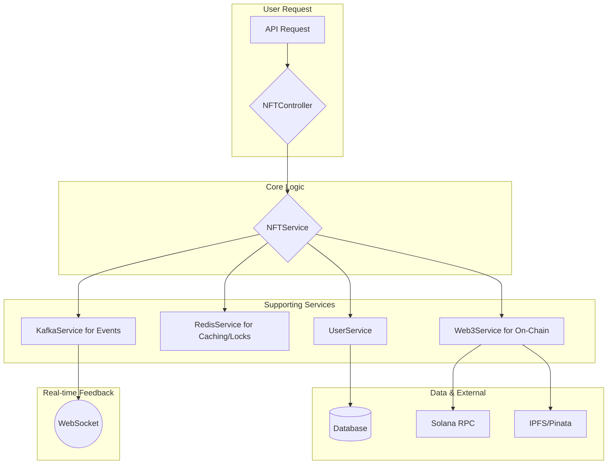

# AIW3 NFT Integration with lastmemefi-api

<!-- Document Metadata -->
**Version:** v1.0.0  
**Last Updated:** 2025-08-06  
**Status:** Active  
**Purpose:** Backend integration strategy and service architecture

---

## Executive Summary

This document provides an analysis of the AIW3 NFT system integration and strategies to align it with the `lastmemefi-api` backend (located at `/home/zealy/aiw3/gitlab.com/lastmemefi-api`). It includes architecture reviews, modification needs, strategic plans, risk assessments, and a phased implementation road map.

--- 

## Table of Contents

1.  [Infrastructure Overview](#infrastructure-overview)
2.  [Required Modifications](#required-modifications)
3.  [Phased Implementation Plan](#phased-implementation-plan)
4.  [Risk Assessment](#risk-assessment)
5.  [Implementation Roadmap](#implementation-roadmap)
6.  [Code Integration Examples](#code-integration-examples)
7.  [Frontend-Backend API & Integration Specification](#frontend-backend-api--integration-specification)

## Infrastructure Overview

### Existing AIW3 Backend Infrastructure

The `lastmemefi-api` provides a robust set of services and components that will be leveraged for the NFT integration.

**Core Components**:

- **Framework**: Sails.js (Node.js MVC framework)
- **Database**: MySQL with Waterline ORM
- **Cache**: Redis (`ioredis`) managed via `RedisService` for session data and caching.
- **Message Queue**: Kafka (`KafkaService`) for asynchronous event processing.
- **Storage**: IPFS via the Pinata SDK, with API keys already configured.
- **Blockchain**: Solana (`@solana/web3.js`) managed via `Web3Service`.
- **Monitoring**: Elasticsearch for application logging and analytics.

**Key Existing Services to Leverage**:

- **`Web3Service`**: Manages Solana RPC connections and basic on-chain queries (e.g., SOL balance). This will be extended for NFT operations.
- **`UserService`**: Handles user data management, including wallet addresses and profile information.
- **`RedisService`**: Provides comprehensive Redis caching functionality using `ioredis` client with connection management, TTL support, and advanced operations like `setCache()`, `getCache()`, `delCache()`, `sadd()`, and distributed locking capabilities.
- **`KafkaService`**: Manages Kafka messaging using `kafkajs` library with producer/consumer instances, supports `sendMessage()` for publishing events and `receiveMessage()` for consuming, configured with broker `host.docker.internal:29092`, clientId `my-nodejs-app`, and groupId `test-group`.
- **`AccessTokenService`**: Manages JWT generation and verification for API authentication.

### Required Modifications

#### 1. Web3Service Integration Points

```javascript
// Existing Web3Service structure
const Web3Service = {
    connection: null,
    initConnection: async function() {
        // Solana RPC connection management
    },
    getSOLBalance: async function(wallet_address) {
        // SOL balance queries
    }
};
```

**NFT Integration Opportunity**: Extend this service to include SPL Token and Metaplex operations.

#### 2. User Model Structure

The existing `User` model in `lastmemefi-api` already contains fields that are essential for the NFT system's business logic.

```javascript
// api/models/User.js - Actual existing attributes in backend
{
    wallet_address: { type: 'string', unique: false }, // Primary blockchain identifier
    accessToken: { type: 'string' }, // Existing JWT managed by AccessTokenService
    referralCode: { type: 'string', unique: true }, // Auto-generated unique referral code
    
    // IMPORTANT: These fields exist and can be used for NFT systems
    points: { type: 'number' }, // User points system
    energy: { type: 'number' }, // User energy system
    quick_amount: { type: 'number', columnType: 'DECIMAL(30,10)' }, // Quick trading amount
    auto_amount: { type: 'number', columnType: 'DECIMAL(30,10)' }, // Auto trading amount
    
    // NOTE: Trading volume must be calculated from Trades model aggregation
    // No total_trading_volume field exists on User model
}
```

**Integration Requirements**: Add NFT-specific fields without breaking existing functionality.

#### 3. Trades Model Structure (Critical for NFT Qualification)

The existing `Trades` model contains the actual trading data needed for NFT tier qualification:

```javascript
// api/models/Trades.js - Existing trading data structure
{
    user_id: { model: 'user', required: true }, // Links to User model
    wallet_address: { type: 'string', required: true }, // User's wallet address
    
    // CRITICAL: These fields contain the trading volume data for NFT qualification
    total_price: { type: 'number', columnType: 'DECIMAL(30,10)' }, // Trade value in tokens
    total_usd_price: { type: 'number', columnType: 'DECIMAL(30,10)' }, // Trade value in USD
    
    amount: { type: 'number', columnType: 'DECIMAL(30,10)' }, // Tokens traded
    price_per_token: { type: 'number', columnType: 'DECIMAL(20,10)' }, // Price per token
    trade_type: { type: 'string', isIn: ['buy', 'sell', 'BUY', 'SELL'] }, // Trade direction
    
    token_id: { model: 'tokens' }, // Reference to traded token
    tokenMintAddress: { type: 'string' }, // Solana mint address
    hash: { type: 'string' } // Transaction signature
}
```

**NFT Qualification Logic**: Trading volume must be calculated by aggregating `total_usd_price` from the Trades model:

```javascript
// Calculate user's total trading volume for NFT qualification
const calculateTradingVolume = async (userId) => {
    const query = `
        SELECT SUM(total_usd_price) as trading_volume 
        FROM trades 
        WHERE user_id = ? AND total_usd_price IS NOT NULL
    `;
    const result = await sails.sendNativeQuery(query, [userId]);
    return result.rows[0]?.trading_volume || 0;
};
```

#### 3. Authentication Patterns

The existing `SolanaChainAuthController` provides the foundation for secure, wallet-based authentication.

```javascript
// config/routes.js - Existing route for wallet verification
'POST /api/solanachainauth/verify': 'SolanaChainAuthController.phantomSignInOrSignUp'
```

**Leverage Point**: This nonce-based signature verification flow must be used to secure all NFT-related endpoints. The existing `AccessTokenService` will continue to manage the JWTs issued upon successful wallet verification.

## Integration Strategy

### Phase 1: Database Schema Extensions

#### New NFT-Related Models - **🚨 TO BE IMPLEMENTED**

**⚠️ IMPLEMENTATION STATUS: DATABASE MODELS NOT YET CREATED**

**Migration Scripts Required:**
```sql
-- Migration 1: Create UserNFT table
CREATE TABLE user_nft (
    id INT AUTO_INCREMENT PRIMARY KEY,
    user_id INT NOT NULL,
    nft_mint_address VARCHAR(44) NOT NULL UNIQUE,
    nft_level INT NOT NULL,
    nft_name VARCHAR(255),
    claimed_at DATETIME DEFAULT CURRENT_TIMESTAMP,
    last_upgraded_at DATETIME,
    metadata_uri TEXT,
    is_active BOOLEAN DEFAULT TRUE,
    created_at DATETIME DEFAULT CURRENT_TIMESTAMP,
    updated_at DATETIME DEFAULT CURRENT_TIMESTAMP ON UPDATE CURRENT_TIMESTAMP,
    FOREIGN KEY (user_id) REFERENCES user(id) ON DELETE CASCADE,
    INDEX idx_user_active (user_id, is_active),
    INDEX idx_mint_address (nft_mint_address)
);

-- Migration 2: Create UserNFTQualification table  
CREATE TABLE user_nft_qualification (
    id INT AUTO_INCREMENT PRIMARY KEY,
    user_id INT NOT NULL,
    target_level INT NOT NULL,
    current_volume DECIMAL(30,10) DEFAULT 0,
    required_volume DECIMAL(30,10) NOT NULL,
    badges_collected INT DEFAULT 0,
    badges_required INT DEFAULT 0,
    is_qualified BOOLEAN DEFAULT FALSE,
    last_checked_at DATETIME DEFAULT CURRENT_TIMESTAMP,
    created_at DATETIME DEFAULT CURRENT_TIMESTAMP,
    updated_at DATETIME DEFAULT CURRENT_TIMESTAMP ON UPDATE CURRENT_TIMESTAMP,
    FOREIGN KEY (user_id) REFERENCES user(id) ON DELETE CASCADE,
    UNIQUE KEY unique_user_level (user_id, target_level)
);

-- Migration 3: Create NFTBadge table
CREATE TABLE nft_badge (
    id INT AUTO_INCREMENT PRIMARY KEY,
    user_id INT NOT NULL,
    badge_type VARCHAR(100) NOT NULL,
    badge_name VARCHAR(255) NOT NULL,
    mint_address VARCHAR(44) NOT NULL UNIQUE,
    earned_at DATETIME DEFAULT CURRENT_TIMESTAMP,
    metadata_uri TEXT,
    created_at DATETIME DEFAULT CURRENT_TIMESTAMP,
    updated_at DATETIME DEFAULT CURRENT_TIMESTAMP ON UPDATE CURRENT_TIMESTAMP,
    FOREIGN KEY (user_id) REFERENCES user(id) ON DELETE CASCADE,
    INDEX idx_user_badge (user_id, badge_type)
);
```

**Sails.js Model Structures (To Be Created):**
```javascript
// api/models/UserNFT.js - TO BE CREATED
module.exports = {
  attributes: {
    user_id: { model: 'user' },
    nft_mint_address: { type: 'string', required: true },
    nft_level: { type: 'number', required: true }, // 1-5 + special
    nft_name: { type: 'string' }, // Tech Chicken, Quant Ape, etc.
    claimed_at: { type: 'ref', columnType: 'datetime' },
    last_upgraded_at: { type: 'ref', columnType: 'datetime' },
    metadata_uri: { type: 'string' },
    is_active: { type: 'boolean', defaultsTo: true }
  }
};

// api/models/UserNFTQualification.js - TO BE CREATED
module.exports = {
  attributes: {
    user_id: { model: 'user' },
    target_level: { type: 'number' },
    current_volume: { type: 'number', columnType: 'DECIMAL(30,10)' },
    required_volume: { type: 'number', columnType: 'DECIMAL(30,10)' },
    badges_collected: { type: 'number', defaultsTo: 0 },
    badges_required: { type: 'number' },
    is_qualified: { type: 'boolean', defaultsTo: false },
    last_checked_at: { type: 'ref', columnType: 'datetime' }
  }
};

// api/models/NFTBadge.js - TO BE CREATED
module.exports = {
  attributes: {
    user_id: { model: 'user' },
    badge_type: { type: 'string' }, // micro_badge, achievement_badge, etc.
    badge_name: { type: 'string' },
    mint_address: { type: 'string' },
    earned_at: { type: 'ref', columnType: 'datetime' },
    metadata_uri: { type: 'string' }
  }
};
```

### Phase 2: Service Layer Extensions

#### Enhanced Web3Service - **🚨 TO BE IMPLEMENTED**

**⚠️ IMPLEMENTATION STATUS: NFT EXTENSIONS NOT YET ADDED**

The existing `Web3Service` needs to be extended with NFT-specific methods:

```javascript
// Extended Web3Service for NFT operations - ADDITIONS REQUIRED
module.exports = {
    // ... existing methods ...
    
    // NFT-specific methods
    mintNFTToUser: async function(userWalletAddress, metadataUri, nftLevel) {
        // Use SPL Token Program to mint NFT
        // Return transaction signature and mint address
    },
    
    burnUserNFT: async function(userWalletAddress, mintAddress) {
        // Burn existing NFT for upgrade process
    },
    
    verifyNFTOwnership: async function(userWalletAddress, mintAddress) {
        // Verify user owns specific NFT
    },
    
    getUserNFTs: async function(userWalletAddress) {
        // Get all NFTs owned by user
    }
};
```

#### New NFTService (Orchestrator) - **🚨 TO BE IMPLEMENTED**

**⚠️ IMPLEMENTATION STATUS: NOT YET CREATED**

The `NFTService` will need to be created to act as an orchestrator, coordinating operations between existing services to execute NFT-related business logic.

**Implementation Required:**
```javascript
// api/services/NFTService.js - TO BE CREATED
module.exports = {
    // Check if user qualifies for NFT level based on trading volume from Trades model
    checkNFTQualification: async function(userId, targetLevel) {
        try {
            // Calculate user's total trading volume from Trades model
            const tradingVolume = await this.calculateTradingVolume(userId);
            const requiredVolume = this.getRequiredVolumeForLevel(targetLevel);
            
            // Check if user already has NFT of this level or higher
            const existingNFT = await UserNFT.findOne({
                user_id: userId,
                nft_level: { '>=': targetLevel },
                status: 'active'
            });
            
            return {
                qualified: tradingVolume >= requiredVolume && !existingNFT,
                currentVolume: tradingVolume,
                requiredVolume: requiredVolume,
                targetLevel: targetLevel,
                hasExistingNFT: !!existingNFT
            };
        } catch (error) {
            sails.log.error('NFT qualification check failed:', error);
            return { qualified: false, reason: 'System error' };
        }
    },
    
    // Calculate user's total trading volume from Trades model
    calculateTradingVolume: async function(userId) {
        try {
            const query = `
                SELECT SUM(total_usd_price) as trading_volume 
                FROM trades 
                WHERE user_id = ? AND total_usd_price IS NOT NULL
            `;
            const result = await sails.sendNativeQuery(query, [userId]);
            return parseFloat(result.rows[0]?.trading_volume) || 0;
        } catch (error) {
            sails.log.error('Trading volume calculation failed:', error);
            return 0;
        }
    },
    
    processNFTUpgrade: async function(userId, fromLevel, toLevel) {
        // Handle burn-and-mint upgrade process
        // 1. Verify qualification
        // 2. Burn old NFT
        // 3. Mint new NFT
        // 4. Update database records
        // 5. Send Kafka notification
    },
    
    // Redis caching integration using actual RedisService methods
    cacheNFTQualification: async function(userId, qualificationData, ttl = 300) {
        try {
            const cacheKey = `nft_qual:${userId}`;
            await RedisService.setCache(cacheKey, qualificationData, ttl);
            return true;
        } catch (error) {
            sails.log.error('Failed to cache NFT qualification:', error);
            return false;
        }
    },
    
    getCachedNFTQualification: async function(userId) {
        try {
            const cacheKey = `nft_qual:${userId}`;
            const cached = await RedisService.getCache(cacheKey);
            return cached ? JSON.parse(cached) : null;
        } catch (error) {
            sails.log.error('Failed to get cached NFT qualification:', error);
            return null;
        }
    },
    
    // Distributed locking using RedisService for concurrent operations
    acquireNFTOperationLock: async function(userId, operation = 'upgrade', ttl = 600) {
        try {
            const lockKey = `nft_lock:${operation}:${userId}`;
            const lockValue = await RedisService.setCache(lockKey, 'locked', ttl, { lockMode: true });
            return lockValue !== false ? lockValue : null;
        } catch (error) {
            sails.log.error('Failed to acquire NFT operation lock:', error);
            return null;
        }
    },
    
    releaseNFTOperationLock: async function(userId, operation = 'upgrade') {
        try {
            const lockKey = `nft_lock:${operation}:${userId}`;
            await RedisService.delCache(lockKey);
            return true;
        } catch (error) {
            sails.log.error('Failed to release NFT operation lock:', error);
            return false;
        }
    },
    
    // Kafka event publishing using actual KafkaService methods
    publishNFTEvent: async function(eventType, eventData) {
        try {
            const topic = 'nft-events'; // Use existing Kafka topic or create new one
            const message = {
                eventType: eventType,
                timestamp: new Date().toISOString(),
                data: eventData
            };
            
            await KafkaService.sendMessage(topic, message);
            sails.log.info(`NFT event published: ${eventType}`, eventData);
            return true;
        } catch (error) {
            sails.log.error('Failed to publish NFT event:', error);
            return false;
        }
    },
    
    applyNFTBenefits: async function(userId) {
        // Apply fee reductions and other benefits based on NFT level
        // Integrate with existing trading fee calculations
        try {
            const userNFTs = await UserNFT.find({ user_id: userId, status: 'active' });
            const highestLevel = Math.max(...userNFTs.map(nft => nft.nft_level));
            
            // Cache the benefit level for quick access during trading
            await RedisService.setCache(`nft_benefits:${userId}`, { level: highestLevel }, 3600);
            
            return { level: highestLevel, benefits: this.getBenefitsForLevel(highestLevel) };
        } catch (error) {
            sails.log.error('Failed to apply NFT benefits:', error);
            return { level: 0, benefits: {} };
        }
    }
};
```

### Phase 3: API Endpoints Integration

#### New NFT Controller - **🚨 TO BE IMPLEMENTED**

**⚠️ IMPLEMENTATION STATUS: NOT YET CREATED**

```javascript
// api/controllers/NFTController.js - TO BE CREATED
module.exports = {
    getUserNFTStatus: async function(req, res) {
        // GET /api/nft/status
        // Return user's current NFT, qualification progress, available upgrades
    },
    
    claimInitialNFT: async function(req, res) {
        // POST /api/nft/claim
        // Mint Level 1 NFT for new users
    },
    
    initiateUpgrade: async function(req, res) {
        // POST /api/nft/upgrade
        // Start upgrade process (burn old, mint new)
    },
    
    getNFTBenefits: async function(req, res) {
        // GET /api/nft/benefits
        // Return current benefits and fee reductions
    }
};
```

#### Route Integration

```javascript
// config/routes.js additions
{
    // NFT-specific routes
    'GET /api/nft/status': 'NFTController.getUserNFTStatus',
    'POST /api/nft/claim': 'NFTController.claimInitialNFT',
    'POST /api/nft/upgrade': 'NFTController.initiateUpgrade',
    'GET /api/nft/benefits': 'NFTController.getNFTBenefits',
    'GET /api/nft/badges': 'NFTController.getUserBadges',
    
    // Integration with existing user endpoints
    'GET /api/user/profile': 'UserController.getProfileWithNFT', // Enhanced
}
```

## Leveraging Existing Infrastructure

### 1. MySQL Database Integration

**Advantage**: Reuse existing user management, trading data, and transaction history.

```sql
-- Leverage existing user trading data for NFT qualification
SELECT 
    u.id,
    u.wallet_address,
    SUM(t.total_price) as total_volume,
    COUNT(DISTINCT DATE(t.createdAt)) as trading_days
FROM user u
LEFT JOIN trades t ON u.wallet_address = t.wallet_address
WHERE t.createdAt >= DATE_SUB(NOW(), INTERVAL 1 YEAR)
GROUP BY u.id;
```

### 2. Redis Caching Strategy

**Implementation**: Cache NFT qualification status and user benefits.

```javascript
// Cache user NFT status for 5 minutes
const cacheKey = `user:${userId}:nft:status`;
await RedisService.setCache(cacheKey, JSON.stringify(nftStatus), 300);
```

### 3. Kafka Message Queue Integration

**Use Cases**: 
- NFT upgrade notifications
- Volume threshold alerts
- Badge earning events

```javascript
// Kafka message for NFT upgrade
const upgradeMessage = {
    userId: user.id,
    fromLevel: 1,
    toLevel: 2,
    timestamp: new Date().toISOString(),
    mintAddress: newNFTMintAddress
};
await KafkaService.sendMessage('nft-events', upgradeMessage);
```

### 4. IPFS Storage (Pinata) Integration

**Advantage**: Already configured and operational.

```javascript
// Leverage existing Pinata configuration
const metadataUri = await pinata.upload({
    name: "Tech Chicken #1",
    description: "Level 1 AIW3 NFT",
    image: "https://gateway.pinata.cloud/ipfs/...",
    attributes: [
        { trait_type: "Level", value: 1 },
        { trait_type: "Tier", value: "Tech Chicken" }
    ]
});
```

### 5. Elasticsearch Monitoring Integration

**Implementation**: Track NFT-related events and user behavior.

```javascript
// Log NFT events to Elasticsearch
// Log to existing monitoring system
const logData = {
    userId: user.id,
    walletAddress: user.wallet_address,
    fromLevel: 1,
    toLevel: 2,
    timestamp: new Date(),
    transactionSignature: txSignature
});
```

## Risk Assessment and Mitigation

### High-Risk Areas

#### 1. Database Schema Changes
**Risk**: Breaking existing functionality
**Mitigation**: 
- Use database migrations
- Maintain backward compatibility
- Extensive testing in staging environment

#### 2. Solana Network Dependencies
**Risk**: Network congestion affecting NFT operations
**Mitigation**:
- Implement retry mechanisms
- Queue failed transactions for later processing
- Use priority fees for critical operations

#### 3. User Experience Disruption
**Risk**: Changes affecting existing user workflows
**Mitigation**:
- Gradual rollout with feature flags
- Maintain existing API contracts
- Comprehensive user testing

### Medium-Risk Areas

#### 1. Performance Impact
**Risk**: NFT operations slowing down existing features
**Mitigation**:
- Asynchronous processing for heavy operations
- Proper database indexing
- Redis caching for frequently accessed data

#### 2. Data Consistency
**Risk**: Mismatch between on-chain and off-chain data
**Mitigation**:
- Regular reconciliation jobs
- Event-driven architecture
- Comprehensive logging

## 🚨 CRITICAL: Missing Dependencies & Prerequisites

**⚠️ BEFORE IMPLEMENTATION CAN BEGIN:**

### Required Package Dependencies (Missing from package.json)
```json
{
  "dependencies": {
    "@solana/web3.js": "^1.98.0",
    "@solana/spl-token": "^0.3.8", 
    "@metaplex-foundation/mpl-token-metadata": "^2.13.0",
    "@metaplex-foundation/umi": "^0.9.0",
    "@metaplex-foundation/umi-bundle-defaults": "^0.9.0"
  }
}
```

### Feature Flag Implementation Required
```javascript
// config/env/development.js - ADD FEATURE FLAGS
module.exports = {
  nftFeatures: {
    enabled: false,  // Start with disabled
    claiming: false,
    upgrading: false,
    badges: false
  }
};
```

## Implementation Roadmap - **UPDATED REALISTIC TIMELINE**

### Phase 0: Prerequisites (Week 1)
- [ ] **🚨 CRITICAL**: Add missing NPM dependencies to package.json
- [ ] **🚨 CRITICAL**: Create database migration scripts
- [ ] **🚨 CRITICAL**: Implement feature flag system
- [ ] Verify existing backend integration points

### Phase 1: Foundation (Week 2-3)
- [ ] Create NFT database models (UserNFT, UserNFTQualification, NFTBadge)
- [ ] Create NFTService.js with basic qualification logic
- [ ] Extend Web3Service with NFT methods
- [ ] Create NFTController.js with API endpoints

### Phase 2: Core Integration (Week 4-5)
- [ ] Implement Redis caching for NFT status
- [ ] Add Kafka event publishing for NFT operations
- [ ] Create database seeders for testing
- [ ] Implement API authentication middleware

### Phase 3: Testing & Validation (Week 6-7)
- [ ] Unit tests for NFTService methods
- [ ] Integration tests for API endpoints
- [ ] End-to-end tests for NFT workflows
- [ ] Performance testing for volume calculations

### Phase 4: Deployment Preparation (Week 8-9)
- [ ] Staging environment setup
- [ ] Feature flag testing
- [ ] Database migration testing
- [ ] Load testing and optimization

### Phase 5: Production Rollout (Week 10-12)
- [ ] Gradual feature flag enablement
- [ ] Monitoring and alerting setup
- [ ] User acceptance testing
- [ ] Full production deployment

## Code Integration Examples

### Enhanced User Profile API

```javascript
// Enhanced UserController.getProfile
getProfile: async function(req, res) {
    const user = req.user;
    
    // Existing user data
    const userData = await User.findOne(user.id);
    
    // Add NFT information
    const nftStatus = await NFTService.getUserNFTStatus(user.id);
    const benefits = await NFTService.calculateBenefits(user.id);
    
    return res.json({
        ...userData,
        nft: nftStatus,
        benefits: benefits
    });
}
```

### Trading Fee Integration

```javascript
// Enhanced trading fee calculation
calculateTradingFee: async function(userId, tradeAmount) {
    const baseFee = tradeAmount * 0.01; // 1% base fee
    
    // Apply NFT benefits
    const nftBenefits = await NFTService.getNFTBenefits(userId);
    const discountedFee = baseFee * (1 - nftBenefits.feeReduction);
    
    return discountedFee;
}
```

## Conclusion

The integration of the AIW3 NFT system with the existing `lastmemefi-api` backend is highly feasible and can leverage significant existing infrastructure. The modular approach ensures minimal disruption to existing functionality while providing a robust foundation for NFT operations.

Key success factors:
1. **Incremental Integration**: Build on existing patterns and services
2. **Data Consistency**: Maintain synchronization between on-chain and off-chain data
3. **Performance Optimization**: Use caching and asynchronous processing
4. **Risk Mitigation**: Comprehensive testing and gradual rollout

The existing infrastructure provides excellent foundations for user management, authentication, caching, messaging, and storage - all critical components for a successful NFT integration.

---

## Related Documents

- **[AIW3 NFT System Design](./AIW3-NFT-System-Design.md)**: High-level technical architecture
- **[AIW3 NFT Implementation Guide](./AIW3-NFT-Implementation-Guide.md)**: Detailed implementation instructions  
- **[AIW3 NFT Data Model](./AIW3-NFT-Data-Model.md)**: Database schemas and data structures
- **[AIW3 NFT Tiers and Rules](./AIW3-NFT-Tiers-and-Rules.md)**: Business rules and tier definitions

**For terminology definitions, please refer to the [AIW3 NFT Appendix](./AIW3-NFT-Appendix.md) document.**

---

## Frontend-Backend API & Integration Specification

This section provides a detailed specification for the API contracts, data formats, and communication protocols that govern the interaction between the frontend application and the `lastmemefi-api` backend.

<details>
<summary><strong>Table of Contents</strong></summary>

- [Key Business Logic & Rules](#key-business-logic--rules)
- [Service Integration Architecture](#service-integration-architecture)
  - [Backend Service Flow](#backend-service-flow)
  - [Frontend Integration Flow](#frontend-integration-flow)
- [API Contract Specifications](#api-contract-specifications)
  - [Authentication & Authorization](#authentication--authorization)
  - [Standardized Response Formats](#standardized-response-formats)
  - [Standardized Error Codes](#standardized-error-codes)
  - [Real-time Communication (WebSockets)](#real-time-communication-websockets)
- [Frontend Integration Points](#frontend-integration-points)
  - [Personal Center Dashboard](#personal-center-dashboard)
  - [Synthesis (Upgrade) Flow](#synthesis-upgrade-flow)
  - [Badge System Integration](#badge-system-integration)
- [Technical Implementation Plan & Dependencies](#technical-implementation-plan--dependencies)
- [Testing & Development Support](#testing--development-support)

</details>

### Key Business Logic & Rules

To ensure development aligns with business objectives, the following core logic must be accurately implemented:

- **Trading Volume Calculation**: Qualification for NFT tiers is based on a user's total trading volume. This data is aggregated from the `Trades` model, not stored directly on the `User` model. The aggregation logic must be efficient and consistent.
- **NFT Upgrade Requirements**: A user can only upgrade their NFT if they meet both the trading volume threshold AND possess the required badges for the next level.
- **Badge Uniqueness**: Badges are unique and can only be claimed once per user.
- **Special NFT Tier**: The "Special" NFT tier is not attainable through the standard upgrade path and must be assigned manually or through special conditions defined by the business.
- **Benefit Application**: NFT benefits (e.g., fee reductions, `aiagentUses`) must be applied in real-time to relevant user actions.

### Service Integration Architecture

#### Backend Service Flow



#### Frontend Integration Flow

```
User Action → API Call → Backend Processing → WebSocket Event → UI Update
     ↓           ↓            ↓                ↓            ↓
Button Click  HTTP Request  NFT Service      Real-time Event  Component Refresh
```

### API Contract Specifications

#### Authentication & Authorization
- **Wallet Authentication**: Extend existing Solana wallet signature verification.
- **JWT Integration**: NFT endpoints use existing JWT middleware from `AccessTokenService`.
- **Permission Levels**: NFT operations require an authenticated user context.

#### Standardized Response Formats

To ensure consistent communication, all API responses must follow the formats below.

```json
// Success Response (following existing lastmemefi-api patterns)
{
  "success": true,
  "data": {
    "currentNFT": {
      "level": 1,
      "tierName": "Tech Chicken",
      "mintAddress": "ABC123...",
      "benefits": { "feeReduction": 0.05, "aiagentUses": 10 }
    },
    "qualification": {
      "nextLevel": 2,
      "progress": 0.75,
      "requirements": { "tradingVolume": 50000, "badges": ["early_adopter"] }
    }
  },
  "meta": { "timestamp": "2024-01-01T00:00:00Z", "version": "v1" }
}

// Error Response (consistent with existing error handling)
{
  "success": false,
  "error": {
    "code": "NFT_UPGRADE_FAILED",
    "message": "Insufficient trading volume for upgrade",
    "details": { "required": 100000, "current": 75000 }
  }
}
```

#### Standardized Error Codes

| Error Code | HTTP Status | Description |
| :--- | :--- | :--- |
| `UNAUTHORIZED` | 401 | Missing or invalid JWT token. |
| `INSUFFICIENT_FUNDS` | 400 | User's wallet has insufficient SOL for the transaction. |
| `NFT_NOT_FOUND` | 404 | The specified NFT does not exist or belong to the user. |
| `QUALIFICATION_NOT_MET` | 403 | User does not meet trading volume or badge requirements for an action. |
| `BADGE_ALREADY_CLAIMED` | 409 | User has already claimed this badge. |
| `SOLANA_RPC_ERROR` | 503 | The Solana RPC node is unavailable or returned an error. |
| `IPFS_ERROR` | 503 | Could not upload or retrieve data from IPFS. |
| `CONCURRENCY_LOCK_FAILED` | 429 | The user's account is currently busy with another operation. |
| `INTERNAL_SERVER_ERROR` | 500 | A generic, unexpected error occurred on the server. |

#### Real-time Communication (WebSockets)
- **Events**: Use existing `socket.io` infrastructure for real-time updates.
  - `nft:status_changed`: NFT level or benefits updated.
  - `nft:upgrade_progress`: Multi-step upgrade progress.
  - `nft:qualification_updated`: Progress toward next tier.
  - `nft:transaction_status`: Solana transaction updates.
- **Payload**: Consistent structure with user ID, event type, and data.

### Core API Endpoints

- **`GET /api/nft/status`**: Returns the user's current NFT level, tier name, and progress toward the next tier, including trading volume and required badges.
- **`POST /api/nft/claim`**: Initiates the process to claim a new NFT once qualification criteria are met. The backend orchestrates metadata upload to IPFS and minting on Solana.
- **`POST /api/nft/upgrade`**: Handles the burn-and-mint upgrade process. The backend verifies qualifications, coordinates the burning of the old NFT, and mints the new one.
- **`GET /api/nft/history`**: Provides a paginated history of the user's NFT activities, including claims, upgrades, and badge achievements.
- **`GET /api/nft/benefits`**: Fetches the current benefits associated with the user's NFT tier, such as fee reductions and increased `aiagentUses`.
- **`GET /api/nft/badges`**: Returns the user's full collection of badges, indicating which are unlocked and which are still required for the next upgrade.
- **`POST /api/nft/badges/claim`**: Allows the user to claim a badge they have earned through specific achievements.

### Technical Implementation Plan & Dependencies

This section outlines the specific technical components required, distinguishing between internal services and external libraries.

| Feature / Requirement | Internal Services (`lastmemefi-api`) | External Libraries & Dependencies (with versions) |
| :--- | :--- | :--- |
| **Wallet Authentication** | `SolanaChainAuthController`, `UserService` | `@solana/web3.js: ^1.98.0` |
| **JWT Integration** | `AccessTokenService` (existing middleware) | `jsonwebtoken: ^9.0.2` |
| **Standardized Responses** | Core Sails.js response handlers | N/A (Architectural Pattern) |
| **Real-time (WebSockets)** | `sails-hook-sockets: ^3.0.0` | `socket.io-client: ^4.x` (Frontend, version to match server) |
| **Transaction Tracking** | `Web3Service`, `WebSocketService` | `@solana/web3.js: ^1.98.0` |
| **Personal Center** | `NFTService` (new), `UserService`, `RedisService` | N/A (Backend logic) |
| **Synthesis (Upgrade) Flow**| `NFTService`, `Web3Service`, `RedisService` (for locking) | `@solana/web3.js: ^1.98.0`, `@metaplex-foundation/mpl-token-metadata: ^2.13.0` |
| **Badge System** | `NFTService`, `UserService`, `Database` (new models) | N/A (Backend logic) |
| **Mock Data & Sandbox** | Sails.js seeders, new `SandboxController` | N/A (Internal tooling) |
| **API Documentation** | Existing Swagger/OpenAPI setup | `swagger-ui-express: (To be added, if needed)` |

### Testing & Development Support

#### Mock Data & Sandbox
- **Test Users**: Pre-configured users with different NFT levels (1-5 + Special).
- **Sandbox Endpoints**: Safe testing environment with `/api/nft/sandbox/` prefix.
- **Test Scenarios**: Upgrade success, upgrade failure, network errors.

#### API Documentation
- **Interactive Docs**: Swagger UI with live examples at `/docs/nft`.
- **Code Examples**: JavaScript, React, Vue.js integration samples.
- **Error Scenarios**: Comprehensive error handling examples.
- **Authentication**: Step-by-step wallet connection guide.
