# AIW3 NFT System Design
## High-Level Architecture & Lifecycle Management for Solana-Based Equity NFTs

---

## Table of Contents

1. [Executive Summary](#executive-summary)
2. [NFT Lifecycle Overview](#nft-lifecycle-overview)
3. [Technical Architecture](#technical-architecture)
4. [Visual Architecture](#visual-architecture)
5. [Implementation Guide](#implementation-guide)
6. [NFT Upgrade and Burn Strategy](#nft-upgrade-and-burn-strategy)
7. [Detailed Process Flows](#detailed-process-flows)
8. [Recommendations](#recommendations)
9. [Implementation Requirements](#implementation-requirements)
10. [Appendix](#appendix)

---

## Executive Summary

This document provides a comprehensive technical guide for implementing AIW3's Equity NFT system on Solana. The recommended approach uses **system-direct minting** combined with **user-controlled burning**, leveraging the Metaplex Token Metadata standard for maximum ecosystem compatibility.

### Key Benefits

- ✅ **Authenticity Guaranteed**: Creator verification through on-chain metadata
- ✅ **User Autonomy**: Full user control over NFT ownership and burning
- ✅ **Cost Effective**: No custom smart contracts required
- ✅ **Industry Standard**: Compatible with all major Solana NFT tools

### Strategic Approach

The optimal implementation uses a **hybrid lifecycle pattern** that balances authenticity, user autonomy, and ecosystem compatibility through:
- **System-controlled minting** for authenticity guarantee
- **Partner-driven verification** for ecosystem integration
- **User-controlled burning** for ownership autonomy

---

## NFT Lifecycle Overview

The AIW3 NFT ecosystem operates through three distinct phases:

| Phase | Description | Control | Key Technology |
|-------|-------------|---------|----------------|
| **🏗️ MINT** | NFT creation with metadata URI linking to level data | AIW3 System Wallet | Solana Token Program + Metaplex |
| **🔍 USE** | Verification and data access by partners | Ecosystem Partners | Metadata queries + IPFS via Pinata |
| **🔥 BURN** | NFT destruction for upgrades/exits | User Wallet | User-initiated transactions |

### Lifecycle Characteristics

**Phase 1: Minting (System-Controlled)**
- Images sourced from AIW3 backend `assets/images` directory
- Images uploaded to IPFS via Pinata for decentralized access
- JSON metadata created with IPFS image URIs and level data
- JSON metadata uploaded to IPFS via Pinata
- AIW3 System Wallet mints NFT to user's Associated Token Account (ATA)
- User becomes owner upon transaction confirmation without additional transfer
- Metadata URI points to IPFS-hosted JSON containing level data and image references

**Phase 2: Usage (Partner-Initiated)**
- Partners verify authenticity via on-chain creator field
- Level queried from IPFS-hosted JSON metadata attributes
- Images retrieved directly from IPFS via Pinata gateway

**Phase 3: Burning (User-Controlled)**
- User initiates burn transaction
- Token supply reduced to zero
- Associated Token Account closed
- SOL rent returned to user

---

## Technical Architecture

The AIW3 NFT system uses a hybrid approach where the NFT itself contains only a URI reference to off-chain JSON metadata that stores the actual level data and references to IPFS-hosted images.

### Transaction Volume Qualification

**Level Requirements** (stored in AIW3 MySQL database):

| NFT Level | Minimum Transaction Volume | Database Query | Verification Method | Business Logic |
|-----------|---------------------------|----------------|-------------------|-----------------|
| **Bronze** | $1,000 - $4,999 | `SELECT SUM(transaction_amount) FROM user_transactions WHERE user_id = ? AND status = 'completed'` | Real-time volume calculation | Entry-level qualification |
| **Silver** | $5,000 - $19,999 | `SELECT SUM(transaction_amount) FROM user_transactions WHERE user_id = ? AND status = 'completed'` | Real-time volume calculation | Mid-tier qualification |
| **Gold** | $20,000 - $99,999 | `SELECT SUM(transaction_amount) FROM user_transactions WHERE user_id = ? AND status = 'completed'` | Real-time volume calculation | High-tier qualification |
| **Platinum** | $100,000+ | `SELECT SUM(transaction_amount) FROM user_transactions WHERE user_id = ? AND status = 'completed'` | Real-time volume calculation | Premium qualification |

**Volume Verification Process**:
1. Query user's total transaction volume from MySQL database
2. Determine highest qualified NFT level based on volume thresholds
3. Verify user doesn't already possess NFT of that level or higher
4. Check for any pending minting operations for the user
5. Authorize minting for qualified level only

**Qualification Business Rules**:
- Users can only mint NFTs for levels they have transaction volume to support
- Users cannot mint multiple NFTs of the same level
- Users cannot mint lower-level NFTs if they already possess higher-level ones
- Transaction volume is calculated from all completed transactions in the system
- Real-time volume calculation ensures current qualification status

### Image and Metadata Flow

```
AIW3 Backend assets/images Directory
         ↓ (Source Images)
    Upload to IPFS via Pinata
         ↓ (Get IPFS Hash)
    Create JSON Metadata with IPFS Image URI
         ↓
    Upload JSON to IPFS via Pinata
         ↓ (Get Metadata IPFS Hash)
    Store Metadata URI in On-Chain NFT Metadata
         ↓
    Third-Party Access via IPFS Gateways
```

**Note**: The NFT is minted to the user's Associated Token Account (ATA), which is deterministically derived from the user's wallet address and the NFT mint address. Ownership is established when the minting transaction is confirmed on-chain.

### On-Chain Metadata Account Details

Data stored directly on **Solana blockchain** for trust and authenticity verification:

| Field | Type | Source | Required | Description & AIW3 Usage |
|-------|------|--------|----------|--------------------------|
| `update_authority` | `Pubkey` | AIW3 System Wallet | Yes | AIW3 System Wallet public key |
| `mint` | `Pubkey` | Solana | Yes | NFT's unique identifier |
| `data.name` | `String` | AIW3 System Wallet | Yes | NFT name (e.g., "AIW3 Equity NFT #1234") |
| `data.symbol` | `String` | AIW3 System Wallet | Yes | Collection symbol (e.g., "AIW3E") |
| `data.uri` | `String` | AIW3 System Wallet | Yes | IPFS via Pinata URI for off-chain JSON |
| `data.creators` | `Vec<Creator>` | AIW3 System Wallet | Yes | **Core authenticity verification** |
| `is_mutable` | `bool` | AIW3 System Wallet | Yes | Set to `false` for permanence |

### Off-Chain JSON Metadata Details

The `uri` field in the on-chain metadata contains an IPFS via Pinata link to this JSON file where the **actual Level data is stored** and **images are referenced via IPFS**:

```json
{
  "name": "AIW3 Equity NFT #1234",
  "symbol": "AIW3E",
  "description": "Represents user's equity and status within AIW3 ecosystem",
  "image": "https://gateway.pinata.cloud/ipfs/QmImageHashExample123",
  "external_url": "https://aiw3.io",
  "attributes": [
    {
      "trait_type": "Level",
      "value": "Gold",
      "display_type": "string"
    },
    {
      "trait_type": "Tier",
      "value": "3",
      "display_type": "number"
    }
  ],
  "properties": {
    "files": [
      {
        "uri": "https://gateway.pinata.cloud/ipfs/QmImageHashExample123",
        "type": "image/png"
      }
    ],
    "creators": [
      {
        "address": "AIW3_SYSTEM_WALLET_PUBLIC_KEY",
        "share": 100
      }
    ]
  }
}
```

---

## Visual Architecture

### NFT Ecosystem Entity Relationship


### Partner Verification Flow

```mermaid
flowchart TD
    A["User provides Wallet Address"] --> B["Query Solana: Find Token Accounts"]
    B --> C["Filter: Token Accounts with balance = 1"]
    C --> D["Extract: Mint Account addresses"]
    D --> E["Derive: Metadata PDA from Mint"]
    E --> F["Verify: creators[0] == AIW3 && verified == true"]
    F --> |Valid| G["Read: URI field from metadata"]
    F --> |Invalid| H["❌ Reject: Not authentic AIW3 NFT"]
    G --> I["Fetch: JSON metadata from IPFS via Pinata"]
    I --> J["Extract: Level from attributes"]
    I --> K["Extract: Image URI from JSON (IPFS)"]
    J --> L["✅ Display: User's NFT level"]
    K --> M["✅ Display: NFT image from IPFS"]

    style A fill:#e1f5fe
    style L fill:#c8e6c9
    style M fill:#c8e6c9
    style H fill:#ffcdd2
```



### Complete Minting Process Flow


### System Architecture for Operations


### Data Model Relationships


---

## Implementation Guide

### Recommended Approach: Metadata Attributes with IPFS Distribution

Use Metaplex standard where on-chain metadata contains URI pointing to IPFS-hosted JSON with level data, while images are sourced from backend `assets/images` directory and distributed via IPFS for decentralized partner access.

**Advantages**:
- ✅ Decentralized access via standard metadata queries
- ✅ Authenticity verification through on-chain creator field
- ✅ Full ecosystem compatibility
- ✅ Cost-effective hybrid approach
- ✅ Leverages proven Metaplex standard
- ✅ Centralized source management with decentralized distribution

**Technical Details**:
- **Source Storage**: Backend `assets/images` directory for image management
- **Distribution**: IPFS via Pinata for decentralized, content-addressed storage
- **Authenticity**: On-chain creator verification via AIW3 System Wallet address
- **Compatibility**: Standard NFT tools and marketplace support

### Minting Process Implementation

**Step-by-Step Minting Flow**:

1. **Transaction Volume Verification**
   - Query user's total transaction volume from MySQL database
   - Determine highest qualified NFT level based on volume thresholds
   - Verify user doesn't already possess NFT of that level or higher
   - Check for any pending minting operations for the user

2. **Image Preparation**
   - Read source image from `assets/images/{level}.png`
   - Validate image format and size
   - Upload image to IPFS via Pinata
   - Obtain IPFS hash for image

3. **Metadata Creation**
   - Create JSON metadata structure
   - Include IPFS image URI in `image` field
   - Add level data to `attributes` array
   - Include creator information

4. **Metadata Upload**
   - Upload JSON metadata to IPFS via Pinata
   - Obtain IPFS hash for metadata
   - Verify metadata accessibility via gateway

5. **NFT Minting**
   - Create Solana mint account
   - Create user's Associated Token Account
   - Mint single token to user's ATA
   - Create Metaplex metadata account with IPFS JSON URI

6. **Verification**
   - Confirm on-chain metadata creation
   - Verify IPFS content accessibility
   - Test partner verification flow

---

## NFT Upgrade and Burn Strategy

### Invalidation Approach: User-Controlled Burning

The recommended approach is **User-Controlled Burning**. The user executes `burn` and `closeAccount` transactions directly from their wallet. This method provides definitive, on-chain proof of destruction and aligns with Web3 principles of user autonomy.

**Advantages**:
- ✅ **Unambiguous Proof**: The closure of the Associated Token Account (ATA) is definitive on-chain evidence that the NFT has been destroyed.
- ✅ **Trustless Verification**: The AIW3 System Wallet can programmatically verify the burn by checking that the ATA no longer exists.
- ✅ **Solana Standards**: This approach correctly follows the SPL Token program's intended lifecycle.
- ✅ **User Empowerment**: Users maintain full control over their assets and can reclaim the SOL rent from the closed account.

**Verification Method**: The system confirms the burn by querying the ATA's address. If `getAccountInfo(ataAddress)` returns `null`, the burn is verified.

---

## Detailed Process Flows

### Partner Verification Process

**Data Flow for Authentication**:

```
1. User presents Wallet Address
   ↓
2. Partner queries Solana for Token Accounts owned by wallet
   ↓
3. Filter for tokens with supply = 1 (NFTs) → Get Mint Address
   ↓
4. Find On-Chain Metadata PDA associated with Mint
   ↓
5. Verify Authenticity: Check creators array for AIW3 System Wallet public key (verified: true)
   ↓
6. Get Rich Data: Read uri field from on-chain metadata
   ↓
7. Fetch Off-Chain JSON from IPFS URI (via Pinata gateway)
   ↓
8. Extract Level Data: Parse attributes array in off-chain JSON for "Level" trait
   ↓
9. Retrieve Image: Get image URI from JSON metadata (IPFS URI)
   ↓
10. Display Image: Access image directly from IPFS via gateway
   ↓
11. Business Context: Level represents user's transaction volume tier at time of minting
```

### Volume Qualification Verification Process

**Pre-Minting Volume Check Flow**:

```
1. User requests NFT minting for specific level
   ↓
2. System queries MySQL: SELECT SUM(transaction_amount) FROM user_transactions WHERE user_id = ? AND status = 'completed'
   ↓
3. Calculate qualified level based on volume thresholds
   ↓
4. Compare requested level with qualified level
   ↓
5. Check existing NFT ownership: Query blockchain for user's current NFTs
   ↓
6. Verify no duplicate level minting
   ↓
7. Authorize or deny minting request based on qualification
   ↓
8. If approved: Proceed to image preparation and IPFS upload
   ↓
9. If denied: Return qualification error with current volume status
```

**Volume Verification Error Scenarios**:
- **Insufficient Volume**: User requests level above their transaction volume
- **Duplicate Level**: User already owns NFT of requested level
- **Database Error**: Unable to calculate transaction volume
- **Pending Operation**: User has existing minting operation in progress

### Image Distribution Flow

**From Source to Third-Party Access**:

```
Backend assets/images Directory
         ↓
    [AIW3 Minting Process]
         ↓
    Upload to IPFS via Pinata
         ↓
    IPFS Content Hash Generated
         ↓
    Include in JSON Metadata
         ↓
    [Partner Verification Process]
         ↓
    Query JSON from IPFS
         ↓
    Extract Image IPFS URI
         ↓
    Access Image from IPFS Gateway
```

---

## Recommendations

### Primary Solution: Hybrid Strategy with IPFS Distribution

**Recommended Approach**: Creator Address Verification + Metadata Attributes + IPFS Content Distribution

This approach prioritizes **simplicity, cost-effectiveness, and standards compliance** while maintaining full decentralization for third-party access.

**Implementation Strategy**:

1. **Source Management**: Maintain images in backend `assets/images` directory
2. **IPFS Distribution**: Upload images and metadata to IPFS via Pinata for decentralized access
3. **Metadata Attributes + Creator Verification**: Use existing Solana/Metaplex standards
4. **Standards Compliance**: Follow Metaplex Token Metadata for ecosystem compatibility

**Advantages**:
- ✅ **Centralized Source Control**: Easy image management and updates
- ✅ **Decentralized Distribution**: IPFS ensures partner accessibility
- ✅ **Minimal Development Complexity**: Leverages existing standards
- ✅ **Maximum Ecosystem Compatibility**: Works with all NFT tools
- ✅ **Cost Effective**: Hybrid on-chain/off-chain approach
- ✅ **Robust Authenticity**: On-chain creator verification
- ✅ **Future-Proof**: Standard approach with broad industry support

---

## Implementation Requirements

### For AIW3 System Implementation

**Transaction Volume Integration**
- Implement real-time volume calculation from MySQL database
- Create qualification checking logic before minting
- Add duplicate NFT prevention for same-level minting
- Integrate volume-based business logic into minting workflow

**Source Image Management**
- Organize images in `assets/images` directory by level/tier
- Implement image validation and optimization
- Maintain consistent naming conventions
- Version control for image updates

**IPFS Integration**
- Configure Pinata account with sufficient storage quota
- Implement image upload pipeline to IPFS
- Verify content accessibility across multiple gateways
- Monitor IPFS content persistence and availability

**System Wallet Management**
- Maintain consistent public key for creator verification
- Secure private key storage and access controls

**Metadata Standards Compliance**
- Follow Metaplex Token Metadata standard
- Structure off-chain JSON with required fields
- Include level as trait: `{"trait_type": "Level", "value": "Gold"}`
- Reference IPFS URIs for all images

**Storage Implementation**
- Upload images and JSON metadata to IPFS via Pinata
- Store metadata URI in on-chain `data.uri` field
- Ensure content-addressed storage for immutability

**Minting Process**
- Set `is_mutable: false` after minting for permanence
- Include AIW3 System Wallet as first creator with `verified: true`
- Mint to user's Associated Token Account (ATA) - no separate transfer transaction required

**Concurrency Safety**
- See [AIW3 NFT Concurrency Control](./AIW3-NFT-Concurrency-Control.md) for concurrent minting coordination and transaction ordering requirements

### For Ecosystem Partners Integration

**Authenticity Verification**
- Query user's wallet for Token Accounts with balance = 1
- Derive Metadata PDA from NFT Mint Account address
- Verify `creators[0].address` matches AIW3 System Wallet address AND `verified == true`

**Level Data Access**
- Read `uri` field from verified on-chain metadata
- Fetch JSON metadata from IPFS via Pinata URI
- Parse `attributes` array for trait where `trait_type` is "Level"

**Image Display**
- Extract `image` field URI from JSON metadata
- Access image directly from IPFS URI (not from AIW3 backend)
- Implement fallback gateways for reliability

### Operational Requirements

For detailed operational procedures, see:
- **Security & Key Management**: [AIW3 NFT Security Operations](./AIW3-NFT-Security-Operations.md)
- **Data Consistency**: [AIW3 NFT Data Consistency](./AIW3-NFT-Data-Consistency.md)
- **Network Resilience**: [AIW3 NFT Network Resilience](./AIW3-NFT-Network-Resilience.md)
- **Concurrency Control**: [AIW3 NFT Concurrency Control](./AIW3-NFT-Concurrency-Control.md)

---

## Appendix

### Related Documentation

- [AIW3 NFT Security Operations](./AIW3-NFT-Security-Operations.md) - Key management, security protocols, and operational procedures
- [AIW3 NFT Data Consistency](./AIW3-NFT-Data-Consistency.md) - Multi-layer data verification and consistency management
- [AIW3 NFT Network Resilience](./AIW3-NFT-Network-Resilience.md) - Network failure handling, retry strategies, and service redundancy
- [AIW3 NFT Concurrency Control](./AIW3-NFT-Concurrency-Control.md) - Concurrent minting safety and transaction ordering strategies

### External References

- [Solana Token Program Documentation](https://docs.solana.com/developing/runtime-facilities/programs#token-program)
- [Metaplex Token Metadata Standard](https://docs.metaplex.com/programs/token-metadata/)
- [Pinata IPFS Service](https://pinata.cloud)
- [Associated Token Account Program](https://spl.solana.com/associated-token-account)

---

*Document Version: 1.0*  
*Last Updated: December 2024*  
*Author: AIW3 Technical Team*
