# AIW3 NFT System Design
## High-Level Architecture & Lifecycle Management for Integrated Solana-Based Equity NFTs

This document provides technical specifications for integrating AIW3's Equity NFT system with `/home/zealy/aiw3/gitlab.com/lastmemefi-api`, focusing on compatibility, backend service utilization, and ecosystem interaction.

---

## Table of Contents

1.  [Executive Summary](#executive-summary)
    -   [Key Benefits](#key-benefits)
    -   [Strategic Approach](#strategic-approach)
2.  [NFT Lifecycle Overview](#nft-lifecycle-overview)
    -   [Lifecycle Characteristics](#lifecycle-characteristics)
3.  [Core Technical Architecture](#core-technical-architecture)
    -   [3.1 NFT Operation Data Flows](#31-nft-operation-data-flows)
        -   [3.1.1 NFT Claiming Flow](#311-nft-claiming-flow)
        -   [3.1.2 NFT Upgrade Flow](#312-nft-upgrade-flow)
    -   [3.2 Transaction Volume Qualification](#32-transaction-volume-qualification)
    -   [3.3 Metadata and Storage Flow](#33-metadata-and-storage-flow)
4.  [Visual Architecture](#visual-architecture)
    -   [NFT Ecosystem Entity Relationship](#nft-ecosystem-entity-relationship)
    -   [Multi-System Infrastructure Topology](#multi-system-infrastructure-topology)
5.  [Related Documents](#related-documents)

---

## Executive Summary

This document provides a high-level technical overview for AIW3's Equity NFT system on Solana. The recommended approach uses **system-direct minting** combined with **user-controlled burning**, leveraging the Metaplex Token Metadata standard for maximum ecosystem compatibility.

### Key Benefits

- ✅ **No Custom Smart Contracts**: Uses only standard Solana Token Program and Metaplex libraries
- ✅ **Authenticity Guaranteed**: Creator verification through on-chain metadata
- ✅ **User Autonomy**: Full user control over NFT ownership and burning
- ✅ **Cost Effective**: No custom development or deployment costs for blockchain logic
- ✅ **Industry Standard**: Compatible with all major Solana NFT tools and wallets

### Strategic Approach

The optimal implementation uses **standard Solana programs only** with a **hybrid lifecycle pattern** that balances authenticity, user autonomy, and ecosystem compatibility through:
- **System-controlled minting** using standard SPL Token Program for authenticity guarantee
- **Partner-driven verification** using Metaplex metadata queries for ecosystem integration
- **User-controlled burning** using standard token burn operations for ownership autonomy

**No Custom Smart Contract Development Required**: The entire system operates using existing, battle-tested Solana programs (SPL Token Program + Metaplex Token Metadata), eliminating development complexity and security risks.

---

## NFT Lifecycle Overview

The AIW3 NFT ecosystem operates through three distinct phases:

| Phase | Description | Control | Key Technology |
|-------|-------------|---------|----------------|
| **🏗️ MINT** | NFT creation with metadata URI linking to level data | AIW3 System Wallet | Solana Token Program + Metaplex |
| **🔍 USE** | Verification and data access by partners | Ecosystem Partners | Metadata queries + IPFS via Pinata |
| **🔥 BURN** | NFT destruction for upgrades/exits | User Wallet | User-initiated transactions |

### Lifecycle Characteristics

**Phase 1: Minting (System-Controlled)**
- Images sourced from AIW3 backend `assets/images` directory
- Images uploaded to IPFS via Pinata for decentralized access
- JSON metadata created with IPFS image URIs and level data
- JSON metadata uploaded to IPFS via Pinata
- AIW3 System Wallet mints NFT to user's Associated Token Account (ATA)
- User becomes owner upon transaction confirmation without additional transfer
- Metadata URI points to IPFS-hosted JSON containing level data and image references

**Phase 2: Usage (Partner-Initiated)**
- Partners verify authenticity via on-chain creator field
- Level queried from IPFS-hosted JSON metadata attributes
- Images retrieved directly from IPFS via Pinata gateway

**Phase 3: Burning (User-Controlled)**
- User initiates burn transaction
- Token supply reduced to zero
- Associated Token Account closed
- SOL rent returned to user

---

## Core Technical Architecture

### Multi-System Integration Overview

The AIW3 NFT system integrates with the complete `lastmemefi-api` infrastructure stack, coordinating between blockchain, database, cache, message queue, and storage systems:


### System Component Responsibilities

| Component | NFT-Related Responsibilities | Data Flow |
|-----------|----------------------------|----------|
| **NFTService** | Orchestrates all NFT business logic, qualification checks, minting/burning coordination | Reads from MySQL, writes to Kafka, calls Web3Service |
| **Web3Service** | Solana blockchain interactions, mint/burn operations, balance queries | Communicates with Solana RPC, returns transaction signatures |
| **UserService** | User data management, trading volume tracking, wallet address validation | CRUD operations on MySQL User table |
| **RedisService** | Caches NFT qualification status, pending operations, rate limiting | Read/write to Redis with TTL for performance |
| **KafkaService** | Publishes NFT events, processes async operations, handles retries | Produces/consumes messages for real-time updates |
| **AccessTokenService** | JWT validation for NFT endpoints, wallet-based authentication | Validates tokens, manages user sessions |

The AIW3 NFT system uses a hybrid approach where the NFT itself contains only a URI reference to off-chain JSON metadata that stores the actual level data and references to IPFS-hosted images.

### 3.1 NFT Operation Data Flows

#### 3.1.1 NFT Claiming Flow


#### 3.1.2 NFT Upgrade Flow


### 3.2 Transaction Volume Qualification

**Qualification Rules**:
The system qualifies users for NFT levels based on a combination of transaction volume and ownership of specific badge-type NFTs. The definitive business rules for each level are maintained in the **[AIW3 NFT Tiers and Rules](./AIW3-NFT-Tiers-and-Rules.md)** document.

**Technical Verification Process**:
1. **Redis Cache Check**: Query cached qualification data (`nft_qual:{userId}`) with 5-minute TTL
2. **Database Query**: If cache miss, aggregate trading volume from MySQL `trades` table using `SUM(total_usd_price) WHERE user_id = ?`
3. **NFT Ownership Check**: Query existing NFTs from `user_nfts` table to prevent duplicates
4. **Badge Verification**: Check badge requirements from `user_nft_qualifications` table
5. **Concurrency Control**: Use Redis locks to prevent duplicate operations
6. **Authorization**: Authorize minting only for qualified level with proper validation

### Image and Metadata Flow

```
AIW3 Backend assets/images Directory
         ↓ (Source Images)
    Upload to IPFS via Pinata
         ↓ (Get IPFS Hash)
    Create JSON Metadata with IPFS Image URI
         ↓
    Upload JSON to IPFS via Pinata
         ↓ (Get Metadata IPFS Hash)
    Store Metadata URI in On-Chain NFT Metadata
         ↓
    Third-Party Access via IPFS Gateways
```

**Note**: The NFT is minted to the user's Associated Token Account (ATA), which is deterministically derived from the user's wallet address and the NFT mint address. Ownership is established when the minting transaction is confirmed on-chain.

---

## Comprehensive NFT Visual Architecture

This document section provides expanded drawings, sequences, and flowcharts representing every NFT business process depicted in the prototypes. For step-by-step guidance and detailed explanation of each associated NFT business flow, see **AIW3 NFT Business Flows and Processes**.

## Visual Architecture

This section contains high-level diagrams illustrating the system's structure and flows.

### NFT Ecosystem Entity Relationship


### System Architecture for Operations

```mermaid
graph TD
    subgraph UserEnvironment ["User Environment"]
        User[👤 User] -->|Browser/Mobile App| Frontend[🌐 AIW3 Frontend]
        Frontend -->|Solana Wallet Adapter| Wallet[🔒 Phantom/Solflare/Backpack]
        Frontend <-->|WebSocket Events| Backend
        Frontend -->|API Requests| Backend
    end

    subgraph LastmemefiAPI ["lastmemefi-api Backend Integration"]
        Backend[⚙️ lastmemefi-api Backend] -->|Extends existing| UserService[👥 UserService]
        Backend -->|New service| NFTService[🎯 NFTService]
        Backend -->|Extends existing| Web3Service[⛓️ Web3Service]
        Backend -->|JWT middleware| AccessTokenService[🔐 AccessTokenService]
        Backend <-->|Existing connection| Redis[(🔴 Redis Cache)]
        Backend -->|Existing integration| Kafka[📨 Kafka Message Queue]
        Backend -->|Existing directory| Assets[📁 assets/images]
        Backend -->|Existing integration| PinataSDK[📌 Pinata SDK Integration]
        Backend -->|Waterline ORM| MySQL[(💾 MySQL Database)]
        Backend -->|Background jobs| CronJobs[⏰ Volume Calculation Jobs]
        Backend -->|Existing monitoring| Elasticsearch[📊 Elasticsearch Logging]
    end

    subgraph NewNFTTables ["NFT Database Extensions"]
        MySQL --> UserNFT[(UserNFT Table)]
        MySQL --> NFTQualification[(UserNFTQualification)]
        MySQL --> NFTBadge[(NFTBadge Table)]
        MySQL --> UpgradeRequest[(NFTUpgradeRequest)]
        MySQL --> ExistingTrades[(Existing Trades Table)]
    end

    subgraph DecentralizedStorage ["IPFS via Pinata"]
        PinataSDK -->|Upload images/metadata| IPFS[🌐 IPFS Network]
        IPFS -->|Public gateways| IPFSGateway[🌍 gateway.pinata.cloud]
        IPFS -->|Backup access| PublicGateways[🌍 Public IPFS Gateways]
    end

    subgraph SolanaEcosystem ["Solana Blockchain Network"]
        Wallet -->|Transaction signing| SolanaRPC[⚡️ Solana RPC Endpoint]
        Web3Service -->|Solana Web3 Library| SolanaRPC
        Web3Service -->|SPL Token Library| SPLTokenProgram[🪙 SPL Token Program]
        Web3Service -->|Metaplex Library| MetaplexProgram[🖼️ Metaplex Metadata Program]
        SolanaRPC -->|Network consensus| SolanaCluster[🌍 Solana Mainnet/Devnet]
        SPLTokenProgram -.->|Standard operations| SolanaCluster
        MetaplexProgram -.->|Metadata management| SolanaCluster
    end

    subgraph ThirdPartyIntegration ["External Partner Access"]
        Partners[🤝 DeFi/GameFi Partners] -->|Direct queries| SolanaRPC
        Partners -->|NFT verification| MetaplexProgram
        Partners -->|Metadata/images| IPFSGateway
        Partners -->|Creator verification| SolanaCluster
        MarketplaceNFT[🏪 NFT Marketplaces] -->|Trading support| SolanaCluster
        MarketplaceNFT -->|Display metadata| IPFSGateway
    end

    subgraph MonitoringIntegration ["System Monitoring"]
        Backend -->|Event streaming| Kafka
        Kafka -->|NFT events| EventProcessors[📡 Event Processors]
        EventProcessors -->|Logging| Elasticsearch
        Backend -->|Blockchain monitoring| BlockchainMonitor[🔍 Transaction Monitor]
        BlockchainMonitor -->|Listen for events| SolanaRPC
    end

    style User fill:#e1f5fe,stroke:#01579b,stroke-width:2px
    style Frontend fill:#f3e5f5,stroke:#4a148c,stroke-width:2px
    style Backend fill:#e8f5e8,stroke:#1b5e20,stroke-width:2px
    style NFTService fill:#fff3e0,stroke:#e65100,stroke-width:2px
    style UserService fill:#fff3e0,stroke:#e65100,stroke-width:2px
    style Web3Service fill:#fff3e0,stroke:#e65100,stroke-width:2px
    style MySQL fill:#fce4ec,stroke:#880e4f,stroke-width:2px
    style Redis fill:#ffebee,stroke:#b71c1c,stroke-width:2px
    style IPFS fill:#f1f8e9,stroke:#33691e,stroke-width:2px
    style SolanaRPC fill:#e3f2fd,stroke:#0d47a1,stroke-width:2px
    style Partners fill:#f9fbe7,stroke:#827717,stroke-width:2px
```



---

## Related Documents

For more detailed information, please refer to the following documents:

### Core Documentation
- **[AIW3 NFT Tiers and Rules](./AIW3-NFT-Tiers-and-Rules.md)**: Contains the business rules, tier requirements, and user policies for the NFT system.
- **[AIW3 NFT Implementation Guide](./AIW3-NFT-Implementation-Guide.md)**: Provides a step-by-step guide for developers, including process flows and code-level details.
- **[AIW3 NFT Data Model](./AIW3-NFT-Data-Model.md)**: Details the on-chain and off-chain data structures, including table schemas and metadata specifications.
- **[AIW3 NFT Appendix](./AIW3-NFT-Appendix.md)**: Contains a glossary of terms and a list of external references.

### Integration & Implementation
- **[AIW3 NFT Legacy Backend Integration](./AIW3-NFT-Legacy-Backend-Integration.md)**: Comprehensive analysis and strategy for integrating NFT services with existing `lastmemefi-api` backend, including service architecture and infrastructure reuse.
- **[AIW3 NFT Integration Issues & PRs](./AIW3-NFT-Integration-Issues-PRs.md)**: Detailed phased implementation plan with frontend-backend integration requirements, API contracts, WebSocket events, and collaborative development guidance.
