# AIW3 NFT System Design
## High-Level Architecture & Lifecycle Management for Solana-Based Equity NFTs

---

## Table of Contents

1. [Executive Summary](#executive-summary)
2. [NFT Lifecycle Overview](#nft-lifecycle-overview)
3. [Core Technical Architecture](#core-technical-architecture)
4. [Visual Architecture](#visual-architecture)
5. [Related Documents](#related-documents)

---

## Executive Summary

This document provides a high-level technical overview for AIW3's Equity NFT system on Solana. The recommended approach uses **system-direct minting** combined with **user-controlled burning**, leveraging the Metaplex Token Metadata standard for maximum ecosystem compatibility.

### Key Benefits

- ✅ **No Custom Smart Contracts**: Uses only standard Solana Token Program and Metaplex libraries
- ✅ **Authenticity Guaranteed**: Creator verification through on-chain metadata
- ✅ **User Autonomy**: Full user control over NFT ownership and burning
- ✅ **Cost Effective**: No custom development or deployment costs for blockchain logic
- ✅ **Industry Standard**: Compatible with all major Solana NFT tools and wallets

### Strategic Approach

The optimal implementation uses **standard Solana programs only** with a **hybrid lifecycle pattern** that balances authenticity, user autonomy, and ecosystem compatibility through:
- **System-controlled minting** using standard SPL Token Program for authenticity guarantee
- **Partner-driven verification** using Metaplex metadata queries for ecosystem integration
- **User-controlled burning** using standard token burn operations for ownership autonomy

**No Custom Smart Contract Development Required**: The entire system operates using existing, battle-tested Solana programs (SPL Token Program + Metaplex Token Metadata), eliminating development complexity and security risks.

---

## NFT Lifecycle Overview

The AIW3 NFT ecosystem operates through three distinct phases:

| Phase | Description | Control | Key Technology |
|-------|-------------|---------|----------------|
| **🏗️ MINT** | NFT creation with metadata URI linking to level data | AIW3 System Wallet | Solana Token Program + Metaplex |
| **🔍 USE** | Verification and data access by partners | Ecosystem Partners | Metadata queries + IPFS via Pinata |
| **🔥 BURN** | NFT destruction for upgrades/exits | User Wallet | User-initiated transactions |

### Lifecycle Characteristics

**Phase 1: Minting (System-Controlled)**
- Images sourced from AIW3 backend `assets/images` directory
- Images uploaded to IPFS via Pinata for decentralized access
- JSON metadata created with IPFS image URIs and level data
- JSON metadata uploaded to IPFS via Pinata
- AIW3 System Wallet mints NFT to user's Associated Token Account (ATA)
- User becomes owner upon transaction confirmation without additional transfer
- Metadata URI points to IPFS-hosted JSON containing level data and image references

**Phase 2: Usage (Partner-Initiated)**
- Partners verify authenticity via on-chain creator field
- Level queried from IPFS-hosted JSON metadata attributes
- Images retrieved directly from IPFS via Pinata gateway

**Phase 3: Burning (User-Controlled)**
- User initiates burn transaction
- Token supply reduced to zero
- Associated Token Account closed
- SOL rent returned to user

---

## Core Technical Architecture

The AIW3 NFT system uses a hybrid approach where the NFT itself contains only a URI reference to off-chain JSON metadata that stores the actual level data and references to IPFS-hosted images.

### Transaction Volume Qualification

**Qualification Rules**:
The system qualifies users for NFT levels based on a combination of transaction volume and ownership of specific badge-type NFTs. The definitive business rules for each level are maintained in the **[AIW3 NFT Tiers and Policies](./AIW3-NFT-Tiers-and-Policies.md)** document.

**Technical Verification Process**:
1. Query user's total transaction volume from MySQL database
2. Determine highest qualified NFT level based on volume thresholds
3. Verify user doesn't already possess NFT of that level or higher
4. Check for any pending minting operations for the user
5. Authorize minting for qualified level only

### Image and Metadata Flow

```
AIW3 Backend assets/images Directory
         ↓ (Source Images)
    Upload to IPFS via Pinata
         ↓ (Get IPFS Hash)
    Create JSON Metadata with IPFS Image URI
         ↓
    Upload JSON to IPFS via Pinata
         ↓ (Get Metadata IPFS Hash)
    Store Metadata URI in On-Chain NFT Metadata
         ↓
    Third-Party Access via IPFS Gateways
```

**Note**: The NFT is minted to the user's Associated Token Account (ATA), which is deterministically derived from the user's wallet address and the NFT mint address. Ownership is established when the minting transaction is confirmed on-chain.

---

## Visual Architecture

This section contains high-level diagrams illustrating the system's structure and flows.

### NFT Ecosystem Entity Relationship


### System Architecture for Operations

```mermaid
graph TD
    subgraph "User Environment"
        User[👤 User] -->|Browser Interaction| Frontend[🌐 AIW3 Frontend]
        Frontend -->|Wallet Adapter| Wallet[🔒 Phantom/Solflare]
        Frontend <-->|WebSocket Events| Backend
    end

    subgraph "AIW3 Services (lastmemefi-api Integration)"
        Frontend -->|HTTPS REST API| Backend[⚙️ AIW3 Backend]
        Backend -->|NFT Service| NFTService[🎯 NFTService]
        Backend -->|User Service| UserService[👥 UserService]
        Backend -->|Web3 Service| Web3Service[⛓️ Web3Service]
        Backend <-->|Caching| Redis[(🔴 Redis Cache)]
        Backend -->|Event Publishing| Kafka[📨 Kafka Queue]
        Backend -->|Read Images| Assets[📁 assets/images]
        Backend -->|Upload Content| PinataService[📌 Pinata IPFS Service]
        Backend -->|Database Queries| MySQL[(💾 MySQL Database)]
    end

    subgraph "Decentralized Storage"
        PinataService -->|Store Content| IPFS[🌐 IPFS Network]
        IPFS -->|Gateway Access| IPFSGateway[🌍 IPFS Gateways]
    end

    subgraph "Solana Network"
        Wallet -->|RPC/WebSocket| SolanaNode[⚡️ Solana RPC Node]
        Web3Service -->|RPC/WebSocket| SolanaNode
        SolanaNode -->|Gossip Protocol| SolanaCluster[🌍 Solana Blockchain]
    end

    subgraph "Third-Party Access"
        Partners[🤝 Ecosystem Partners] -->|Query NFTs| SolanaCluster
        Partners -->|Access Images/Metadata| IPFSGateway
    end

    style User fill:#f9f,stroke:#333,stroke-width:2px
    style Frontend fill:#ccf,stroke:#333,stroke-width:2px
    style Backend fill:#cfc,stroke:#333,stroke-width:2px
    style NFTService fill:#9cf,stroke:#333,stroke-width:2px
    style UserService fill:#9cf,stroke:#333,stroke-width:2px
    style Web3Service fill:#9cf,stroke:#333,stroke-width:2px
    style Redis fill:#ff9,stroke:#333,stroke-width:2px
    style Kafka fill:#f9c,stroke:#333,stroke-width:2px
    style Assets fill:#ffa,stroke:#333,stroke-width:2px
    style PinataService fill:#aff,stroke:#333,stroke-width:2px
    style MySQL fill:#faf,stroke:#333,stroke-width:2px
    style IPFS fill:#faf,stroke:#333,stroke-width:2px
    style SolanaNode fill:#f96,stroke:#333,stroke-width:2px
    style Partners fill:#afa,stroke:#333,stroke-width:2px
```



---

## Related Documents

For more detailed information, please refer to the following documents:

### Core Documentation
- **[AIW3 NFT Tiers and Policies](./AIW3-NFT-Tiers-and-Policies.md)**: Contains the business rules, tier requirements, and user policies for the NFT system.
- **[AIW3 NFT Implementation Guide](./AIW3-NFT-Implementation-Guide.md)**: Provides a step-by-step guide for developers, including process flows and code-level details.
- **[AIW3 NFT Data Model](./AIW3-NFT-Data-Model.md)**: Details the on-chain and off-chain data structures, including table schemas and metadata specifications.
- **[AIW3 NFT Appendix](./AIW3-NFT-Appendix.md)**: Contains a glossary of terms and a list of external references.

### Integration & Implementation
- **[AIW3 NFT Legacy Backend Integration](./AIW3-NFT-Legacy-Backend-Integration.md)**: Comprehensive analysis and strategy for integrating NFT services with existing `lastmemefi-api` backend, including service architecture and infrastructure reuse.
- **[AIW3 NFT Integration Issues & PRs](./AIW3-NFT-Integration-Issues-PRs.md)**: Detailed phased implementation plan with frontend-backend integration requirements, API contracts, WebSocket events, and collaborative development guidance.
