# AIW3 NFT System Design
## High-Level Architecture & Lifecycle Management for Solana-Based Equity NFTs

---

## Table of Contents

1. [Executive Summary](#executive-summary)
2. [NFT Lifecycle Overview](#nft-lifecycle-overview)
3. [Core Technical Architecture](#core-technical-architecture)
4. [Visual Architecture](#visual-architecture)
5. [Related Documents](#related-documents)

---

## Executive Summary

This document provides a high-level technical overview for AIW3's Equity NFT system on Solana. The recommended approach uses **system-direct minting** combined with **user-controlled burning**, leveraging the Metaplex Token Metadata standard for maximum ecosystem compatibility.

### Key Benefits

- ✅ **Authenticity Guaranteed**: Creator verification through on-chain metadata
- ✅ **User Autonomy**: Full user control over NFT ownership and burning
- ✅ **Cost Effective**: No custom smart contracts required for basic lifecycle
- ✅ **Industry Standard**: Compatible with all major Solana NFT tools

### Strategic Approach

The optimal implementation uses a **hybrid lifecycle pattern** that balances authenticity, user autonomy, and ecosystem compatibility through:
- Associated Token Account closed
- SOL rent returned to user

---

## Core Technical Architecture

The AIW3 NFT system uses a hybrid approach where the NFT itself contains only a URI reference to off-chain JSON metadata that stores the actual level data and references to IPFS-hosted images.

### Transaction Volume Qualification

**Qualification Rules**:
The system qualifies users for NFT levels based on a combination of transaction volume and ownership of specific badge-type NFTs. The definitive business rules for each level are maintained in the **[AIW3 NFT Tiers and Policies](./AIW3-NFT-Tiers-and-Policies.md)** document.

**Technical Verification Process**:
1. Query user's total transaction volume from MySQL database
2. Determine highest qualified NFT level based on volume thresholds
3. Verify user doesn't already possess NFT of that level or higher
4. Check for any pending minting operations for the user
5. Authorize minting for qualified level only

### Image and Metadata Flow

```
AIW3 Backend assets/images Directory
         ↓ (Source Images)
    Upload to IPFS via Pinata
         ↓ (Get IPFS Hash)
    Create JSON Metadata with IPFS Image URI
         ↓
    Upload JSON to IPFS via Pinata
         ↓ (Get Metadata IPFS Hash)
    Store Metadata URI in On-Chain NFT Metadata
         ↓
    Third-Party Access via IPFS Gateways
```

**Note**: The NFT is minted to the user's Associated Token Account (ATA), which is deterministically derived from the user's wallet address and the NFT mint address. Ownership is established when the minting transaction is confirmed on-chain.

---

## Visual Architecture

This section contains high-level diagrams illustrating the system's structure and flows.

### NFT Ecosystem Entity Relationship


### System Architecture for Operations

```mermaid
graph TD
    subgraph "User Environment"
        User[👤 User] -->|Browser Interaction| Frontend[🌐 AIW3 Frontend]
        Frontend -->|Wallet Adapter| Wallet[🔒 Phantom/Solflare]
    end

    subgraph "AIW3 Services"
        Frontend -->|HTTPS REST API| Backend[⚙️ AIW3 Backend]
        Backend -->|Read Images| Assets[📁 assets/images]
        Backend -->|Upload Content| PinataService[📌 Pinata IPFS Service]
        Backend -->|Database Queries| DB[(📦 Backend Database)]
        Backend -->|Transaction Volume Queries| TxDB[(💾 MySQL Transaction Database)]
    end

    subgraph "Decentralized Storage"
        PinataService -->|Store Content| IPFS[🌐 IPFS Network]
        IPFS -->|Gateway Access| IPFSGateway[🌍 IPFS Gateways]
    end

    subgraph "Solana Network"
        Wallet -->|RPC/WebSocket| SolanaNode[⚡️ Solana RPC Node]
        Backend -->|RPC/WebSocket| SolanaNode
        SolanaNode -->|Gossip Protocol| SolanaCluster[🌍 Solana Blockchain]
    end

    subgraph "Third-Party Access"
        Partners[🤝 Ecosystem Partners] -->|Query NFTs| SolanaCluster
        Partners -->|Access Images/Metadata| IPFSGateway
    end

    style User fill:#f9f,stroke:#333,stroke-width:2px
    style Frontend fill:#ccf,stroke:#333,stroke-width:2px
    style Backend fill:#cfc,stroke:#333,stroke-width:2px
    style Assets fill:#ffa,stroke:#333,stroke-width:2px
    style PinataService fill:#aff,stroke:#333,stroke-width:2px
    style TxDB fill:#faf,stroke:#333,stroke-width:2px
    style IPFS fill:#faf,stroke:#333,stroke-width:2px
    style SolanaNode fill:#f96,stroke:#333,stroke-width:2px
    style Partners fill:#afa,stroke:#333,stroke-width:2px
```



---

## Related Documents

For more detailed information, please refer to the following documents:

- **[AIW3 NFT Implementation Guide](./AIW3-NFT-Implementation-Guide.md)**: Provides a step-by-step guide for developers, including process flows and code-level details.
- **[AIW3 NFT Data Model](./AIW3-NFT-Data-Model.md)**: Details the on-chain and off-chain data structures, including table schemas and metadata specifications.
- **[AIW3 NFT Appendix](./AIW3-NFT-Appendix.md)**: Contains a glossary of terms and a list of external references.

| Feature / Function              | Rationale & Implementation                                                                                                                                                                                                                                                                                                                                                                                                                                                                                                                                                                                                                                                                                                                                                                                                                                                                                                                                                                                                                                                                                                                                                                                                                                                                                                                                                                                                                                                                                                                                                                                                                                                                                                                                                                                                                                                                                                                                                                                                                                                                                                                                                                                                                                                                                                                                                                                                                                                                                                                                                                                                                                                                                                                                                                                                                                                                                                                                                                                                                                                                                                                                                                                                                                                                                                                                                                                                                                                                                                                                                                                                                                                                                                                                                                                                                                                                                                                                                                                                                                                                                                                                                                                                                                                                                                                                                                                                                                                                                                                                                                                                                                                                                                                                                                                                                                                                                                                                                                                                                                                                                                                                                                                                                                                                                                                                                                                                                                                                                                                                                                                                                                                                                                                                                                                                                                                                                                                                                                                                                                                                                                                                                                                                                                                                                                                                                                                                                                                                                                                                                                                                                                                                                                                                                                                                                                                                                                          -   **Calculating Trading Volume**: The backend runs complex queries on its MySQL database to sum up a user's historical trading volume. Rationale: This calculation is too computationally expensive and data-intensive to perform on-chain.
-   **Displaying NFT Images/Metadata**: The frontend fetches metadata and images from IPFS via a public gateway. Rationale: Storing large files like images on-chain is prohibitively expensive. IPFS provides a cost-effective decentralized alternative.
-   **Applying Fee Discounts**: The backend reads a user's active NFT level from the blockchain, looks up the corresponding discount in its own configuration, and applies it to the user's transactions. Rationale: The discount logic can be updated easily off-chain without requiring a smart contract redeployment.

This section details how the frontend application interacts with the backend services and the Solana blockchain to deliver the user-facing NFT experience.

#### 1. Personal Center - Displaying User NFTs

The Personal Center is the user's primary interface for viewing their NFT collection. The frontend renders this view by orchestrating calls to both the AIW3 backend and the Solana network.

**

**Flow:**
1.  **Frontend Request**: When the user navigates to their Personal Center, the frontend sends a request to the AIW3 backend with the user's authenticated ID.
2.  **Backend Verification**: The backend retrieves the user's wallet address and queries the Solana blockchain for all NFTs associated with that wallet that have the verified AIW3 creator address.
3.  **Metadata Fetch**: For each valid NFT found, the backend fetches the off-chain JSON metadata from IPFS.
4.  **API Response**: The backend aggregates this information (NFT level, image URI, benefits) and sends it back to the frontend.
5.  **Render View**: The frontend uses this data to display the user's "Unlocked" NFTs and identifies the next "Unlockable" tier based on the user's current level.

#### 2. NFT Synthesis (Upgrade) Flow

"Synthesis" is the user-facing term for the NFT upgrade process, which involves burning an old NFT to mint a new one. The frontend guides the user through this, while the backend manages the complex blockchain interactions.

**

**Flow:**
1.  **Eligibility Check**: The user clicks the "Synthesize" button. The frontend calls a dedicated backend endpoint to verify if the user meets the transaction volume and badge requirements for the next tier.
2.  **User Confirmation**: If eligible, the frontend displays a confirmation popup. The user must approve the transaction in their connected wallet (e.g., Phantom or Solflare). This signature authorizes the burning of their current NFT.
3.  **Backend Process**: The backend initiates the burn transaction, waits for blockchain confirmation, and then proceeds to mint the new, higher-level NFT to the user's wallet.
4.  **Success Notification**: Once the new NFT is minted, the backend notifies the frontend, which displays a success message to the user.

**

#### 3. Pre-Synthesis Activation

Before a user can initiate the synthesis process, they may need to complete an activation step. This is triggered by a popup that ensures the user is ready and has met preliminary requirements.

**

**Flow:**
1.  The frontend detects that a user is eligible for an upgrade but has not completed a necessary preliminary action (e.g., confirming their wallet).
2.  A modal popup is displayed, prompting the user to "Activate" their status.
3.  This interaction is a client-side check that unlocks the "Synthesize" button, acting as a gate before the more resource-intensive backend eligibility check is called.

#### 4. System Notifications and Messaging

The system uses asynchronous messages to keep the user informed of important events, such as receiving a new badge or a successful synthesis.

**

**Flow:**
1.  The backend performs an action that requires user notification (e.g., an airdrop is completed).
2.  A message is stored in a user-specific notification table in the database.
3.  The frontend periodically polls a notifications endpoint and displays an indicator for unread messages.
4.  The user can view the full message history in their inbox.

#### 5. Public Profile View

A user's NFTs and badges are visible to others on their Community Mini-Homepage, which serves as their public-facing profile.

**

**Flow:**
1.  A user navigates to another user's profile page.
2.  The frontend requests the public profile data for the target user from the backend.
3.  The backend follows the same logic as the Personal Center (querying the blockchain for NFTs and badges) but only returns publicly visible information.
4.  The frontend renders the public view, showcasing the user's collection.

---

## Implementation Guide

### Recommended Approach: Metadata Attributes with IPFS Distribution

Use Metaplex standard where on-chain metadata contains URI pointing to IPFS-hosted JSON with level data, while images are sourced from backend `assets/images` directory and distributed via IPFS for decentralized partner access.

**Advantages**:
- ✅ Decentralized access via standard metadata queries
- ✅ Authenticity verification through on-chain creator field
- ✅ Full ecosystem compatibility
- ✅ Cost-effective hybrid approach
- ✅ Leverages proven Metaplex standard
- ✅ Centralized source management with decentralized distribution

**Technical Details**:
- **Source Storage**: Backend `assets/images` directory for image management
- **Distribution**: IPFS via Pinata for decentralized, content-addressed storage
- **Authenticity**: On-chain creator verification via AIW3 System Wallet address
- **Compatibility**: Standard NFT tools and marketplace support

### Minting Process Implementation

**Step-by-Step Minting Flow**:

1. **Transaction Volume Verification**
   - Query user's total transaction volume from MySQL database
   - Determine highest qualified NFT level based on volume thresholds
   - Verify user doesn't already possess NFT of that level or higher
   - Check for any pending minting operations for the user

2. **Image Preparation**
   - Read source image from `assets/images/{level}.png`
   - Validate image format and size
   - Upload image to IPFS via Pinata
   - Obtain IPFS hash for image

3. **Metadata Creation**
   - Create JSON metadata structure
   - Include IPFS image URI in `image` field
   - Add level data to `attributes` array
   - Include creator information

4. **Metadata Upload**
   - Upload JSON metadata to IPFS via Pinata
   - Obtain IPFS hash for metadata
   - Verify metadata accessibility via gateway

5. **NFT Minting**
   - Create Solana mint account
   - Create user's Associated Token Account
   - Mint single token to user's ATA
   - Create Metaplex metadata account with IPFS JSON URI

6. **Verification**
   - Confirm on-chain metadata creation
   - Verify IPFS content accessibility
   - Test partner verification flow

---

## NFT Upgrade and Burn Process

The upgrade process is a critical system function that combines on-chain (Solana) and off-chain (AIW3 Backend) operations. It is designed to be atomic and verifiable, ensuring system integrity.

### Invalidation Strategy: User-Controlled Burning
The recommended approach is **User-Controlled Burning**. The user executes `burn` and `closeAccount` transactions directly from their wallet. This method provides definitive, on-chain proof of destruction and aligns with Web3 principles of user autonomy.

**Advantages**:
- ✅ **Unambiguous Proof**: The closure of the Associated Token Account (ATA) is definitive on-chain evidence that the NFT has been destroyed.
- ✅ **Trustless Verification**: The AIW3 System Wallet can programmatically verify the burn by checking that the ATA no longer exists.
- ✅ **Solana Standards**: This approach correctly follows the SPL Token program's intended lifecycle.
- ✅ **User Empowerment**: Users maintain full control over their assets and can reclaim the SOL rent from the closed account.

**Verification Method**: The system confirms the burn by querying the ATA's address. If `getAccountInfo(ataAddress)` returns `null`, the burn is verified.

### Upgrade Sequence Workflow

The following diagram illustrates the technical sequence of events during an NFT upgrade.

```mermaid
sequenceDiagram
    participant User
    participant Frontend as AIW3 Frontend
    participant Wallet as Phantom/Solflare
    participant Backend as AIW3 Backend
    participant Solana as Solana Blockchain

    %% Step 1: Eligibility Check
    User->>Frontend: Click "Check Eligibility"
    Frontend->>Backend: GET /api/eligibility-check
    Backend->>Backend: Verify transaction volume & badges for user
    Backend-->>Frontend: {"eligible": true, "targetLevel": "Level 2"}
    Frontend->>User: Display "You are eligible to upgrade!"

    %% Step 2: Burn Initiation
    User->>Frontend: Click "Burn to Upgrade"
    Frontend->>Wallet: Request signature for burn transaction
    User->>Wallet: Approve Transaction
    Wallet->>Solana: Submit burn & close ATA transaction
    Solana-->>Wallet: Transaction Confirmed
    Wallet-->>Frontend: Burn transaction successful

    %% Step 3: Burn Verification
    Frontend->>Backend: POST /api/request-upgrade {burnTx: "..."}
    Backend->>Solana: getAccountInfo(user_L1_NFT_ata_address)
    Solana-->>Backend: null (Confirms ATA is closed)
    note right of Backend: ✅ On-chain verification success!

    %% Step 4: New NFT Minting
    Backend->>Solana: Mint Level 2 NFT to new ATA for User
    Solana-->>Backend: Mint Successful
    Backend-->>Frontend: {"upgradeStatus": "complete"}
    Frontend->>User: Display "Upgrade Complete! You now have Level 2 NFT."
```



### Upgrade Implementation Pseudo-Code

**Transaction Volume Verification (Backend)**
```typescript
// Pseudo-code for AIW3 platform transaction volume verification
async function verifyTransactionVolumeRequirement(
    userWallet: PublicKey, 
    targetLevel: string
): Promise<{ qualified: boolean; currentVolume: number; requiredVolume: number }> {
    
    // Volume thresholds are sourced from business logic configuration
    const volumeThresholds = getVolumeThresholds();
    
    // Query AIW3 platform transaction history
    const userTransactionHistory = await getAIW3TransactionHistory(userWallet);
    const totalVolume = calculateTotalVolume(userTransactionHistory);
    const requiredVolume = volumeThresholds[targetLevel];
    
    return {
        qualified: totalVolume >= requiredVolume,
        currentVolume: totalVolume,
        requiredVolume: requiredVolume
    };
}
```

**Burn Verification (Backend)**
```typescript
// Pseudo-code for AIW3 system verification
async function verifyNFTBurnCompletion(oldNftMintAddress: PublicKey, userWallet: PublicKey): Promise<boolean> {
    // Check if the user's ATA for this mint still exists
    const ata = await getAssociatedTokenAddress(oldNftMintAddress, userWallet);
    const accountInfo = await connection.getAccountInfo(ata);
    
    return accountInfo === null; // Account closed = burn complete
}
```

### Implementation Design Choices

| Verification Type | Approach | Description | Rationale |
|:---|:---|:---|:---|
| **Transaction Volume** | **Platform Database Query** | Query AIW3 internal database for user transaction history. | Provides real-time, comprehensive data. While centralized, it is the authoritative source for platform-specific activity. |
| **NFT Burn Status** | **Polling after User Signal** | User's frontend signals the backend after submitting the burn transaction. Backend then polls the ATA address until `getAccountInfo` returns `null`. | Balances implementation simplicity with near real-time verification without requiring a complex chain-monitoring service. |

---

## Detailed Process Flows

### Partner Verification Process

**Data Flow for Authentication**:

```
1. User presents Wallet Address
   ↓
2. Partner queries Solana for Token Accounts owned by wallet
   ↓
3. Filter for tokens with supply = 1 (NFTs) → Get Mint Address
   ↓
4. Find On-Chain Metadata PDA associated with Mint
   ↓
5. Verify Authenticity: Check creators array for AIW3 System Wallet public key (verified: true)
   ↓
6. Get Rich Data: Read uri field from on-chain metadata
   ↓
7. Fetch Off-Chain JSON from IPFS URI (via Pinata gateway)
   ↓
8. Extract Level Data: Parse attributes array in off-chain JSON for "Level" trait
   ↓
9. Retrieve Image: Get image URI from JSON metadata (IPFS URI)
   ↓
10. Display Image: Access image directly from IPFS via gateway
   ↓
11. Business Context: Level represents user's transaction volume tier at time of minting
```

### Volume Qualification Verification Process

**Pre-Minting Volume Check Flow**:

```
1. User requests NFT minting for specific level
   ↓
2. System queries MySQL: SELECT SUM(transaction_amount) FROM user_transactions WHERE user_id = ? AND status = 'completed'
   ↓
3. Calculate qualified level based on volume thresholds
   ↓
4. Compare requested level with qualified level
   ↓
5. Check existing NFT ownership: Query blockchain for user's current NFTs
   ↓
6. Verify no duplicate level minting
   ↓
7. Authorize or deny minting request based on qualification
   ↓
8. If approved: Proceed to image preparation and IPFS upload
   ↓
9. If denied: Return qualification error with current volume status
```

**Volume Verification Error Scenarios**:
- **Insufficient Volume**: User requests level above their transaction volume
- **Duplicate Level**: User already owns NFT of requested level
- **Database Error**: Unable to calculate transaction volume
- **Pending Operation**: User has existing minting operation in progress

### Image Distribution Flow

**From Source to Third-Party Access**:

```
Backend assets/images Directory
         ↓
    [AIW3 Minting Process]
         ↓
    Upload to IPFS via Pinata
         ↓
    IPFS Content Hash Generated
         ↓
    Include in JSON Metadata
         ↓
    [Partner Verification Process]
         ↓
    Query JSON from IPFS
         ↓
    Extract Image IPFS URI
         ↓
    Access Image from IPFS Gateway
```

---

## Recommendations

### Primary Solution: Hybrid Strategy with IPFS Distribution

**Recommended Approach**: Creator Address Verification + Metadata Attributes + IPFS Content Distribution

This approach prioritizes **simplicity, cost-effectiveness, and standards compliance** while maintaining full decentralization for third-party access.

**Implementation Strategy**:

1. **Source Management**: Maintain images in backend `assets/images` directory
2. **IPFS Distribution**: Upload images and metadata to IPFS via Pinata for decentralized access
3. **Metadata Attributes + Creator Verification**: Use existing Solana/Metaplex standards
4. **Standards Compliance**: Follow Metaplex Token Metadata for ecosystem compatibility

**Advantages**:
- ✅ **Centralized Source Control**: Easy image management and updates
- ✅ **Decentralized Distribution**: IPFS ensures partner accessibility
- ✅ **Minimal Development Complexity**: Leverages existing standards
- ✅ **Maximum Ecosystem Compatibility**: Works with all NFT tools
- ✅ **Cost Effective**: Hybrid on-chain/off-chain approach
- ✅ **Robust Authenticity**: On-chain creator verification
- ✅ **Future-Proof**: Standard approach with broad industry support

---

## Implementation Requirements

### For AIW3 System Implementation

**Transaction Volume Integration**
- Implement real-time volume calculation from MySQL database
- Create qualification checking logic before minting
- Add duplicate NFT prevention for same-level minting
- Integrate volume-based business logic into minting workflow

**Source Image Management**
- Organize images in `assets/images` directory by level/tier
- Implement image validation and optimization
- Maintain consistent naming conventions
- Version control for image updates

**IPFS Integration**
- Configure Pinata account with sufficient storage quota
- Implement image upload pipeline to IPFS
- Verify content accessibility across multiple gateways
- Monitor IPFS content persistence and availability

**System Wallet Management**
- Maintain consistent public key for creator verification
- Secure private key storage and access controls

**Metadata Standards Compliance**
- Follow Metaplex Token Metadata standard
- Structure off-chain JSON with required fields
- Include level as trait: `{"trait_type": "Level", "value": "Gold"}`
- Reference IPFS URIs for all images

**Storage Implementation**
- Upload images and JSON metadata to IPFS via Pinata
- Store metadata URI in on-chain `data.uri` field
- Ensure content-addressed storage for immutability

**Minting Process**
- Set `is_mutable: false` after minting for permanence
- Include AIW3 System Wallet as first creator with `verified: true`
- Mint to user's Associated Token Account (ATA) - no separate transfer transaction required

**Concurrency Safety**
- See [AIW3 NFT Concurrency Control](./AIW3-NFT-Concurrency-Control.md) for concurrent minting coordination and transaction ordering requirements

### For Ecosystem Partners Integration

**Authenticity Verification**
- Query user's wallet for Token Accounts with balance = 1
- Derive Metadata PDA from NFT Mint Account address
- Verify `creators[0].address` matches AIW3 System Wallet address AND `verified == true`

**Level Data Access**
- Read `uri` field from verified on-chain metadata
- Fetch JSON metadata from IPFS via Pinata URI
- Parse `attributes` array for trait where `trait_type` is "Level"

**Image Display**
- Extract `image` field URI from JSON metadata
- Access image directly from IPFS URI (not from AIW3 backend)
- Implement fallback gateways for reliability

### Operational Requirements

For detailed operational procedures, see:
- **Security & Key Management**: [AIW3 NFT Security Operations](./AIW3-NFT-Security-Operations.md)
- **Data Consistency**: [AIW3 NFT Data Consistency](./AIW3-NFT-Data-Consistency.md)
- **Network Resilience**: [AIW3 NFT Network Resilience](./AIW3-NFT-Network-Resilience.md)
- **Concurrency Control**: [AIW3 NFT Concurrency Control](./AIW3-NFT-Concurrency-Control.md)

---

## Appendix

### Related Documentation

- [AIW3 NFT Security Operations](./AIW3-NFT-Security-Operations.md) - Key management, security protocols, and operational procedures
- [AIW3 NFT Data Consistency](./AIW3-NFT-Data-Consistency.md) - Multi-layer data verification and consistency management
- [AIW3 NFT Network Resilience](./AIW3-NFT-Network-Resilience.md) - Network failure handling, retry strategies, and service redundancy
- [AIW3 NFT Concurrency Control](./AIW3-NFT-Concurrency-Control.md) - Concurrent minting safety and transaction ordering strategies

### External References

- [Solana Token Program Documentation](https://docs.solana.com/developing/runtime-facilities/programs#token-program)
- [Metaplex Token Metadata Standard](https://docs.metaplex.com/programs/token-metadata/)
- [Pinata IPFS Service](https://pinata.cloud)
- [Associated Token Account Program](https://spl.solana.com/associated-token-account)

---

---

## Terminologies

This section defines the core concepts used throughout this document.

-   **NFT (Non-Fungible Token):** A unique digital certificate of ownership for an asset, stored on a blockchain.
    -   **Analogy:** Think of it as a digital deed or a one-of-a-kind collectible card. While anyone can have a copy of a digital image, the NFT is the proof of owning the original. It's like having the artist's signature on a print, certifying it as authentic.

-   **Equity NFTs:** The official name for the platform's primary NFTs that represent user status and benefits. They are organized into different **Levels** (or **Tiers**).
    -   **Synonyms:** You may see these referred to as **Tiered NFTs**, **Tier NFTs**, or **Level NFTs** in different contexts. "Equity NFT" is the canonical term for the main progression NFTs.
    -   **Progression Model:** The primary way to acquire higher-level Equity NFTs is by meeting cumulative **trading volume** thresholds and binding a required number of **Badge NFTs**.
    -   **Utility:** While each token is a unique non-fungible asset on the blockchain, its utility is fungible within its tier. This means any Lv.2 NFT provides the exact same benefits as any other Lv.2 NFT.
    -   **Analogy:** This is similar to a customer loyalty program (e.g., Bronze, Silver, Gold status) or leveling up a character in a game. Each new tier provides enhanced status and perks, with the top tier granting equity-like benefits. Your "Gold" membership card is unique to you, but it gives you the same benefits as every other "Gold" member.


-   **Synthesis:** The official user-facing term for the process of upgrading an Equity NFT to the next level. This action involves meeting specific criteria (like trading volume and owning Badge NFTs) and results in the user acquiring a higher-tier NFT. While the underlying technical process may be referred to as an 'upgrade' or 'unlock,' the user interacts with this feature as **Synthesis**.
    -   **Analogy:** This is like crafting a more powerful item from a weaker one in a game. The user gathers the required materials (trading volume, badges) and then initiates the synthesis to create the next-level asset.

-   **CGas:** A platform-specific token required to pay for certain transactions, such as unlocking a new Equity NFT tier.
    -   **Analogy:** Similar to "gas" on Ethereum, CGas is the fuel for specific platform operations.

-   **Solana:** A high-performance blockchain network on which the AIW3 NFTs are built, recorded, and traded.
    -   **Analogy:** If an NFT is a valuable package, Solana is the global, super-fast, and secure courier service that handles its delivery and tracks its ownership history transparently.

-   **Unlockable State:** A state where a user has met the conditions to acquire an NFT but has not yet claimed or minted it. This requires a user action to complete the acquisition.
    -   **Analogy:** This is like having a coupon you are eligible for but haven't redeemed yet. You need to take the step to present the coupon to get the item.

-   **Micro Badge:** A small, icon-like representation of a user's highest-level NFT, displayed on their profile and in community spaces to signify their status.
    -   **Analogy:** This is like a digital lapel pin or a rank insignia on a uniform, quickly communicating a person's level or achievements to others.

-   **Special NFTs (e.g., Breeder Reward NFT):** These are distinct NFTs awarded for specific achievements, such as winning a trading competition. They are acquired through airdrops, not synthesis, and may have their own unique benefits. They are separate from the main Equity NFT progression ladder.

*Document Version: 1.0*  
*Last Updated: December 2024*  
*Author: AIW3 Technical Team*
