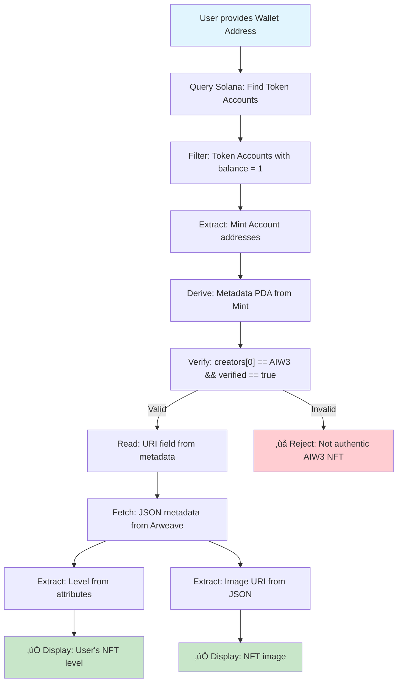

# AIW3 NFT Implementation Guide
## Complete Technical Architecture & Lifecycle Management for Solana-Based Equity NFTs

---

## Table of Contents

1. [Executive Summary](#executive-summary)
2. [NFT Lifecycle Overview](#nft-lifecycle-overview)
3. [Integration Patterns](#integration-patterns)
4. [Technical Architecture](#technical-architecture)
5. [Visual Architecture Diagrams](#visual-architecture-diagrams)
6. [Implementation Guide](#implementation-guide)
7. [NFT Upgrade and Burn Strategy](#nft-upgrade-and-burn-strategy)
8. [Detailed Process Flows](#detailed-process-flows)
9. [Recommendations](#recommendations)
10. [Implementation Requirements](#implementation-requirements)
11. [Testing and Validation](#testing-and-validation)
12. [Appendix](#appendix)

---

## Executive Summary

This document provides a comprehensive technical guide for implementing AIW3's Equity NFT system on Solana. The recommended approach uses **system-direct minting** combined with **user-controlled burning**, leveraging the Metaplex Token Metadata standard for maximum ecosystem compatibility.

### Key Benefits

- ✅ **Authenticity Guaranteed**: Creator verification through on-chain metadata
- ✅ **User Autonomy**: Full user control over NFT ownership and burning
- ✅ **Cost Effective**: No custom smart contracts required
- ✅ **Industry Standard**: Compatible with all major Solana NFT tools

### Strategic Approach

The optimal implementation uses a **hybrid lifecycle pattern** that balances authenticity, user autonomy, and ecosystem compatibility through:
- **System-controlled minting** for authenticity guarantee
- **Partner-driven verification** for ecosystem integration
- **User-controlled burning** for ownership autonomy

---

## NFT Lifecycle Overview

The AIW3 NFT ecosystem operates through three distinct phases:

| Phase | Description | Control | Key Technology |
|-------|-------------|---------|----------------|
| **🏗️ MINT** | NFT creation with embedded level data | AIW3 System | Solana Token Program + Metaplex |
| **🔍 USE** | Verification and data access by partners | Ecosystem Partners | Metadata queries + Arweave |
| **🔥 BURN** | NFT destruction for upgrades/exits | User Wallet | User-initiated transactions |

### Lifecycle Characteristics

**Phase 1: Minting (System-Controlled)**
- AIW3 system mints NFT directly to user wallet
- User becomes immediate owner without transfer
- Level data stored in off-chain JSON metadata
- Creator verification data embedded in on-chain metadata

**Phase 2: Usage (Partner-Initiated)**
- Partners verify authenticity via on-chain creator field
- Level queried from off-chain JSON metadata attributes
- Images retrieved via Arweave URIs
- Optional API for traditional system integration

**Phase 3: Burning (User-Controlled)**
- User initiates burn transaction
- Token supply reduced to zero
- Associated Token Account closed
- SOL rent returned to user

---

## Integration Patterns

### Lifecycle Pattern Analysis

#### 🏗️ Minting Patterns

| Pattern | Description | AIW3 Implementation | Pros | Cons |
|---------|-------------|---------------------|------|------|
| **System-Direct Minting** | AIW3 system mints NFTs directly to user wallets | ✅ **Current Approach** | No transfer needed, efficient, lower gas costs | System controls minting authority |
| **User-Initiated Minting** | Users trigger minting themselves | Not adopted | User control, decentralized | Higher friction, user pays costs |
| **Delegated Minting** | Third-party services mint on behalf | Not adopted | Outsourced complexity | Trust dependency |
| **Batch Minting** | Multiple NFTs in single transaction | Enhancement option | Cost-efficient for bulk | Complex implementation |

**Key Insight**: With Solana/Metaplex, NFTs can be minted directly to user wallets without ownership transfer - the user becomes the initial and immediate owner.

#### 🔥 Burning Patterns

| Pattern | Description | AIW3 Implementation | Pros | Cons |
|---------|-------------|---------------------|------|------|
| **User-Controlled Burning** | NFT owners burn their own NFTs | ✅ **Current Approach** | User autonomy, decentralized | User must initiate and pay |
| **System-Triggered Burning** | AIW3 burns with user approval | Not adopted | Automated workflows | Complex permissions |
| **Time-Based Burning** | Auto-burn after expiration | Not adopted | Automatic cleanup | Smart contract complexity |
| **Conditional Burning** | Event-triggered burning | Not adopted | Advanced automation | High complexity |

#### 🔍 Use Phase Integration Patterns

| Pattern | Description | Status | Ecosystem Benefit |
|---------|-------------|--------|-------------------|
| **Metadata-Based Verification** | Partners read level from NFT metadata | ✅ **Recommended** | Standard, widely supported |
| **Smart Contract Registry** | On-chain registry for verification | 📋 **Planned** | Trustless verification |
| **API Gateway** | Centralized API for integration | 🔄 **Optional** | Easy traditional integration |
| **Direct Blockchain Queries** | Partners query blockchain directly | ✅ **Always Available** | No intermediaries |

---

## Technical Architecture

### Solana NFT Data Structure (Metaplex Standard)

Understanding Solana NFTs is crucial for correct implementation. An NFT consists of multiple related accounts on the blockchain, governed by Metaplex Token Metadata standards.

#### Core Concepts and Relationships

1. **NFT Ownership (Token Account)**: The actual owner holds the **Token Account** with balance = 1
2. **NFT Identity (Mint Account)**: Defines the NFT as unique asset with supply = 1, decimals = 0
3. **NFT Metadata (On-Chain PDA)**: Program Derived Address storing verifiable data
4. **Rich Content (Off-Chain JSON)**: External JSON file with descriptions, images, attributes

#### Data Flow for Verification

```
1. User presents Wallet Address
   ↓
2. Partner queries Solana for Token Accounts owned by wallet
   ↓
3. Filter for tokens with supply = 1 (NFTs) → Get Mint Address
   ↓
4. Find On-Chain Metadata PDA associated with Mint
   ↓
5. Verify Authenticity: Check creators array for AIW3 public key (verified: true)
   ↓
6. Get Rich Data: Read uri field from on-chain metadata
   ↓
7. Fetch Off-Chain JSON from uri (Arweave)
   ↓
8. Read NFT Level: Parse attributes array for "Level" trait
   ↓
9. Retrieve Image: Get image URI from JSON metadata
```

#### On-Chain Metadata Account Details

Data stored directly on **Solana blockchain** for trust and authenticity verification:

| Field | Type | Source | Required | Description & AIW3 Usage |
|-------|------|--------|----------|--------------------------|
| `update_authority` | `Pubkey` | AIW3 | Yes | AIW3 system wallet public key |
| `mint` | `Pubkey` | Solana | Yes | NFT's unique identifier |
| `data.name` | `String` | AIW3 | Yes | NFT name (e.g., "AIW3 Equity NFT #1234") |
| `data.symbol` | `String` | AIW3 | Yes | Collection symbol (e.g., "AIW3E") |
| `data.uri` | `String` | AIW3 | Yes | Arweave URI for off-chain JSON |
| `data.creators` | `Vec<Creator>` | AIW3 | Yes | **Core authenticity verification** |
| `is_mutable` | `bool` | AIW3 | Yes | Set to `false` for permanence |

#### Off-Chain JSON Metadata Details

The `uri` from on-chain metadata points to this JSON file on Arweave/IPFS where **Level information is stored**:

```json
{
  "name": "AIW3 Equity NFT #1234",
  "symbol": "AIW3E",
  "description": "Represents user's equity and status within AIW3 ecosystem",
  "image": "https://arweave.net/ARWEAVE_IMAGE_HASH",
  "external_url": "https://aiw3.io",
  "attributes": [
    {
      "trait_type": "Level",
      "value": "Gold",
      "display_type": "string"
    },
    {
      "trait_type": "Tier",
      "value": "3",
      "display_type": "number"
    }
  ],
  "properties": {
    "files": [
      {
        "uri": "https://arweave.net/ARWEAVE_IMAGE_HASH",
        "type": "image/png"
      }
    ],
    "creators": [
      {
        "address": "AIW3_SYSTEM_WALLET_PUBLIC_KEY",
        "share": 100
      }
    ]
  }
}
```

#### NFT Images Handling

**Storage Chain**: `On-Chain Metadata` → `Off-Chain JSON URI` → `JSON File` → `Image URI` → `Image File`

1. **Upload Image**: Upload to Arweave for permanent storage URI
2. **Link in JSON**: Place Arweave URI in `image` field of JSON metadata
3. **Link to On-Chain**: JSON file URI stored in `data.uri` field during minting

**Two-Layer Architecture**:
- **On-Chain (Solana)**: Creator verification, ownership proof, URI pointer
- **Off-Chain (Arweave/IPFS)**: Level attributes, images, rich metadata

---

## Visual Architecture Diagrams

### NFT Ecosystem Entity Relationship


### Verification Flow



### Minting Flow


---

## Implementation Guide

### Key Challenges

1. **Level Information Storage**: Efficiently storing and accessing NFT level data
2. **Authenticity Verification**: Ensuring third parties can validate AIW3 origin
3. **Image/Artwork Storage**: Proper visual asset storage with decentralization
4. **Ecosystem Integration**: Seamless verification by DeFi protocols and marketplaces

### Image/Artwork Storage Solutions

#### Storage Options Analysis

**Option 1: Arweave Permanent Storage ⭐ Recommended**
- **Advantages**: Truly permanent (200+ years), one-time payment, cryptographically verifiable
- **Disadvantages**: Higher upfront cost (~$5-20 per MB)
- **Evaluation**: Excellent decentralization and permanence
- **Use Case**: High-value, permanent NFTs like AIW3 equity tokens

**Option 2: IPFS with Pinning Services**
- **Advantages**: Lower initial costs, flexible deployment, good ecosystem support
- **Disadvantages**: Requires ongoing pinning costs, availability dependency
- **Evaluation**: Good decentralization, moderate permanence
- **Use Case**: Cost-sensitive implementations

**Option 3: Hybrid Approach**
- **Description**: IPFS for immediate availability, migrate to Arweave for permanence
- **Advantages**: Best of both worlds, cost optimization
- **Disadvantages**: Complex implementation, migration logic required

### Level Information Storage Solutions

#### ⭐ Metadata Attributes (Recommended)

**Implementation**: Use Metaplex standard with off-chain JSON metadata for level data, on-chain metadata for authenticity verification.

**Addresses Requirements**:
- **Issuer Verification**: Check creator field in on-chain Solana metadata
- **NFT Tier Access**: Read level from off-chain JSON attributes
- **Image Retrieval**: Access image URI from off-chain JSON metadata

**Advantages**:
- ✅ Decentralized access via standard metadata queries
- ✅ Authenticity verification through on-chain creator field
- ✅ Full ecosystem compatibility
- ✅ Cost-effective hybrid approach
- ✅ Leverages proven Metaplex standard

**Evaluation**:
- **Trust**: High (on-chain creator verification)
- **Compatibility**: Excellent (standard NFT tools)
- **Cost**: Very low (only verification data on-chain)

#### ❌ Smart Contract Verification (Not Recommended)

**Implementation**: Deploy Solana smart contract for NFT level management.

**Disadvantages**:
- High development and maintenance costs
- Additional transaction fees for queries
- Unnecessary complexity vs. creator verification
- No significant trust advantage over metadata approach

#### 🔄 Ecosystem Validation API (Supplementary)

**Implementation**: REST API providing additional validation and convenience.

**Use Case**: Optional integration layer for traditional systems while maintaining on-chain verification as primary method.

---

## NFT Upgrade and Burn Strategy

### Overview: The NFT Upgrade Challenge

When users upgrade from a lower-level NFT to a higher-level one, the system must ensure that the lower-level NFT is permanently and verifiably disabled to prevent continued use, trading, or benefit claiming.

**The Problem**: Simply transferring an NFT to an inaccessible address doesn't constitute true invalidation - the NFT still exists on-chain and contributes to total supply metrics.

**The Solution**: The most secure and reliable approach is **user-controlled burning** with **system verification** through Associated Token Account (ATA) closure confirmation.

### Core Solana NFT Mechanics for Burning

#### Understanding Associated Token Accounts (ATAs)

Users don't hold NFTs directly in their main wallet address. Instead, for each unique NFT, a separate Associated Token Account (ATA) is created with these properties:

- **Deterministic Address**: Programmatically linked to both user's wallet and NFT's mint address
- **Token Storage**: The ATA actually holds the single token (the NFT)
- **Standard Enforcement**: Non-optional part of Solana SPL Token standard

Wallets like Phantom abstract this complexity, but on-chain, each NFT exists in its own separate ATA.

#### NFT Lifecycle: Minting and Burning

**Minting Process**:
- **Pre-condition**: Unique Mint Account for NFT exists
- **Action**: ATA created for user + NFT mint, one token minted to ATA
- **Post-condition**: User has ATA holding NFT, appears in wallet

**Burning Process**:
- **Pre-condition**: User owns NFT in specific ATA
- **Action**: `burn` instruction destroys token, `closeAccount` reclaims SOL rent
- **Post-condition**: NFT destroyed, **ATA closed and removed from blockchain**

**Key Insight**: ATA closure provides definitive proof of NFT destruction.

### Invalidation Approach Analysis

#### Approach Comparison Matrix

| Approach | Technical Feasibility | Cost | Implementation | Maintenance | Trust | True Invalidation | Recommendation |
|----------|:-------------------:|:----:|:-------------:|:-----------:|:-----:|:----------------:|:-------------:|
| **Public Blackhole** | ✅ High | 💰 Very Low | 🟢 Low | 🟢 Low | ⚠️ Low | ❌ No | Not Recommended |
| **Custom Blackhole** | ✅ High | 💰 Very Low | 🟡 Moderate | 🟢 Low | 🟡 Medium | ❌ No | Not Recommended |
| **System Wallet** | ✅ High | 💰 Very Low | 🟡 Moderate | 🔴 High | 🔴 Low | ❌ No | Not Recommended |
| **Dedicated Wallet** | ✅ High | 💰 Very Low | 🟡 Moderate | 🔴 High | 🟡 Medium | ❌ No | Not Recommended |
| **User Burns NFT** | ✅ High | 💰 Very Low | 🟡 Moderate | 🟢 Low | ✅ High | ✅ Yes | **⭐ RECOMMENDED** |
| **System Burns NFT** | ✅ High | 💰 Low | 🔴 High | 🔴 High | 🔴 Low | ⚠️ Partial | Alternative only |

**Legend**: ✅ Excellent ⚠️ Moderate ❌ Poor | 🟢 Low 🟡 Moderate 🔴 High | 💰 Cost indicator | ⭐ Recommended

#### Detailed Approach Analysis

**1. Transfer to Public Blackhole Address**
- **Implementation**: Transfer to known inaccessible address (e.g., `11111111111111111111111111111111`)
- **Issue**: NFT still exists on-chain, contributes to supply count, visible in explorers
- **Business Impact**: Fails core requirement of permanent invalidation

**2. Transfer to Custom Blackhole Address**
- **Implementation**: Create provably inaccessible address for AIW3 system
- **Issue**: Same limitations as public blackhole - not true destruction
- **Business Impact**: External tools still recognize NFT as existing

**3. Transfer to AIW3 System Wallet**
- **Implementation**: Users transfer NFT to main AIW3 wallet
- **Issues**: High maintenance overhead, wallet bloat, potential misuse concerns
- **Business Impact**: Creates custodial responsibility and trust requirements

**4. Transfer to Dedicated Wallet**
- **Implementation**: Separate wallet for "disabled" NFTs
- **Issues**: Similar to system wallet but with asset segregation
- **Business Impact**: Ongoing management complexity without true invalidation

**5. User Burns NFT (RECOMMENDED)**
- **Implementation**: User executes burn + closeAccount transactions
- **Advantages**: 
  - ✅ **Unambiguous Proof**: ATA closure is definitive on-chain evidence
  - ✅ **Trustless Verification**: System can verify programmatically
  - ✅ **Solana Standards**: Follows SPL Token lifecycle correctly
  - ✅ **User Empowerment**: Users control their assets and reclaim rent
- **Verification Method**: Check if `getAccountInfo(ataAddress)` returns `null`

**6. System Burns NFT**
- **Implementation**: User transfers to system, system burns
- **Issues**: Requires user trust, complex custody management
- **Use Case**: Consider only when user-direct burning isn't feasible

### Technical Implementation: Burn Verification

#### Core Verification Logic

```typescript
import { PublicKey } from '@solana/web3.js';
import { TOKEN_PROGRAM_ID, ASSOCIATED_TOKEN_PROGRAM_ID } from '@solana/spl-token';

/**
 * Finds the Associated Token Account (ATA) address for a given mint and owner
 */
async function findAssociatedTokenAddress(
  owner: PublicKey,
  mint: PublicKey
): Promise<PublicKey> {
  const [address] = await PublicKey.findProgramAddress(
    [owner.toBuffer(), TOKEN_PROGRAM_ID.toBuffer(), mint.toBuffer()],
    ASSOCIATED_TOKEN_PROGRAM_ID
  );
  return address;
}

/**
 * Verifies that an NFT has been burned by checking if its ATA has been closed
 * @param connection - The Solana JSON RPC connection
 * @param userWallet - The public key of the user's main wallet
 * @param nftMint - The public key of the NFT's mint account
 * @returns {Promise<boolean>} - True if NFT is burned, false otherwise
 */
async function verifyNftIsBurned(
  connection: Connection,
  userWallet: string,
  nftMint: string
): Promise<boolean> {
  
  // 1. Find the expected address of the NFT's ATA
  const ataAddress = await findAssociatedTokenAddress(
    new PublicKey(userWallet),
    new PublicKey(nftMint)
  );

  // 2. Check if an account exists at that address
  const accountInfo = await connection.getAccountInfo(ataAddress);

  // 3. If accountInfo is null, account is closed, confirming burn
  if (accountInfo === null) {
    console.log(`✅ Verification Successful: ATA ${ataAddress.toBase58()} is closed. NFT is burned.`);
    return true;
  }
  
  console.log(`❌ Verification Failed: ATA ${ataAddress.toBase58()} still exists. NFT not burned.`);
  return false;
}

// Example Usage
// const isBurned = await verifyNftIsBurned(connection, 'USER_WALLET_ADDRESS', 'NFT_MINT_ADDRESS');
```

#### System Architecture for Upgrades

```mermaid
graph TD
    subgraph "User Environment"
        User[👤 User] -->|Browser Interaction| Frontend[🌐 AIW3 Frontend]
        Frontend -->|Wallet Adapter| Wallet[🔒 Phantom/Solflare]
    end

    subgraph "AIW3 Services"
        Frontend -->|HTTPS REST API| Backend[🖥️ AIW3 Backend]
        Backend -->|Database Queries| DB[(📦 Database)]
    end

    subgraph "Solana Network"
        Wallet -->|RPC/WebSocket| SolanaNode[⚡️ Solana RPC Node]
        Backend -->|RPC/WebSocket| SolanaNode
        SolanaNode -->|Gossip Protocol| SolanaCluster[🌍 Solana Blockchain]
    end

    style User fill:#f9f,stroke:#333,stroke-width:2px
    style Frontend fill:#ccf,stroke:#333,stroke-width:2px
    style Backend fill:#cfc,stroke:#333,stroke-width:2px
    style SolanaNode fill:#f96,stroke:#333,stroke-width:2px
```



#### Backend System Requirements

**Data Model for Upgrade Tracking**:


**NFT Status Values**:
- `active`: NFT held by user and valid for use
- `burning`: User initiated burn process for upgrade
- `burned`: System verified on-chain NFT destruction

**Upgrade Request Status Values**:
- `pending`: Upgrade initiated, burn not yet verified
- `verified`: Backend confirmed original NFT burn on-chain
- `completed`: New higher-level NFT successfully minted
- `failed`: Upgrade process failed (timeout, minting error, etc.)

**Blockchain Synchronization Requirements**:

1. **On-Chain Monitoring**:
   - WebSocket subscriptions for real-time ATA closure notifications
   - Periodic polling for pending upgrade request status checks
   - Transaction confirmation monitoring for reliability

2. **State Synchronization**:
   - Update NFT status to `burned` upon ATA closure verification
   - Update upgrade request status to `verified` after burn confirmation
   - Trigger new NFT minting workflow after successful verification

3. **Error Handling**:
   - Retry mechanisms for failed on-chain queries
   - Graceful recovery from network interruptions
   - Timeout handling for stalled upgrade processes

### Business Process: NFT Upgrade Flow

#### Complete Upgrade Sequence

```mermaid
sequenceDiagram
    participant User
    participant Frontend as AIW3 Frontend
    participant Wallet as Phantom/Solflare
    participant Backend as AIW3 Backend
    participant Solana as Solana Blockchain

    %% Step 1: Eligibility Check
    User->>Frontend: Click "Check Eligibility"
    Frontend->>Backend: GET /api/eligibility-check
    Backend->>Backend: Verify transaction volume for user
    Backend-->>Frontend: {"eligible": true}
    Frontend->>User: Display "You are eligible to upgrade!"

    %% Step 2: Burn Initiation
    User->>Frontend: Click "Burn to Upgrade"
    Frontend->>Wallet: Request signature for burn transaction
    User->>Wallet: Approve Transaction
    Wallet->>Solana: Submit burn & close ATA transaction
    Solana-->>Wallet: Transaction Confirmed
    Wallet-->>Frontend: Burn transaction successful

    %% Step 3: Burn Verification
    Frontend->>Backend: POST /api/request-upgrade {burnTx: "..."}
    Backend->>Solana: getAccountInfo(user_L1_NFT_ata_address)
    Solana-->>Backend: null (Confirms ATA is closed)
    note right of Backend: ✅ On-chain verification success!

    %% Step 4: New NFT Minting
    Backend->>Solana: Mint Level 2 NFT to new ATA for User
    Solana-->>Backend: Mint Successful
    Backend-->>Frontend: {"upgradeStatus": "complete"}
    Frontend->>User: Display "Upgrade Complete! You now have Level 2 NFT."
```



#### Communication Protocols

- **User ↔ Frontend**: Standard browser interaction (HTTPS)
- **Frontend ↔ Backend**: Secure RESTful API calls over HTTPS
- **Frontend ↔ Wallet**: Wallet adapter for transaction signing requests
- **Wallet ↔ Solana**: RPC/WebSocket for transaction submission
- **Backend ↔ Solana**: RPC queries for on-chain verification and minting

#### Critical Success Factors

1. **Atomic Verification**: Ensure burn verification completes before new NFT minting
2. **User Experience**: Minimize transaction steps while maintaining security
3. **Error Recovery**: Handle partial failures gracefully with clear user feedback
4. **Performance**: Optimize verification speed without compromising reliability
5. **Security**: Validate all burn transactions before proceeding with upgrades

---

## Detailed Process Flows

### System-Direct Minting Process

Understanding how "AIW3 system mints NFT directly to user's wallet" works through Solana's Associated Token Account (ATA) Program:

#### Step 1: Create Mint Account

**Purpose**: Establish unique NFT identifier
- **Pre-conditions**: AIW3 System Wallet has sufficient SOL for fees/rent
- **Inputs**: Payer (AIW3), Mint Authority (AIW3), optional Freeze Authority
- **Action**: Call Solana Token Program to create and initialize Mint
- **Outputs**: New Mint Account with unique public key
- **Post-conditions**: Mint exists with supply=0, decimals=0, AIW3 as authority

#### Step 2: Create User's Associated Token Account (ATA)

**Purpose**: Create dedicated account in user's wallet for NFT
- **Pre-conditions**: Mint Account exists, User's public key known, AIW3 has SOL for rent
- **Inputs**: Payer (AIW3), Owner (User Wallet), Mint (from Step 1)
- **Action**: Call ATA Program to create deterministic account address
- **Outputs**: New ATA owned by User Wallet
- **Post-conditions**: ATA exists with owner=User, balance=0, rent paid by AIW3

#### Step 3: Mint NFT to User's ATA

**Purpose**: Create actual token in user's possession
- **Pre-conditions**: AIW3 is Mint Authority, User's ATA exists
- **Inputs**: Signer (AIW3), Mint Account, Destination (User's ATA), Amount (1)
- **Action**: Call Token Program `mintTo` function
- **Outputs**: Successful transaction confirmation
- **Post-conditions**: User's ATA balance = 1, Mint supply = 1, **User owns NFT**

#### Step 4: Create Metaplex Metadata

**Purpose**: Attach rich data and authenticity verification
- **Pre-conditions**: Mint Account exists, off-chain JSON uploaded to Arweave
- **Inputs**: Payer (AIW3), Mint Address, Metadata (name, symbol, URI, creators)
- **Action**: Call Metaplex Token Metadata Program for new PDA
- **Outputs**: New Metadata PDA account
- **Post-conditions**: Metadata linked to Mint, AIW3 as verified creator

#### Step 5: Finalize and Secure (Optional)

**Purpose**: Make NFT and metadata immutable
- **Pre-conditions**: AIW3 still has Mint Authority and Update Authority
- **Inputs**: Signer (AIW3), Account to modify, New Authority (null)
- **Action**: Call `set_authority` instruction to revoke authorities
- **Post-conditions**: Mint Authority = null, Update Authority = null, permanent NFT

**Key Result**: User becomes immediate owner without any transfer - they are the first and only owner.

---

## Recommendations

### Primary Solution: Hybrid Strategy

**Recommended Approach**: Creator Address Verification + Metadata Attributes

This approach prioritizes **simplicity, cost-effectiveness, and standards compliance** while maintaining full decentralization.

**Implementation Strategy**:

1. **Metadata Attributes + Creator Verification**: Use existing Solana/Metaplex standards
2. **Arweave Storage**: Permanent storage for images and JSON metadata
3. **Standards Compliance**: Follow Metaplex Token Metadata for ecosystem compatibility
4. **Optional API Layer**: Supplementary REST API for traditional system integration

**Advantages**:
- ✅ **Minimal Development Complexity**: Leverages existing standards
- ✅ **Maximum Ecosystem Compatibility**: Works with all NFT tools
- ✅ **Cost Effective**: Hybrid on-chain/off-chain approach
- ✅ **Robust Authenticity**: On-chain creator verification
- ✅ **Future-Proof**: Standard approach with broad industry support

### Phased Implementation Plan

**Phase 1 (0-6 months): Core Implementation**
- Deploy metadata-based verification system
- Implement Arweave storage for permanence
- Launch with Bronze/Silver tiers using system-paid rent
- Begin ecosystem partner integration

**Phase 2 (6-18 months): Enhanced Features**
- Add smart contract verification for premium features
- Implement tiered rent responsibility for Gold+ users
- Deploy comprehensive API for traditional integrations
- Expand partner ecosystem

**Phase 3 (18+ months): Full Ecosystem**
- Complete smart contract verification deployment
- Optimize user-paid models for premium tiers
- Mature API ecosystem with multiple verification paths
- Scale to millions of users

---

## Implementation Requirements

### For AIW3 System Implementation

**1. System Wallet Management**
- Maintain consistent public key for creator verification
- Secure private key storage and access controls
- Document and publish official creator address

**2. Metadata Standards Compliance**
- Follow Metaplex Token Metadata standard
- Structure off-chain JSON with required fields: name, symbol, description, image, attributes
- Include level as trait: `{"trait_type": "Level", "value": "Gold"}`

**3. Storage Implementation**
- Upload images to Arweave before minting for permanent URIs
- Upload JSON metadata to Arweave for metadata URIs
- Store metadata URI in on-chain `data.uri` field

**4. Minting Process**
- Set `is_mutable: false` after minting for permanence
- Include AIW3 as first creator with `verified: true`
- Mint directly to user wallet (no transfer required)

### For Ecosystem Partners Integration

**1. Authenticity Verification Process**
- Query user's wallet for Token Accounts with balance = 1
- Derive Metadata PDA from NFT Mint Account address
- Verify `creators[0].address` matches AIW3 address AND `verified == true`

**2. Level Data Access**
- Read `uri` field from verified on-chain metadata
- Fetch JSON metadata from Arweave URI
- Parse `attributes` array for trait where `trait_type` is "Level"

**3. Image Display**
- Extract `image` field URI from JSON metadata
- Display image directly from Arweave permanent storage
- Implement fallback handling for network issues

**4. Error Handling & Fallbacks**
- Implement retry logic for Arweave requests
- Cache frequently accessed metadata
- Provide graceful degradation when off-chain data unavailable

### Technical Implementation Details

**Required Dependencies**:
- Solana Web3.js or Rust SDK for blockchain interactions
- Metaplex SDK for metadata operations
- HTTP client for Arweave requests
- JSON parsing capabilities

**Key Functions Needed**:
- `getTokenAccountsByOwner()` - Find user's NFTs
- `findMetadataPda()` - Derive metadata account address
- `getAccountInfo()` - Read on-chain metadata
- `fetch()` - Retrieve off-chain JSON from Arweave
- `parseAttributes()` - Extract level from metadata traits

**Integration Patterns**:
- **Direct Integration**: Query blockchain directly for maximum decentralization
- **API Integration**: Use optional AIW3 validation API for simplified implementation
- **Hybrid Approach**: Combine direct verification with API convenience

---

## Testing and Validation

### NFT Burn Verification Testing

This section provides comprehensive testing procedures for validating the NFT burn verification logic using the proof-of-concept implementation.

#### Prerequisites

**Development Environment**:
- Node.js (v16+) and npm installed
- Solana CLI installed and configured
- Access to Solana network (devnet recommended for testing)

**Test Assets**:
- Solana wallet with sufficient SOL for transaction fees
- Existing NFT mint address for burn verification testing
- Test environment configured with proper RPC endpoints

#### Configuration Setup

**Environment Configuration** (`.env` file):

```bash
# Network Configuration
SOLANA_NETWORK="devnet"  # Options: "devnet", "mainnet-beta", "localnet"

# Test Wallet Configuration
USER_WALLET_ADDRESS="YOUR_WALLET_ADDRESS"
PAYER_SECRET_KEY="YOUR_PAYER_SECRET_KEY"

# Test NFT Configuration
NFT_MINT_ADDRESS="YOUR_NFT_MINT_ADDRESS"

# RPC Configuration (Optional)
SOLANA_RPC_URL="https://api.devnet.solana.com"  # Custom RPC endpoint
```

**Security Note**: Never use mainnet private keys in testing environments. Use dedicated devnet wallets only.

#### Test Execution Procedures

**Basic Test Execution**:

```bash
# Navigate to POC directory
cd poc/solana-nft-burn-mint

# Install dependencies
npm install

# Execute burn verification test
node index.js
```

#### Expected Test Scenarios

**Scenario 1: Successful Burn Verification**
```bash
✅ Verification Successful: ATA Gu7X...8kL2 is closed. NFT is burned.
Burn verification completed successfully.
Transaction details: [Transaction signature and metadata]
```

**Scenario 2: NFT Not Burned (ATA Still Exists)**
```bash
❌ Verification Failed: ATA Gu7X...8kL2 still exists. NFT not burned.
Error: Associated Token Account is still active.
```

**Scenario 3: Configuration Error**
```bash
❌ Configuration Error: Please set required environment variables
Missing: SOLANA_NETWORK, USER_WALLET_ADDRESS, NFT_MINT_ADDRESS, PAYER_SECRET_KEY
```

**Scenario 4: Network/Connection Error**
```bash
❌ Network Error: Failed to connect to Solana RPC
Error details: [Connection timeout or RPC error message]
```

#### Advanced Testing Procedures

**End-to-End Integration Testing**:

```typescript
// Advanced test suite for burn verification
describe('NFT Burn Verification', () => {
  let connection: Connection;
  let testWallet: Keypair;
  let testNftMint: PublicKey;

  beforeAll(async () => {
    // Setup test environment
    connection = new Connection(clusterApiUrl('devnet'));
    testWallet = Keypair.generate();
    
    // Fund test wallet
    await connection.requestAirdrop(testWallet.publicKey, LAMPORTS_PER_SOL);
    
    // Create test NFT
    testNftMint = await createTestNFT(connection, testWallet);
  });

  test('should detect active NFT before burn', async () => {
    const isBurned = await verifyNftIsBurned(
      connection,
      testWallet.publicKey.toString(),
      testNftMint.toString()
    );
    expect(isBurned).toBe(false);
  });

  test('should detect burned NFT after burn transaction', async () => {
    // Execute burn transaction
    await burnTestNFT(connection, testWallet, testNftMint);
    
    // Verify burn detection
    const isBurned = await verifyNftIsBurned(
      connection,
      testWallet.publicKey.toString(),
      testNftMint.toString()
    );
    expect(isBurned).toBe(true);
  });

  test('should handle non-existent NFT gracefully', async () => {
    const fakeMint = Keypair.generate().publicKey;
    const isBurned = await verifyNftIsBurned(
      connection,
      testWallet.publicKey.toString(),
      fakeMint.toString()
    );
    expect(isBurned).toBe(true); // Non-existent ATA = burned
  });
});
```

#### Performance Testing

**Load Testing for Verification System**:

```typescript
// Performance test for burn verification at scale
async function performanceTest() {
  const testCases = 1000;
  const startTime = Date.now();
  
  const results = await Promise.all(
    Array(testCases).fill(0).map(async (_, index) => {
      const testWallet = `wallet_${index}`;
      const testMint = `mint_${index}`;
      return verifyNftIsBurned(connection, testWallet, testMint);
    })
  );
  
  const endTime = Date.now();
  const averageTime = (endTime - startTime) / testCases;
  
  console.log(`Performance Test Results:`);
  console.log(`- Total tests: ${testCases}`);
  console.log(`- Total time: ${endTime - startTime}ms`);
  console.log(`- Average time per verification: ${averageTime}ms`);
  console.log(`- Successful verifications: ${results.filter(r => r === true).length}`);
}
```

#### Monitoring and Observability

**Test Metrics to Track**:

- **Verification Accuracy**: Percentage of correct burn detections
- **Response Time**: Average time for burn verification completion
- **Error Rate**: Frequency of network or RPC errors
- **False Positives**: Incorrect burn detections (should be zero)
- **False Negatives**: Missed burn detections (should be zero)

**Integration with Monitoring Systems**:

```typescript
// Example monitoring integration
interface VerificationMetrics {
  timestamp: Date;
  userWallet: string;
  nftMint: string;
  verificationResult: boolean;
  responseTime: number;
  errorMessage?: string;
}

async function monitoredVerifyNftIsBurned(
  connection: Connection,
  userWallet: string,
  nftMint: string
): Promise<boolean> {
  const startTime = Date.now();
  
  try {
    const result = await verifyNftIsBurned(connection, userWallet, nftMint);
    
    // Log successful verification
    logMetrics({
      timestamp: new Date(),
      userWallet,
      nftMint,
      verificationResult: result,
      responseTime: Date.now() - startTime
    });
    
    return result;
  } catch (error) {
    // Log failed verification
    logMetrics({
      timestamp: new Date(),
      userWallet,
      nftMint,
      verificationResult: false,
      responseTime: Date.now() - startTime,
      errorMessage: error.message
    });
    
    throw error;
  }
}
```

#### Troubleshooting Guide

**Common Issues and Solutions**:

| Issue | Symptoms | Solution |
|-------|----------|----------|
| **RPC Rate Limiting** | Frequent timeout errors | Implement request throttling, use paid RPC |
| **Stale Account Data** | Inconsistent verification results | Add retry logic with delays |
| **Network Latency** | Slow verification times | Use geographically closer RPC endpoints |
| **Invalid Wallet Address** | Address format errors | Validate address format before verification |
| **Missing Environment Variables** | Configuration errors | Verify all required variables are set |

**Debug Mode Execution**:

```bash
# Enable verbose logging for troubleshooting
DEBUG=true node index.js

# Test with specific network
SOLANA_NETWORK=localnet node index.js

# Test with custom RPC endpoint
SOLANA_RPC_URL="https://custom-rpc.solana.com" node index.js
```

---

## Appendix

### Success Metrics

- **Integration**: Partner integration time < 1 week for API, < 2 weeks for direct verification
- **Reliability**: 99.9% uptime for verification services
- **Authenticity**: Zero counterfeit NFTs accepted by ecosystem partners
- **Compatibility**: 100% compatibility with major Solana NFT tools and wallets

### Risk Mitigation

- **Technical Risk**: Comprehensive testing and phased deployment
- **Integration Risk**: Multiple verification paths (API, contract, hybrid)
- **Storage Risk**: Arweave permanence eliminates data loss concerns
- **Standards Risk**: Metaplex compliance ensures long-term compatibility

### Related Documentation

For comprehensive cost analysis and financial planning:
- [AIW3 NFT Financial Analysis](./AIW3-NFT-Financial-Analysis.md) - Cost optimization and strategic planning
- [Solana NFT Technical Reference](./Solana-NFT-Technical-Reference.md) - Code examples and implementation details
- [AIW3 NFT Upgrade Business Logic](./AIW3-NFT-Upgrade-Business-Logic.md) - Upgrade process workflows

### External References

- [Solana Token Program Documentation](https://docs.solana.com/developing/runtime-facilities/programs#token-program)
- [Metaplex Token Metadata Standard](https://docs.metaplex.com/programs/token-metadata/)
- [Arweave Permanent Storage](https://arweave.org)
- [Associated Token Account Program](https://spl.solana.com/associated-token-account)

---

*Document Version: 2.0*  
*Last Updated: August 2, 2025*  
*Author: AIW3 Technical Team*
