# AIW3 NFT Upgrade Process
## Business Logic Requirements & Implementation Guide

---

## 📋 Table of Contents

1. [Overview](#overview)
2. [Upgrade Challenge & Requirements](#upgrade-challenge--requirements)
3. [System Verification Workflow](#system-verification-workflow)
4. [Implementation Options](#implementation-options)
5. [Volume Thresholds & Benefits](#volume-thresholds--benefits)
6. [Business Considerations](#business-considerations)

---

## 🎯 Overview

This document defines the business logic requirements for AIW3's equity NFT upgrade process. Unlike simple NFT collections, AIW3 equity NFTs control access to real business benefits and rights, requiring sophisticated verification workflows to maintain system integrity.

**Key Principles:**
- **Atomic Operations**: Upgrades must be verifiably complete before new benefits activate
- **Merit-Based Access**: Users must demonstrate platform engagement through transaction volume
- **System Integrity**: Prevent double-claiming and unauthorized access to higher tiers
- **Legal Compliance**: Ensure proper transfer of equity rights without duplication

---

## 🔄 Upgrade Challenge & Requirements

### 🎯 The Equity NFT Upgrade Challenge

AIW3 equity NFTs represent tiered access rights and benefits. When users upgrade from a lower-level NFT to a higher-level one, the system must ensure:

1. **Old NFT Rights Are Revoked**: The burned NFT should immediately stop providing benefits
2. **No Double Benefits**: Users cannot claim benefits from both old and new NFTs during transition
3. **Atomic Upgrades**: The upgrade process should be verifiably complete before new benefits activate
4. **Transaction Volume Requirements**: Users must meet minimum transaction volume thresholds on the AIW3 platform to qualify for each NFT level

---

## 🔍 System Verification Workflow

### 🛡️ Verification Requirements

**The Business Requirement:**
Unlike simple NFT collections, AIW3 equity NFTs control access to real business benefits and rights. The system must actively verify multiple conditions before allowing upgrades:

- **Burned NFT Validation**: Ensure old NFTs are truly invalidated
- **Transaction Volume Verification**: Confirm user meets volume thresholds for target level
- **Platform Engagement**: Validate user's activity and participation on AIW3 platform

**This prevents:**
- Users continuing to receive benefits from "obsoleted" NFTs
- Double-claiming rights during upgrade transitions
- Unqualified users accessing higher tiers without meeting volume requirements
- System integrity violations in the tiered equity structure

## 🔄 System Verification Workflow

### 🛡️ Verification Requirements

**The Business Requirement:**
Unlike simple NFT collections, AIW3 equity NFTs control access to real business benefits and rights. The system must actively verify multiple conditions before allowing upgrades:

- **Burned NFT Validation**: Ensure old NFTs are truly invalidated
- **Transaction Volume Verification**: Confirm user meets volume thresholds for target level
- **Platform Engagement**: Validate user's activity and participation on AIW3 platform

**This prevents:**
- Users continuing to receive benefits from "obsoleted" NFTs
- Double-claiming rights during upgrade transitions
- Unqualified users accessing higher tiers without meeting volume requirements
- System integrity violations in the tiered equity structure

### 🔄 Complete Upgrade Sequence Workflow

#### Business Process Integration Pattern

```mermaid
sequenceDiagram
    participant User
    participant Frontend as AIW3 Frontend
    participant Wallet as Phantom/Solflare
    participant Backend as AIW3 Backend
    participant Solana as Solana Blockchain

    %% Step 1: Eligibility Check
    User->>Frontend: Click "Check Eligibility"
    Frontend->>Backend: GET /api/eligibility-check
    Backend->>Backend: Verify transaction volume for user
    Backend-->>Frontend: {"eligible": true}
    Frontend->>User: Display "You are eligible to upgrade!"

    %% Step 2: Burn Initiation
    User->>Frontend: Click "Burn to Upgrade"
    Frontend->>Wallet: Request signature for burn transaction
    User->>Wallet: Approve Transaction
    Wallet->>Solana: Submit burn & close ATA transaction
    Solana-->>Wallet: Transaction Confirmed
    Wallet-->>Frontend: Burn transaction successful

    %% Step 3: Burn Verification
    Frontend->>Backend: POST /api/request-upgrade {burnTx: "..."}
    Backend->>Solana: getAccountInfo(user_L1_NFT_ata_address)
    Solana-->>Backend: null (Confirms ATA is closed)
    note right of Backend: ✅ On-chain verification success!

    %% Step 4: New NFT Minting
    Backend->>Solana: Mint Level 2 NFT to new ATA for User
    Solana-->>Backend: Mint Successful
    Backend-->>Frontend: {"upgradeStatus": "complete"}
    Frontend->>User: Display "Upgrade Complete! You now have Level 2 NFT."
```



#### Communication Protocols & Integration Points

**System Integration Architecture:**

- **User ↔ Frontend**: Standard browser interaction (HTTPS)
- **Frontend ↔ Backend**: Secure RESTful API calls over HTTPS
- **Frontend ↔ Wallet**: Wallet adapter for transaction signing requests
- **Wallet ↔ Solana**: RPC/WebSocket for transaction submission
- **Backend ↔ Solana**: RPC queries for on-chain verification and minting

#### Upgrade Verification Decision Matrix

| Condition | Check Method | Success Criteria | Failure Action |
|-----------|--------------|------------------|----------------|
| **Transaction Volume** | AIW3 Platform API | `volume >= threshold` | Display volume requirement |
| **NFT Ownership** | Solana ATA Query | `balance == 1` | Request correct NFT |
| **Burn Completion** | ATA Existence Check | `accountInfo == null` | Wait for burn completion |
| **Upgrade Eligibility** | Business Logic Rules | `all_conditions_met` | Show specific failure reason |

#### Critical Success Factors

1. **Atomic Verification**: Ensure burn verification completes before new NFT minting
2. **User Experience**: Minimize transaction steps while maintaining security
3. **Error Recovery**: Handle partial failures gracefully with clear user feedback
4. **Performance**: Optimize verification speed without compromising reliability
5. **Security**: Validate all burn transactions before proceeding with upgrades

### 🔄 Implementation Workflow

#### Step 1: User Initiates Upgrade Request
- User requests upgrade from Level X to Level Y
- AIW3 system records the upgrade request and associated old NFT address
- System captures user wallet address for transaction history verification

#### Step 2: Transaction Volume Verification
```typescript
// Pseudo-code for AIW3 platform transaction volume verification
async function verifyTransactionVolumeRequirement(
    userWallet: PublicKey, 
    targetLevel: string
): Promise<{ qualified: boolean; currentVolume: number; requiredVolume: number }> {
    
    // Define volume thresholds for each NFT level
    const volumeThresholds = {
        "Level 1": 100000,    // 100,000 USDT
        "Level 2": 500000,    // 500,000 USDT
        "Level 3": 5000000,   // 5,000,000 USDT
        "Level 4": 10000000,  // 10,000,000 USDT
        "Level 5": 50000000   // 50,000,000 USDT
    };
    
    // Query AIW3 platform transaction history
    const userTransactionHistory = await getAIW3TransactionHistory(userWallet);
    const totalVolume = calculateTotalVolume(userTransactionHistory);
    const requiredVolume = volumeThresholds[targetLevel];
    
    return {
        qualified: totalVolume >= requiredVolume,
        currentVolume: totalVolume,
        requiredVolume: requiredVolume
    };
}
```

#### Step 3: NFT Burn Verification Loop
```typescript
// Pseudo-code for AIW3 system verification
async function verifyNFTBurnCompletion(oldNftMintAddress: PublicKey): Promise<boolean> {
    // Check if the user's ATA for this mint still exists
    const ata = await getAssociatedTokenAddress(oldNftMintAddress, userWallet);
    const accountInfo = await connection.getAccountInfo(ata);
    
    return accountInfo === null; // Account closed = burn complete
}
```

#### Step 4: Conditional New NFT Activation
- Verify transaction volume requirements are met
- Confirm old NFT account closure (if upgrading from existing NFT)
- Only after all conditions are satisfied:
  - Mint new NFT to user wallet
  - Activate new NFT benefits in AIW3 system
  - Update user's access rights to reflect new tier

---

## 📊 Implementation Options

| Verification Type | Approach | Description | Advantages | Disadvantages |
|------------------|----------|-------------|------------|---------------|
| **Transaction Volume** | **Platform Database Query** | Query AIW3 internal database for user transaction history | Real-time data, comprehensive history | Centralized dependency |
| | **Blockchain Analysis** | Analyze on-chain transactions to/from user wallet | Fully decentralized verification | Complex implementation, gas costs |
| | **Hybrid Approach** | Platform data with blockchain validation | Balance of convenience and decentralization | More complex architecture |
| **NFT Burn Status** | **Polling** | AIW3 system regularly checks account status | Simple implementation | Potential delays in verification |
| | **Transaction Monitoring** | Monitor blockchain for close_account transactions | Real-time verification | More complex implementation |
| | **User-Initiated Proof** | User provides proof of account closure | Immediate verification | Requires user action |

---

## 💰 Volume Thresholds & Benefits

### Tiered Volume Requirements

```typescript
// Example tiered volume requirements for AIW3 NFT levels
const NFT_LEVELS = {
    "Level 1": {
        name: "Tech Chicken",
        minVolume: 100000, // 100,000 USDT
        upgradeConditions: "Total transaction volume ≥ 100,000 USDT",
        benefits: ["10% reduction in handling fees", "10 free uses of Aiagent per week"]
    },
    "Level 2": {
        name: "Quant Ape",
        minVolume: 500000, // 500,000 USDT
        upgradeConditions: "Total transaction volume ≥ 500,000 USDT, bind two designated badge-type NFTs",
        benefits: ["20% reduction in handling fees", "20 free uses of Aiagent per week"]
    },
    "Level 3": {
        name: "On-chain Hunter",
        minVolume: 5000000, // 5,000,000 USDT
        upgradeConditions: "Total transaction volume ≥ 5,000,000 USDT, bind four designated badge-type NFTs",
        benefits: ["30% reduction in transaction fees", "30 free uses of Aiagent per week"]
    },
    "Level 4": {
        name: "Alpha Alchemist",
        minVolume: 10000000, // 10,000,000 USDT
        upgradeConditions: "Total transaction volume ≥ 10,000,000 USDT, binding to six designated badge-type NFTs",
        benefits: ["40% reduction in transaction fees", "40 free uses of Aiagent per week"]
    },
    "Level 5": {
        name: "Quantum Alchemist",
        minVolume: 50000000, // 50,000,000 USDT
        upgradeConditions: "Total transaction volume ≥ 50,000,000 USDT, bound to eight designated badge-type NFTs",
        benefits: ["55% reduction in transaction fees", "50 free uses of Aiagent per week"]
    },
    "Trophy Breeder": {
        name: "Trophy Breeder",
        minVolume: null, // Not based on volume
        upgradeConditions: "The top three participants in the trading competition will receive (airdrop)",
        benefits: ["25% reduction in handling fee"]
    }
};
```

---

## ⚠️ Business Considerations

### Why This Matters
- **Legal Compliance**: Ensures equity rights are properly transferred, not duplicated
- **Economic Integrity**: Prevents exploitation of the upgrade system through volume requirements
- **Merit-Based Access**: Only users who demonstrate platform engagement receive higher tiers
- **User Trust**: Demonstrates that the system properly manages digital equity ownership based on actual activity
- **Revenue Protection**: Volume thresholds ensure higher-tier benefits are earned, not gamed
- **Scalability**: Enables confident expansion of the equity NFT program with clear qualification criteria

### Implementation Considerations
- **Volume Calculation Period**: Define whether thresholds are based on all-time, rolling 12-month, or other time periods
- **Volume Types**: Specify which transactions count (trading, staking, lending, etc.)
- **Currency Conversion**: Establish how to handle multi-asset volumes and price conversions
- **Verification Frequency**: Determine how often to re-verify volume requirements for existing NFT holders
- **Grace Periods**: Consider transition periods for users whose volume drops below thresholds
