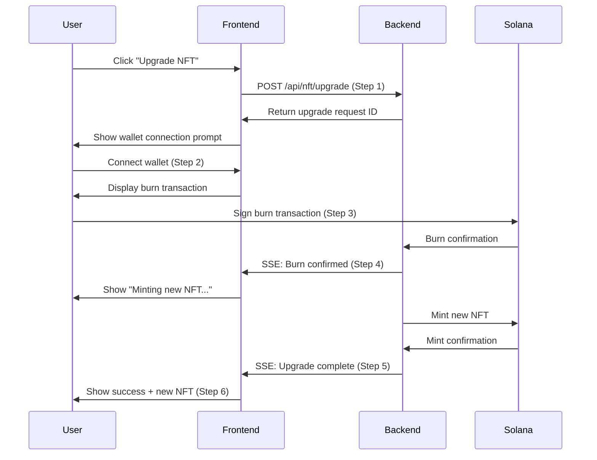
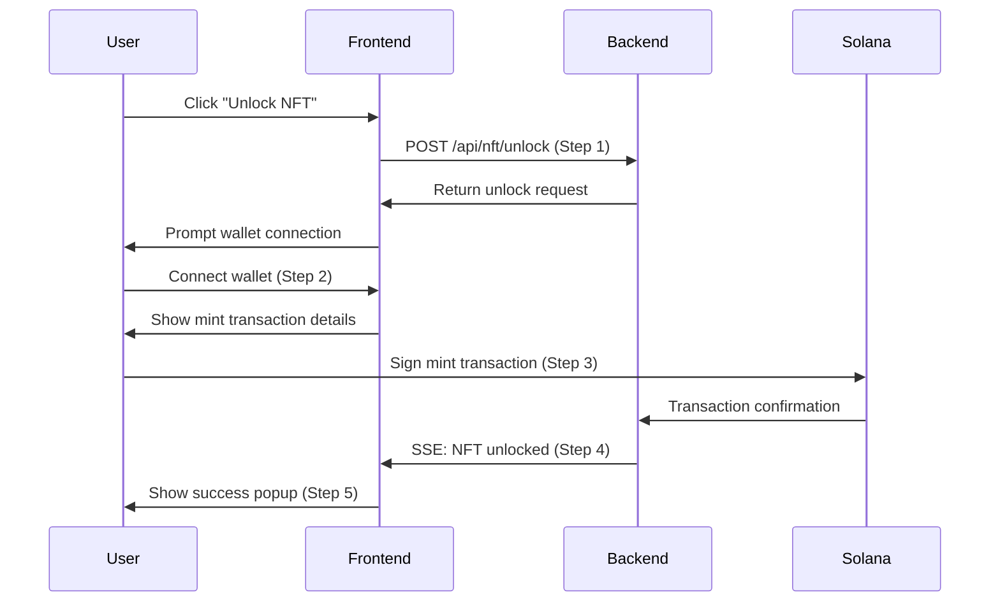
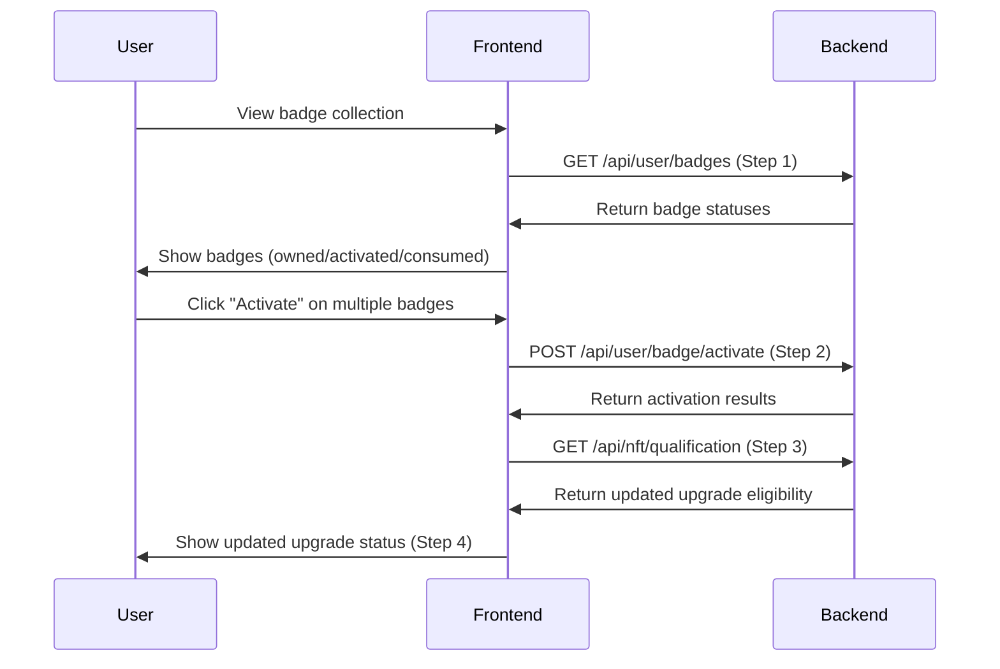
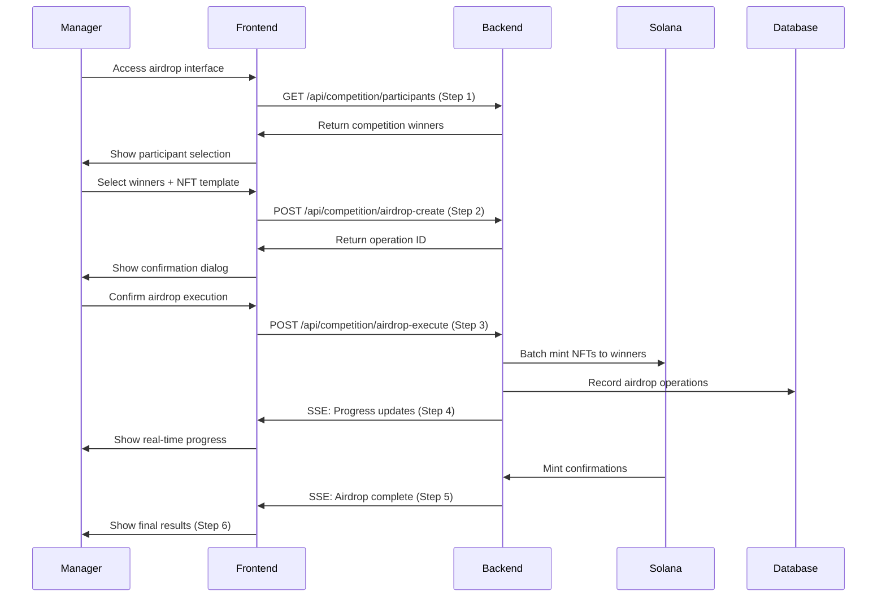
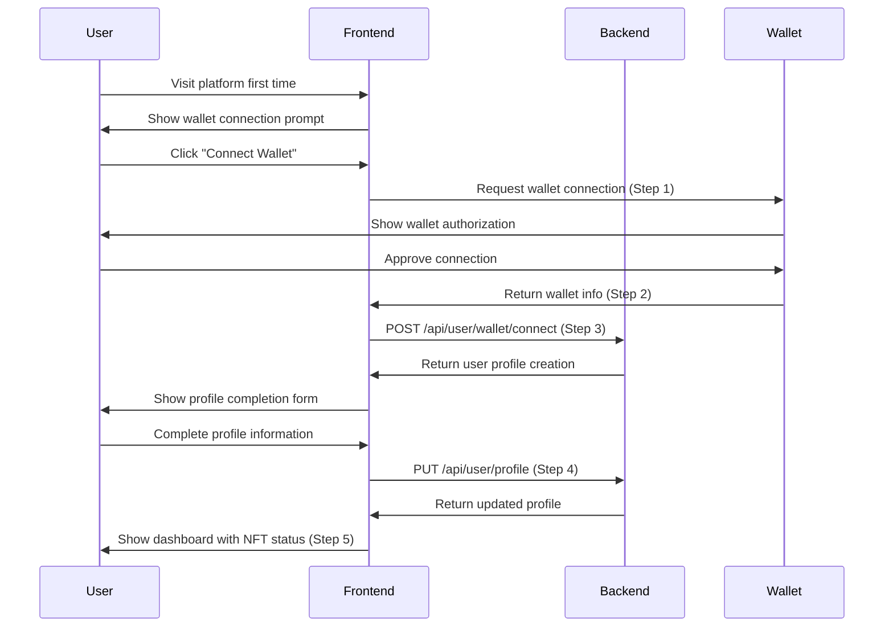
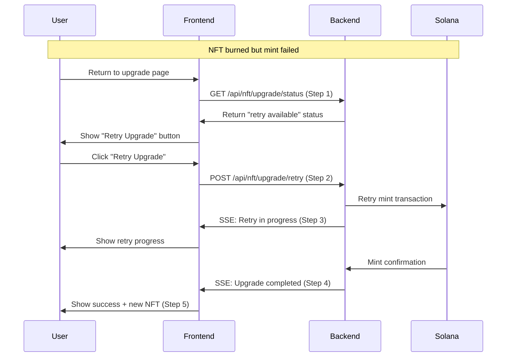
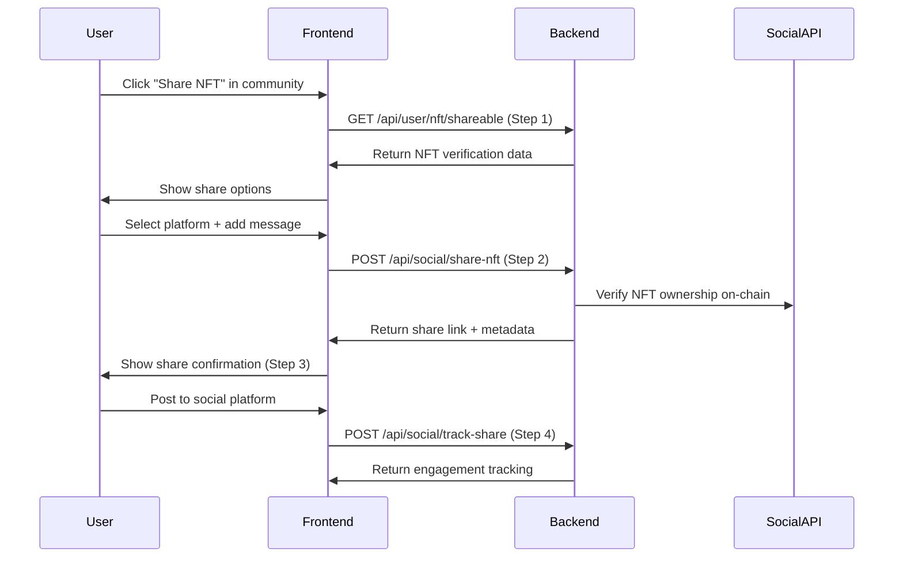
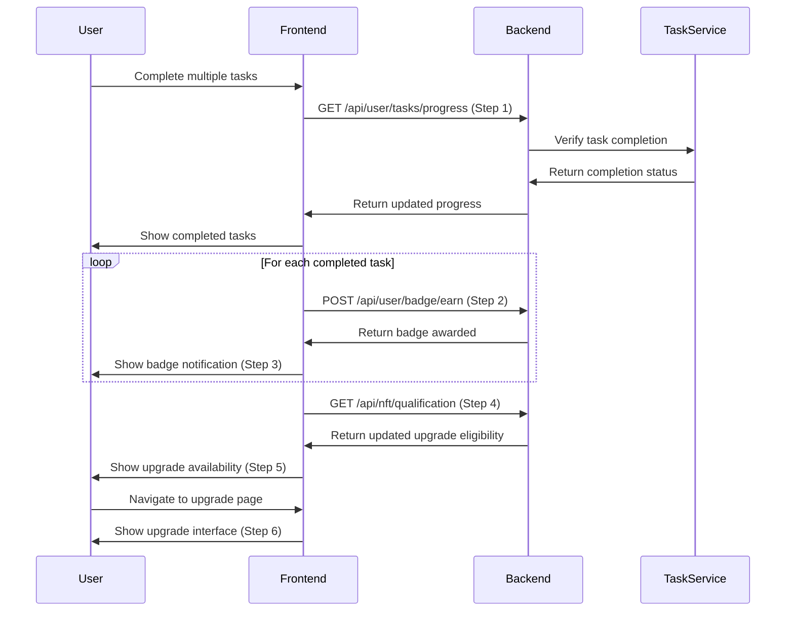

# Multi-Step Business Interactions Analysis

## Overview

This document identifies and analyzes all business actions in the AIW3 NFT system that require **multiple steps of interaction** between frontend and backend, similar to the NFT upgrade process.

---

## 🔄 Multi-Step Business Actions Identified

### 1. **NFT Upgrade Process** (Primary Example)
**Steps: 6+ interactions**

**Key Characteristics:**
- **User wallet interaction required**
- **Blockchain transaction dependencies**
- **Real-time status updates via SSE**
- **Retry/resume capability needed**
- **Multiple failure points**

### 2. **First NFT Unlock/Claim Process**
**Steps: 4-5 interactions**

**Business Logic:**
- Volume qualification check
- First-time NFT claiming
- Direct mint to user wallet
- Real-time status tracking

### 3. **Badge Activation for NFT Upgrade**
**Steps: 3-4 interactions**

**Business Logic:**
- Sequential badge activation
- Real-time qualification updates
- Upgrade eligibility recalculation
- Status synchronization

### 4. **Competition NFT Airdrop Process** (Admin/Manager)
**Steps: 5-6 interactions**

**Business Logic:**
- Winner validation and selection
- Bulk blockchain operations
- Real-time progress tracking
- Error handling for failed airdrops
- Audit trail creation

### 5. **Wallet Connection and Profile Setup**
**Steps: 4-5 interactions**

**Business Logic:**
- Wallet authentication
- User profile initialization
- Trading volume historical calculation
- NFT qualification assessment

### 6. **NFT Upgrade Retry Process** (After Failed Mint)
**Steps: 4-5 interactions**

**Business Logic:**
- Persistent upgrade state tracking
- No wallet interaction needed (NFT already burned)
- Badge consumption only on success
- Retry limit enforcement

### 7. **Social NFT Sharing and Verification**
**Steps: 3-4 interactions**

**Business Logic:**
- NFT ownership verification
- Metadata and image generation
- Social platform integration
- Engagement tracking

### 8. **Multi-Badge Task Completion Flow**
**Steps: 4-6 interactions**

**Business Logic:**
- Task completion validation
- Automatic badge awarding
- Qualification recalculation
- Progressive upgrade unlocking

---

## 🔍 Analysis Summary

### **Complexity Patterns Identified**

| **Business Action** | **Interaction Steps** | **Wallet Required** | **Blockchain Ops** | **Real-time Updates** | **Retry Support** |
|---------------------|----------------------|---------------------|--------------------|-----------------------|-------------------|
| NFT Upgrade | 6+ | ✅ | ✅ (Burn+Mint) | ✅ | ✅ |
| First NFT Unlock | 4-5 | ✅ | ✅ (Mint) | ✅ | ❌ |
| Badge Activation | 3-4 | ❌ | ❌ | ✅ | ❌ |
| Competition Airdrop | 5-6 | ❌ | ✅ (Bulk Mint) | ✅ | ✅ |
| Wallet Connection | 4-5 | ✅ | ❌ | ❌ | ❌ |
| Upgrade Retry | 4-5 | ❌ | ✅ (Mint) | ✅ | ✅ |
| NFT Sharing | 3-4 | ❌ | ✅ (Verification) | ❌ | ❌ |
| Multi-Badge Tasks | 4-6 | ❌ | ❌ | ✅ | ❌ |

### **Critical Multi-Step Characteristics**

1. **Wallet Interaction Dependency**
   - NFT Upgrade, First Unlock, Wallet Connection
   - Requires user to approve blockchain transactions
   - Highest complexity due to external wallet dependencies

2. **Blockchain Transaction Dependencies**
   - NFT operations (mint/burn), Competition airdrops
   - Require transaction confirmation waiting
   - Need retry mechanisms for failed transactions

3. **Real-time Status Updates Required**
   - Most operations except static profile management
   - Essential for user experience during waiting periods
   - HTTP/2 SSE connections critical for performance

4. **State Persistence Requirements**
   - Upgrade requests, airdrop operations
   - Must survive page refreshes and reconnections
   - Database tracking essential for retry capability

5. **Error Recovery Complexity**
   - Multi-point failures possible
   - Different recovery strategies per failure type
   - User guidance needed for resolution steps

---

## 💡 **HTTP/2 SSE Benefits for Multi-Step Interactions**

### **Why These Actions Need Real-Time Communication:**

1. **User Experience**: Users need immediate feedback during blockchain operations
2. **State Synchronization**: Frontend must stay synchronized with backend state changes
3. **Error Handling**: Real-time error notifications enable quick user response
4. **Progress Tracking**: Long operations need progress indicators
5. **Retry Coordination**: Failed operations need coordinated retry mechanisms

### **HTTP/2 SSE Advantages for These Scenarios:**

- **Single Connection Reuse**: All real-time updates use the same long-lived connection
- **Efficient Header Compression**: Authentication tokens compressed across multiple events
- **Parallel Processing**: Multiple SSE streams can run simultaneously
- **Automatic Reconnection**: Browser handles connection failures transparently
- **Better Performance**: 3-5x faster than polling for status updates

---

## 📋 **Implementation Recommendations**

### **For Each Multi-Step Process:**

1. **Create Persistent Request Tracking**
   - Database records for operation state
   - Unique request IDs for correlation
   - Status history for debugging

2. **Implement HTTP/2 SSE Streams**
   - Real-time status updates
   - Connection management with limits
   - Graceful error handling

3. **Design Retry/Resume Mechanisms**
   - Identify retryable vs permanent failures
   - State recovery after interruption
   - User-friendly retry interfaces

4. **Provide Clear User Guidance**
   - Progress indicators and status messages
   - Error explanations and resolution steps
   - Expected timing information

5. **Comprehensive Error Handling**
   - Network timeout handling
   - Blockchain confirmation delays
   - Wallet connection issues
   - Recovery path documentation

This analysis shows that the NFT system has **8 major multi-step business interactions**, with NFT Upgrade being the most complex (6+ steps). All require careful frontend-backend coordination, and most benefit significantly from HTTP/2 SSE real-time communication.
