```mermaid
graph TD
    subgraph User Environment
        User[👤 User] -->|Interacts via Browser| Frontend[🌐 AIW3 Frontend]
        Frontend -->|Wallet Adapter| Wallet[🔒 Phantom / Solflare]
    end

    subgraph AIW3 Services
        Frontend -->|"HTTPS (REST API)"| AIW3_Backend
        AIW3_Backend -->|Database Queries| DB[(📦 Database)]
    end

    subgraph Solana Network
        Wallet -->|RPC/WS| Solana_Node[⚡️ Solana RPC Node]
        AIW3_Backend -->|RPC/WS| Solana_Node
        Solana_Node -->|Gossip| Solana_Cluster[🌍 Solana Blockchain]
    end

    style User fill:#f9f,stroke:#333,stroke-width:2px
    style Frontend fill:#ccf,stroke:#333,stroke-width:2px
    style AIW3_Backend fill:#cfc,stroke:#333,stroke-width:2px
    style Solana_Node fill:#f96,stroke:#333,stroke-width:2px
```

# A Definitive Guide to Solana NFT Upgrades via a Burn-and-Mint Mechanism

## 1. Purpose of This Document

This document serves as the definitive technical guide for developers, architects, and stakeholders responsible for implementing the NFT upgrade functionality within the AIW3 DeFi system. Its primary purpose is to:

1.  **Establish a single, correct, and secure strategy** for invalidating a lower-level NFT when a user upgrades to a higher-level one.
2.  **Provide a clear technical explanation** of the underlying Solana NFT mechanics (specifically Associated Token Accounts) that make this strategy reliable.
3.  **Offer a ready-to-use, programmable implementation**, including code samples and diagrams, to ensure a consistent and error-free execution of the burn-and-mint process.

By consolidating this information, this document aims to eliminate ambiguity, prevent the implementation of less secure alternatives, and provide a clear roadmap for building a robust and trustworthy NFT upgrade feature.

## 2. Overview

This document outlines the definitive method for managing the lifecycle of upgradeable NFTs within the AIW3 DeFi system. 

**The Problem**: To upgrade a user from a lower-level NFT to a higher-level one, the lower-level NFT must be permanently and verifiably disabled to prevent its continued use or sale.

**The Optimal Solution**: The most secure and reliable approach is to have the user burn their existing NFT. The AIW3 system then programmatically verifies this burn on-chain by confirming that the NFT's specific Associated Token Account (ATA) has been closed. This method is unambiguous, aligns with Solana standards, and empowers the user.

This document provides a detailed analysis of this approach, a comparison with less secure alternatives, and a technical implementation guide with code samples and a sequence diagram to ensure clarity.

## 3. Core Solana NFT Mechanics: Mint Accounts and ATAs

To understand how to properly invalidate an NFT on Solana, it is essential to first understand two core concepts:

1.  **Mint Account**: Think of this as the central blueprint or template for a specific NFT collection. For a standard NFT (SPL Token), the Mint Account is created with a total supply of 1 and 0 decimal places. This account is what defines the NFT's existence and its unique identifier (the "mint address").

2.  **Associated Token Account (ATA)**: A user does **not** hold an NFT directly in their main wallet address (e.g., their public key). Instead, for each unique NFT a user owns, a separate account called an Associated Token Account (ATA) is created. This ATA has the following properties:
    *   It is programmatically linked to **both the user's wallet** and the **NFT's specific mint address**.
    *   It is this ATA that actually holds the single token (the NFT itself).
    *   This is an enforced, non-optional part of the Solana SPL Token standard.

Wallets like Phantom abstract this away, making it seem like the NFTs are in your main wallet, but on-chain, they are all in separate ATAs.

## 4. The Lifecycle of an NFT: Minting and Burning

*   **Minting (Pre-condition & Post-condition)**:
    *   **Pre-condition**: A unique Mint Account for the NFT must exist.
    *   **Action**: An ATA is created for the user and the NFT mint, and one token is minted to that ATA.
    *   **Post-condition**: The user now has an ATA that holds the NFT, and it appears in their wallet.

*   **Burning (Pre-condition & Post-condition)**:
    *   **Pre-condition**: The user must own the NFT in a specific ATA.
    *   **Action**: A `burn` instruction destroys the token in the ATA. Then, a `closeAccount` instruction is called on the now-empty ATA to reclaim the SOL stored for rent.
    *   **Post-condition**: The NFT is destroyed, and **the ATA that held it is closed and no longer exists on the blockchain.** The user's main wallet is unaffected.

This lifecycle provides the definitive method for burn verification.

## 5. Evaluation of Approaches for Disabling Solana NFTs

Given the mechanics above, the only truly reliable way to confirm an NFT is permanently disabled is to verify that its ATA has been closed. Let's re-evaluate the approaches with this understanding.

## 6. Quick Comparison Table

| Approach | Technical Feasibility | Cost (Gas Fee) | Implementation Difficulty | Future Maintenance | Business Logic Compliance | Trust | True Invalidation | Recommendation |
|:---|:---:|:---:|:---:|:---:|:---:|:---:|:---:|:---:|
| **1. Public Blackhole Address** | ✅ High | 💰 Very Low | 🟢 Low | 🟢 Low | ⚠️ Partial | ⚠️ Low | ❌ No | Not Recommended |
| **2. Custom Blackhole Address** | ✅ High | 💰 Very Low | 🟡 Moderate | 🟢 Low | ⚠️ Partial | 🟡 Medium | ❌ No | Not Recommended |
| **3. AIW3 System Wallet** | ✅ High | 💰 Very Low | 🟡 Moderate | 🔴 High | ⚠️ Partial | 🔴 Low | ❌ No | Not Recommended |
| **4. Dedicated Wallet** | ✅ High | 💰 Very Low | 🟡 Moderate | 🔴 High | ⚠️ Partial | 🟡 Medium | ❌ No | Not Recommended |
| **5. User Burns NFT** | ✅ High | 💰 Very Low | 🟡 Moderate | 🟢 Low | ✅ Strong | ✅ High | ✅ Yes | **⭐ RECOMMENDED** |
| **6. System Burns NFT** | ✅ High | 💰 Low | 🔴 High | 🔴 High | ✅ Strong | 🔴 Low | ⚠️ Partial | Consider as alternative |

**Legend:**
- ✅ Excellent/Yes  ⚠️ Moderate/Partial  ❌ Poor/No
- 🟢 Low complexity  🟡 Moderate complexity  🔴 High complexity
- 💰 Cost indicator
- ⭐ Recommended approach

---

### Analysis

**Note**: All approaches require system verification before minting new NFTs to prevent errors.

- **Public Blackhole Address**: Easy implementation; system checks ownership at blackhole address. Does not remove on-chain existence.
- **Custom Blackhole Address**: Secure setup needed; system verifies transfer to custom address. Similar limitations as Approach 1.
- **AIW3 System Wallet**: System manages transfers and verifies receipt. Reliant on system integrity; centralized control.
- **Dedicated Wallet**: System verifies transfer to dedicated wallet. Separated management; still centralized involvement.
- **User Burns NFT**: The system verifies the burn by confirming the NFT's Associated Token Account (ATA) has been closed. **This is the most robust and recommended approach.**
- **System Burns NFT**: System handles both transfer and burn. Adds complexity and requires user trust.

#### 2. Approach 2: Define/Set a New Blackhole Address on Solana

This is similar to Approach 1, but you would designate your own "blackhole" address if a universally recognized one for Solana wasn't clear, ensuring no one has the private key to it.

*   **Technical Feasibility**:
    *   Feasible to create an address with no known private key. However, as mentioned, this doesn't equate to a native "burn" on Solana.
*   **Cost (Gas Fee)**:
    *   Same as Approach 1: low transaction fees for transfer.
*   **Implementation Difficulty**:
    *   Similar to Approach 1, with the added step of securely generating and publicizing a new, truly inaccessible address.
*   **Future Maintenance Complexity**:
    *   Low, as it relies on a fixed, unchangeable address.
*   **Business Logic Compliance**:
    *   Same limitations as Approach 1 regarding true invalidation and prevention of malicious use outside your system.

#### 3. Approach 3: Transfer NFT to AIW3 System Wallet

In this approach, users transfer the lower-level NFT directly to your AIW3 backend system's wallet. Your system would then manage these NFTs, ensuring they are not re-circulated.

*   **Technical Feasibility**:
    *   Highly feasible. This is a standard NFT transfer operation on Solana.
*   **Cost (Gas Fee)**:
    *   Low, similar to other transfers (around 0.000005 SOL).
*   **Implementation Difficulty**:
    *   Moderate. Your backend needs to securely manage a wallet that receives potentially many NFTs. This involves proper key management and robust tracking.
*   **Future Maintenance Complexity**:
    *   Moderate to high. Your system now becomes responsible for holding and managing these "disabled" NFTs. This could lead to an accumulating inventory of unusable NFTs in your wallet, requiring ongoing management or periodic burning by your system. There's also the need to ensure the system wallet remains honest and doesn't re-issue or misuse these NFTs.
*   **Business Logic Compliance**:
    *   **Internal Control**: This approach offers strong internal control over the "disabled" NFTs, as they are now under your system's direct management.
    *   **External Perception**: However, externally, the NFTs still exist and contribute to the circulating supply on the blockchain, potentially causing confusion if not clearly communicated. Users might try to trade them on other marketplaces, which would fail or lead to disputes if your system considers them invalid.

#### 4. Approach 4: Transfer NFT to a Dedicated Other Wallet Separate from the System Wallet

Similar to Approach 3, but you would use a separate dedicated wallet, distinct from your minting system wallet, to hold the disabled NFTs.

*   **Technical Feasibility**:
    *   Technically feasible, as it's a standard transfer.
*   **Cost (Gas Fee)**:
    *   Low, same as other transfers.
*   **Implementation Difficulty**:
    *   Moderate. Requires managing an additional dedicated wallet with strong security measures.
*   **Future Maintenance Complexity**:
    *   Similar to Approach 3, requiring management of the dedicated wallet and its accumulating NFTs. This approach offers a slight separation of concerns by not holding "disabled" NFTs in the same wallet used for active minting.
*   **Business Logic Compliance**:
    *   Similar to Approach 3, the NFTs still exist on the blockchain and are part of the circulating supply. The primary difference is the segregation of assets for internal management purposes.

#### 5. Approach 5: Require User to Burn Their NFT Directly

This approach mandates that users explicitly burn their lower-level NFT using Solana's native `burn` instruction before they can upgrade. Your backend would then verify the burn.

*   **Technical Feasibility**:
    *   Highly feasible and aligned with Solana's native capabilities. The Solana Program Library (SPL) provides a `burn()` function that removes tokens from circulation. This is the most definitive way to remove an NFT from the blockchain.
    *   **Verification**: The only reliable on-chain proof of a burn is to confirm that the NFT's specific Associated Token Account (ATA) has been closed. The user's main wallet is unaffected by this.
*   **Cost (Gas Fee)**:
    *   Burning an NFT on Solana involves a transaction fee, which is typically very low, often less than a cent (e.g., 0.0000013 USD for compressed NFTs, or a small fraction of SOL for others). It also allows the user to reclaim the SOL tied up as "storage rent" for that token account, which can be around 0.01 SOL for regular NFTs or 0.002 SOL for scam tokens where metadata cannot be burned. Sol-Incinerator, a dApp for burning NFTs, charges a minor fraction of the reclaimed SOL as a fee.
*   **Implementation Difficulty**:
    *   Moderate. While user-friendly tools like Phantom Wallet and Sol Incinerator allow users to burn NFTs easily, integrating programmatic checks into your backend requires a good understanding of Solana's `spl-token` library and blockchain interactions.
*   **Future Maintenance Complexity**:
    *   Low to moderate. The logic for verifying a burn is clear and leverages fundamental Solana operations. No accumulation of "junk" NFTs in a system wallet.
*   **Business Logic Compliance**:
    *   **Strongest Invalidation**: This approach offers the strongest guarantee that the lower-level NFT is truly "invalidated" both within and outside your AIW3 system, as it is permanently removed from circulation. This directly addresses your concern about preventing malicious use or continued trading of the old NFT.

#### 6. Approach 6: Transfer NFT to AIW3 Backend System, Then Backend System Burns It

In this approach, users transfer the lower-level NFT to your AIW3 backend system's wallet, and then your system performs the burn operation.

*   **Technical Feasibility**:
    *   Highly feasible. It combines standard NFT transfer with a programmatic burn by your system.
*   **Cost (Gas Fee)**:
    *   Users pay a low transfer fee (around 0.000005 SOL). Your backend will incur a separate, also low, burn transaction fee. The user would also reclaim the SOL rent from the NFT upon your system burning it, which would then be held by your system's wallet.
*   **Implementation Difficulty**:
    *   Moderate to high. Requires managing incoming transfers and securely performing burn operations from your backend wallet. This adds complexity in terms of wallet management and transaction processing on your end.
*   **Future Maintenance Complexity**:
    *   Moderate to high. Your system needs to manage incoming NFTs before burning them. This involves handling potential issues with failed transfers, ensuring the burn instruction is correctly executed, and managing the recovered SOL rent.
*   **Business Logic Compliance**:
    *   **Strong Invalidation**: Provides strong invalidation because the NFT is eventually burned.
    *   **Trust in System**: Requires users to trust your AIW3 system to correctly burn the NFT after transfer. This approach ensures the NFT is truly removed from circulation, fulfilling the requirement to prevent its use or trade outside the system.

## 7. The Correct and Viable On-Chain Implementation

**The Goal**: To programmatically verify that an NFT has been burned.

**The Method**: The backend must derive the address of the specific Associated Token Account (ATA) for the user and the NFT mint. It then checks if that account still exists. If it does not (`getAccountInfo` returns `null`), the burn is confirmed.

**Step-by-Step Verification Logic:**
1.  **Get the ATA Address**: Use the user's wallet public key and the NFT's mint address to deterministically find the ATA address.
2.  **Check the Account Info**: Call `connection.getAccountInfo()` on the derived ATA address.
3.  **Confirm Closure**: If the result is `null`, the ATA is closed, and the NFT is successfully burned. Otherwise, the NFT still exists.

**Recommended Implementation Code:**

```javascript
import { PublicKey } from '@solana/web3.js';
import { TOKEN_PROGRAM_ID, ASSOCIATED_TOKEN_PROGRAM_ID } from '@solana/spl-token';

/**
 * Finds the Associated Token Account (ATA) address for a given mint and owner.
 */
async function findAssociatedTokenAddress(
  owner: PublicKey,
  mint: PublicKey
): Promise<PublicKey> {
  const [address] = await PublicKey.findProgramAddress(
    [owner.toBuffer(), TOKEN_PROGRAM_ID.toBuffer(), mint.toBuffer()],
    ASSOCIATED_TOKEN_PROGRAM_ID
  );
  return address;
}

/**
 * Verifies that an NFT has been burned by checking if its ATA has been closed.
 * @param connection - The Solana JSON RPC connection.
 * @param userWallet - The public key of the user's main wallet.
 * @param nftMint - The public key of the NFT's mint account.
 * @returns {Promise<boolean>} - True if the NFT is burned, false otherwise.
 */
async function verifyNftIsBurned(connection, userWallet, nftMint) {
  // 1. Find the expected address of the NFT's ATA.
  const ataAddress = await findAssociatedTokenAddress(
    new PublicKey(userWallet),
    new PublicKey(nftMint)
  );

  // 2. Check if an account exists at that address.
  const accountInfo = await connection.getAccountInfo(ataAddress);

  // 3. If accountInfo is null, the account has been closed, confirming the burn.
  if (accountInfo === null) {
    console.log(`Verification Successful: ATA ${ataAddress.toBase58()} is closed. NFT is burned.`);
    return true;
  }
  
  console.log(`Verification Failed: ATA ${ataAddress.toBase58()} still exists. NFT not burned.`);
  return false;
}

// Example Usage:
// const isBurned = await verifyNftIsBurned(connection, 'USER_WALLET_ADDRESS', 'NFT_MINT_ADDRESS');
```


## 8. Executive Summary

**The Optimal Approach:** The most secure, reliable, and efficient method to disable a Solana NFT before an upgrade is **Approach 5: Require the User to Burn Their NFT Directly.**

**Why This is Optimal:**
- **Unambiguous Proof**: The only definitive on-chain proof that an NFT has been permanently destroyed is the closure of its specific Associated Token Account (ATA). All other methods leave the NFT in an ambiguous state.
- **Trustless Verification**: The system does not need to trust any party. It can programmatically and reliably verify the ATA closure with a single, simple on-chain query.
- **Aligns with Solana Standards**: This method correctly follows the standard lifecycle of an SPL Token, leveraging the `burn` and `closeAccount` instructions as intended.
- **User-Centric**: It empowers users to manage their own assets and reclaim the SOL rent from the closed ATA, providing a direct incentive.

**Implementation:**
The AIW3 backend must implement a function to `verifyNftIsBurned`. This function will deterministically find the address of the NFT's ATA and confirm that the account no longer exists by checking that `getAccountInfo` returns `null`. Minting of the new, upgraded NFT should only proceed after this verification is successful. All other approaches are not recommended as they introduce unnecessary risk, complexity, and ambiguity.


## 9. System Architecture for NFT Upgrades

This diagram provides a high-level overview of the system components and their communication protocols.



**Component Communication Protocols:**

-   **User to Frontend**: Standard browser interaction (HTTPS).
-   **Frontend to AIW3 Backend**: Secure RESTful API calls over HTTPS for all off-chain operations (e.g., checking eligibility, initiating the upgrade process).
-   **Frontend to Wallet**: The frontend uses a wallet adapter (like the Solana Wallet-Adapter library) to send transaction signing requests to the user's wallet. The user approves these directly in the wallet extension.
-   **Wallet to Solana**: The user's wallet submits the signed `burn` and `closeAccount` transactions to a Solana RPC node via RPC (Remote Procedure Call) over HTTPS or WebSocket (WS) for real-time updates.
-   **AIW3 Backend to Solana**: The backend connects to a Solana RPC node (either a public one or a private one like QuickNode/Helius for better performance) to query on-chain data, specifically using the `getAccountInfo` method via RPC to verify the closure of an ATA.

This architecture clearly separates the on-chain and off-chain responsibilities, providing a secure and robust model for the NFT upgrade process.

## 10. Business Process: NFT Upgrade Sequence Diagram

This diagram illustrates the end-to-end flow for the optimal approach, including the frontend web application.

**Diagram Participants:**
*   **User**: The individual interacting with the AIW3 dApp in their browser.
*   **Frontend**: The web application (running in the user's browser) that provides the user interface.
*   **Wallet (Phantom / Solflare)**: The user's Solana wallet, which is prompted by the Frontend to sign and approve on-chain transactions.
*   **AIW3 Backend**: The centralized server responsible for off-chain logic, such as checking eligibility and orchestrating the upgrade process.
*   **Solana Blockchain**: The decentralized network where all on-chain actions are recorded.

**Flow Explanation:**
The user initiates all actions through the Frontend. The Frontend communicates with the AIW3 Backend for off-chain tasks (like eligibility checks) and with the user's Wallet to request signatures for on-chain transactions (like burning). The Backend then independently verifies the on-chain result (ATA closure) before minting the new NFT.


### Overview

This document outlines the definitive method for managing the lifecycle of upgradeable NFTs within the AIW3 DeFi system. 

**The Problem**: To upgrade a user from a lower-level NFT to a higher-level one, the lower-level NFT must be permanently and verifiably disabled to prevent its continued use or sale.

**The Optimal Solution**: The most secure and reliable approach is to have the user burn their existing NFT. The AIW3 system then programmatically verifies this burn on-chain by confirming that the NFT's specific Associated Token Account (ATA) has been closed. This method is unambiguous, aligns with Solana standards, and empowers the user.

This document provides a detailed analysis of this approach, a comparison with less secure alternatives, and a technical implementation guide with code samples and a sequence diagram to ensure clarity.

### Core Solana NFT Mechanics: Mint Accounts and ATAs

To understand how to properly invalidate an NFT on Solana, it is essential to first understand two core concepts:

1.  **Mint Account**: Think of this as the central blueprint or template for a specific NFT collection. For a standard NFT (SPL Token), the Mint Account is created with a total supply of 1 and 0 decimal places. This account is what defines the NFT's existence and its unique identifier (the "mint address").

2.  **Associated Token Account (ATA)**: A user does **not** hold an NFT directly in their main wallet address (e.g., their public key). Instead, for each unique NFT a user owns, a separate account called an Associated Token Account (ATA) is created. This ATA has the following properties:
    *   It is programmatically linked to **both the user's wallet** and the **NFT's specific mint address**.
    *   It is this ATA that actually holds the single token (the NFT itself).
    *   This is an enforced, non-optional part of the Solana SPL Token standard.

Wallets like Phantom abstract this away, making it seem like the NFTs are in your main wallet, but on-chain, they are all in separate ATAs.

### The Lifecycle of an NFT: Minting and Burning

*   **Minting (Pre-condition & Post-condition)**:
    *   **Pre-condition**: A unique Mint Account for the NFT must exist.
    *   **Action**: An ATA is created for the user and the NFT mint, and one token is minted to that ATA.
    *   **Post-condition**: The user now has an ATA that holds the NFT, and it appears in their wallet.

*   **Burning (Pre-condition & Post-condition)**:
    *   **Pre-condition**: The user must own the NFT in a specific ATA.
    *   **Action**: A `burn` instruction destroys the token in the ATA. Then, a `closeAccount` instruction is called on the now-empty ATA to reclaim the SOL stored for rent.
    *   **Post-condition**: The NFT is destroyed, and **the ATA that held it is closed and no longer exists on the blockchain.** The user's main wallet is unaffected.

This lifecycle provides the definitive method for burn verification.

### Evaluation of Approaches for Disabling Solana NFTs

Given the mechanics above, the only truly reliable way to confirm an NFT is permanently disabled is to verify that its ATA has been closed. Let's re-evaluate the approaches with this understanding.

## Quick Comparison Table

| Approach | Technical Feasibility | Cost (Gas Fee) | Implementation Difficulty | Future Maintenance | Business Logic Compliance | Trust | True Invalidation | Recommendation |
|:---|:---:|:---:|:---:|:---:|:---:|:---:|:---:|:---:|
| **1. Public Blackhole Address** | ✅ High | 💰 Very Low | 🟢 Low | 🟢 Low | ⚠️ Partial | ⚠️ Low | ❌ No | Not Recommended |
| **2. Custom Blackhole Address** | ✅ High | 💰 Very Low | 🟡 Moderate | 🟢 Low | ⚠️ Partial | 🟡 Medium | ❌ No | Not Recommended |
| **3. AIW3 System Wallet** | ✅ High | 💰 Very Low | 🟡 Moderate | 🔴 High | ⚠️ Partial | 🔴 Low | ❌ No | Not Recommended |
| **4. Dedicated Wallet** | ✅ High | 💰 Very Low | 🟡 Moderate | 🔴 High | ⚠️ Partial | 🟡 Medium | ❌ No | Not Recommended |
| **5. User Burns NFT** | ✅ High | 💰 Very Low | 🟡 Moderate | 🟢 Low | ✅ Strong | ✅ High | ✅ Yes | **⭐ RECOMMENDED** |
| **6. System Burns NFT** | ✅ High | 💰 Low | 🔴 High | 🔴 High | ✅ Strong | 🔴 Low | ⚠️ Partial | Consider as alternative |

**Legend:**
- ✅ Excellent/Yes  ⚠️ Moderate/Partial  ❌ Poor/No
- 🟢 Low complexity  🟡 Moderate complexity  🔴 High complexity
- 💰 Cost indicator
- ⭐ Recommended approach

---

### Analysis

**Note**: All approaches require system verification before minting new NFTs to prevent errors.

- **Public Blackhole Address**: Easy implementation; system checks ownership at blackhole address. Does not remove on-chain existence.
- **Custom Blackhole Address**: Secure setup needed; system verifies transfer to custom address. Similar limitations as Approach 1.
- **AIW3 System Wallet**: System manages transfers and verifies receipt. Reliant on system integrity; centralized control.
- **Dedicated Wallet**: System verifies transfer to dedicated wallet. Separated management; still centralized involvement.
- **User Burns NFT**: The system verifies the burn by confirming the NFT's Associated Token Account (ATA) has been closed. **This is the most robust and recommended approach.**
- **System Burns NFT**: System handles both transfer and burn. Adds complexity and requires user trust.

#### 2. Approach 2: Define/Set a New Blackhole Address on Solana

This is similar to Approach 1, but you would designate your own "blackhole" address if a universally recognized one for Solana wasn't clear, ensuring no one has the private key to it.

*   **Technical Feasibility**:
    *   Feasible to create an address with no known private key. However, as mentioned, this doesn't equate to a native "burn" on Solana.
*   **Cost (Gas Fee)**:
    *   Same as Approach 1: low transaction fees for transfer.
*   **Implementation Difficulty**:
    *   Similar to Approach 1, with the added step of securely generating and publicizing a new, truly inaccessible address.
*   **Future Maintenance Complexity**:
    *   Low, as it relies on a fixed, unchangeable address.
*   **Business Logic Compliance**:
    *   Same limitations as Approach 1 regarding true invalidation and prevention of malicious use outside your system.

#### 3. Approach 3: Transfer NFT to AIW3 System Wallet

In this approach, users transfer the lower-level NFT directly to your AIW3 backend system's wallet. Your system would then manage these NFTs, ensuring they are not re-circulated.

*   **Technical Feasibility**:
    *   Highly feasible. This is a standard NFT transfer operation on Solana.
*   **Cost (Gas Fee)**:
    *   Low, similar to other transfers (around 0.000005 SOL).
*   **Implementation Difficulty**:
    *   Moderate. Your backend needs to securely manage a wallet that receives potentially many NFTs. This involves proper key management and robust tracking.
*   **Future Maintenance Complexity**:
    *   Moderate to high. Your system now becomes responsible for holding and managing these "disabled" NFTs. This could lead to an accumulating inventory of unusable NFTs in your wallet, requiring ongoing management or periodic burning by your system. There's also the need to ensure the system wallet remains honest and doesn't re-issue or misuse these NFTs.
*   **Business Logic Compliance**:
    *   **Internal Control**: This approach offers strong internal control over the "disabled" NFTs, as they are now under your system's direct management.
    *   **External Perception**: However, externally, the NFTs still exist and contribute to the circulating supply on the blockchain, potentially causing confusion if not clearly communicated. Users might try to trade them on other marketplaces, which would fail or lead to disputes if your system considers them invalid.

#### 4. Approach 4: Transfer NFT to a Dedicated Other Wallet Separate from the System Wallet

Similar to Approach 3, but you would use a separate dedicated wallet, distinct from your minting system wallet, to hold the disabled NFTs.

*   **Technical Feasibility**:
    *   Technically feasible, as it's a standard transfer.
*   **Cost (Gas Fee)**:
    *   Low, same as other transfers.
*   **Implementation Difficulty**:
    *   Moderate. Requires managing an additional dedicated wallet with strong security measures.
*   **Future Maintenance Complexity**:
    *   Similar to Approach 3, requiring management of the dedicated wallet and its accumulating NFTs. This approach offers a slight separation of concerns by not holding "disabled" NFTs in the same wallet used for active minting.
*   **Business Logic Compliance**:
    *   Similar to Approach 3, the NFTs still exist on the blockchain and are part of the circulating supply. The primary difference is the segregation of assets for internal management purposes.

#### 5. Approach 5: Require User to Burn Their NFT Directly

This approach mandates that users explicitly burn their lower-level NFT using Solana's native `burn` instruction before they can upgrade. Your backend would then verify the burn.

*   **Technical Feasibility**:
    *   Highly feasible and aligned with Solana's native capabilities. The Solana Program Library (SPL) provides a `burn()` function that removes tokens from circulation. This is the most definitive way to remove an NFT from the blockchain.
    *   **Verification**: The only reliable on-chain proof of a burn is to confirm that the NFT's specific Associated Token Account (ATA) has been closed. The user's main wallet is unaffected by this.
*   **Cost (Gas Fee)**:
    *   Burning an NFT on Solana involves a transaction fee, which is typically very low, often less than a cent (e.g., 0.0000013 USD for compressed NFTs, or a small fraction of SOL for others). It also allows the user to reclaim the SOL tied up as "storage rent" for that token account, which can be around 0.01 SOL for regular NFTs or 0.002 SOL for scam tokens where metadata cannot be burned. Sol-Incinerator, a dApp for burning NFTs, charges a minor fraction of the reclaimed SOL as a fee.
*   **Implementation Difficulty**:
    *   Moderate. While user-friendly tools like Phantom Wallet and Sol Incinerator allow users to burn NFTs easily, integrating programmatic checks into your backend requires a good understanding of Solana's `spl-token` library and blockchain interactions.
*   **Future Maintenance Complexity**:
    *   Low to moderate. The logic for verifying a burn is clear and leverages fundamental Solana operations. No accumulation of "junk" NFTs in a system wallet.
*   **Business Logic Compliance**:
    *   **Strongest Invalidation**: This approach offers the strongest guarantee that the lower-level NFT is truly "invalidated" both within and outside your AIW3 system, as it is permanently removed from circulation. This directly addresses your concern about preventing malicious use or continued trading of the old NFT.

#### 6. Approach 6: Transfer NFT to AIW3 Backend System, Then Backend System Burns It

In this approach, users transfer their lower-level NFT to your AIW3 backend system's wallet, and then your system performs the burn operation.

*   **Technical Feasibility**:
    *   Highly feasible. It combines standard NFT transfer with a programmatic burn by your system.
*   **Cost (Gas Fee)**:
    *   Users pay a low transfer fee (around 0.000005 SOL). Your backend will incur a separate, also low, burn transaction fee. The user would also reclaim the SOL rent from the NFT upon your system burning it, which would then be held by your system's wallet.
*   **Implementation Difficulty**:
    *   Moderate to high. Requires managing incoming transfers and securely performing burn operations from your backend wallet. This adds complexity in terms of wallet management and transaction processing on your end.
*   **Future Maintenance Complexity**:
    *   Moderate to high. Your system needs to manage incoming NFTs before burning them. This involves handling potential issues with failed transfers, ensuring the burn instruction is correctly executed, and managing the recovered SOL rent.
*   **Business Logic Compliance**:
    *   **Strong Invalidation**: Provides strong invalidation because the NFT is eventually burned.
    *   **Trust in System**: Requires users to trust your AIW3 system to correctly burn the NFT after transfer. This approach ensures the NFT is truly removed from circulation, fulfilling the requirement to prevent its use or trade outside the system.

**Recommendation**: **Users must burn NFTs directly (Approach 5), and the system must verify the closure of the Associated Token Account (ATA).**

**Reasons**:
- **Definitive Invalidation**: Closing the ATA is the only on-chain action that guarantees the NFT is permanently and irreversibly destroyed.
- **Decentralized and Secure**: It places control in the user's hands while allowing for trustless verification by the system.
- **No Ambiguity**: Unlike transferring to a wallet (which still exists), a closed ATA is definitive proof of a burn.

### The Correct and Viable On-Chain Implementation

**The Goal**: To programmatically verify that an NFT has been burned.

**The Method**: The backend must derive the address of the specific Associated Token Account (ATA) for the user and the NFT mint. It then checks if that account still exists. If it does not (`getAccountInfo` returns `null`), the burn is confirmed.

**Step-by-Step Verification Logic:**
1.  **Get the ATA Address**: Use the user's wallet public key and the NFT's mint address to deterministically find the ATA address.
2.  **Check the Account Info**: Call `connection.getAccountInfo()` on the derived ATA address.
3.  **Confirm Closure**: If the result is `null`, the ATA is closed, and the NFT is successfully burned. Otherwise, the NFT still exists.

**Recommended Implementation Code:**

```javascript
import { PublicKey } from '@solana/web3.js';
import { TOKEN_PROGRAM_ID, ASSOCIATED_TOKEN_PROGRAM_ID } from '@solana/spl-token';

/**
 * Finds the Associated Token Account (ATA) address for a given mint and owner.
 */
async function findAssociatedTokenAddress(
  owner: PublicKey,
  mint: PublicKey
): Promise<PublicKey> {
  const [address] = await PublicKey.findProgramAddress(
    [owner.toBuffer(), TOKEN_PROGRAM_ID.toBuffer(), mint.toBuffer()],
    ASSOCIATED_TOKEN_PROGRAM_ID
  );
  return address;
}

/**
 * Verifies that an NFT has been burned by checking if its ATA has been closed.
 * @param connection - The Solana JSON RPC connection.
 * @param userWallet - The public key of the user's main wallet.
 * @param nftMint - The public key of the NFT's mint account.
 * @returns {Promise<boolean>} - True if the NFT is burned, false otherwise.
 */
async function verifyNftIsBurned(connection, userWallet, nftMint) {
  // 1. Find the expected address of the NFT's ATA.
  const ataAddress = await findAssociatedTokenAddress(
    new PublicKey(userWallet),
    new PublicKey(nftMint)
  );

  // 2. Check if an account exists at that address.
  const accountInfo = await connection.getAccountInfo(ataAddress);

  // 3. If accountInfo is null, the account has been closed, confirming the burn.
  if (accountInfo === null) {
    console.log(`Verification Successful: ATA ${ataAddress.toBase58()} is closed. NFT is burned.`);
    return true;
  }
  
  console.log(`Verification Failed: ATA ${ataAddress.toBase58()} still exists. NFT not burned.`);
  return false;
}

// Example Usage:
// const isBurned = await verifyNftIsBurned(connection, 'USER_WALLET_ADDRESS', 'NFT_MINT_ADDRESS');
```


### Executive Summary

**The Optimal Approach:** The most secure, reliable, and efficient method to disable a Solana NFT before an upgrade is **Approach 5: Require the User to Burn Their NFT Directly.**

**Why This is Optimal:**
- **Unambiguous Proof**: The only definitive on-chain proof that an NFT has been permanently destroyed is the closure of its specific Associated Token Account (ATA). All other methods leave the NFT in an ambiguous state.
- **Trustless Verification**: The system does not need to trust any party. It can programmatically and reliably verify the ATA closure with a single, simple on-chain query.
- **Aligns with Solana Standards**: This method correctly follows the standard lifecycle of an SPL Token, leveraging the `burn` and `closeAccount` instructions as intended.
- **User-Centric**: It empowers users to manage their own assets and reclaim the SOL rent from the closed ATA, providing a direct incentive.

**Implementation:**
The AIW3 backend must implement a function to `verifyNftIsBurned`. This function will deterministically find the address of the NFT's ATA and confirm that the account no longer exists by checking that `getAccountInfo` returns `null`. Minting of the new, upgraded NFT should only proceed after this verification is successful. All other approaches are not recommended as they introduce unnecessary risk, complexity, and ambiguity.


### System Architecture for NFT Upgrades

This diagram provides a high-level overview of the system components and their communication protocols.


**Component Communication Protocols:**

-   **User to Frontend**: Standard browser interaction (HTTPS).
-   **Frontend to AIW3 Backend**: Secure RESTful API calls over HTTPS for all off-chain operations (e.g., checking eligibility, initiating the upgrade process).
-   **Frontend to Wallet**: The frontend uses a wallet adapter (like the Solana Wallet-Adapter library) to send transaction signing requests to the user's wallet. The user approves these directly in the wallet extension.
-   **Wallet to Solana**: The user's wallet submits the signed `burn` and `closeAccount` transactions to a Solana RPC node via RPC (Remote Procedure Call) over HTTPS or WebSocket (WS) for real-time updates.
-   **AIW3 Backend to Solana**: The backend connects to a Solana RPC node (either a public one or a private one like QuickNode/Helius for better performance) to query on-chain data, specifically using the `getAccountInfo` method via RPC to verify the closure of an ATA.

This architecture clearly separates the on-chain and off-chain responsibilities, providing a secure and robust model for the NFT upgrade process.

This diagram illustrates the end-to-end flow for the optimal approach, including the frontend web application.

**Diagram Participants:**
*   **User**: The individual interacting with the AIW3 dApp in their browser.
*   **Frontend**: The web application (running in the user's browser) that provides the user interface.
*   **Wallet (Phantom / Solflare)**: The user's Solana wallet, which is prompted by the Frontend to sign and approve on-chain transactions.
*   **AIW3 Backend**: The centralized server responsible for off-chain logic, such as checking eligibility and orchestrating the upgrade process.
*   **Solana Blockchain**: The decentralized network where all on-chain actions are recorded.

**Flow Explanation:**
The user initiates all actions through the Frontend. The Frontend communicates with the AIW3 Backend for off-chain tasks (like eligibility checks) and with the user's Wallet to request signatures for on-chain transactions (like burning). The Backend then independently verifies the on-chain result (ATA closure) before minting the new NFT.


