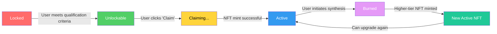

# AIW3 NFT Business Rules and Flows

<!-- Document Metadata -->
**Version:** v5.0.0
**Last Updated:** 2025-08-07
**Status:** Active
**Purpose:** To provide a definitive, implementation-aligned specification of all NFT-related business flows, rules, statuses, UI data requirements, and backend API endpoints. This document is strictly aligned with the `lastmemefi-api` backend models and routes to serve as a ground-truth reference for developers.

---

## 1. Core Business Rules: NFT Tiers and Benefits

### 1.1 NFT Tier Qualification Rules

Qualification for each NFT tier is based on a user's total trading volume (in USDT). Badge requirements have been simplified based on prototype analysis. These conditions are mandatory and checked in real-time.

**Business Rule**: Users can only hold ONE active NFT at a time. When upgrading, the previous NFT is burned and a new higher-tier NFT is minted.

| Level   | NFT Name            | Required Trading Volume (USDT) | Trading Fee Reduction | AI Agent Benefits         | Unlock Status Display     |
|:--------|:--------------------|:-------------------------------|:----------------------|:--------------------------|:--------------------------|
| 1       | Tech Chicken        | ≥ 100,000                      | 10%                   | 10 free uses per week     | "Unlocked" when qualified |
| 2       | Quant Ape           | ≥ 500,000                      | 20%                   | 20 free uses per week     | "Unlocked" when qualified |
| 3       | On-chain Hunter     | ≥ 5,000,000                    | 30%                   | 30 free uses per week     | "Unlocked" when qualified |
| 4       | Alpha Alchemist     | ≥ 10,000,000                   | 40%                   | 40 free uses per week     | "Unlocked" when qualified |
| 5       | Quantum Alchemist   | ≥ 50,000,000                   | 55%                   | 50 free uses per week     | "Unlocked" when qualified |
| Special | Trophy Breeder      | Top 3 in trading competition   | 25%                   | Special privileges        | Airdrop notification      |

### 1.2 Additional Business Rules from Prototypes

1. **Progress Tracking**: Users can see their progress toward the next tier with visual progress bars
2. **Activation Popup**: When users unlock a new tier, they see a "Trigger Activation Popup" (Prototype 5)
3. **Success Messaging**: After successful synthesis, users see confirmation with new NFT details (Prototype 2.4)
4. **Community Display**: Active NFTs are displayed in community profiles for social proof (Prototypes 6, 7)

---

## 2. NFT Lifecycle and Status

The NFT lifecycle is managed through a series of statuses. It is critical to distinguish between **dynamic business statuses** (determined by business logic in `NFTService`) and **persistent database statuses** (stored in the `UserNft` table).

- **Business Statuses (`Locked`, `Unlockable`, `Claiming`):** Represent a user's eligibility *before* an NFT is minted. They are calculated on-the-fly and are not stored in the database.
- **Database Statuses (`active`, `burned`):** Represent the state of an NFT *after* it has been minted and recorded in the database.

### NFT Status Transition Diagram



### Status Definitions

| Status       | Description                                                                                             | UI/User Action                                        |
|:-------------|:--------------------------------------------------------------------------------------------------------|:------------------------------------------------------|
| **Locked**     | (Business Status) The user has not yet met the requirements for this NFT tier.                          | UI shows the requirements to unlock.                  |
| **Unlockable** | (Business Status) The user has met all requirements and can now claim the NFT.                          | UI displays a prominent "Claim" button.               |
| **Claiming**   | (Transient State) The user has clicked "Claim", and the backend is processing the mint.               | UI shows a pending or processing indicator.           |
| **`active`**   | (Database Status) The NFT has been successfully minted and is owned by the user.                        | NFT is visible in the Personal Center.                |
| **`burned`**   | (Database Status) The NFT was consumed during Synthesis to mint a higher-tier NFT.                      | NFT is removed from active view.                      |

---

## 3. UI Data Requirements and API Payloads

This section details the data required for each primary UI screen, aligning with the backend API endpoints.

### 3.1. Personal Center (VIP Level Plan)

*Prototypes: `1. Entrance.png`, `2. NFT_Not_Unlocked.png`, `2.1. NFT_Unlockable.png`, `4. Personal_Center_NFT.png`*

**Business Flow**: The Personal Center is the primary dashboard where users view their NFT status, track progress, and initiate claims or upgrades.

**UI States from Prototypes**:
1. **Entrance State**: First-time user with no NFTs
2. **Not Unlocked State**: User hasn't met requirements for any tier
3. **Unlockable State**: User has met requirements and can claim
4. **Active NFT State**: User has claimed and owns an active NFT

#### 3.1.1 Complete Data Requirements

**Field Specifications** (Required unless marked Optional):

| Field Name | Data Type | Required | Description | Example |
|:-----------|:----------|:---------|:------------|:--------|
| `userProfile.walletAddress` | String | Yes | User's Solana wallet address | `"So1a..."` |
| `userProfile.username` | String | Optional | Display name | `"CryptoHunter"` |
| `userProfile.avatarUrl` | String | Optional | Profile image URL | `"/path/to/avatar.png"` |
| `userProfile.totalTradingVolume` | Number | Yes | Current trading volume in USDT | `550000.00` |
| `userProfile.currentTierLevel` | Number | Optional | Current active NFT tier (0 if none) | `2` |
| `nftTiers[].tierId` | Number | Yes | Unique tier identifier | `1` |
| `nftTiers[].tierName` | String | Yes | Display name of NFT tier | `"Tech Chicken"` |
| `nftTiers[].status` | String | Yes | Current status (Locked/Unlockable/Active) | `"Active"` |
| `nftTiers[].nftImageUrl` | String | Yes | NFT image URL | `"/ipfs/tech_chicken.png"` |
| `nftTiers[].mintAddress` | String | Optional | Solana mint address (if Active) | `"Mint...abc"` |
| `nftTiers[].unlockRequirements.requiredVolume` | Number | Yes | Volume needed to unlock | `10000` |
| `nftTiers[].progressPercentage` | Number | Yes | Progress toward unlock (0-100) | `75.5` |
| `nftTiers[].canUpgrade` | Boolean | Optional | Whether upgrade is available | `true` |
| `nftTiers[].benefits.tradingFeeReduction` | String | Yes | Fee reduction percentage | `"10%"` |
| `nftTiers[].benefits.aiAgentUses` | String | Yes | AI agent usage allowance | `"10 free uses per week"` |

#### 3.1.2 Data Payload Structure

```json
{
  "userProfile": {
    "walletAddress": "So1a...",
    "username": "CryptoHunter",
    "avatarUrl": "/path/to/avatar.png",
    "totalTradingVolume": 550000.00,
    "currentTierLevel": 1
  },
  "nftTiers": [
    {
      "tierId": 1,
      "tierName": "Tech Chicken",
      "status": "Active",
      "nftImageUrl": "/ipfs/tech_chicken.png",
      "mintAddress": "Mint...abc",
      "unlockRequirements": {
        "requiredVolume": 100000
      },
      "progressPercentage": 100,
      "canUpgrade": true,
      "benefits": {
        "tradingFeeReduction": "10%",
        "aiAgentUses": "10 free uses per week"
      }
    },
    {
      "tierId": 2,
      "tierName": "Quant Ape",
      "status": "Unlockable",
      "nftImageUrl": "/ipfs/quant_ape.png",
      "mintAddress": null,
      "unlockRequirements": {
        "requiredVolume": 500000
      },
      "progressPercentage": 110,
      "canUpgrade": false,
      "benefits": {
        "tradingFeeReduction": "20%",
        "aiAgentUses": "20 free uses per week"
      }
    }
    // ... other tiers
  ]
}
```

### 3.2. NFT Synthesis (Upgrade) Page

*Prototypes: `2.3. NFT_Synthesis.png`, `2.3. NFT_Synthesis_Conditions.png`, `2.4 VIP2_Synthesis_Success.png`*

**Business Flow**: Users can upgrade their current NFT to the next tier through a "burn-and-mint" process. The old NFT is burned and a new higher-tier NFT is minted.

**UI States from Prototypes**:
1. **Synthesis Conditions**: Shows requirements and current NFT details
2. **Synthesis Confirmation**: User confirms the upgrade action
3. **Synthesis Success**: Confirmation screen with new NFT details

#### 3.2.1 Complete Data Requirements

**Field Specifications** (Required unless marked Optional):

| Field Name | Data Type | Required | Description | Example |
|:-----------|:----------|:---------|:------------|:--------|
| `currentNft.tierName` | String | Yes | Current NFT name | `"Quant Ape"` |
| `currentNft.level` | Number | Yes | Current tier level | `2` |
| `currentNft.nftImageUrl` | String | Yes | Current NFT image | `"/ipfs/quant_ape.png"` |
| `currentNft.mintAddress` | String | Yes | Current NFT mint address | `"Mint...def"` |
| `currentNft.benefits` | Object | Yes | Current benefits | `{"tradingFeeReduction": "20%"}` |
| `nextTierNft.tierName` | String | Yes | Target NFT name | `"On-chain Hunter"` |
| `nextTierNft.level` | Number | Yes | Target tier level | `3` |
| `nextTierNft.nftImageUrl` | String | Yes | Target NFT image | `"/ipfs/onchain_hunter.png"` |
| `nextTierNft.unlockRequirements.requiredVolume` | Number | Yes | Volume needed for target | `5000000` |
| `nextTierNft.benefits` | Object | Yes | Target benefits | `{"tradingFeeReduction": "30%"}` |
| `canSynthesize` | Boolean | Yes | Whether synthesis is allowed | `true` |
| `synthesisConditions.volumeMet` | Boolean | Yes | Whether volume requirement is met | `true` |
| `synthesisConditions.currentVolume` | Number | Yes | User's current volume | `5500000` |
| `synthesisConditions.estimatedGasFee` | Number | Optional | Estimated transaction cost | `0.001` |
| `synthesisConditions.nextTierBenefits` | Object | Yes | Benefits of next tier | `{"tradingFeeReduction": "30%"}` |
| `synthesisConditions.nextTierRequirements` | Object | Yes | Requirements for next tier | `{"requiredVolume": 5000000}` |

#### 3.2.2 Data Payload Structure

```json
{
  "currentNft": {
    "tierName": "Quant Ape",
    "level": 2,
    "nftImageUrl": "/ipfs/quant_ape.png",
    "mintAddress": "Mint...def",
    "benefits": {
      "tradingFeeReduction": "20%",
      "aiAgentUses": "20 free uses per week"
    }
  },
  "nextTierNft": {
    "tierName": "On-chain Hunter",
    "level": 3,
    "nftImageUrl": "/ipfs/onchain_hunter.png",
    "unlockRequirements": {
      "requiredVolume": 5000000
    },
    "benefits": {
      "tradingFeeReduction": "30%",
      "aiAgentUses": "30 free uses per week"
    }
  },
  "canSynthesize": true,
  "synthesisConditions": {
    "volumeMet": true,
    "currentVolume": 5500000,
    "estimatedGasFee": 0.001
  }
}
```

### 3.3. Badge Gallery Page

*Prototype: `3. Badge.png`*

**Business Flow**: Users can view all available badges and their ownership status. Badges serve as achievements and social proof elements.

**UI States from Prototypes**:
1. **Badge Grid**: Shows all available badges with ownership indicators
2. **Badge Details**: Individual badge information and earning criteria

#### 3.3.1 Complete Data Requirements

**Field Specifications** (Required unless marked Optional):

| Field Name | Data Type | Required | Description | Example |
|:-----------|:----------|:---------|:------------|:--------|
| `badges[].badgeId` | String | Yes | Unique badge identifier | `"BadgeA"` |
| `badges[].badgeName` | String | Yes | Display name | `"Early Adopter"` |
| `badges[].badgeImageUrl` | String | Yes | Badge image URL | `"/ipfs/badge_a.png"` |
| `badges[].description` | String | Yes | How to earn the badge | `"Awarded to users who joined in the first month."` |
| `badges[].isOwned` | Boolean | Yes | Whether user owns this badge | `true` |
| `badges[].category` | String | Optional | Badge category | `"Achievement"` |
| `badges[].rarity` | String | Optional | Badge rarity level | `"Common"` |
| `badges[].earnedDate` | String | Optional | When badge was earned (ISO date) | `"2025-01-15T10:30:00Z"` |
| `totalBadges` | Number | Yes | Total number of badges | `12` |
| `ownedBadges` | Number | Yes | Number of badges owned | `5` |

#### 3.3.2 Data Payload Structure

```json
{
  "badges": [
    {
      "badgeId": "BadgeA",
      "badgeName": "Early Adopter",
      "badgeImageUrl": "/ipfs/badge_a.png",
      "description": "Awarded to users who joined in the first month.",
      "isOwned": true,
      "category": "Achievement",
      "rarity": "Common",
      "earnedDate": "2025-01-15T10:30:00Z"
    },
    {
      "badgeId": "BadgeB",
      "badgeName": "Top Trader",
      "badgeImageUrl": "/ipfs/badge_b.png",
      "description": "Awarded for being in the top 10% of traders.",
      "isOwned": false,
      "category": "Trading",
      "rarity": "Rare",
      "earnedDate": null
    }
  ],
  "totalBadges": 12,
  "ownedBadges": 5
}
```

### 3.4. Community Profile Page (Public View)

*Prototypes: `6. Community_Mini_Homepage.png`, `7. Other Users View Homepage.png`*

**Business Flow**: Public-facing profile pages where users can showcase their NFT achievements and badges to the community.

**UI States from Prototypes**:
1. **Community Mini Homepage**: Compact profile view with key achievements
2. **Full Profile View**: Detailed view of user's NFT and badge collection

#### 3.4.1 Complete Data Requirements

**Field Specifications** (Required unless marked Optional):

| Field Name | Data Type | Required | Description | Example |
|:-----------|:----------|:---------|:------------|:--------|
| `userProfile.walletAddress` | String | Yes | Public wallet address | `"So1a..."` |
| `userProfile.username` | String | Optional | Display name | `"CryptoHunter"` |
| `userProfile.avatarUrl` | String | Optional | Profile image | `"/path/to/avatar.png"` |
| `userProfile.joinDate` | String | Optional | When user joined | `"2025-01-01"` |
| `activeNfts[].tierName` | String | Yes | NFT name | `"Tech Chicken"` |
| `activeNfts[].level` | Number | Yes | NFT tier level | `1` |
| `activeNfts[].nftImageUrl` | String | Yes | NFT image | `"/ipfs/tech_chicken.png"` |
| `activeNfts[].mintAddress` | String | Yes | Solana mint address | `"Mint...abc"` |
| `earnedBadges[].badgeName` | String | Yes | Badge name | `"Early Adopter"` |
| `earnedBadges[].badgeImageUrl` | String | Yes | Badge image | `"/ipfs/badge_a.png"` |
| `earnedBadges[].earnedDate` | String | Optional | When earned | `"2025-01-15"` |
| `stats.totalBadges` | Number | Yes | Total badges earned | `5` |
| `stats.currentTierLevel` | Number | Yes | Highest NFT tier | `2` |
| `stats.publicTradingVolume` | Number | Optional | Public volume display | `1000000` |

#### 3.4.2 Data Payload Structure

```json
{
  "userProfile": {
    "walletAddress": "So1a...",
    "username": "CryptoHunter",
    "avatarUrl": "/path/to/avatar.png",
    "joinDate": "2025-01-01"
  },
  "activeNfts": [
    {
      "tierName": "Tech Chicken",
      "level": 1,
      "nftImageUrl": "/ipfs/tech_chicken.png",
      "mintAddress": "Mint...abc"
    }
  ],
  "earnedBadges": [
    {
      "badgeName": "Early Adopter",
      "badgeImageUrl": "/ipfs/badge_a.png",
      "earnedDate": "2025-01-15"
    }
  ],
  "stats": {
    "totalBadges": 5,
    "currentTierLevel": 1,
    "publicTradingVolume": 1000000
  }
}
```

---

## 4. Backend API Endpoints & Notifications

### 4.1. RESTful API Endpoints

#### 4.1.1 Get Personal Center Data

- **Endpoint**: `GET /api/v1/nft/personal-center`
- **Controller Action**: `NFTController.getPersonalCenterData`
- **Authentication**: Required (JWT)
- **Description**: Retrieves all data needed for the Personal Center view.
- **Query Parameters**: None
- **Success Response**: `200 OK` with JSON object containing `userProfile` and `nftTiers` keys, as defined in section 3.1.2
- **Error Responses**: 
  - `401 Unauthorized`: Invalid or missing JWT token
  - `500 Internal Server Error`: Server processing error

#### 4.1.2 Get Synthesis Details

- **Endpoint**: `GET /api/v1/nft/synthesis-details`
- **Controller Action**: `NFTController.getSynthesisDetails`
- **Authentication**: Required (JWT)
- **Description**: Provides the data needed to render the synthesis page for a specific upgrade path.
- **Query Parameters**: 
  - `currentTierId` (optional): Current NFT tier ID
- **Success Response**: `200 OK` with JSON object containing `currentNft`, `nextTierNft`, `canSynthesize`, and `synthesisConditions` keys, as defined in section 3.2.2
- **Error Responses**:
  - `400 Bad Request`: User has no NFT to synthesize
  - `401 Unauthorized`: Invalid or missing JWT token
  - `404 Not Found`: NFT tier not found

#### 4.1.3 Get Badge Gallery

- **Endpoint**: `GET /api/v1/nft/badge-gallery`
- **Controller Action**: `NFTController.getBadgeGallery`
- **Authentication**: Required (JWT)
- **Description**: Fetches the complete list of badges and the user's ownership status.
- **Query Parameters**: None
- **Success Response**: `200 OK` with JSON object containing `badges`, `totalBadges`, and `ownedBadges` keys, as defined in section 3.3.2
- **Error Responses**:
  - `401 Unauthorized`: Invalid or missing JWT token
  - `500 Internal Server Error`: Server processing error

#### 4.1.4 Get Community Profile

- **Endpoint**: `GET /api/v1/nft/community-profile/:walletAddress`
- **Controller Action**: `NFTController.getCommunityProfile`
- **Authentication**: Not Required (Public endpoint)
- **Description**: Retrieves the public profile data for a given Solana wallet address.
- **Path Parameters**:
  - `walletAddress` (required): Solana wallet address
- **Success Response**: `200 OK` with JSON object containing `userProfile`, `activeNfts`, `earnedBadges`, and `stats` keys, as defined in section 3.4.2
- **Error Responses**:
  - `404 Not Found`: Wallet address not found or user has no public profile
  - `400 Bad Request`: Invalid wallet address format

#### 4.1.5 Claim NFT

- **Endpoint**: `POST /api/v1/nft/claim`
- **Controller Action**: `NFTController.claim`
- **Authentication**: Required (JWT)
- **Description**: Initiates the minting of an NFT that the user has qualified for.
- **Request Body**:
  ```json
  {
    "tierId": 2
  }
  ```
- **Success Response**: `200 OK`
  ```json
  {
    "status": "success",
    "message": "NFT claim processing started.",
    "mintAddress": "newly-minted-solana-address",
    "transactionId": "tx...123"
  }
  ```
- **Error Responses**:
  - `400 Bad Request`: User does not meet requirements
    ```json
    {
      "status": "error",
      "message": "User does not meet the requirements for this NFT tier.",
      "requiredVolume": 500000,
      "currentVolume": 300000
    }
    ```
  - `409 Conflict`: User already has an active NFT
  - `401 Unauthorized`: Invalid or missing JWT token

#### 4.1.6 Synthesize NFT

- **Endpoint**: `POST /api/v1/nft/synthesize`
- **Controller Action**: `NFTController.synthesize`
- **Authentication**: Required (JWT)
- **Description**: Initiates the upgrade process, burning the current NFT and minting the next-tier NFT.
- **Request Body**:
  ```json
  {
    "targetTierId": 3
  }
  ```
- **Success Response**: `200 OK`
  ```json
  {
    "status": "success",
    "message": "NFT synthesis initiated successfully.",
    "newNftMintAddress": "mint...xyz",
    "burnTransactionId": "tx...burn456",
    "mintTransactionId": "tx...mint789"
  }
  ```
- **Error Responses**:
  - `400 Bad Request`: Synthesis requirements not met
    ```json
    {
      "status": "error",
      "message": "Synthesis requirements not met.",
      "requiredVolume": 5000000,
      "currentVolume": 3000000
    }
    ```
  - `404 Not Found`: User has no NFT to synthesize
  - `401 Unauthorized`: Invalid or missing JWT token

### 4.2. Real-time Notifications (Kafka -> WebSocket)

*Prototype: `8. System_Messages.png`*

When an NFT is successfully claimed, the backend will publish an event with the following payload:

```json
{
  "event": "nftStatusUpdate",
  "walletAddress": "So1a...",
  "nft": {
    "tierName": "Quant Ape",
    "status": "Active",
    "nftImageUrl": "/ipfs/quant_ape.png",
    "mintAddress": "Mint...def"
  }
}
```

---

## 5.0 Appendix: Backend Data Models

These definitions reflect the exact attributes in the `lastmemefi-api` Sails.js models.

### 5.1 `UserNft` Model (from `api/models/UserNft.js`)

Represents a specific NFT instance owned by a user.

- `owner`: Association to `user` model.
- `nftDefinition`: Association to `nftdefinition` model.
- `mintAddress`: String (Unique, Required)
- `status`: String (Enum: `['active', 'burned']`, Default: `'active'`)
- `level`: Number (Default: `1`)

### 5.2 `NftDefinition` Model (from `api/models/NftDefinition.js`)

Represents a type of NFT that can be minted.

- `name`: String (Required)
- `symbol`: String (Required)
- `metadataUri`: String (Required, IPFS URI)
- `description`: String
