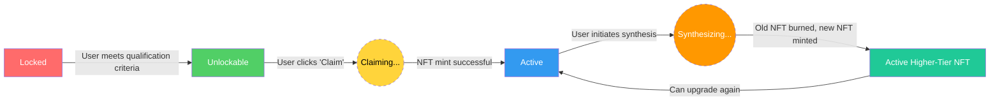

# AIW3 NFT Business Rules and Flows

<!-- Document Metadata -->
**Version:** v5.0.0
**Last Updated:** 2025-08-07
**Status:** Active
**Purpose:** To provide a definitive, implementation-aligned specification of all NFT-related business flows, rules, statuses, UI data requirements, and backend API endpoints. This document is strictly aligned with the `lastmemefi-api` backend models and routes to serve as a ground-truth reference for developers.

---

## 1. Core Business Rules: NFT Tiers and Benefits

### 1.1 NFT Tier Qualification Rules

Qualification for each NFT tier is based on a user's total trading volume (in USDT). Badge requirements have been simplified based on prototype analysis. These conditions are mandatory and checked in real-time.

**Business Rule**: Users can only hold ONE active NFT at a time. When upgrading, the previous NFT is burned and a new higher-tier NFT is minted.

| Level   | NFT Name            | Required Trading Volume (USDT) | Trading Fee Reduction | AI Agent Benefits         | Unlock Status Display     |
|:--------|:--------------------|:-------------------------------|:----------------------|:--------------------------|:--------------------------|
| 1       | Tech Chicken        | ≥ 100,000                      | 10%                   | 10 free uses per week     | "Unlocked" when qualified |
| 2       | Quant Ape           | ≥ 500,000                      | 20%                   | 20 free uses per week     | "Unlocked" when qualified |
| 3       | On-chain Hunter     | ≥ 5,000,000                    | 30%                   | 30 free uses per week     | "Unlocked" when qualified |
| 4       | Alpha Alchemist     | ≥ 10,000,000                   | 40%                   | 40 free uses per week     | "Unlocked" when qualified |
| 5       | Quantum Alchemist   | ≥ 50,000,000                   | 55%                   | 50 free uses per week     | "Unlocked" when qualified |
| Special | Trophy Breeder      | Top 3 in trading competition   | 25%                   | Special privileges        | Airdrop notification      |

### 1.2 Additional Business Rules from Prototypes

1. **Progress Tracking**: Users can see their progress toward the next tier with visual progress bars
2. **Activation Popup**: When users unlock a new tier, they see a "Trigger Activation Popup" (Prototype 5)
3. **Success Messaging**: After successful synthesis, users see confirmation with new NFT details (Prototype 2.4)
4. **Community Display**: Active NFTs are displayed in community profiles for social proof (Prototypes 6, 7)

---

## 2. NFT Lifecycle and Status

The NFT lifecycle involves three distinct types of states that must be clearly distinguished:

- **Business Logic States (`Locked`, `Unlockable`):** Represent a user's eligibility *before* an NFT is minted. These are calculated on-the-fly by `NFTService` and are not stored in the database.
- **Process/UI States (`Claiming`, `Synthesizing`):** Represent temporary processing states during user actions. These are UI indicators, not NFT statuses.
- **Database NFT Statuses (`active`, `burned`):** Represent the actual state of NFTs *after* they have been minted and recorded in the `UserNft` table.

### NFT Status Transition Diagram

### State Definitions

#### Business Logic States
| State        | Description                                                                                             | UI/User Action                                        |
|:-------------|:--------------------------------------------------------------------------------------------------------|:------------------------------------------------------|
| **Locked**     | User has not yet met the requirements for this NFT tier.                                               | UI shows the requirements to unlock.                  |
| **Unlockable** | User has met all requirements and can claim the NFT.                                                   | UI displays a prominent "Claim" button.               |

#### Process/UI States
| State        | Description                                                                                             | UI/User Action                                        |
|:-------------|:--------------------------------------------------------------------------------------------------------|:------------------------------------------------------|
| **Claiming**   | User has clicked "Claim", backend is processing the mint transaction.                                 | UI shows a pending or processing indicator.           |
| **Synthesizing** | User has initiated synthesis, backend is processing burn and mint transactions.                       | UI shows synthesis progress indicator.                |

#### Database NFT Statuses
| Status       | Description                                                                                             | UI/User Action                                        |
|:-------------|:--------------------------------------------------------------------------------------------------------|:------------------------------------------------------|
| **`active`**   | NFT has been successfully minted and is owned by the user.                                             | NFT is visible in the Personal Center.                |
| **`burned`**   | NFT was consumed during Synthesis to mint a higher-tier NFT.                                           | NFT is removed from active view.                      |

---

## 3. Technical Implementation References

The technical implementation details for the AIW3 NFT system have been moved to dedicated technical documentation for better separation of concerns:

### API & Frontend Integration
- **Document**: `/docs/technical/implementation/api-frontend/API-Frontend-Integration-Specification.md`
- **Contains**: Complete API endpoint specifications, frontend integration patterns, real-time events
- **Covers**: All 6 NFT-related endpoints, WebSocket events, UI component integration

### Detailed API Reference
- **Document**: `/docs/technical/implementation/api-frontend/AIW3-NFT-API-Reference.md`
- **Contains**: Comprehensive API documentation with examples and error handling
- **Covers**: Request/response schemas, authentication patterns, integration examples

### System Architecture
- **Document**: `/docs/technical/architecture/AIW3-NFT-System-Design.md`
- **Contains**: NFT state transition diagrams, system architecture, lifecycle management
- **Covers**: Technical state management, integration patterns, infrastructure topology

### Data Models
- **Document**: `/docs/technical/architecture/AIW3-NFT-Data-Model.md`
- **Contains**: Backend data models, database schemas, field specifications
- **Covers**: UserNft and NftDefinition models, tier definitions, data relationships

---

## 4. Business Process Summary

This business document focuses on the core business logic and rules. The key business processes are:

### 4.1 NFT Qualification Process
1. **Volume Tracking**: User trading volume is tracked in real-time
2. **Tier Assessment**: System determines which NFT tiers user qualifies for
3. **Status Computation**: Business logic states (Locked/Unlockable) are calculated
4. **User Notification**: UI displays qualification status and progress

### 4.2 NFT Claiming Process
1. **Eligibility Check**: User must meet volume requirements
2. **Single NFT Rule**: Users can only hold one active NFT at a time
3. **Minting Process**: Backend initiates NFT minting on Solana
4. **Status Update**: NFT becomes active upon successful minting

### 4.3 NFT Synthesis (Upgrade) Process
1. **Upgrade Eligibility**: User must qualify for higher tier
2. **Burn-and-Mint**: Old NFT is burned, new higher-tier NFT is minted
3. **Benefit Enhancement**: User receives improved trading fee reductions and AI agent benefits
4. **Continuous Progression**: Users can continue upgrading through all tiers

### 4.4 Community Display
1. **Social Proof**: Active NFTs are displayed in community profiles
2. **Achievement Showcase**: Users can showcase their NFT achievements and badges
3. **Public Visibility**: Community profiles are publicly accessible
4. **Engagement Driver**: NFT ownership encourages community participation

---

## 5. Business Rules Enforcement

### 5.1 Core Constraints
- **One Active NFT**: Users can only hold one active NFT at any time
- **Volume-Based Qualification**: All tier access is based on trading volume thresholds
- **Irreversible Upgrades**: NFT synthesis permanently burns the lower-tier NFT
- **Real-time Assessment**: Qualification status is checked in real-time

### 5.2 Business Logic States
- **Locked**: User has not met volume requirements
- **Unlockable**: User meets requirements and can claim NFT
- **Process States**: Claiming and Synthesizing are temporary UI indicators
- **Database States**: Only Active and Burned NFTs are persisted

### 5.3 Benefits and Incentives
- **Trading Fee Reduction**: Ranges from 10% to 55% based on NFT tier
- **AI Agent Access**: Free usage allowances increase with tier level
- **Social Status**: Higher-tier NFTs provide greater community recognition
- **Exclusive Features**: Special privileges for Trophy Breeder tier

For detailed technical implementation, API specifications, and integration patterns, refer to the technical documentation listed in Section 3.

---

*This completes the business rules and flows documentation. All technical implementation details, API specifications, data models, and integration patterns have been moved to the appropriate technical documentation for better separation of concerns and maintainability.*
