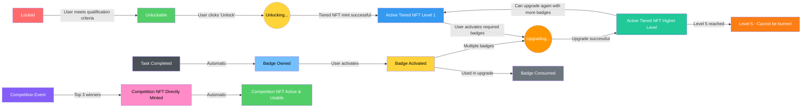

# AIW3 NFT Business Rules and Flows

<!-- Document Metadata -->
**Version:** v7.0.0  
**Last Updated:** 2025-08-07  
**Status:** Active  
**Purpose:** To provide a definitive, implementation-aligned specification of all NFT-related business flows, rules, statuses, UI data requirements, and backend API endpoints. This document is strictly aligned with the `lastmemefi-api` backend models and routes to serve as a ground-truth reference for developers.

---

## 1. Core Business Rules: AIW3 Equity NFT System

### 1.1 NFT Types and Classification

AIW3's NFT system consists of **Equity NFTs** with two distinct subtypes:

1. **Tiered NFT**: A single progression-based NFT that users upgrade through levels
2. **Competition NFT**: Multiple NFTs earned through trading competitions and competition events

**Business Rule**: Users can hold **one active Tiered NFT** and **multiple Competition NFTs** simultaneously.

### 1.2 Tiered NFT Qualification and Upgrade Rules

**Tiered NFT Requirements**:

**First NFT Unlock (Level 1)**: Only requires **trading volume** (≥ 100,000 USDT) - no badges needed

**Sequential Progression Rule**: Users MUST start with Level 1 NFT regardless of their trading volume. Even if a user has volume for Level 2+ NFTs, they cannot skip Level 1 and must progress sequentially through badge collection.

**NFT Upgrades (Level 2-5)**: Each upgrade requires **THREE** conditions:
1. **Trading Volume** - Meet the volume threshold for target level
2. **Badge Collection** - Complete tasks and activate required badges  
3. **NFT Burn** - Current lower-level NFT must be burned before new NFT is minted

| Level   | Tiered NFT Name     | Required Volume (USDT) | Required Badges | Trading Fee Reduction | Additional Rights                    |
|:--------|:--------------------|:----------------------|:----------------|:----------------------|:-------------------------------------|
| 1       | Tech Chicken        | ≥ 100,000             | 0               | 10%                   | 10 AI agent uses per week |
| 2       | Quant Ape           | ≥ 500,000             | 2 badges        | 20%                   | 20 AI agent uses per week + Activate Exclusive Background |
| 3       | On-chain Hunter     | ≥ 5,000,000           | 4 badges        | 30%                   | 30 AI agent uses per week + Strategy Priority + Activate Exclusive Background |
| 4       | Alpha Alchemist     | ≥ 10,000,000          | 5 badges        | 40%                   | 40 AI agent uses per week + Unlock Exclusive Strategy Recommendation Service + Activate Exclusive Background |
| 5       | Quantum Alchemist   | ≥ 50,000,000          | 6 badges        | 55%                   | 55 AI agent uses per week |

**Competition NFTs:**
| Type            | Name            | Source                         | Trading Fee Reduction | Additional Rights         | Distribution Method       |
|:----------------|:----------------|:-------------------------------|:----------------------|:--------------------------|:--------------------------|
| Competition     | Trophy Breeder  | Top 3 in trading competition   | 25%                   | Avatar Crown or Community Top Pin | Direct mint to wallet     |

**Competition NFT Rules:**
- **Multiple Holdings**: Each top 3 user can receive multiple Competition NFTs
- **Direct Minting**: NFTs are minted directly into winners' wallets automatically
- **Immediate Usage**: No unlocking or activation process required - ready to use instantly
- **Independent Process**: Competition NFT acquisition is completely separate from Tiered NFT upgrades
- **Non-Cumulative**: When user has multiple Competition NFTs, only the one with highest Trading Fee Reduction is used

**Benefit Calculation System:**
- **Trading Fee Reduction**: Takes the MAXIMUM benefit between Tiered NFT and best Competition NFT (not cumulative)
- **Competition NFT Selection**: Only the Competition NFT with highest Trading Fee Reduction is considered
- **Additional Rights**: ACCUMULATED from Tiered NFT and the selected best Competition NFT

**Example Benefit Calculation:**
If a user has Level 2 Tiered NFT (20% fee reduction) + multiple Competition NFTs (25%, 20%, 15% fee reductions):
- **Selected Competition NFT**: The 25% fee reduction Competition NFT (highest among all Competition NFTs)
- **Final Trading Fee Reduction**: 25% (max of Tiered 20% vs best Competition 25%)
- **Final Additional Rights**: Level 2 Tiered rights + best Competition NFT privileges (accumulated)
  - 20 AI agent uses per week (from Tiered NFT)
  - Activate Exclusive Background (from Tiered NFT Level 2)  
  - Avatar Crown or Community Top Pin (from best Competition NFT only)

### 1.3 Critical Business Logic: Badge-Based Upgrade System

**🔑 Key Distinction:**

- **"Unlocking"** = First Tiered NFT acquisition
  - Applies when user has NO active Tiered NFT
  - Only for Tech Chicken (Level 1) when user reaches 100,000 USDT volume
  - Process: User clicks "Unlock" → Tiered NFT is minted → User has first active Tiered NFT

- **"Upgrade"** = Tiered NFT level progression through badge activation
  - Users activate multiple badges to upgrade their Tiered NFT to higher levels
  - Requires specific number of activated badges per level (2, 4, 5, 6 for levels 2-5)
  - Process: User activates required badges → Upgrade initiated → Higher-level Tiered NFT replaces current one
  - Used badges become consumed and cannot be reactivated

**Business Rule**: Users progress their single Tiered NFT through levels using task-earned badges, while also collecting Competition NFTs independently

### 1.4 Badge System and Task Relationships

**Badge Lifecycle**: Owned → Activated → Consumed

**Task-Badge-NFT Relationship**:
- **Task ↔ Badge**: One-to-one relationship (each task completion awards one specific badge)
- **Tiered NFT ↔ Badge**: One-to-many relationship (multiple badges required for each NFT upgrade)

**Badge Status Definitions**:
| Status       | Description                                                                | User Action Available              |
|:-------------|:---------------------------------------------------------------------------|:-----------------------------------|
| **Owned**    | Badge automatically obtained when user completes corresponding task       | Can activate badge                 |
| **Activated** | Badge is ready for use in Tiered NFT upgrade process                      | Can use in upgrade, cannot revert |
| **Consumed** | Badge was used in successful Tiered NFT upgrade                           | No actions available               |

**Upgrade Requirements by Level**:
| From Level | To Level | Required Badges | Badge Sources                    | Cumulative Badges Consumed |
|:-----------|:---------|:---------------|:---------------------------------|:---------------------------|
| 1          | 2        | 2 badges       | Complete 2 designated tasks      | 2 total                    |
| 2          | 3        | 2 more badges  | Complete 2 additional tasks      | 4 total                    |
| 3          | 4        | 1 more badge   | Complete 1 additional task       | 5 total                    |
| 4          | 5        | 1 more badge   | Complete 1 additional task       | 6 total                    |

**Important**: Once badges are used for an upgrade, they are permanently consumed and cannot be reused for future upgrades. Users at higher level NFTs have already consumed all badges from previous upgrades.

### 1.5 Additional Business Rules from Prototypes

1. **Progress Tracking**: Users can see their progress toward the next tier with visual progress bars
2. **Level 1 NFT Activation**: When users unlock their first Level 1 NFT, they see a "Trigger Activation Popup" (Prototype 5)
3. **Badge Activation**: After users complete designated tasks, they must manually activate owned badges before using them for upgrades
4. **Success Messaging**: After successful upgrade, users see confirmation with new NFT details
5. **Community Display**: Active NFTs are displayed in community profiles for social proof (Prototypes 6, 7)
6. **Badge Management**: Users can view owned badges, activate them, and track consumption status

---

## 2. NFT Lifecycle and Status

The NFT and Badge lifecycle involves multiple distinct types of states that must be clearly distinguished:

- **Level 1 Tiered NFT States (`Locked`, `Unlockable`, `Active`):** Represent Level 1 NFT status for a specific user. Locked/Unlockable are calculated on-the-fly based on trading volume, while Active is stored in the database once minted.
- **Process/UI States (`Unlocking`, `Upgrading`):** Represent temporary processing states during user actions. These are UI indicators, not NFT statuses.
- **Higher Level Tiered NFT Statuses:**
  - **Level 2-4 NFTs (`active`, `burned`):** Can be active (owned) or burned (destroyed during upgrade)
  - **Level 5 NFT (`active` only):** Can only be active since it's the highest tier and cannot be burned
- **Competition NFT Status (`active`):** Competition NFTs only have active status once minted.

### NFT Status Transition Diagram

### State Definitions

#### Level 1 Tiered NFT States
| State        | Description                                                                                             | UI/User Action                                        |
|:-------------|:--------------------------------------------------------------------------------------------------------|:------------------------------------------------------|
| **Locked**     | Level 1 Tiered NFT is locked for user (trading volume < 100,000 USDT).                                               | UI shows the volume requirements to unlock.                  |
| **Unlockable** | Level 1 Tiered NFT is unlockable for user (trading volume ≥ 100,000 USDT).                                                   | UI displays a prominent "Unlock" button.               |
| **Active** | Level 1 Tiered NFT has been minted and is owned by the user.                                                   | NFT is visible in Personal Center, can be upgraded with badges.               |

#### Process/UI States
| State        | Description                                                                                             | UI/User Action                                        |
|:-------------|:--------------------------------------------------------------------------------------------------------|:------------------------------------------------------|
| **Unlocking**   | User has clicked "Unlock" for their FIRST Tiered NFT (Tech Chicken only), backend is processing the mint transaction. | UI shows "Unlocking..." with processing indicator.    |
| **Upgrading** | User has activated required badges and clicked "Upgrade", backend is processing the Tiered NFT level upgrade. | UI shows "Upgrading..." with progress indicator.  |

#### Level 2-5 Tiered NFT Statuses
| Status       | Description                                                                                             | UI/User Action                                        |
|:-------------|:--------------------------------------------------------------------------------------------------------|:------------------------------------------------------|
| **`active`**   | Tiered NFT (Level 2-5) has been minted and is owned by the user.                                             | NFT is visible in the Personal Center. Levels 2-4 can be upgraded, Level 5 is final.                |
| **`burned`**   | Tiered NFT (Level 2-4 only) was destroyed during upgrade to higher level.                                           | NFT is removed from active view but preserved in transaction history.                      |

#### Competition NFT Status
| Status       | Description                                                                                             | UI/User Action                                        |
|:-------------|:--------------------------------------------------------------------------------------------------------|:------------------------------------------------------|
| **`active`**   | Competition NFT has been minted and is owned by the user.                                             | NFT is visible in the Personal Center.                |

#### Badge Statuses
**Badge States (`owned`, `activated`, `consumed`):** Represent the status of badges throughout their lifecycle from task completion to NFT upgrade consumption.

| Status       | Description                                                                                             | UI/User Action                                        |
|:-------------|:--------------------------------------------------------------------------------------------------------|:------------------------------------------------------|
| **`owned`**   | Badge was automatically awarded when user completed corresponding task.                                             | Badge is visible in badge collection, can be activated.                |
| **`activated`**   | Badge has been activated by user and is ready for use in Tiered NFT upgrade.                                           | Badge shows as activated, can be used in upgrade process.                      |
| **`consumed`**   | Badge was used in successful Tiered NFT upgrade and is no longer available.                                           | Badge shows as consumed, cannot be reactivated or reused.                      |

---

## 3. Technical Implementation References

The technical implementation details for the AIW3 NFT system have been moved to dedicated technical documentation for better separation of concerns:

### API & Frontend Integration
- **Document**: `/docs/technical/implementation/api-frontend/API-Frontend-Integration-Specification.md`
- **Contains**: Complete API endpoint specifications, frontend integration patterns, real-time events
- **Covers**: All 6 NFT-related endpoints, WebSocket events, UI component integration

### Detailed API Reference
- **Document**: `/docs/technical/implementation/api-frontend/AIW3-NFT-API-Reference.md`
- **Contains**: Comprehensive API documentation with examples and error handling
- **Covers**: Request/response schemas, authentication patterns, integration examples

### System Architecture
- **Document**: `/docs/technical/architecture/AIW3-NFT-System-Design.md`
- **Contains**: NFT state transition diagrams, system architecture, lifecycle management
- **Covers**: Technical state management, integration patterns, infrastructure topology

### Data Models
- **Document**: `/docs/technical/architecture/AIW3-NFT-Data-Model.md`
- **Contains**: Backend data models, database schemas, field specifications
- **Covers**: UserNft and NftDefinition models, tier definitions, data relationships

---

## 4. Business Process Summary

This business document focuses on the core business logic and rules. The key business processes are:

### 4.1 NFT Qualification Process
1. **Volume Tracking**: User trading volume is tracked in real-time
2. **Tier Assessment**: System determines which NFT tiers user qualifies for
3. **User Notification**: UI displays qualification status and progress

### 4.2 Level 1 Tiered NFT Unlocking Process
1. **Eligibility Check**: User must meet volume requirements (≥ 100,000 USDT)
2. **User Initiation**: User clicks "Unlock" button in UI to request Level 1 Tiered NFT
3. **Minting Process**: Backend processes the unlock request and initiates NFT minting on Solana
4. **Status Update**: Level 1 NFT becomes active upon successful minting

### 4.3 Tiered NFT Upgrade Process
1. **Badge Activation**: User manually activates owned badges to prepare for upgrade  
2. **Volume Verification**: System verifies user's trading volume meets the target level requirement
3. **Triple Eligibility Check**: System verifies user can request NFT upgrade by meeting ALL three conditions:
   - Trading volume threshold for target level
   - Required number of activated badges (not consumed)
   - **Either**: Active lower-level Tiered NFT (normal upgrade path) **OR** Burned lower-level Tiered NFT with activated badges (retry after failed mint)
4. **User Initiation**: User clicks "Upgrade" button to request the upgrade process
5. **Burn Process (if needed)**: 
   - **Normal Path**: User connects wallet and signs transaction to burn their active lower-level NFT
   - **Retry Path**: Skip burn steps since NFT is already burned from previous attempt
6. **Backend Detection**: AIW3 backend detects the burn transaction (existing or new)
7. **NFT Mint**: AIW3 backend mints new higher-level NFT to user's wallet
8. **Badge Consumption**: All activated badges are consumed ONLY after successful NFT minting (not after burning, enabling retry on mint failure)
9. **Benefit Enhancement**: Successful upgrade grants improved trading fee reductions and additional rights
10. **Level Progression**: Users can upgrade from Level 1 to Level 5, with Level 5 being the final tier that cannot be burned

### 4.4 Competition NFT Distribution Process
1. **Automatic Eligibility**: Top 3 users in trading competitions automatically qualify
2. **Direct Minting**: Competition NFTs are minted directly to winners' wallets
3. **Immediate Activation**: NFTs are active and usable immediately upon minting
4. **Multiple Awards**: Users can receive multiple Competition NFTs from different competitions
5. **No Prerequisites**: No volume requirements, badges, or unlocking process needed

### 4.5 Community Display
1. **Social Proof**: Active NFTs are displayed in community profiles
2. **Achievement Showcase**: Users can showcase their NFT achievements and badges
3. **Public Visibility**: Community profiles are publicly accessible
4. **Engagement Driver**: NFT ownership encourages community participation

---

## 5. Business Rules Enforcement

### 5.1 Core Constraints
- **Tiered NFT Limitation**: Users can hold only one active Tiered NFT at any time
- **Competition NFT Freedom**: Users can hold multiple Competition NFTs simultaneously
- **Volume-Based Initial Access**: First Tiered NFT access is based on trading volume thresholds
- **Triple Upgrade Requirements**: Tiered NFT upgrades require volume + badges + NFT burn
- **Irreversible Burn Process**: Lower-level NFT is permanently destroyed during upgrade (Levels 1-4 only)
- **Max Level Protection**: Level 5 (Quantum Alchemist) NFT cannot be burned - it's the highest achievable tier
- **Irreversible Badge Consumption**: Activated badges are consumed permanently during upgrades
- **Real-time Assessment**: Qualification status is checked in real-time

### 5.2 Benefits and Incentives
- **Trading Fee Reduction**: System uses the MAXIMUM reduction between Tiered NFT (10%-55%) and Competition NFT (25%)
- **Additional Rights**: ACCUMULATED from both NFT types - users receive ALL rights from Tiered NFT AND Competition NFT
- **Social Status**: Both NFT types provide community recognition, with Tiered NFTs showing progression
- **Rights Stacking**: Competition NFT privileges stack with Tiered NFT privileges for enhanced benefits
- **Independent Processes**: Tiered NFT upgrades and Competition NFT acquisition operate separately

For detailed technical implementation, API specifications, and integration patterns, refer to the technical documentation listed in Section 3.

---

*This completes the business rules and flows documentation. All technical implementation details, API specifications, data models, and integration patterns have been moved to the appropriate technical documentation for better separation of concerns and maintainability.*
