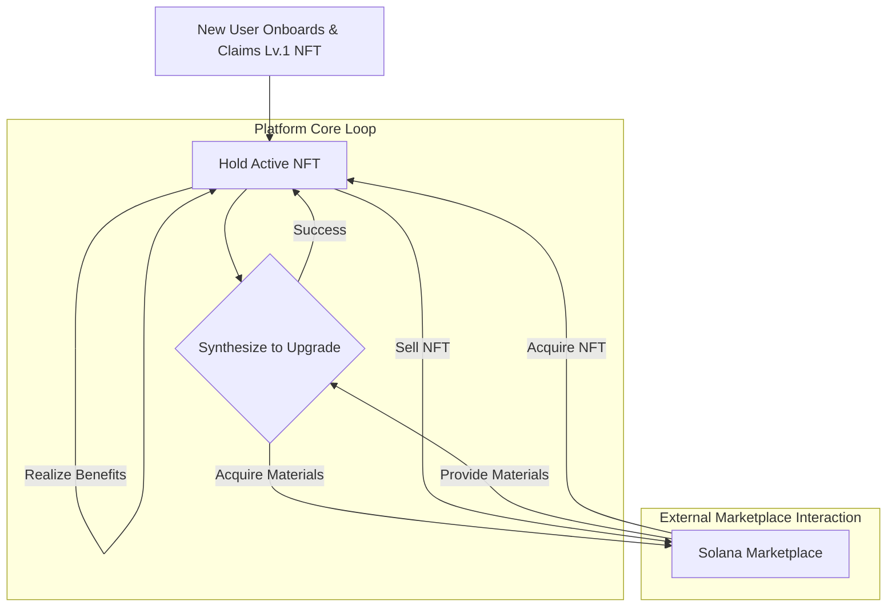
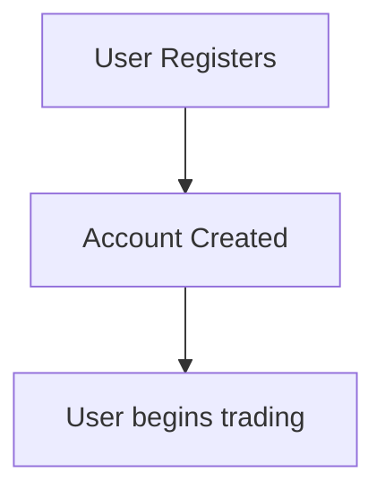
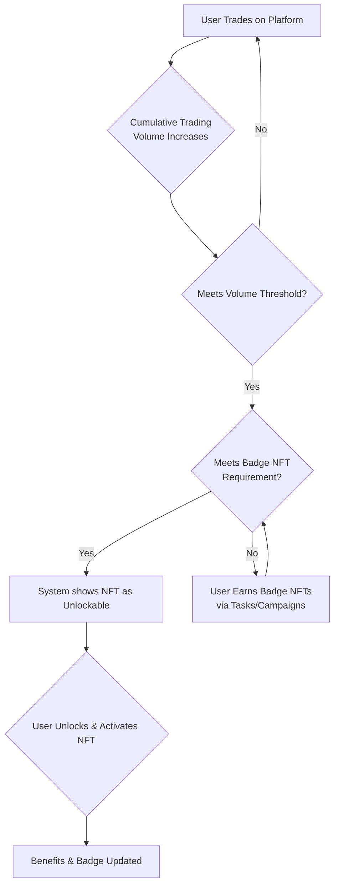
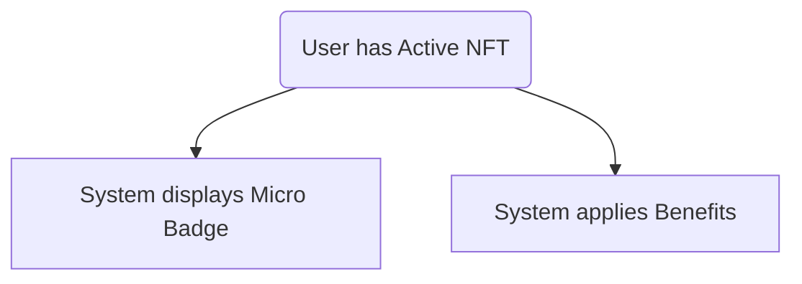
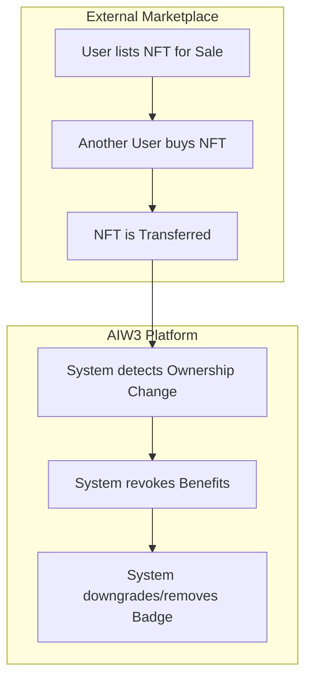
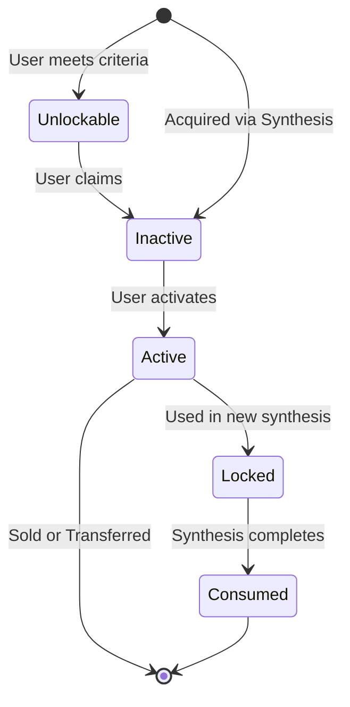

# AIW3 Equity NFT on Solana - Business Process and Rules Manual

This document details the business processes and rules for the AIW3 **Equity NFT** system on Solana, which forms the basis of the platform's VIP level plan. The information is extracted from the project prototypes.

## 1. Overview of Equity NFTs

AIW3 Equity NFTs are a series of NFTs with different levels that serve as a user's identity credential on the AIW3 platform. Holding higher-level NFTs grants users more platform benefits and privileges, forming the core of the AIW3 VIP level plan. While each token is a unique, ownable asset on the blockchain (non-fungible), all tokens of the same level grant identical rights and benefits, making their utility fungible within that tier.

## 2. NFT Types

The AIW3 platform features two distinct categories of NFTs. It is crucial to understand their differences in purpose, acquisition, and utility.

### 2.1 Equity NFTs (Primary Progression)
This is the main category of NFTs on the platform, representing a user's level, status, and ongoing benefits.
-   **Purpose:** To serve as a user's primary identity and status credential, unlocking progressively greater platform-wide benefits.
-   **Acquisition:** Equity NFTs are **unlocked** when a user meets specific criteria, primarily based on their cumulative trading volume on the platform. For higher levels, users must also acquire and bind a number of "Badge NFTs" earned through platform tasks.
-   **Function:** They form a clear progression ladder. Holding a higher-level Equity NFT grants significant advantages like trading fee discounts, airdrop bonuses, and enhanced community visibility via a "Micro Badge". The entire lifecycle of claiming, synthesizing, and activating revolves around this type.
-   **Minting Authority:** All Equity NFTs are created (minted) exclusively by the AIW3 platform's official programs when a user meets the unlock criteria. While these NFTs can be freely traded between users on external marketplaces *after* they are unlocked, the AIW3 system is the sole source of their creation.

### 2.2 Special NFTs (Achievement-Based)
This category includes unique NFTs awarded for specific, one-time achievements. They are separate from the main progression ladder.
-   **Purpose:** To reward users for specific accomplishments, such as winning a competition or participating in a special event.
-   **Acquisition:** Typically distributed via **Airdrop** to eligible users. They are not acquired through synthesis.
-   **Function:** Their benefits are specific to the NFT itself and do not necessarily align with the tiered benefits of Equity NFTs. They serve as a trophy or badge of honor for a particular achievement.
-   **Example:** The **Breeder Reward NFT**, which is airdropped to the top winners of trading competitions.

## 3. Equity NFT Lifecycle and User Journeys

This section outlines the primary end-to-end user journeys within the AIW3 NFT ecosystem.

### 3.1 New User Onboarding
This process describes how a new user joins the platform. Acquiring an Equity NFT is a subsequent step that requires meeting platform criteria.

1.  **[User] Registration:** A user creates an account on the AIW3 platform.
2.  **[System] Outcome:** The user has a standard account and can begin using platform features like trading. They do not hold any Equity NFT at this stage. The journey to acquire their first NFT begins when they start trading.

### 3.2 NFT Level Progression via Trading Volume
This is the core process for a user to upgrade their status on the platform by meeting trading volume and other criteria.

1.  **[User] Trading Activity:** The **[User]** engages in trading on the AIW3 platform. The **[System]** tracks their cumulative trading volume.
2.  **[System] Threshold Check:** Once the user's volume reaches the threshold for the next NFT level (e.g., ≥ 100,000 USDT for Lv.1), the **[System]** checks for any other requirements.
3.  **[User] Fulfilling Additional Requirements:** For Lv.2 and above, the **[User]** must also earn and bind a specific number of "Badge NFTs" by completing platform tasks or participating in campaigns.
4.  **[User & System] Unlocking and Activation:** When all criteria are met, the **[System]** makes the corresponding Equity NFT available to the user as "Unlockable". The **[User]** must then perform an action to unlock and activate the NFT.
5.  **[System] Outcome:** Upon activation, the **[System]** grants the user the new tier's benefits (e.g., fee discounts) and updates their public "Micro Badge".

### 3.3 Community Status and Benefit Realization
This process is ongoing and demonstrates the value of holding an active NFT.

1.  **[System] Public Display:** The **[System]** continuously displays the user's active NFT level as a "Micro Badge" on their profile, mini-homepage, and next to their name in community discussions, signaling their status to others.
2.  **[System] Benefit Application:** The **[System]** automatically applies platform benefits, such as trading fee discounts or airdrop bonuses, to the user's account based on their active NFT's level.

### 3.4 Exiting or Downgrading (Selling NFTs)
This process describes how a user can liquidate their NFT assets.

1.  **[User & External System] Listing on Marketplace:** The **[User]** lists their NFT (e.g., a Lv.4 "Master" NFT) for sale on an **[External System]** (a Solana marketplace).
2.  **[External System] Sale:** Another user purchases the NFT on the marketplace.
3.  **[System & External System] Outcome:** The NFT is transferred out of the original user's wallet by the **[External System]**. The **[System]** detects this change, revokes all associated benefits, and automatically downgrades the user's public "Micro Badge" to the next-highest NFT they hold (or removes it).

## 4. Equity NFT Levels, Benefits, and Upgrade Conditions

There are 5 levels of Equity NFTs that users can unlock through platform activity, plus a special "Trophy Breeder" NFT. Each level has specific upgrade conditions and provides unique benefits.

| Level | Name              | Upgrade Conditions                                                              | Tier Benefits                                           |
|-------|-------------------|---------------------------------------------------------------------------------|---------------------------------------------------------|
| 1     | Tech Chicken      | Total transaction volume ≥ 100,000 USDT                                         | 10% reduction in handling fees, 10 free uses of AIagent per week |
| 2     | Quant Ape         | Total transaction volume ≥ 500,000 USDT, bind two designated badge-type NFTs      | 20% reduction in handling fees, 20 free uses of AIagent per week |
| 3     | On-chain Hunter   | Total transaction volume ≥ 5,000,000 USDT, bind four designated badge-type NFTs   | 30% reduction in transaction fees, 30 free uses of AIagent per week |
| 4     | Alpha Alchemist   | Total transaction volume ≥ 10,000,000 USDT, binding to six designated badge-type NFTs | 40% reduction in transaction fees, 40 free uses of AIagent per week |
| 5     | Quantum Alchemist | Total transaction volume ≥ 50,000,000 USDT, bound to eight designated badge-type NFTs | 55% reduction in transaction fees, 50 free uses of AIagent per week |

### Special Tier
- **Trophy Breeder:** This is a distinct NFT, not part of the main progression ladder. It is airdropped to the top three participants in trading competitions and provides a 25% reduction in handling fees.

### Acquisition Constraints
- **Trading Volume:** This is the primary requirement for unlocking higher NFT tiers. It is cumulative.
- **Badge NFTs:** For Lv.2 and above, users must also acquire and "bind" a specified number of designated Badge NFTs. These are earned by completing platform tasks and participating in official campaigns.

## 5. NFT Status Lifecycle

An NFT can exist in several states throughout its lifecycle on the platform.

-   **Unlockable:** This is a pre-mint state where a user has met the criteria to receive an NFT (e.g., by registering) but has not yet claimed it. The NFT does not exist on the blockchain at this point. The user must perform an action to mint it.

-   **Inactive:** Once an NFT is minted to a user's wallet (either by claiming an unlockable one or through synthesis), it may start in an "Inactive" state. In this state, the user owns the NFT, but the associated benefits (like fee discounts) are not yet applied.

-   **Active:** The user must explicitly activate an "Inactive" NFT. Once active, the NFT grants all its associated benefits and privileges. The user's public-facing Micro Badge is updated to reflect this active NFT if it's their highest level.

## 6. Equity NFT Operations

This section details the specific actions users can take regarding their NFTs, outlining the conditions and outcomes for each operation.

### 6.1 Claiming an NFT

-   **Description:** A **user-initiated** action to mint an "Unlockable" NFT to their wallet. This applies to the initial Lv.1 NFT for new users, and can also apply to higher-level NFTs that are awarded or airdropped by the system.
-   **Pre-condition:**
    -   User is registered on the platform.
    -   The target NFT is in the **Unlockable** state for the user.
-   **Post-condition:**
    -   A new NFT is minted and sent to the user's connected wallet.
    -   The NFT's status becomes **Inactive**.
-   **Rules/Constraints:**
    -   This action can typically only be performed once per user for the Lv.1 NFT.

### 6.2 Activating an NFT

-   **Description:** A **user-initiated** action to enable the benefits of an owned NFT.
-   **Pre-condition:**
    -   User owns the NFT.
    -   The NFT is in the **Inactive** state.
-   **Post-condition:**
    -   The NFT's status changes to **Active**.
    -   The user gains all associated benefits (e.g., fee discounts).
    -   The user's public Micro Badge is updated if this NFT is their highest level.
-   **Rules/Constraints:**
    -   An NFT must be activated for its benefits and public badge to apply.

### 6.3 Unlocking an Equity NFT

-   **Description:** A **user-initiated** action to claim and activate an Equity NFT after meeting the required criteria.
-   **Pre-condition:**
    -   User's cumulative trading volume has met the threshold for the target NFT level.
    -   User has acquired and bound the required number of Badge NFTs (for Lv.2+).
    -   The target NFT is in the **Unlockable** state for the user.
-   **Post-condition:**
    -   A new Equity NFT is minted to the user's wallet (or its state is updated if they already hold a lower level).
    -   The NFT's status becomes **Active**.
    -   The user gains all associated benefits.
-   **Rules/Constraints:**
    -   Progression is linear; a user must unlock levels in order.
    -   The unlock criteria (volume, badges) are defined by the system and displayed to the user.

### 6.4 Selling/Transferring an NFT

-   **Description:** A **user-initiated** action to trade an NFT on an **External System** (a marketplace). The AIW3 **System** reacts to the ownership change.
-   **Pre-condition:**
    -   User owns the NFT.
    -   The NFT is in the **Active** or **Inactive** state (i.e., not Locked).
-   **Post-condition:**
    -   The NFT is removed from the user's wallet and platform account.
    -   The NFT effectively leaves the lifecycle from the user's perspective.
-   **Rules/Constraints:**
    -   **External Marketplace Rules:** All trading activities are subject to the terms, conditions, and fees of the external NFT marketplace where the transaction occurs.
    -   **Loss of Benefits:** When a user sells or transfers an NFT, they lose all associated platform benefits if they do not hold another active NFT that provides similar or lesser benefits.
    -   **Automatic Badge Updates:** If a user sells their highest-level NFT, their public-facing Micro Badge will automatically downgrade to reflect the next-highest level NFT they currently hold. If no other NFTs are held, the badge may be removed or revert to a default state.

## 7. User Interface and Experience

This section describes how users interact with their NFTs on the platform.

### Personal Center

The Personal Center is the main hub for a user to manage their **Equity NFTs**. From here, they can:
-   View their entire collection of owned Equity NFTs.
-   See which NFTs are "Unlockable" and claim them.
-   Initiate the synthesis process to upgrade their NFTs.

### Activation Process

-   After acquiring a new, higher-level **Equity NFT** (either through synthesis or other means), it appears in an inactive state.
-   A popup will prompt the user to "Activate" the NFT.
-   Activating the NFT enables its associated benefits and updates the user's public-facing badge.

### Profile and Community Display

A user's status is visibly represented throughout the platform to signify their achievements and level.
-   **Micro Badge:** The user's highest-level active NFT is displayed as a "Micro Badge" next to their username and on their avatar.
-   **Personal Homepage:** The badge is prominently displayed on the user's personal homepage.
-   **Community Mini-Homepage:** The badge is also visible on the user's "mini-homepage" card within community sections, making their status visible to other users.

### System Notifications

Users are kept informed of NFT-related events through system messages. These include notifications for:
-   Successful or failed synthesis attempts.
-   Acquisition of a new NFT.
-   Prompts to activate a newly acquired NFT.

### UI and Benefit Constraints
- **Active Equity NFT Determines Benefits:** A user only receives the benefits (e.g., fee discounts, airdrop bonuses) associated with their currently *active* **Equity NFT**.
- **Highest Level Badge:** The Micro Badge displayed publicly on a user's profile always corresponds to their highest-level *active* **Equity NFT**. If a user holds multiple NFTs (e.g., Lv.4 and Lv.2), only the Lv.4 badge will be shown.

## 8. Terminologies

This section defines the core concepts used throughout this document.

-   **NFT (Non-Fungible Token):** A unique digital certificate of ownership for an asset, stored on a blockchain.
    -   **Analogy:** Think of it as a digital deed or a one-of-a-kind collectible card. While anyone can have a copy of a digital image, the NFT is the proof of owning the original. It's like having the artist's signature on a print, certifying it as authentic.

-   **Equity NFTs:** The official name for the platform's primary NFTs that represent user status and benefits. They are organized into different **Levels** (or **Tiers**).
    -   **Synonyms:** You may see these referred to as **Tiered NFTs**, **Tier NFTs**, or **Level NFTs** in different contexts. "Equity NFT" is the canonical term for the main progression NFTs.
    -   **Progression Model:** The primary way to acquire higher-level Equity NFTs is by meeting cumulative **trading volume** thresholds and binding a required number of **Badge NFTs**.
    -   **Utility:** While each token is a unique non-fungible asset on the blockchain, its utility is fungible within its tier. This means any Lv.2 NFT provides the exact same benefits as any other Lv.2 NFT.
    -   **Analogy:** This is similar to a customer loyalty program (e.g., Bronze, Silver, Gold status) or leveling up a character in a game. Each new tier provides enhanced status and perks, with the top tier granting equity-like benefits. Your "Gold" membership card is unique to you, but it gives you the same benefits as every other "Gold" member.

-   **Solana:** A high-performance blockchain network on which the AIW3 NFTs are built, recorded, and traded.
    -   **Analogy:** If an NFT is a valuable package, Solana is the global, super-fast, and secure courier service that handles its delivery and tracks its ownership history transparently.

-   **Unlockable State:** A state where a user has met the conditions to acquire an NFT but has not yet claimed or minted it. This requires a user action to complete the acquisition.
    -   **Analogy:** This is like having a coupon you are eligible for but haven't redeemed yet. You need to take the step to present the coupon to get the item.

-   **Micro Badge:** A small, icon-like representation of a user's highest-level NFT, displayed on their profile and in community spaces to signify their status.
    -   **Analogy:** This is like a digital lapel pin or a rank insignia on a uniform, quickly communicating a person's level or achievements to others.

-   **Special NFTs (e.g., Breeder Reward NFT):** These are distinct NFTs awarded for specific achievements, such as winning a trading competition. They are acquired through airdrops, not synthesis, and may have their own unique benefits. They are separate from the main Equity NFT progression ladder.

