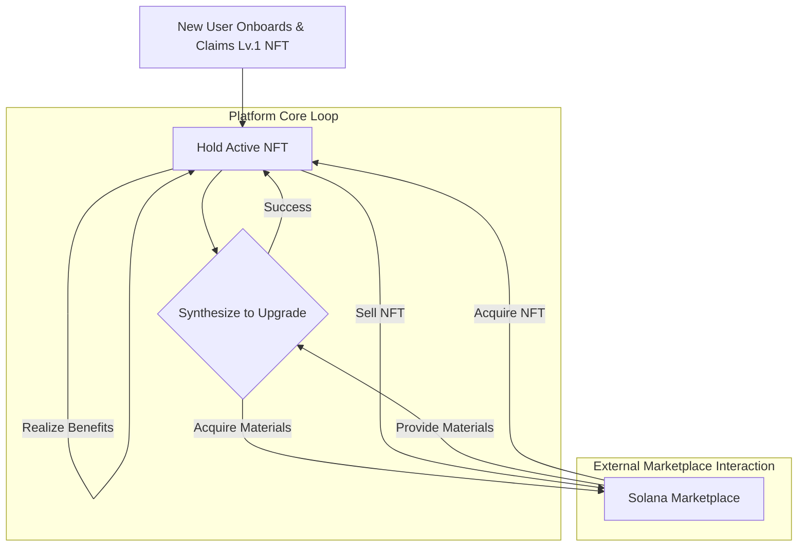
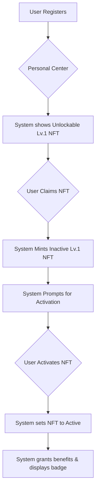
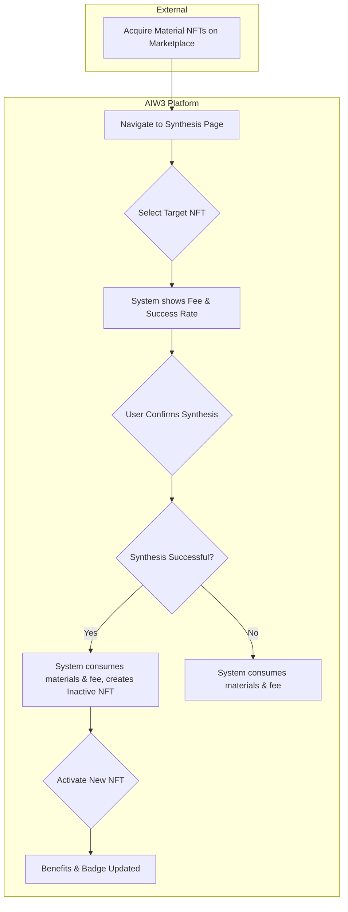
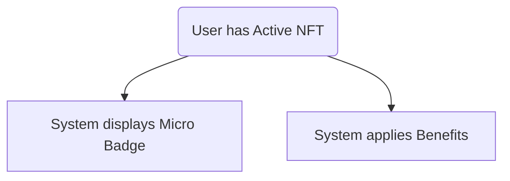
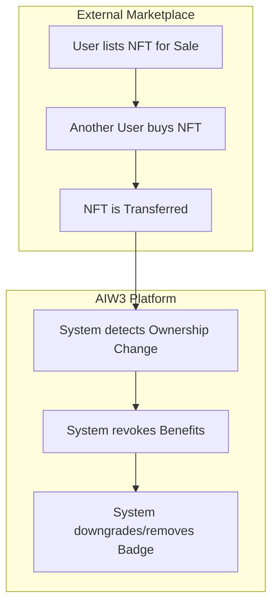
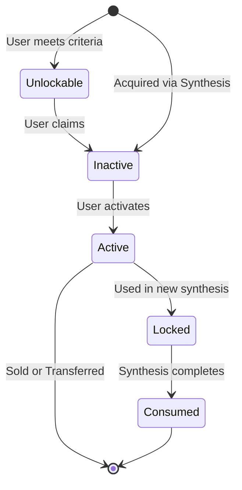

# AIW3 NFT on Solana - Business Process and Rules Manual

This document details the business processes and rules for the AIW3 NFT on Solana project, as extracted from the project prototypes.

## 1. Overview of Tiered NFTs

AIW3 Tiered NFTs are a series of NFTs with different levels that serve as a user's identity credential on the AIW3 platform. Holding higher-level NFTs grants users more platform benefits and privileges. While each token is a unique, ownable asset on the blockchain (non-fungible), all tokens of the same level grant identical rights and benefits, making their utility fungible within that tier.

## 2. Core Business Processes

This section outlines the primary end-to-end user journeys within the AIW3 NFT ecosystem.

### 1. New User Onboarding and First NFT Acquisition
This process describes how a new user joins the platform and gets their initial identity credential.

1.  **[User] Registration:** A user creates an account on the AIW3 platform.
2.  **[User] Claiming:** The user navigates to their Personal Center, where the **[System]** shows a Lv.1 "Newbie" NFT as "Unlockable". The user executes the "Claim" action.
3.  **[System & User] Activation:** The newly claimed Lv.1 NFT appears in the user's collection in an "Inactive" state. The **[System]** shows a popup prompting the user to activate it. The **[User]** confirms, and the NFT becomes "Active".
4.  **[System] Outcome:** The user now has an active Lv.1 NFT. The **[System]** grants basic platform benefits and displays a "Micro Badge" on the user's profile.

### 2. NFT Level Progression via Synthesis
This is the core process for a user to upgrade their status on the platform.

1.  **[User & External System] Material Acquisition:** To synthesize a Lv.2 NFT, the **[User]** needs 3 Lv.1 NFTs. They already have one from onboarding. The **[User]** must acquire the remaining two by purchasing them from other users on an **[External System]** (a Solana-compatible NFT marketplace).
2.  **[User] Initiating Synthesis:** With the required materials and sufficient platform tokens for the fee, the **[User]** navigates to the Synthesis page in their Personal Center.
3.  **[User & System] Execution:** The **[User]** selects the target NFT (Lv.2). The **[System]** displays the fee and success rate. The **[User]** confirms and starts the synthesis.
4.  **[System & User] Outcome (Success):** The **[System]** consumes the 3 Lv.1 NFTs and creates a new Lv.2 NFT in the "Inactive" state. The **[User]** then activates it to receive enhanced benefits and an upgraded profile badge.
5.  **[User] Progression Cycle:** The **[User]** repeats this cycle of acquiring materials and synthesizing to climb to higher levels (Lv.3, Lv.4, Lv.5).

### 3. Community Status and Benefit Realization
This process is ongoing and demonstrates the value of holding an active NFT.

1.  **[System] Public Display:** The **[System]** continuously displays the user's active NFT level as a "Micro Badge" on their profile, mini-homepage, and next to their name in community discussions, signaling their status to others.
2.  **[System] Benefit Application:** The **[System]** automatically applies platform benefits, such as trading fee discounts or airdrop bonuses, to the user's account based on their active NFT's level.

### 4. Exiting or Downgrading (Selling NFTs)
This process describes how a user can liquidate their NFT assets.

1.  **[User & External System] Listing on Marketplace:** The **[User]** lists their NFT (e.g., a Lv.4 "Master" NFT) for sale on an **[External System]** (a Solana marketplace).
2.  **[External System] Sale:** Another user purchases the NFT on the marketplace.
3.  **[System & External System] Outcome:** The NFT is transferred out of the original user's wallet by the **[External System]**. The **[System]** detects this change, revokes all associated benefits, and automatically downgrades the user's public "Micro Badge" to the next-highest NFT they hold (or removes it).

## 3. NFT Levels, Benefits, and Acquisition

There are 6 levels of NFTs, each with unique benefits and acquisition methods.

| Level | Name        | How to Get                                                     | Benefits                                                                      | Equivalent Lv.1 NFTs |
|-------|-------------|----------------------------------------------------------------|-------------------------------------------------------------------------------|----------------------|
| 1     | Newbie      | Becomes "Unlockable" for all registered users, requires claiming. | Basic access to platform features.                                            | 1                    |
| 2     | Apprentice  | Synthesize with 3 Lv.1 NFTs.                                   | Small airdrop bonus, 5% fee discount.                                         | 3                    |
| 3     | Adept       | Synthesize with 3 Lv.2 NFTs.                                   | Medium airdrop bonus, 10% fee discount, access to exclusive chat groups.      | 9                    |
| 4     | Master      | Synthesize with 2 Lv.3 NFTs.                                   | Large airdrop bonus, 20% fee discount, priority access to new features.       | 18                   |
| 5     | Grandmaster | Synthesize with 2 Lv.4 NFTs.                                   | Maximum airdrop bonus, 50% fee discount, direct line to the development team. | 36                   |
| 6     | Legend      | Awarded for outstanding community contributions. Not synthesizable. | All Grandmaster benefits plus a share of platform revenue.                    | N/A                  |

### Acquisition Constraints
- **Lv.1 "Newbie" NFT:** This NFT is not automatically granted. A registered user must perform an explicit "claim" or "unlock" action to mint it to their wallet.
- **Lv.6 "Legend" NFT:** This level is strictly honorary and cannot be acquired through synthesis. Its issuance is at the sole discretion of the AIW3 team based on a user's contributions to the community.

### Cumulative Cost Formula

The value of higher-level NFTs can be understood by calculating their total cost in terms of Lv.1 NFTs. This is also referred to as the cumulative cost.

Let `C(L)` be the cost in Lv.1 NFTs to produce one NFT of level `L`.
Let `M(L)` be the number of material NFTs of level `L-1` required to synthesize an NFT of level `L`.

The formula is:
`C(L) = C(L-1) * M(L)` for `L > 1`, with `C(1) = 1`.

From the acquisition table, we have:
- `M(2) = 3`
- `M(3) = 3`
- `M(4) = 2`
- `M(5) = 2`

This gives the following cumulative costs, which are also reflected in the "Equivalent Lv.1 NFTs" column in the table in this section:
- **Lv.2:** `C(2) = C(1) * M(2) = 1 * 3 = 3` Lv.1 NFTs
- **Lv.3:** `C(3) = C(2) * M(3) = 3 * 3 = 9` Lv.1 NFTs
- **Lv.4:** `C(4) = C(3) * M(4) = 9 * 2 = 18` Lv.1 NFTs
- **Lv.5:** `C(5) = C(4) * M(5) = 18 * 2 = 36` Lv.1 NFTs

## 4. NFT Status Lifecycle

An NFT can exist in several states throughout its lifecycle on the platform.

-   **Unlockable:** This is a pre-mint state where a user has met the criteria to receive an NFT (e.g., by registering) but has not yet claimed it. The NFT does not exist on the blockchain at this point. The user must perform an action to mint it.

-   **Inactive:** Once an NFT is minted to a user's wallet (either by claiming an unlockable one or through synthesis), it may start in an "Inactive" state. In this state, the user owns the NFT, but the associated benefits (like fee discounts) are not yet applied.

-   **Active:** The user must explicitly activate an "Inactive" NFT. Once active, the NFT grants all its associated benefits and privileges. The user's public-facing Micro Badge is updated to reflect this active NFT if it's their highest level.

-   **Locked (During Synthesis):** When a user initiates a synthesis process, the material NFTs being used are temporarily "Locked". They cannot be traded, transferred, or used for other syntheses during this period.

-   **Consumed (Burned):** Upon completion of a synthesis process (whether successful or failed), the material NFTs are permanently "Consumed" or "Burned". They are removed from the user's wallet and effectively destroyed. This is a terminal state.

## 5. User Actions and NFT Operations

This section details the specific actions users can take regarding their NFTs, outlining the conditions and outcomes for each operation.

### 1. Claiming an NFT

-   **Description:** A **user-initiated** action to mint an "Unlockable" NFT to their wallet. This applies to the initial Lv.1 NFT for new users, and can also apply to higher-level NFTs that are awarded or airdropped by the system.
-   **Pre-condition:**
    -   User is registered on the platform.
    -   The target NFT is in the **Unlockable** state for the user.
-   **Post-condition:**
    -   A new NFT is minted and sent to the user's connected wallet.
    -   The NFT's status becomes **Inactive**.
-   **Rules/Constraints:**
    -   This action can typically only be performed once per user for the Lv.1 NFT.

### 2. Activating an NFT

-   **Description:** A **user-initiated** action to enable the benefits of an owned NFT.
-   **Pre-condition:**
    -   User owns the NFT.
    -   The NFT is in the **Inactive** state.
-   **Post-condition:**
    -   The NFT's status changes to **Active**.
    -   The user gains all associated benefits (e.g., fee discounts).
    -   The user's public Micro Badge is updated if this NFT is their highest level.
-   **Rules/Constraints:**
    -   An NFT must be activated for its benefits and public badge to apply.

### 3. Synthesizing an NFT

-   **Description:** A **user-initiated** process, managed by the **System**, to combine lower-level NFTs to create a higher-level one.
-   **Pre-condition:**
    -   User owns the required number of material NFTs.
    -   The material NFTs are in the **Active** or **Inactive** state.
    -   User has sufficient platform tokens to pay the synthesis fee.
-   **Status Change During Operation:**
    -   Upon initiation, the material NFTs' status changes to **Locked**.
-   **Post-condition (Success):**
    -   The synthesis fee is consumed.
    -   The material NFTs' status changes from **Locked** to **Consumed**.
    -   A new, higher-level NFT is minted to the user's wallet with an initial status of **Inactive**.
-   **Post-condition (Failure):**
    -   The synthesis fee is consumed.
    -   The material NFTs' status changes from **Locked** to **Consumed**.
    -   No new NFT is created.
-   **Rules/Constraints:**
    -   **Irreversibility:** The synthesis process is final. Once initiated, the consumption of material NFTs and fees is irreversible, regardless of the outcome.
    -   **Material Ownership:** To synthesize a target NFT, a user must own the required number of material NFTs in their connected wallet.
    -   **Fee Payment:** A synthesis fee must be paid in platform tokens (e.g., AIW3 tokens).
    -   **Success Rate:** The synthesis process is not guaranteed to succeed. The success rate is displayed to the user before they start the process (e.g., 80% for Lv.2).
    -   **Consequence of Failure:** If synthesis fails, the consumed material NFTs and the synthesis fee are permanently lost and not returned to the user.
    -   **Locked State:** During the synthesis process, the material NFTs are in a **Locked** state and cannot be traded or used in other operations.

#### Example Flow (Synthesizing Lv.2 NFT)
1.  **Navigation:** The user navigates to their Personal Center and selects the Synthesis option.
2.  **Selection:** The user selects the Lv.2 NFT as the synthesis target. The interface shows the required materials (3 Lv.1 NFTs) will be consumed.
3.  **Confirmation:** The system displays the required synthesis fee (e.g., 100 AIW3) and the success rate (e.g., 80%). The user confirms to proceed.
4.  **Processing:** The user initiates the synthesis. The 3 Lv.1 NFTs are locked, and the fee is paid.
5.  **Outcome:**
    -   **Success:** The user receives a success notification/popup. The 3 Lv.1 NFTs and the fee are consumed. The new Lv.2 NFT appears in their Personal Center in an **Inactive** state, and the user is prompted to activate it.
    -   **Failure:** The user receives a failure notification. The 3 Lv.1 NFTs and the fee are consumed, and no new NFT is created.

### 4. Selling/Transferring an NFT

-   **Description:** A **user-initiated** action to trade an NFT on an **External System** (a marketplace). The AIW3 **System** reacts to the ownership change.
-   **Pre-condition:**
    -   User owns the NFT.
    -   The NFT is in the **Active** or **Inactive** state (i.e., not Locked).
-   **Post-condition:**
    -   The NFT is removed from the user's wallet and platform account.
    -   The NFT effectively leaves the lifecycle from the user's perspective.
-   **Rules/Constraints:**
    -   **External Marketplace Rules:** All trading activities are subject to the terms, conditions, and fees of the external NFT marketplace where the transaction occurs.
    -   **Loss of Benefits:** When a user sells or transfers an NFT, they lose all associated platform benefits if they do not hold another active NFT that provides similar or lesser benefits.
    -   **Automatic Badge Updates:** If a user sells their highest-level NFT, their public-facing Micro Badge will automatically downgrade to reflect the next-highest level NFT they currently hold. If no other NFTs are held, the badge may be removed or revert to a default state.

## 6. User Interface and Experience

This section describes how users interact with their NFTs on the platform.

### Personal Center

The Personal Center is the main hub for a user to manage their NFTs. From here, they can:
-   View their entire collection of owned NFTs.
-   See which NFTs are "Unlockable" and claim them.
-   Initiate the synthesis process to upgrade their NFTs.

### Activation Process

-   After acquiring a new, higher-level NFT (either through synthesis or other means), it appears in an inactive state.
-   A popup will prompt the user to "Activate" the NFT.
-   Activating the NFT enables its associated benefits and updates the user's public-facing badge.

### Profile and Community Display

A user's status is visibly represented throughout the platform to signify their achievements and level.
-   **Micro Badge:** The user's highest-level active NFT is displayed as a "Micro Badge" next to their username and on their avatar.
-   **Personal Homepage:** The badge is prominently displayed on the user's personal homepage.
-   **Community Mini-Homepage:** The badge is also visible on the user's "mini-homepage" card within community sections, making their status visible to other users.

### System Notifications

Users are kept informed of NFT-related events through system messages. These include notifications for:
-   Successful or failed synthesis attempts.
-   Acquisition of a new NFT.
-   Prompts to activate a newly acquired NFT.

### UI and Benefit Constraints
- **Active NFT Determines Benefits:** A user only receives the benefits (e.g., fee discounts, airdrop bonuses) associated with their currently *active* NFT.
- **Highest Level Badge:** The Micro Badge displayed publicly on a user's profile always corresponds to their highest-level *active* NFT. If a user holds multiple NFTs (e.g., Lv.4 and Lv.2), only the Lv.4 badge will be shown.

## 7. Terminologies

This section defines the core concepts used throughout this document.

-   **NFT (Non-Fungible Token):** A unique digital certificate of ownership for an asset, stored on a blockchain.
    -   **Analogy:** Think of it as a digital deed or a one-of-a-kind collectible card. While anyone can have a copy of a digital image, the NFT is the proof of owning the original. It's like having the artist's signature on a print, certifying it as authentic.

-   **Tiered NFTs:** A collection of NFTs organized into different levels or tiers. In this project, higher-tiered NFTs unlock greater benefits and privileges. It's important to note that while each individual token is a unique non-fungible asset on the blockchain, its utility is fungible within its tier. This means any Lv.2 NFT provides the exact same benefits as any other Lv.2 NFT.
    -   **Analogy:** This is similar to a customer loyalty program (e.g., Bronze, Silver, Gold status) or leveling up a character in a game. Each new tier provides enhanced status and perks. Your "Gold" membership card is unique to you, but it gives you the same benefits as every other "Gold" member.

-   **Synthesis:** The process of combining (and consuming) multiple lower-level NFTs to create a single, more valuable higher-level NFT.
    -   **Analogy:** This is like crafting in a video game. A player might combine three basic "wood" items to craft one stronger "plank" item. In our case, users combine lower-level NFTs to craft a higher-level one.

-   **Solana:** A high-performance blockchain network on which the AIW3 NFTs are built, recorded, and traded.
    -   **Analogy:** If an NFT is a valuable package, Solana is the global, super-fast, and secure courier service that handles its delivery and tracks its ownership history transparently.

-   **Unlockable State:** A state where a user has met the conditions to acquire an NFT but has not yet claimed or minted it. This requires a user action to complete the acquisition.
    -   **Analogy:** This is like having a coupon you are eligible for but haven't redeemed yet. You need to take the step to present the coupon to get the item.

-   **Micro Badge:** A small, icon-like representation of a user's highest-level NFT, displayed on their profile and in community spaces to signify their status.
    -   **Analogy:** This is like a digital lapel pin or a rank insignia on a uniform, quickly communicating a person's level or achievements to others.

