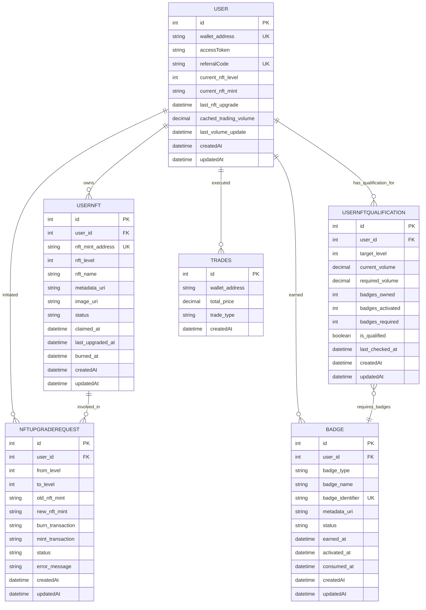

# AIW3 NFT Data Model

<!-- Document Metadata -->
**Version:** v1.0.0  
**Last Updated:** 2025-08-08  
**Status:** Active  
**Purpose:** Defines the data structures and relationships for the AIW3 NFT system, aligned with v1.0.0 business rules and lastmemefi-api backend implementation.

---

**Data Model Scope**: This document provides comprehensive specifications for data structures supporting all NFT business flows documented in **AIW3-NFT-Business-Rules-and-Flows.md** v1.0.0, including:
- **Tiered NFT System**: Single progression-based NFT with sequential upgrade requirements (Levels 1-5)
- **Competition NFT System**: Multiple Trophy Breeder NFTs from trading competitions
- **Badge System**: Task-based badge collection with owned → activated → consumed lifecycle
- **NFT Status Management**: Comprehensive status tracking for all NFT lifecycle states

This document provides comprehensive specifications for data structures in the AIW3 NFT system, designed for seamless integration with the existing `lastmemefi-api` backend (located at `$HOME/aiw3/lastmemefi-api`). It covers database extensions, API response formats, and data relationships optimized for the Sails.js/MySQL infrastructure.

---

## Table of Contents

1.  [Database Schema Extensions](#database-schema-extensions)
    -   [New Models](#new-models)
        -   [UserNFT Model](#usernft-model-apimodelsusernftjs)
        -   [UserNFTQualification Model](#usernftqualification-model-apimodelsusernftqualificationjs)
        -   [Badge Model](#badge-model-apimodelsbadgejs)
        -   [NFTUpgradeRequest Model](#nftupgraderequest-model-apimodelsnftupgraderequestjs)
    -   [Extended User Model](#extended-user-model)
    -   [Database Migration Scripts](#database-migration-scripts)
2.  [API Response Data Formats](#api-response-data-formats)
3.  [On-Chain Data Structures](#on-chain-data-structures)
4.  [Off-Chain Data Storage](#off-chain-data-storage)
5.  [Data Model Relationships](#data-model-relationships)
6.  [System Data Flow & Caching](#system-data-flow--caching)
    -   [Redis Cache Structure](#redis-cache-structure)
    -   [Kafka Event Patterns](#kafka-event-patterns-using-kafkaservicesendmessage)
    -   [WebSocket Event Data Formats](#websocket-event-data-formats-frontend-integration)
    -   [Error Response Format](#error-response-format)

---

## Database Schema Extensions

This section defines the new database models and extensions to existing models required for NFT integration with lastmemefi-api.

### New Models

## Backend Data Models (lastmemefi-api)

These models reflect the exact implementation in the `lastmemefi-api` backend, aligned with prototype-driven business requirements.

### UserNft Model (api/models/UserNft.js)

**Purpose**: Represents a specific NFT instance owned by a user.

```javascript
module.exports = {
  attributes: {
    owner: { 
      model: 'user', 
      required: true, 
      description: 'The user who owns this NFT.' 
    },
    
    nftDefinition: { 
      model: 'nftdefinition', 
      required: true, 
      description: 'The definition of the NFT that was minted.' 
    },
    
    mintAddress: { 
      type: 'string', 
      required: true, 
      unique: true, 
      description: 'The unique on-chain mint address of the NFT instance.' 
    },
    
    status: { 
      type: 'string', 
      isIn: ['active', 'burned'], 
      defaultsTo: 'active', 
      description: 'The current status of the NFT.' 
    },
    
    level: { 
      type: 'number', 
      defaultsTo: 1, 
      description: 'The upgrade level of the NFT, used in upgrade flows.' 
    }
  }
};
```

**Key Fields**:
- `owner`: Association to User model
- `nftDefinition`: Association to NftDefinition model  
- `mintAddress`: Unique Solana mint address
- `status`: Only `active` or `burned` (database statuses)
- `level`: Upgrade level for upgrade flows

### NftDefinition Model (api/models/NftDefinition.js)

**Purpose**: Represents a type of NFT that can be minted.

```javascript
module.exports = {
  attributes: {
    name: { 
      type: 'string', 
      required: true, 
      description: 'The on-chain name of the NFT.' 
    },
    
    symbol: { 
      type: 'string', 
      required: true, 
      description: 'The on-chain symbol of the NFT.' 
    },
    
    metadataUri: { 
      type: 'string', 
      required: true, 
      description: 'The IPFS URI for the NFT\'s metadata JSON file.' 
    },
    
    description: { 
      type: 'string', 
      description: 'A brief description of the NFT and its purpose or tier.', 
      maxLength: 1000 
    }
  }
};
```

**Key Fields**:
- `name`: On-chain NFT name (e.g., "Tech Chicken")
- `symbol`: On-chain symbol (e.g., "TECH")
- `metadataUri`: IPFS URI for metadata JSON
- `description`: Human-readable description

## NFT Tier Definitions Reference

For complete NFT tier specifications including badge requirements, trading fee reductions, and additional rights, refer to the authoritative documentation in **AIW3-NFT-Business-Rules-and-Flows.md**.
      defaultsTo: 'unlocked',
      description: 'Current status of the NFT'
    },
    
    // Timestamps
    claimed_at: { 
      type: 'ref', 
      columnType: 'datetime',
      description: 'When the NFT was first claimed'
    },
    
    last_upgraded_at: { 
      type: 'ref', 
      columnType: 'datetime',
      description: 'When the NFT was last upgraded'
    },
    
    burned_at: {
      type: 'ref',
      columnType: 'datetime',
      allowNull: true,
      description: 'When the NFT was burned (for upgrades)'
    },
    
    // Waterline standard timestamps
    createdAt: { type: 'ref', columnType: 'datetime' },
    updatedAt: { type: 'ref', columnType: 'datetime' }
  }
};
```

#### UserNFTQualification Model (api/models/UserNFTQualification.js)

```javascript
module.exports = {
  attributes: {
    id: { type: 'number', autoIncrement: true },
    
    user_id: { 
      type: 'string',
      required: true,
      description: 'User ID (matches existing lastmemefi-api pattern)'
    },
    
    target_level: { 
      type: 'number', 
      required: true,
      min: 1,
      max: 5
    },
    
    // Volume tracking
    current_volume: { 
      type: 'number', 
      columnType: 'DECIMAL(30,10)',
      defaultsTo: 0,
      description: 'User current trading volume in USDT'
    },
    
    required_volume: { 
      type: 'number', 
      columnType: 'DECIMAL(30,10)',
      required: true,
      description: 'Required volume for target level'
    },
    
    // Badge tracking
    badges_owned: { 
      type: 'number', 
      defaultsTo: 0,
      description: 'Number of badges user has earned/owned'
    },
    
    badges_activated: { 
      type: 'number', 
      defaultsTo: 0,
      description: 'Number of badges user has activated for upgrade'
    },
    
    badges_required: { 
      type: 'number',
      defaultsTo: 0,
      description: 'Number of badges required for target level'
    },
    
    // Qualification status
    is_qualified: { 
      type: 'boolean', 
      defaultsTo: false,
      description: 'Whether user meets all requirements'
    },
    
    last_checked_at: { 
      type: 'ref', 
      columnType: 'datetime',
      description: 'When qualification was last calculated'
    },
    
    // Standard timestamps
    createdAt: { type: 'ref', columnType: 'datetime' },
    updatedAt: { type: 'ref', columnType: 'datetime' }
  }
};
```

#### Badge Model (api/models/Badge.js)

This model represents an off-chain achievement badge awarded to a user. It is not an NFT.

```javascript
module.exports = {
  attributes: {
    id: { type: 'number', autoIncrement: true },
    
    user_id: { 
      type: 'string',
      required: true,
      description: 'User ID (matches existing lastmemefi-api pattern)'
    },
    
    badge_type: {
      type: 'string',
      required: true,
      isIn: ['micro_badge', 'achievement_badge', 'event_badge', 'special_badge'],
      description: 'Type of badge'
    },
    
    badge_name: {
      type: 'string',
      required: true,
      maxLength: 100,
      description: 'Human-readable badge name'
    },
    
    badge_identifier: {
      type: 'string',
      required: true,
      unique: true,
      maxLength: 100,
      description: 'Unique identifier for the badge (not an NFT mint address)'
    },
    
    metadata_uri: {
      type: 'string',
      maxLength: 500,
      description: 'URI for badge metadata'
    },
    
    status: {
      type: 'string',
      isIn: ['owned', 'activated', 'consumed'],
      defaultsTo: 'owned',
      description: 'Badge lifecycle status: owned (earned), activated (ready for upgrade), consumed (used in upgrade)'
    },
    
    earned_at: {
      type: 'ref',
      columnType: 'datetime',
      description: 'When the badge was earned'
    },
    
    activated_at: {
      type: 'ref',
      columnType: 'datetime',
      allowNull: true,
      description: 'When the badge was activated for NFT upgrade use'
    },
    
    consumed_at: {
      type: 'ref',
      columnType: 'datetime',
      allowNull: true,
      description: 'When the badge was consumed during NFT upgrade'
    },
    
    // Standard timestamps
    createdAt: { type: 'ref', columnType: 'datetime' },
    updatedAt: { type: 'ref', columnType: 'datetime' }
  }
};
```

#### NFTUpgradeRequest Model (api/models/NFTUpgradeRequest.js)

```javascript
module.exports = {
  attributes: {
    id: { type: 'number', autoIncrement: true },
    
    user_id: {
      type: 'string',
      required: true,
      description: 'User ID (matches existing lastmemefi-api pattern)'
    },
    
    from_level: {
      type: 'number',
      required: true,
      min: 1,
      max: 5
    },
    
    to_level: {
      type: 'number',
      required: true,
      min: 2,
      max: 5
    },
    
    old_nft_mint: {
      type: 'string',
      required: true,
      maxLength: 44,
      description: 'Mint address of NFT being burned'
    },
    
    new_nft_mint: {
      type: 'string',
      allowNull: true,
      maxLength: 44,
      description: 'Mint address of new NFT (when created)'
    },
    
    // Transaction tracking
    burn_transaction: {
      type: 'string',
      allowNull: true,
      maxLength: 88,
      description: 'Solana transaction signature for burn'
    },
    
    mint_transaction: {
      type: 'string',
      allowNull: true,
      maxLength: 88,
      description: 'Solana transaction signature for mint'
    },
    
    status: {
      type: 'string',
      isIn: ['pending', 'burn_confirmed', 'mint_confirmed', 'completed', 'failed'],
      defaultsTo: 'pending',
      description: 'Current status of upgrade process'
    },
    
    error_message: {
      type: 'string',
      allowNull: true,
      maxLength: 500,
      description: 'Error message if upgrade failed'
    },
    
    // Standard timestamps
    createdAt: { type: 'ref', columnType: 'datetime' },
    updatedAt: { type: 'ref', columnType: 'datetime' }
  }
};
```

### Extended User Model

**CRITICAL UPDATE**: Based on comprehensive backend analysis, the NFT qualification logic requires a new unified trading volume system. The existing `trades` table only contains Solana token trades, which are **NOT eligible** for NFT qualification.

**NFT Business Rule - Qualifying Trading Volume**:
- ✅ **Perpetual contract trading volume** (OKX + Hyperliquid platforms)
- ✅ **Trading volume generated from strategy trading**
- ❌ **Solana token trading** (excluded from NFT qualification)

**Critical Integration Gaps Identified**:
1. **OKX Volume Gap**: No historical perpetual contract volume stored locally (CRITICAL)
2. **Strategy Volume Gap**: Individual strategy trade volumes not tracked (HIGH)
3. **Unified Service Gap**: No consolidated NFT volume calculation system

**New Data Models Required**:
- `TradingVolumeRecord` - Unified storage for all NFT-qualifying trading volumes
- `UserTradingVolumeCache` - Performance cache for NFT qualification checks
- `TradingVolumeService` - Orchestration service for volume aggregation

**Historical Volume Requirement**: Since the AIW3 system has been in production before NFT feature launch, the calculation must include:
- **Historical trading volume**: All qualifying trading activity before NFT feature launch
- **New trading volume**: All qualifying trading activity after NFT feature launch
- **Implementation**: Aggregate from multiple sources (Hyperliquid DB + OKX API + Strategy API)

The User model does not contain a `total_trading_volume` field. The extensions below are for tracking NFT-specific state and relationships.

#### User Model Extensions (api/models/User.js)

// Extensions to existing User model for NFT integration
// NOTE: The actual User model already contains these fields:
// - wallet_address, accessToken, referralCode, points, energy, quick_amount, auto_amount

module.exports = {
  attributes: {
    // ... existing User attributes (wallet_address, accessToken, referralCode, etc.) ...
    
    // NFT-related extensions (NEW FIELDS TO ADD)
    current_nft_level: {
      type: 'number',
      allowNull: true,
      description: 'The current highest active NFT level of the user'
    },
    
    current_nft_mint: {
      type: 'string',
      allowNull: true,
      description: 'The mint address of the current highest active NFT'
    },
    
    // Cached trading volume for performance (calculated from TradingVolumeService)
    cached_trading_volume: {
      type: 'number',
      columnType: 'DECIMAL(30,10)',
      defaultsTo: 0,
      description: 'Cached total NFT-qualifying trading volume (perpetual contracts + strategy trading only)'
    },
    
    last_volume_update: {
      type: 'ref',
      columnType: 'datetime',
      allowNull: true,
      description: 'Timestamp of last trading volume cache update'
    },
    
    // Relationships
    nfts: {
      collection: 'usernft',
      via: 'user_id'
    },
    
    badges: {
      collection: 'badge',
      via: 'user_id'
    },
    
    qualifications: {
      collection: 'usernftqualification',
      via: 'user_id'
    },
    
    upgradeRequests: {
      collection: 'nftupgraderequest',
      via: 'user_id'
    }
  }
};
```

### New Trading Volume Data Models

#### TradingVolumeRecord Model (api/models/TradingVolumeRecord.js)

```javascript
module.exports = {
  tableName: 'trading_volume_records',
  attributes: {
    user_id: {
      type: 'string',
      required: true,
      description: 'User ID (matches existing lastmemefi-api pattern)'
    },
    
    platform: {
      type: 'string',
      isIn: ['okx', 'hyperliquid', 'strategy', 'orderly'],
      required: true,
      description: 'Trading platform identifier'
    },
    
    trade_type: {
      type: 'string',
      isIn: ['perpetual_contract', 'strategy_trading'],
      required: true,
      description: 'Type of NFT-qualifying trading activity'
    },
    
    volume_usd: {
      type: 'number',
      columnType: 'DECIMAL(30,10)',
      required: true,
      description: 'Trading volume in USD'
    },
    
    external_order_id: {
      type: 'string',
      allowNull: true,
      description: 'External platform order ID for reference'
    },
    
    external_trade_id: {
      type: 'string',
      allowNull: true,
      description: 'External platform trade ID for reference'
    },
    
    trade_timestamp: {
      type: 'ref',
      columnType: 'datetime',
      required: true,
      description: 'Actual trade execution time'
    },
    
    nft_era: {
      type: 'string',
      isIn: ['pre_nft', 'post_nft'],
      required: true,
      description: 'Whether trade occurred before or after NFT feature launch'
    },
    
    data_source: {
      type: 'string',
      isIn: ['real_time', 'historical_migration', 'api_sync'],
      defaultsTo: 'real_time',
      description: 'How this record was created'
    },
    
    // Metadata for debugging and auditing
    raw_data: {
      type: 'json',
      allowNull: true,
      description: 'Raw trading data from external platform'
    },
    
    // Standard timestamps
    createdAt: { type: 'ref', columnType: 'datetime' },
    updatedAt: { type: 'ref', columnType: 'datetime' }
  },
  
  indexes: [
    {
      attributes: ['user_id', 'platform', 'trade_type'],
      type: 'index'
    },
    {
      attributes: ['user_id', 'nft_era'],
      type: 'index'
    },
    {
      attributes: ['trade_timestamp'],
      type: 'index'
    },
    {
      attributes: ['user_id', 'trade_timestamp'],
      type: 'index',
      description: 'Critical for historical volume queries and performance'
    }
  ]
};
```

#### UserTradingVolumeCache Model (api/models/UserTradingVolumeCache.js)

```javascript
module.exports = {
  tableName: 'user_trading_volume_cache',
  attributes: {
    user_id: {
      type: 'string',
      required: true,
      unique: true,
      description: 'User ID (matches existing lastmemefi-api pattern)'
    },
    
    total_volume_usd: {
      type: 'number',
      columnType: 'DECIMAL(30,10)',
      defaultsTo: 0,
      description: 'Total NFT-qualifying trading volume across all platforms'
    },
    
    perpetual_volume_usd: {
      type: 'number',
      columnType: 'DECIMAL(30,10)',
      defaultsTo: 0,
      description: 'Perpetual contract trading volume (OKX + Hyperliquid)'
    },
    
    strategy_volume_usd: {
      type: 'number',
      columnType: 'DECIMAL(30,10)',
      defaultsTo: 0,
      description: 'Strategy trading volume'
    },
    
    pre_nft_volume_usd: {
      type: 'number',
      columnType: 'DECIMAL(30,10)',
      defaultsTo: 0,
      description: 'Trading volume before NFT feature launch'
    },
    
    post_nft_volume_usd: {
      type: 'number',
      columnType: 'DECIMAL(30,10)',
      defaultsTo: 0,
      description: 'Trading volume after NFT feature launch'
    },
    
    last_updated: {
      type: 'ref',
      columnType: 'datetime',
      required: true,
      description: 'Last cache update timestamp'
    },
    
    // Platform-specific volumes for debugging and analytics
    okx_volume_usd: {
      type: 'number',
      columnType: 'DECIMAL(30,10)',
      defaultsTo: 0,
      description: 'OKX platform trading volume'
    },
    
    hyperliquid_volume_usd: {
      type: 'number',
      columnType: 'DECIMAL(30,10)',
      defaultsTo: 0,
      description: 'Hyperliquid platform trading volume'
    },
    
    strategy_platform_volume_usd: {
      type: 'number',
      columnType: 'DECIMAL(30,10)',
      defaultsTo: 0,
      description: 'Strategy platform trading volume'
    },
    
    orderly_volume_usd: {
      type: 'number',
      columnType: 'DECIMAL(30,10)',
      defaultsTo: 0,
      description: 'Orderly platform trading volume (future)'
    },
    
    // Standard timestamps
    createdAt: { type: 'ref', columnType: 'datetime' },
    updatedAt: { type: 'ref', columnType: 'datetime' }
  }
};
```

### Database Migration Scripts

#### Migration 1: Create NFT Tables

```sql
-- Create UserNFT table
CREATE TABLE usernft (
  id INT AUTO_INCREMENT PRIMARY KEY,
  user_id INT NOT NULL,
  nft_mint_address VARCHAR(44) NOT NULL UNIQUE,
  nft_level TINYINT NOT NULL CHECK (nft_level BETWEEN 1 AND 5),
  nft_name VARCHAR(100) NOT NULL,
  metadata_uri VARCHAR(500),
  image_uri VARCHAR(500),
  status ENUM('unlocked', 'active', 'inactive', 'burned') DEFAULT 'unlocked',
  claimed_at DATETIME,
  last_upgraded_at DATETIME,
  burned_at DATETIME NULL,
  createdAt DATETIME DEFAULT CURRENT_TIMESTAMP,
  updatedAt DATETIME DEFAULT CURRENT_TIMESTAMP ON UPDATE CURRENT_TIMESTAMP,
  
  FOREIGN KEY (user_id) REFERENCES user(id) ON DELETE CASCADE,
  INDEX idx_user_id (user_id),
  INDEX idx_nft_level (nft_level),
  INDEX idx_status (status)
);

-- Create UserNFTQualification table
CREATE TABLE usernftqualification (
  id INT AUTO_INCREMENT PRIMARY KEY,
  user_id INT NOT NULL,
  target_level TINYINT NOT NULL CHECK (target_level BETWEEN 1 AND 5),
  current_volume DECIMAL(30,10) DEFAULT 0,
  required_volume DECIMAL(30,10) NOT NULL,
  badges_owned INT DEFAULT 0,
  badges_activated INT DEFAULT 0,
  badges_required INT DEFAULT 0,
  is_qualified BOOLEAN DEFAULT FALSE,
  last_checked_at DATETIME,
  createdAt DATETIME DEFAULT CURRENT_TIMESTAMP,
  updatedAt DATETIME DEFAULT CURRENT_TIMESTAMP ON UPDATE CURRENT_TIMESTAMP,
  
  FOREIGN KEY (user_id) REFERENCES user(id) ON DELETE CASCADE,
  UNIQUE KEY unique_user_target (user_id, target_level),
  INDEX idx_qualified (is_qualified),
  INDEX idx_last_checked (last_checked_at)
);

-- Create Badge table
CREATE TABLE badge (
  id INT AUTO_INCREMENT PRIMARY KEY,
  user_id INT NOT NULL,
  badge_type ENUM('micro_badge', 'achievement_badge', 'event_badge', 'special_badge') NOT NULL,
  badge_name VARCHAR(100) NOT NULL,
  badge_identifier VARCHAR(100) NOT NULL UNIQUE,
  metadata_uri VARCHAR(500),
  status ENUM('owned', 'activated', 'consumed') DEFAULT 'owned',
  earned_at DATETIME,
  activated_at DATETIME NULL,
  consumed_at DATETIME NULL,
  createdAt DATETIME DEFAULT CURRENT_TIMESTAMP,
  updatedAt DATETIME DEFAULT CURRENT_TIMESTAMP ON UPDATE CURRENT_TIMESTAMP,
  
  FOREIGN KEY (user_id) REFERENCES user(id) ON DELETE CASCADE,
  INDEX idx_user_id (user_id),
  INDEX idx_badge_type (badge_type),
  INDEX idx_status (status)
);

-- Create NFTUpgradeRequest table
CREATE TABLE nftupgraderequest (
  id INT AUTO_INCREMENT PRIMARY KEY,
  user_id INT NOT NULL,
  from_level TINYINT NOT NULL CHECK (from_level BETWEEN 1 AND 5),
  to_level TINYINT NOT NULL CHECK (to_level BETWEEN 2 AND 5),
  old_nft_mint VARCHAR(44) NOT NULL,
  new_nft_mint VARCHAR(44) NULL,
  burn_transaction VARCHAR(88) NULL,
  mint_transaction VARCHAR(88) NULL,
  status ENUM('pending', 'burn_confirmed', 'mint_confirmed', 'completed', 'failed') DEFAULT 'pending',
  error_message VARCHAR(500) NULL,
  createdAt DATETIME DEFAULT CURRENT_TIMESTAMP,
  updatedAt DATETIME DEFAULT CURRENT_TIMESTAMP ON UPDATE CURRENT_TIMESTAMP,
  
  FOREIGN KEY (user_id) REFERENCES user(id) ON DELETE CASCADE,
  INDEX idx_user_id (user_id),
  INDEX idx_status (status),
  INDEX idx_created_at (createdAt)
);
```

#### Migration 2: Extend User Table

```sql
-- Add NFT-related columns to existing user table
-- NOTE: The following fields already exist in the backend User model:
-- wallet_address, accessToken, referralCode, points, energy, quick_amount, auto_amount

ALTER TABLE user
ADD COLUMN current_nft_level TINYINT DEFAULT 0 COMMENT 'Current highest NFT level owned by user (1-5)',
ADD COLUMN last_active_nft_id INT NULL COMMENT 'Reference to user\'s currently active/primary NFT',
ADD COLUMN cached_trading_volume DECIMAL(30,10) DEFAULT 0 COMMENT 'Cached total trading volume (calculated from trades table)',
ADD COLUMN last_volume_update DATETIME NULL COMMENT 'Timestamp of last trading volume cache update',
ADD INDEX idx_nft_level (current_nft_level),
ADD INDEX idx_cached_volume (cached_trading_volume),
ADD FOREIGN KEY (last_active_nft_id) REFERENCES usernft(id) ON DELETE SET NULL;
```

---

## On-Chain Data

This section describes the data stored directly on the Solana blockchain for maximum security, decentralization, and trust.

### On-Chain Metadata Account Details

Data stored directly on **Solana blockchain** for trust and authenticity verification:

| Field | Type | Source | Required | Description & AIW3 Usage |
|-------|------|--------|----------|--------------------------|
| `update_authority` | `Pubkey` | AIW3 System Wallet | Yes | AIW3 System Wallet public key |
| `mint` | `Pubkey` | Solana | Yes | NFT's unique identifier |
| `data.name` | `String` | AIW3 System Wallet | Yes | NFT name (e.g., "Tech Chicken", "Quant Ape") |
| `data.symbol` | `String` | AIW3 System Wallet | Yes | Collection symbol (e.g., "AIW3E") |
| `data.uri` | `String` | AIW3 System Wallet | Yes | IPFS via Pinata URI for off-chain JSON |
| `data.creators` | `Vec<Creator>` | AIW3 System Wallet | Yes | **Core authenticity verification** |
| `is_mutable` | `bool` | AIW3 System Wallet | Yes | Set to `false` for permanence |

---

## Off-Chain Data

This section describes the data stored off-chain. **All NFT-related assets (images, videos, and metadata JSON files) must be stored exclusively on IPFS via the Pinata pinning service.** This is a strict project policy to ensure data immutability, decentralization, and long-term availability. No other storage solutions are permitted for NFT assets.

### Off-Chain JSON Metadata Details

The `uri` field in the on-chain metadata contains an IPFS via Pinata link to this JSON file where the **actual Level data is stored** and **images are referenced via IPFS**:

```json
{
  "name": "On-chain Hunter",
  "symbol": "AIW3E",
  "description": "Represents Level 3 equity and status within the AIW3 ecosystem.",
  "image": "https://gateway.pinata.cloud/ipfs/QmImageHashExample123",
  "external_url": "https://aiw3.io",
  "attributes": [
    {
      "trait_type": "Level",
      "value": "3",
      "display_type": "number"
    },
    {
      "trait_type": "Name",
      "value": "On-chain Hunter",
      "display_type": "string"
    }
  ],
  "properties": {
    "files": [
      {
        "uri": "https://gateway.pinata.cloud/ipfs/QmImageHashExample123",
        "type": "image/png"
      }
    ],
    "creators": [
      {
        "address": "AIW3_SYSTEM_WALLET_PUBLIC_KEY",
        "share": 100
      }
    ]
  }
}
```

---

## Data Model Relationships

This diagram illustrates the relationships between the different data entities in the backend database.



---

## On-Chain Interaction Mapping

The AIW3 system interacts with the Solana blockchain using **only standard Solana programs** (SPL Token Program and Metaplex Token Metadata Program) without requiring any custom smart contract development. All business logic is handled off-chain in the backend services.

| User Operation                  | On-Chain Interaction            | Interaction Type                | Description |
|---------------------------------|---------------------------------|---------------------------------|-------------|
| **Minting a New NFT**           | `mintTo(...)`                   | **Standard SPL Token Program**  | The AIW3 backend uses the system wallet to mint new NFTs directly to user wallets using standard SPL Token operations. All business logic verification (trading volume, tier eligibility) is handled off-chain before minting. |
| **Upgrading an Equity NFT**     | `burn(...)` + `mintTo(...)`     | **Standard SPL Token Program**  | The upgrade process uses standard token operations: user burns their current NFT, then the system mints the new tier NFT. The AIW3 backend verifies all off-chain criteria (trading volume, badge requirements) before authorizing the upgrade. |
| **Managing Badges**             | Off-chain operations            | **Backend Database Only**       | Badges are managed entirely off-chain in the backend database. They are not NFTs and do not require blockchain operations. The backend tracks badge ownership and enforces binding requirements through database queries and business logic. |
| **Selling/Transferring an NFT** | `transfer(...)`                 | **Standard SPL Token Program**  | This is a standard token transfer. The AIW3 system does not need a custom function for this. Users can freely trade their NFTs on any marketplace that supports Solana NFTs. |
| **Burning an NFT**              | `burn(...)`                     | **Standard SPL Token Program**  | This is a standard token burn. It is used in the **Upgrade** process to destroy the lower-level NFT before the higher-level one is minted. |

---

## API Response Data Formats

This section defines the standardized API response formats for frontend-backend integration, following existing `lastmemefi-api` patterns.

### NFT Status Response Format

```json
{
  "success": true,
  "data": {
    "currentNFT": {
      "level": 1,
      "tierName": "Tech Chicken",
      "mintAddress": "ABC123...",
      "benefits": {
        "feeReduction": 0.05,
        "aiagentUses": 10
      }
    },
    "qualification": {
      "nextLevel": 2,
      "progress": 0.75,
      "requirements": {
        "tradingVolume": 50000,
        "badges": ["early_adopter"]
      }
    }
  },
  "meta": {
    "timestamp": "2024-01-01T00:00:00Z",
    "version": "v1"
  }
}
```

### Redis Cache Structure

### NFT Qualification Cache (using RedisService.setCache/getCache)
```json
nft_qual:{user_id} -> {
    "trading_volume": 50000,
    "badges_owned": 4,
    "badges_activated": 2,
    "badges_consumed": 0,
    "eligible_levels": [1, 2],
    "last_calculated": "2024-01-15T10:30:00Z",
    "ttl": 300
}

// Set using: RedisService.setCache(`nft_qual:${userId}`, qualificationData, 300)
// Get using: RedisService.getCache(`nft_qual:${userId}`)
```

### NFT Operation Locks (using RedisService distributed locking)
```
nft_lock:upgrade:{user_id} -> "locked" (TTL: 600s)
nft_lock:unlock:{user_id} -> "locked" (TTL: 300s)
nft_lock:burn:{user_id} -> "locked" (TTL: 180s)

// Acquire lock: RedisService.setCache(lockKey, "locked", ttl, {lockMode: true})
// Release lock: RedisService.delCache(lockKey)
```

### NFT Benefits Cache (using RedisService with 1-hour TTL)
```
nft_benefits:{user_id} -> {
    "level": 3,
    "feeReduction": 0.15,
    "aiagentUses": 30,
    "cached_at": "2024-01-15T10:30:00Z"
}

// Set using: RedisService.setCache(`nft_benefits:${userId}`, benefitsData, 3600)
```

### Kafka Event Patterns (using KafkaService.sendMessage)

#### NFT Events Topic: "nft-events"
```json
// NFT Claimed Event
{
  "eventType": "claimed",
  "timestamp": "2024-01-15T10:30:00Z",
  "data": {
    "userId": "user123",
    "nftLevel": 1,
    "tierName": "Tech Chicken",
    "mintAddress": "5J7GpqXVf7Kx8rY3nZ9...",
    "transactionSignature": "3Nc2yi7yoACnKqiuW5c6..."
  }
}

// NFT Upgraded Event
{
  "eventType": "upgraded",
  "timestamp": "2024-01-15T10:35:00Z",
  "data": {
    "userId": "user123",
    "fromLevel": 1,
    "toLevel": 2,
    "fromTier": "Tech Chicken",
    "toTier": "Quant Ape",
    "oldMintAddress": "5J7GpqXVf7Kx8rY3nZ9...",
    "newMintAddress": "8K9HrqYWg8Ly9sZ4oA1..."
  }
}

// Badge Activated Event
{
  "eventType": "badge_activated",
  "timestamp": "2024-01-15T10:40:00Z",
  "data": {
    "userId": "user123",
    "badgeId": "badge_early_adopter",
    "badgeName": "Early Adopter",
    "activatedAt": "2024-01-15T10:40:00Z"
  }
}

// Badges Consumed Event (during NFT upgrade)
{
  "eventType": "badges_consumed",
  "timestamp": "2024-01-15T10:45:00Z",
  "data": {
    "userId": "user123",
    "consumedBadges": ["badge_early_adopter", "badge_trader"],
    "upgradeLevel": 2,
    "consumedAt": "2024-01-15T10:45:00Z"
  }
}

// Published using: KafkaService.sendMessage("nft-events", eventData)
```

### WebSocket Event Data Formats (Frontend Integration)

```json
// NFT Status Changed Event
{
  "event": "nft:status_changed",
  "userId": "user123",
  "data": {
    "newLevel": 2,
    "tierName": "Quant Ape",
    "benefits": {
      "feeReduction": 0.10,
      "aiagentUses": 20
    }
  },
  "timestamp": "2024-01-01T00:00:00Z"
}

// Transaction Status Event
{
  "event": "nft:transaction_status",
  "userId": "user123",
  "data": {
    "transactionId": "5J7...",
    "status": "confirmed",
    "step": "mint_completed",
    "progress": 100
  },
  "timestamp": "2024-01-01T00:00:00Z"
}

// Badge Activated Event
{
  "event": "badge:activated",
  "userId": "user123",
  "data": {
    "badgeId": "badge_early_adopter",
    "badgeName": "Early Adopter",
    "status": "activated"
  },
  "timestamp": "2024-01-01T00:00:00Z"
}

// Badge Status Update Event
{
  "event": "badge:status_changed",
  "userId": "user123",
  "data": {
    "badgeId": "badge_trader",
    "badgeName": "High Volume Trader",
    "oldStatus": "activated",
    "newStatus": "consumed",
    "usedInUpgrade": 2
  },
  "timestamp": "2024-01-01T00:00:00Z"
}
```

### Error Response Format

```json
{
  "success": false,
  "error": {
    "code": "NFT_UPGRADE_FAILED",
    "message": "Insufficient trading volume for upgrade",
    "details": {
      "required": 100000,
      "current": 75000,
      "shortfall": 25000
    }
  },
  "meta": {
    "timestamp": "2024-01-01T00:00:00Z",
    "requestId": "req_123"
  }
}
```

---


- **[AIW3 NFT Appendix](./AIW3-NFT-Appendix.md)**: Glossary of terms and external references

### Integration & Implementation
- **[AIW3 NFT Legacy Backend Integration](./AIW3-NFT-Legacy-Backend-Integration.md)**: Comprehensive analysis and strategy for integrating NFT services with existing `lastmemefi-api` backend, including service architecture and infrastructure reuse
- **[AIW3 NFT Integration Issues & PRs](./AIW3-NFT-Integration-Issues-PRs.md)**: Detailed phased implementation plan with frontend-backend integration requirements, API contracts, WebSocket events, and collaborative development guidance
