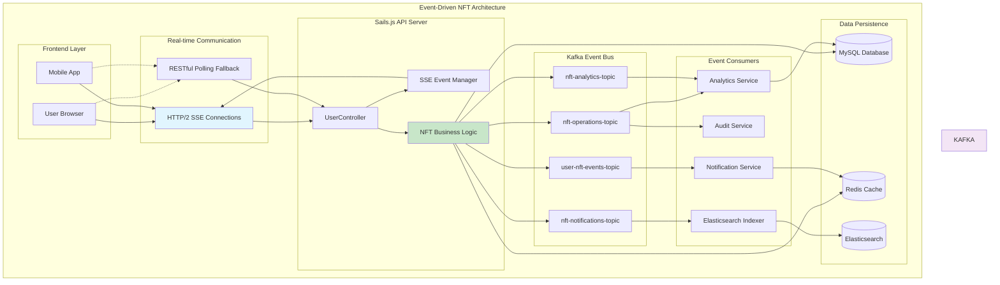

# AIW3 NFT Event-Driven Architecture

<!-- Document Metadata -->
**Version:** v1.0.0  
**Last Updated:** 2025-08-08  
**Status:** Active  
**Purpose:** Event-driven architecture design for real-time NFT notifications and system integration via Kafka and WebSocket

---

## Overview

This document defines the event-driven architecture for the AIW3 NFT system, detailing how real-time notifications are delivered to frontend applications while maintaining service decoupling through Apache Kafka. The architecture provides **dual-path event delivery**: WebSocket connections for immediate user feedback and Kafka events for service-to-service communication and analytics.

## Table of Contents

1. [Architecture Principles](#architecture-principles)
2. [Event Flow Patterns](#event-flow-patterns)
3. [Kafka Integration](#kafka-integration)
4. [WebSocket Implementation](#websocket-implementation)
5. [Event Types and Schemas](#event-types-and-schemas)
6. [Service Integration Patterns](#service-integration-patterns)
7. [Implementation Guidelines](#implementation-guidelines)
8. [Performance and Monitoring](#performance-and-monitoring)

---

## Architecture Principles

### 🎯 **Design Goals**

| Priority | Goal | Implementation |
|----------|------|----------------|
| P0 | **Immediate User Feedback** | HTTP/2 SSE for <100ms real-time updates |
| P1 | **Service Decoupling** | Kafka topics for async service communication |
| P2 | **System Reliability** | Multiple fallback mechanisms and error recovery |
| P3 | **Analytics Integration** | Event streaming for business intelligence |

### 🏗️ **Architectural Patterns**



---

## Event Flow Patterns

### 🔄 **Primary Event Flow: User Actions**

```javascript
// Example: NFT Upgrade Event Flow
const nftUpgradeFlow = {
  // 1. User initiates NFT upgrade
  userAction: "POST /api/v1/user/upgrade-nft",
  
  // 2. Business logic processes upgrade
  businessLogic: {
    validate: "Check volume, badges, wallet signature",
    execute: "Burn old NFT, mint new NFT on Solana",
    persist: "Update database, cache invalidation"
  },
  
  // 3. Dual event publishing
  eventPublishing: {
    // Immediate user feedback via SSE
    sse: {
      target: "specific user connection",
      latency: "~50ms",
      payload: "nft_upgrade_completed event"
    },
    
    // System-wide event distribution via Kafka
    kafka: {
      topics: ["nft-operations-topic", "user-nft-events-topic"],
      latency: "~200ms",
      consumers: ["Analytics", "Audit", "Notification"]
    }
  }
};
```

### 📊 **Event Categories and Routing**

| Event Category | SSE Target | Kafka Topics | Primary Consumers |
|----------------|------------|--------------|-------------------|
| **User NFT Actions** | Individual user | `user-nft-events-topic` | Notification, Analytics |
| **System Operations** | Admin users only | `nft-operations-topic` | Audit, Monitoring |
| **Analytics Events** | None | `nft-analytics-topic` | BI Dashboard, Reporting |
| **Notification Events** | Relevant users | `nft-notifications-topic` | Push Service, Email Service |

---

## Kafka Integration

### 🗃️ **Topic Configuration**

```javascript
// config/kafka.js - Extended NFT Configuration
module.exports.kafka = {
  // Existing Configuration
  broker: '172.23.1.63:29092',
  clientId: 'my-nodejs-app',
  groupId: 'test-group',
  tokenTopic: 'mp-token-topic',
  tradeTopic: 'mp-trade-topic',
  
  // NFT Event Topics
  nft: {
    // Core NFT operations (minting, burning, transfers)
    operationsTopic: 'nft-operations-topic',
    
    // User-specific NFT events (unlocks, upgrades, activations)
    userEventsTopic: 'user-nft-events-topic',
    
    // Notification delivery events
    notificationsTopic: 'nft-notifications-topic',
    
    // Analytics and business intelligence events
    analyticsTopic: 'nft-analytics-topic'
  },
  
  // Consumer Groups
  consumerGroups: {
    analytics: 'nft-analytics-group',
    notifications: 'nft-notifications-group',
    audit: 'nft-audit-group'
  }
};
```

### 🔧 **Event Publishing Service**

```javascript
// api/services/NFTEventService.js
class NFTEventService {
  
  /**
   * Publishes NFT events to both SSE connections and Kafka topics
   */
  async publishNFTEvent(eventType, userId, eventData) {
    const eventPayload = {
      eventId: this.generateEventId(),
      eventType,
      userId,
      timestamp: new Date().toISOString(),
      data: eventData,
      source: 'nft-service',
      version: '1.0.0'
    };

    // 1. Immediate SSE notification (high priority)
    await this.sendSSEEvent(userId, eventPayload);
    
    // 2. Kafka event publishing (async, fire-and-forget)
    this.publishToKafka(eventType, eventPayload);
    
    return eventPayload;
  }

  /**
   * Send real-time event to specific user via SSE
   */
  async sendSSEEvent(userId, eventPayload) {
    const connections = this.sseManager.getUserConnections(userId);
    
    connections.forEach(connection => {
      try {
        connection.write(`data: ${JSON.stringify(eventPayload)}\n\n`);
      } catch (error) {
        sails.log.warn('SSE connection error:', { userId, error: error.message });
        this.sseManager.removeConnection(userId, connection);
      }
    });
  }

  /**
   * Publish events to appropriate Kafka topics
   */
  async publishToKafka(eventType, eventPayload) {
    const topicMappings = {
      // User-facing events
      'nft_unlocked': ['user-nft-events-topic', 'nft-analytics-topic'],
      'nft_upgraded': ['user-nft-events-topic', 'nft-operations-topic'],
      'badge_earned': ['user-nft-events-topic', 'nft-notifications-topic'],
      
      // System events
      'nft_minted': ['nft-operations-topic', 'nft-analytics-topic'],
      'nft_burned': ['nft-operations-topic', 'nft-analytics-topic'],
      
      // Analytics events
      'volume_milestone_reached': ['nft-analytics-topic'],
      'tier_qualification_changed': ['nft-analytics-topic', 'user-nft-events-topic']
    };

    const topics = topicMappings[eventType] || ['nft-operations-topic'];
    
    // Publish to all relevant topics
    const publishPromises = topics.map(topic =>
      KafkaService.sendMessage(topic, eventPayload)
        .catch(error => {
          sails.log.error('Kafka publish error:', { topic, eventType, error });
        })
    );

    // Fire and forget - don't block user response
    Promise.all(publishPromises);
  }

  generateEventId() {
    return `nft_${Date.now()}_${Math.random().toString(36).substr(2, 9)}`;
  }
}

module.exports = new NFTEventService();
```

### 📥 **Event Consumer Implementation**

```javascript
// api/services/NFTEventConsumer.js
class NFTEventConsumer {
  
  async initialize() {
    // Start consuming from NFT-related topics
    await this.startAnalyticsConsumer();
    await this.startNotificationConsumer();
    await this.startAuditConsumer();
  }

  async startAnalyticsConsumer() {
    await KafkaService.receiveMessage(
      sails.config.kafka.nft.analyticsTopic,
      (error, message) => {
        if (error) {
          sails.log.error('Analytics consumer error:', error);
          return;
        }
        
        this.processAnalyticsEvent(message);
      }
    );
  }

  async processAnalyticsEvent(eventData) {
    try {
      // Update analytics tables
      await AnalyticsService.recordNFTEvent(eventData);
      
      // Update Elasticsearch for searching
      await ElasticsearchService.indexEvent(eventData);
      
      // Update Redis counters
      await RedisService.incrementCounter(`nft:${eventData.eventType}:count`);
      
    } catch (error) {
      sails.log.error('Analytics processing error:', error);
    }
  }

  async startNotificationConsumer() {
    await KafkaService.receiveMessage(
      sails.config.kafka.nft.notificationsTopic,
      (error, message) => {
        if (error) {
          sails.log.error('Notification consumer error:', error);
          return;
        }
        
        this.processNotificationEvent(message);
      }
    );
  }

  async processNotificationEvent(eventData) {
    try {
      // Create notification record
      const notification = await NotificationService.createNotification({
        userId: eventData.userId,
        type: eventData.eventType,
        title: this.generateNotificationTitle(eventData),
        message: this.generateNotificationMessage(eventData),
        data: eventData.data,
        priority: this.calculatePriority(eventData.eventType)
      });

      // Send push notification if user has enabled them
      if (await UserService.hasPushNotificationsEnabled(eventData.userId)) {
        await PushNotificationService.send(notification);
      }

    } catch (error) {
      sails.log.error('Notification processing error:', error);
    }
  }
}

module.exports = new NFTEventConsumer();
```

---

## HTTP/2 SSE Implementation

### 🔌 **SSE Connection Manager**

```javascript
// api/services/SSEManager.js
class SSEManager {
  constructor() {
    this.connections = new Map(); // userId -> Set<connection>
    this.connectionMetadata = new Map(); // connection -> metadata
  }

  /**
   * Register new SSE connection for user
   */
  registerConnection(userId, response, metadata = {}) {
    if (!this.connections.has(userId)) {
      this.connections.set(userId, new Set());
    }
    
    this.connections.get(userId).add(response);
    this.connectionMetadata.set(response, {
      userId,
      connectedAt: Date.now(),
      userAgent: metadata.userAgent,
      ipAddress: metadata.ipAddress
    });

    sails.log.info('SSE connection registered:', { userId, totalConnections: this.getTotalConnections() });
  }

  /**
   * Remove SSE connection
   */
  removeConnection(userId, response) {
    if (this.connections.has(userId)) {
      this.connections.get(userId).delete(response);
      
      // Clean up empty sets
      if (this.connections.get(userId).size === 0) {
        this.connections.delete(userId);
      }
    }
    
    this.connectionMetadata.delete(response);
    
    sails.log.info('SSE connection removed:', { userId, totalConnections: this.getTotalConnections() });
  }

  /**
   * Get all connections for a specific user
   */
  getUserConnections(userId) {
    return Array.from(this.connections.get(userId) || []);
  }

  /**
   * Get total number of active connections
   */
  getTotalConnections() {
    let total = 0;
    for (const userConnections of this.connections.values()) {
      total += userConnections.size;
    }
    return total;
  }

  /**
   * Send heartbeat to all connections
   */
  sendHeartbeat() {
    const heartbeatMessage = {
      type: 'heartbeat',
      timestamp: new Date().toISOString(),
      serverTime: Date.now()
    };

    for (const [userId, connections] of this.connections) {
      connections.forEach(connection => {
        try {
          connection.write(`data: ${JSON.stringify(heartbeatMessage)}\n\n`);
        } catch (error) {
          this.removeConnection(userId, connection);
        }
      });
    }
  }

  /**
   * Get connection statistics
   */
  getStats() {
    const stats = {
      totalConnections: this.getTotalConnections(),
      uniqueUsers: this.connections.size,
      connectionsPerUser: {},
      averageConnectionsPerUser: 0
    };

    for (const [userId, connections] of this.connections) {
      stats.connectionsPerUser[userId] = connections.size;
    }

    if (stats.uniqueUsers > 0) {
      stats.averageConnectionsPerUser = stats.totalConnections / stats.uniqueUsers;
    }

    return stats;
  }
}

module.exports = new SSEManager();
```

### 🎯 **Controller Implementation**

```javascript
// api/controllers/UserController.js - SSE Endpoint
module.exports = {
  
  /**
   * HTTP/2 Server-Sent Events endpoint for real-time NFT updates
   * GET /api/v1/user/nft-events
   */
  async getNFTEventStream(req, res) {
    // Validate authentication
    if (!req.user || !req.user.user_id) {
      return res.status(401).json({
        code: 401,
        message: 'Authentication required for SSE connection',
        error_code: 'UNAUTHORIZED'
      });
    }

    const userId = req.user.user_id;

    // Set SSE headers
    res.writeHead(200, {
      'Content-Type': 'text/event-stream',
      'Cache-Control': 'no-cache',
      'Connection': 'keep-alive',
      'Access-Control-Allow-Origin': '*',
      'Access-Control-Allow-Headers': 'Cache-Control',
      'X-Accel-Buffering': 'no' // Disable nginx buffering
    });

    // Register this connection
    const connectionMetadata = {
      userAgent: req.get('User-Agent'),
      ipAddress: req.ip
    };
    
    SSEManager.registerConnection(userId, res, connectionMetadata);

    // Send initial connection confirmation
    const welcomeMessage = {
      type: 'connection_established',
      userId,
      timestamp: new Date().toISOString(),
      message: 'NFT event stream connected successfully'
    };
    
    res.write(`data: ${JSON.stringify(welcomeMessage)}\n\n`);

    // Set up heartbeat interval
    const heartbeatInterval = setInterval(() => {
      try {
        res.write(`data: ${JSON.stringify({ type: 'heartbeat', timestamp: new Date().toISOString() })}\n\n`);
      } catch (error) {
        clearInterval(heartbeatInterval);
        SSEManager.removeConnection(userId, res);
      }
    }, 30000); // 30 second heartbeat

    // Handle client disconnect
    req.on('close', () => {
      clearInterval(heartbeatInterval);
      SSEManager.removeConnection(userId, res);
      sails.log.info('SSE client disconnected:', { userId });
    });

    req.on('error', (error) => {
      clearInterval(heartbeatInterval);
      SSEManager.removeConnection(userId, res);
      sails.log.error('SSE connection error:', { userId, error: error.message });
    });
  },

  // Existing polling endpoints remain as fallback
  async getNFTPortfolioChanges(req, res) {
    // Implementation remains the same as previously defined
    // This serves as fallback for clients that can't use SSE
  }
};
```

---

## Event Types and Schemas

### 📋 **Core Event Schemas**

```javascript
// Event Schema Definitions
const NFTEventSchemas = {
  
  /**
   * User NFT Events
   */
  nft_unlocked: {
    eventType: 'nft_unlocked',
    userId: 'string',
    data: {
      nftId: 'string',
      tierName: 'string',
      tierId: 'number',
      mintAddress: 'string',
      imageUrl: 'string',
      benefits: {
        tradingFeeReduction: 'string',
        aiAgentWeeklyUses: 'number',
        prioritySupport: 'boolean'
      }
    }
  },

  nft_upgraded: {
    eventType: 'nft_upgraded',
    userId: 'string',
    data: {
      oldNft: {
        nftId: 'string',
        tierName: 'string',
        burnedAt: 'iso_string'
      },
      newNft: {
        nftId: 'string',
        tierName: 'string',
        tierId: 'number',
        mintAddress: 'string',
        transactionSignature: 'string'
      },
      consumedBadges: ['string']
    }
  },

  badge_earned: {
    eventType: 'badge_earned',
    userId: 'string',
    data: {
      badgeId: 'string',
      badgeName: 'string',
      description: 'string',
      imageUrl: 'string',
      earnedAt: 'iso_string',
      requiredForTier: 'number'
    }
  },

  /**
   * System Events
   */
  nft_minted: {
    eventType: 'nft_minted',
    userId: 'string',
    data: {
      nftId: 'string',
      mintAddress: 'string',
      transactionSignature: 'string',
      metadataUri: 'string',
      gasUsed: 'number'
    }
  },

  volume_milestone_reached: {
    eventType: 'volume_milestone_reached',
    userId: 'string',
    data: {
      previousVolume: 'number',
      currentVolume: 'number',
      milestone: 'number',
      tierUnlocked: 'number'
    }
  },

  /**
   * Analytics Events
   */
  tier_qualification_changed: {
    eventType: 'tier_qualification_changed',
    userId: 'string',
    data: {
      previousQualifications: ['number'],
      currentQualifications: ['number'],
      volumeChange: 'number',
      badgeChanges: {
        earned: ['string'],
        activated: ['string'],
        consumed: ['string']
      }
    }
  }
};
```

### 🔍 **Event Validation Service**

```javascript
// api/services/EventValidationService.js
class EventValidationService {
  
  static validate(eventType, eventData) {
    const schema = NFTEventSchemas[eventType];
    
    if (!schema) {
      throw new Error(`Unknown event type: ${eventType}`);
    }

    // Basic validation - in production, use a proper schema validator like Joi
    if (!eventData.userId) {
      throw new Error('Event must include userId');
    }

    if (!eventData.timestamp) {
      throw new Error('Event must include timestamp');
    }

    return true;
  }

  static sanitize(eventData) {
    // Remove sensitive fields before sending to frontend
    const sanitized = { ...eventData };
    
    // Remove internal system fields
    delete sanitized.internalId;
    delete sanitized.systemMetadata;
    
    return sanitized;
  }
}

module.exports = EventValidationService;
```

---

## Service Integration Patterns

### 🔗 **Integration with Existing Services**

```javascript
// Integration Examples

// 1. NFT Service publishes events after operations
class NFTService {
  async unlockNFT(userId, nftDefinitionId) {
    try {
      // Business logic...
      const nft = await this.mintNFTToUser(userId, nftDefinitionId);
      
      // Database updates...
      await this.updateUserNFTRecord(userId, nft);
      
      // Publish event
      await NFTEventService.publishNFTEvent('nft_unlocked', userId, {
        nftId: nft.nftId,
        tierName: nft.tierName,
        tierId: nft.tierId,
        mintAddress: nft.mintAddress,
        imageUrl: nft.imageUrl,
        benefits: nft.benefits
      });

      return nft;
    } catch (error) {
      // Error handling...
      await NFTEventService.publishNFTEvent('nft_unlock_failed', userId, {
        error: error.message,
        nftDefinitionId
      });
      throw error;
    }
  }
}

// 2. Trading Volume Service triggers tier qualification events
class TradingVolumeService {
  async updateUserVolume(userId, newVolume) {
    const previousVolume = await this.getCurrentVolume(userId);
    
    // Update volume
    await this.setUserVolume(userId, newVolume);
    
    // Check for milestone achievements
    const milestones = [100000, 250000, 500000, 1000000, 2500000];
    const newMilestones = milestones.filter(m => newVolume >= m && previousVolume < m);
    
    for (const milestone of newMilestones) {
      await NFTEventService.publishNFTEvent('volume_milestone_reached', userId, {
        previousVolume,
        currentVolume: newVolume,
        milestone,
        tierUnlocked: this.getTierForMilestone(milestone)
      });
    }
  }
}

// 3. User Service integration
class UserService {
  async awardBadge(userId, badgeId) {
    const badge = await this.createUserBadge(userId, badgeId);
    
    await NFTEventService.publishNFTEvent('badge_earned', userId, {
      badgeId: badge.badgeId,
      badgeName: badge.name,
      description: badge.description,
      imageUrl: badge.imageUrl,
      earnedAt: badge.earnedAt,
      requiredForTier: badge.requiredForTier
    });

    return badge;
  }
}
```

---

## Implementation Guidelines

### 🚀 **Phase 1: Basic SSE Implementation**

```javascript
// Step 1: Add SSE endpoint to routes
// config/routes.js
module.exports.routes = {
  // Existing routes...
  
  'GET /api/v1/user/nft-events': 'UserController.getNFTEventStream'
};

// Step 2: Initialize services on startup
// config/bootstrap.js
module.exports.bootstrap = function(done) {
  // Existing bootstrap code...
  
  // Initialize NFT event services
  SSEManager.initialize();
  NFTEventConsumer.initialize();
  
  // Start heartbeat for SSE connections
  setInterval(() => {
    SSEManager.sendHeartbeat();
  }, 30000);
  
  done();
};
```

### 📊 **Phase 2: Kafka Topic Setup**

```javascript
// Step 1: Extend Kafka configuration
// config/kafka.js (updated)
module.exports.kafka = {
  // ... existing configuration
  
  nft: {
    operationsTopic: 'nft-operations-topic',
    userEventsTopic: 'user-nft-events-topic', 
    notificationsTopic: 'nft-notifications-topic',
    analyticsTopic: 'nft-analytics-topic'
  }
};

// Step 2: Create topics (run once)
// scripts/create-nft-kafka-topics.js
const { Kafka } = require('kafkajs');

async function createNFTTopics() {
  const kafka = new Kafka({
    clientId: sails.config.kafka.clientId,
    brokers: [sails.config.kafka.broker]
  });

  const admin = kafka.admin();
  await admin.connect();

  const topics = [
    { topic: 'nft-operations-topic', numPartitions: 3 },
    { topic: 'user-nft-events-topic', numPartitions: 5 },
    { topic: 'nft-notifications-topic', numPartitions: 3 },
    { topic: 'nft-analytics-topic', numPartitions: 2 }
  ];

  await admin.createTopics({ topics });
  await admin.disconnect();
  
  console.log('NFT Kafka topics created successfully');
}

createNFTTopics().catch(console.error);
```

### 🔒 **Phase 3: Security and Monitoring**

```javascript
// Security middleware for SSE connections
// api/policies/sseAuth.js
module.exports = function(req, res, proceed) {
  // Rate limiting for SSE connections
  const userId = req.user?.user_id;
  const currentConnections = SSEManager.getUserConnections(userId)?.length || 0;
  
  if (currentConnections >= 3) { // Max 3 connections per user
    return res.status(429).json({
      code: 429,
      message: 'Too many SSE connections',
      error_code: 'RATE_LIMITED'
    });
  }

  return proceed();
};

// Monitoring service
// api/services/NFTEventMonitoringService.js
class NFTEventMonitoringService {
  
  static startMonitoring() {
    setInterval(() => {
      this.reportMetrics();
    }, 60000); // Report every minute
  }

  static async reportMetrics() {
    const sseStats = SSEManager.getStats();
    const kafkaStats = await this.getKafkaStats();
    
    const metrics = {
      timestamp: Date.now(),
      sse: sseStats,
      kafka: kafkaStats,
      events: {
        processedLastMinute: this.getEventsProcessed(),
        failedLastMinute: this.getEventsFailed()
      }
    };

    // Log metrics or send to monitoring system
    sails.log.info('NFT Event System Metrics:', metrics);
    
    // Optional: Send to external monitoring (Prometheus, DataDog, etc.)
    // await MonitoringService.sendMetrics('nft_events', metrics);
  }
}
```

---

## Performance and Monitoring

### 📈 **Performance Benchmarks**

| Metric | Target | Measurement |
|--------|---------|-------------|
| **SSE Event Delivery** | <100ms | Time from event trigger to user browser |
| **Kafka Event Publishing** | <50ms | Time to publish to Kafka topic |
| **Event Processing Latency** | <200ms | Time for consumers to process events |
| **Connection Limit** | 10,000 concurrent SSE | Max concurrent SSE connections |
| **Event Throughput** | 1,000 events/second | Peak event processing capacity |

### 🔍 **Monitoring Dashboard Queries**

```javascript
// Key monitoring queries for operational insights

const monitoringQueries = {
  
  // SSE Connection Health
  sseHealth: {
    totalConnections: 'SELECT COUNT(*) FROM active_sse_connections',
    connectionsByUser: 'SELECT user_id, COUNT(*) FROM active_sse_connections GROUP BY user_id',
    connectionDropRate: 'SELECT (disconnects / connections) * 100 FROM sse_stats WHERE timestamp > NOW() - INTERVAL 1 HOUR'
  },

  // Event Processing Metrics
  eventMetrics: {
    eventsPerMinute: 'SELECT eventType, COUNT(*) FROM nft_events WHERE created_at > NOW() - INTERVAL 1 MINUTE GROUP BY eventType',
    processingTime: 'SELECT AVG(processing_time_ms) FROM event_processing_logs WHERE timestamp > NOW() - INTERVAL 1 HOUR',
    errorRate: 'SELECT (failed_events / total_events) * 100 FROM event_stats WHERE timestamp > NOW() - INTERVAL 1 HOUR'
  },

  // Kafka Health
  kafkaHealth: {
    topicLag: 'SELECT topic, partition, lag FROM kafka_consumer_lag',
    throughput: 'SELECT topic, messages_per_second FROM kafka_topic_metrics',
    errorRate: 'SELECT topic, error_rate FROM kafka_error_metrics'
  }
};
```

### 🚨 **Alert Configuration**

```javascript
// Alert thresholds and actions
const alertConfig = {
  
  sseConnectionErrors: {
    threshold: 'error_rate > 5%',
    action: 'Send alert to DevOps team',
    severity: 'warning'
  },

  kafkaLag: {
    threshold: 'consumer_lag > 1000 messages',
    action: 'Scale consumer instances',
    severity: 'critical'
  },

  eventProcessingDelay: {
    threshold: 'avg_processing_time > 500ms',
    action: 'Check system resources',
    severity: 'warning'
  },

  sseConnectionLimit: {
    threshold: 'active_connections > 8000',
    action: 'Prepare to scale SSE servers',
    severity: 'info'
  }
};
```

---

## Integration Checklist

### ✅ **Implementation Phases**

- **Phase 1: Foundation** (Week 1)
  - [ ] Set up SSE endpoint and connection manager
  - [ ] Implement basic NFT event publishing
  - [ ] Add fallback REST polling endpoints
  - [ ] Basic error handling and logging

- **Phase 2: Kafka Integration** (Week 2)
  - [ ] Create NFT-specific Kafka topics
  - [ ] Implement event consumers for analytics
  - [ ] Add notification processing pipeline
  - [ ] Set up audit trail logging

- **Phase 3: Production Readiness** (Week 3)
  - [ ] Add monitoring and alerting
  - [ ] Implement rate limiting and security
  - [ ] Load testing and performance optimization
  - [ ] Documentation and operational runbooks

- **Phase 4: Advanced Features** (Week 4)
  - [ ] Event replay capabilities
  - [ ] Cross-service event correlation
  - [ ] Advanced analytics dashboards
  - [ ] Mobile push notification integration

---

## Conclusion

This event-driven architecture provides a robust foundation for real-time NFT notifications while maintaining the flexibility to scale and integrate with additional services. The dual-path approach ensures immediate user feedback via SSE while enabling comprehensive system integration through Kafka events.

**Key Benefits:**
- **🚀 Real-time**: Sub-100ms user notifications
- **🏗️ Scalable**: Horizontal scaling for both SSE and Kafka
- **🔧 Maintainable**: Clear separation of concerns
- **📊 Observable**: Comprehensive monitoring and alerting
- **🔄 Resilient**: Multiple fallback mechanisms

For implementation questions or architectural discussions, refer to the main [System Design document](./AIW3-NFT-System-Design.md) or contact the development team.
