# AIW3 NFT System Design

<!-- Document Metadata -->
**Version:** v1.0.0  
**Last Updated:** 2025-08-06  
**Status:** Active  
**Purpose:** High-level technical architecture and lifecycle management

---

## High-Level Architecture & Lifecycle Management for Integrated Solana-Based Equity NFTs

This document provides technical specifications for integrating AIW3's Equity NFT system with `$HOME/aiw3/lastmemefi-api`, focusing on compatibility, backend service utilization, and ecosystem interaction.

## 🎯 Implementation Acceptance Criteria


This document serves as the **authoritative reference** for system validation and acceptance testing.

---

## Table of Contents

1.  [Executive Summary](#executive-summary)
    -   [Key Benefits](#key-benefits)
    -   [Strategic Approach](#strategic-approach)
2.  [NFT Lifecycle Overview](#nft-lifecycle-overview)
    -   [Lifecycle Characteristics](#lifecycle-characteristics)
3.  [Core Technical Architecture](#core-technical-architecture)
    -   [3.1 NFT Operation Data Flows](#31-nft-operation-data-flows)
        -   [3.1.1 NFT Claiming Flow](#311-nft-claiming-flow)
        -   [3.1.2 NFT Upgrade Flow](#312-nft-upgrade-flow)
    -   [3.2 Transaction Volume Qualification](#32-transaction-volume-qualification)
    -   [3.3 Metadata and Storage Flow](#33-metadata-and-storage-flow)
4.  [Visual Architecture](#visual-architecture)
    -   [NFT Ecosystem Entity Relationship](#nft-ecosystem-entity-relationship)
    -   [Multi-System Infrastructure Topology](#multi-system-infrastructure-topology)


---

## Executive Summary

This document provides a high-level technical overview for AIW3's Equity NFT system on Solana. The recommended approach uses **system-direct minting** combined with **user-controlled burning**, leveraging the Metaplex Token Metadata standard for maximum ecosystem compatibility.

### Key Benefits

- ✅ **No Custom Smart Contracts**: Uses only standard Solana Token Program and Metaplex libraries
- ✅ **Authenticity Guaranteed**: Creator verification through on-chain metadata
- ✅ **User Autonomy**: Full user control over NFT ownership and burning
- ✅ **Cost Effective**: No custom development or deployment costs for blockchain logic
- ✅ **Industry Standard**: Compatible with all major Solana NFT tools and wallets

### Strategic Approach

The optimal implementation uses **standard Solana programs only** with a **hybrid lifecycle pattern** that balances authenticity, user autonomy, and ecosystem compatibility through:
- **System-controlled minting** using standard SPL Token Program for authenticity guarantee
- **Partner-driven verification** using Metaplex metadata queries for ecosystem integration
- **User-controlled burning** using standard token burn operations for ownership autonomy

**No Custom Smart Contract Development Required**: The entire system operates using existing, battle-tested Solana programs (SPL Token Program + Metaplex Token Metadata), eliminating development complexity and security risks.

---

## NFT Lifecycle Overview

The AIW3 NFT ecosystem operates through three distinct phases:

| Phase | Description | Control | Key Technology |
|-------|-------------|---------|----------------|
| **🏗️ MINT** | NFT creation with metadata URI linking to level data | AIW3 System Wallet | Solana Token Program + Metaplex |
| **🔍 USE** | Verification and data access by partners | Ecosystem Partners | Metadata queries + IPFS via Pinata |
| **🔥 BURN** | NFT destruction for upgrades/exits | User Wallet | User-initiated transactions |

### Lifecycle Characteristics

**Phase 1: Minting (System-Controlled)**
- **Asset Preparation**: Visual assets (images, videos) for each NFT tier are prepared and uploaded to IPFS via the Pinata service. This is a managed, offline process that generates a unique IPFS URI for each asset.
- **Metadata Generation**: When a user qualifies for an NFT, the `NFTService` generates a JSON metadata file. This file includes the NFT's name, attributes (e.g., level), and the pre-uploaded IPFS URI for the corresponding visual asset.
- **Metadata Upload to IPFS**: The generated JSON metadata is uploaded exclusively to **IPFS via Pinata**, creating the permanent, decentralized URI for the metadata. This is the single source of truth for NFT metadata storage.
- **On-Chain Minting**: The `Web3Service`, directed by the `NFTService`, mints the NFT to the user's Associated Token Account (ATA). The on-chain Metaplex metadata record is set to point to the permanent IPFS URI of the JSON metadata file.
- **Ownership**: The user gains full ownership of the NFT in their wallet upon transaction confirmation.

**Phase 2: Usage (Partner-Initiated)**
- Partners verify authenticity via on-chain creator field
- Level queried from IPFS-hosted JSON metadata attributes
- Images retrieved directly from IPFS via Pinata gateway

**Phase 3: Burning (User-Controlled)**
- User initiates burn transaction
- Token supply reduced to zero
- Associated Token Account closed
- SOL rent returned to user

---

## Core Technical Architecture

### Multi-System Integration Overview

The AIW3 NFT system integrates with the complete `lastmemefi-api` infrastructure stack, coordinating between blockchain, database, cache, message queue, and storage systems:


*Figure 1: High-level system architecture showing the main components and their interactions.*

---

## System Component Responsibilities

| Component | Implementation Status | NFT-Related Responsibilities | Data Flow |
|-----------|---------------------|----------------------------|----------|
| **NFTService** | 🚨 **TO BE CREATED** | Orchestrates all NFT business logic, qualification checks, minting/burning coordination | Reads from MySQL, writes to Kafka, calls Web3Service |
| **Web3Service** | ✅ **EXISTS** - NFT extensions needed | Solana blockchain interactions, mint/burn operations, balance queries | Communicates with Solana RPC, returns transaction signatures |
| **UserService** | ✅ **EXISTS** | User data management, trading volume tracking, wallet address validation | CRUD operations on MySQL User table |
| **RedisService** | ✅ **EXISTS** | Caches NFT qualification status, pending operations, rate limiting | Read/write to Redis with TTL for performance |
| **KafkaService** | ✅ **EXISTS** | Publishes NFT events, processes async operations, handles retries | Produces/consumes messages for real-time updates |
| **AccessTokenService** | ✅ **EXISTS** | JWT validation for NFT endpoints, wallet-based authentication | Validates tokens, manages user sessions |

The AIW3 NFT system uses a hybrid approach where the NFT itself contains only a URI reference to off-chain JSON metadata that stores the actual level data and references to IPFS-hosted images.

### 3.1 NFT Operation Data Flows

#### 3.1.1 NFT Claiming and Activation Flow
This flow is now separated into two distinct stages: Claiming (transitioning the NFT to an `unlocked` state) and Activating (making the NFT fully active and its benefits available).

**Claiming Flow (`unlocked` state):**


**Activation Flow (`active` state):**


#### 3.1.2 NFT Upgrade Flow


### Adherence to SOLID Principles

The system architecture is designed to align with SOLID principles, promoting a modular, maintainable, and scalable codebase.

- **Single Responsibility Principle (SRP)**: Each service is responsible for a single part of the system's functionality. For example, `NFTService` handles the business logic of NFTs, `Web3Service` manages blockchain interactions, and `UserService` is responsible for user data. This separation of concerns makes the system easier to understand, test, and maintain.

- **Open/Closed Principle (OCP)**: The system is open to extension but closed for modification. For instance, new NFT tiers or benefits can be added by inserting new records into the database and updating configuration files, without altering the core logic of the `NFTService` or `Web3Service`. This allows for future expansion without risking the stability of the existing codebase.

- **Liskov Substitution Principle (LSP)**: The system's service-oriented architecture and use of well-defined interfaces ensure that different implementations of a service can be used interchangeably. For example, a new implementation of the `Web3Service` that connects to a different Solana cluster could replace the existing one without affecting the `NFTService`.

- **Interface Segregation Principle (ISP)**: The API endpoints are segregated by functionality, ensuring that clients only need to interact with the parts of the system they are concerned with. For example, a client application that only needs to display NFT data would use the `GET /api/nft/status` endpoint, without needing to know about the endpoints for claiming or upgrading NFTs.

- **Dependency Inversion Principle (DIP)**: High-level modules like `NFTService` depend on abstractions, not on concrete implementations. For example, `NFTService` uses the `Web3Service` and `RedisService` through their defined interfaces, not by depending on their specific implementations. This decoupling makes the system more flexible and easier to test, as dependencies can be mocked or replaced.

**Qualification Rules**:
The system qualifies users for NFT levels based on a combination of transaction volume and ownership of specific badges. The definitive business rules for each level are maintained in the **[AIW3 NFT Business Rules and Flows](../../business/AIW3-NFT-Business-Rules-and-Flows.md)** document.

**Technical Verification Process**:
1. **Redis Cache Check**: Query cached qualification data (`nft_qual:{userId}`) with 5-minute TTL
2. **Database Query**: If cache miss, aggregate trading volume from MySQL `trades` table using `SUM(total_usd_price) WHERE user_id = ?`
3. **NFT Ownership Check**: Query existing NFTs from `user_nfts` table to prevent duplicates
4. **Badge Verification**: Check earned badges from the `badge` table
5. **Concurrency Control**: Use Redis locks to prevent duplicate operations
6. **Authorization**: Authorize minting only for qualified level with proper validation

### Image and Metadata Flow

```
AIW3 Backend assets/images Directory
         ↓ (Source Images)
    Upload to IPFS via Pinata
         ↓ (Get IPFS Hash)
    Create JSON Metadata with IPFS Image URI
         ↓
    Upload JSON to IPFS via Pinata
         ↓ (Get Metadata IPFS Hash)
    Store Metadata URI in On-Chain NFT Metadata
         ↓
    Third-Party Access via IPFS Gateways
```

**Note**: The NFT is minted to the user's Associated Token Account (ATA), which is deterministically derived from the user's wallet address and the NFT mint address. Ownership is established when the minting transaction is confirmed on-chain.

---

## Comprehensive NFT Visual Architecture

This document section provides expanded drawings, sequences, and flowcharts representing every NFT business process depicted in the prototypes. For step-by-step guidance and detailed explanation of each associated NFT business flow, see **AIW3 NFT Business Flows and Processes**.

## Visual Architecture

This section contains high-level diagrams illustrating the system's structure and flows.

### NFT Ecosystem Entity Relationship


### System Architecture for Operations

```mermaid
graph TD
    subgraph UserEnvironment ["User Environment"]
        User[👤 User] -->|Browser/Mobile App| Frontend[🌐 AIW3 Frontend]
        Frontend -->|Solana Wallet Adapter| Wallet[🔒 Phantom/Solflare/Backpack]
        Frontend <-->|WebSocket Events| Backend
        Frontend -->|API Requests| Backend
    end

    subgraph LastmemefiAPI ["lastmemefi-api Backend Integration"]
        Backend[⚙️ lastmemefi-api Backend] -->|Extends existing| UserService[👥 UserService]
        Backend -->|New service| NFTService[🎯 NFTService]
        Backend -->|Extends existing| Web3Service[⛓️ Web3Service]
        Backend -->|JWT middleware| AccessTokenService[🔐 AccessTokenService]
        Backend <-->|Existing connection| Redis[(🔴 Redis Cache)]
        Backend -->|Existing integration| Kafka[📨 Kafka Message Queue]
        Backend -->|Existing directory| Assets[📁 assets/images]
        Backend -->|Existing integration| PinataSDK[📌 Pinata SDK Integration]
        Backend -->|Waterline ORM| MySQL[(💾 MySQL Database)]
        Backend -->|Background jobs| CronJobs[⏰ Volume Calculation Jobs]
        Backend -->|Existing monitoring| Elasticsearch[📊 Elasticsearch Logging]
    end

    subgraph NewNFTTables ["NFT Database Extensions"]
        MySQL --> UserNFT[(UserNFT Table)]
        MySQL --> NFTQualification[(UserNFTQualification)]
        MySQL --o Badge[(Badge Table)]
        MySQL --> UpgradeRequest[(NFTUpgradeRequest)]
        MySQL --> ExistingTrades[(Existing Trades Table)]
    end

    subgraph DecentralizedStorage ["IPFS via Pinata"]
        PinataSDK -->|Upload images/metadata| IPFS[🌐 IPFS Network]
        IPFS -->|Public gateways| IPFSGateway[🌍 gateway.pinata.cloud]
        IPFS -->|Backup access| PublicGateways[🌍 Public IPFS Gateways]
    end

    subgraph SolanaEcosystem ["Solana Blockchain Network"]
        Wallet -->|Transaction signing| SolanaRPC[⚡️ Solana RPC Endpoint]
        Web3Service -->|Solana Web3 Library| SolanaRPC
        Web3Service -->|SPL Token Library| SPLTokenProgram[🪙 SPL Token Program]
        Web3Service -->|Metaplex Library| MetaplexProgram[🖼️ Metaplex Metadata Program]
        SolanaRPC -->|Network consensus| SolanaCluster[🌍 Solana Mainnet/Devnet]
        SPLTokenProgram -.->|Standard operations| SolanaCluster
        MetaplexProgram -.->|Metadata management| SolanaCluster
    end

    subgraph ThirdPartyIntegration ["External Partner Access"]
        Partners[🤝 DeFi/GameFi Partners] -->|Direct queries| SolanaRPC
        Partners -->|NFT verification| MetaplexProgram
        Partners -->|Metadata/images| IPFSGateway
        Partners -->|Creator verification| SolanaCluster
        MarketplaceNFT[🏪 NFT Marketplaces] -->|Trading support| SolanaCluster
        MarketplaceNFT -->|Display metadata| IPFSGateway
    end

    subgraph MonitoringIntegration ["System Monitoring"]
        Backend -->|Event streaming| Kafka
        Kafka -->|NFT events| EventProcessors[📡 Event Processors]
        EventProcessors -->|Logging| Elasticsearch
        Backend -->|Blockchain monitoring| BlockchainMonitor[🔍 Transaction Monitor]
        BlockchainMonitor -->|Listen for events| SolanaRPC
    end

    style User fill:#e1f5fe,stroke:#01579b,stroke-width:2px
    style Frontend fill:#f3e5f5,stroke:#4a148c,stroke-width:2px
    style Backend fill:#e8f5e8,stroke:#1b5e20,stroke-width:2px
    style NFTService fill:#fff3e0,stroke:#e65100,stroke-width:2px
    style UserService fill:#fff3e0,stroke:#e65100,stroke-width:2px
    style Web3Service fill:#fff3e0,stroke:#e65100,stroke-width:2px
    style MySQL fill:#fce4ec,stroke:#880e4f,stroke-width:2px
    style Redis fill:#ffebee,stroke:#b71c1c,stroke-width:2px
    style IPFS fill:#f1f8e9,stroke:#33691e,stroke-width:2px
    style SolanaRPC fill:#e3f2fd,stroke:#0d47a1,stroke-width:2px
    style Partners fill:#f9fbe7,stroke:#827717,stroke-width:2px
```



---

## System Health and Observability

The AIW3 NFT system implements comprehensive observability through structured logging, metrics collection, and distributed tracing to ensure production-ready monitoring and debugging capabilities.

### Logging Strategy

**Structured Logging Framework**:
```javascript
// Centralized logging configuration
const logger = {
  info: (message, metadata = {}) => {
    console.log(JSON.stringify({
      timestamp: new Date().toISOString(),
      level: 'INFO',
      service: 'nft-service',
      message,
      ...metadata,
      traceId: getCurrentTraceId(),
      userId: getCurrentUserId()
    }));
  },
  
  error: (message, error, metadata = {}) => {
    console.error(JSON.stringify({
      timestamp: new Date().toISOString(),
      level: 'ERROR',
      service: 'nft-service',
      message,
      error: {
        name: error.name,
        message: error.message,
        stack: error.stack
      },
      ...metadata,
      traceId: getCurrentTraceId(),
      userId: getCurrentUserId()
    }));
  }
};
```

**Log Categories and Levels**:
- **TRACE**: Detailed execution flow for debugging
- **DEBUG**: Development and troubleshooting information
- **INFO**: General operational information
- **WARN**: Potential issues that don't affect functionality
- **ERROR**: Error conditions requiring attention
- **FATAL**: Critical errors causing system failure

**Key Logging Points**:
```javascript
// NFT Claiming Process Logging
const claimNFT = async (userId, level) => {
  const traceId = generateTraceId();
  
  logger.info('NFT claim initiated', {
    userId,
    targetLevel: level,
    traceId,
    operation: 'nft_claim_start'
  });
  
  try {
    // Qualification check
    const qualification = await checkQualification(userId, level);
    logger.info('Qualification check completed', {
      userId,
      qualified: qualification.qualified,
      currentVolume: qualification.currentVolume,
      requiredVolume: qualification.requiredVolume,
      traceId,
      operation: 'qualification_check'
    });
    
    if (!qualification.qualified) {
      logger.warn('NFT claim rejected - insufficient qualification', {
        userId,
        shortfall: qualification.requiredVolume - qualification.currentVolume,
        traceId,
        operation: 'claim_rejected'
      });
      throw new Error('Insufficient qualification');
    }
    
    // IPFS upload
    const ipfsHash = await uploadToIPFS(metadata);
    logger.info('Metadata uploaded to IPFS', {
      userId,
      ipfsHash,
      uploadDuration: Date.now() - startTime,
      traceId,
      operation: 'ipfs_upload_success'
    });
    
    // Blockchain minting
    const mintResult = await Web3Service.mintNFT({
      userWallet: user.wallet_address,
      metadataUri: `ipfs://${ipfsHash}`,
      level
    });
    
    logger.info('NFT minted successfully', {
      userId,
      mintAddress: mintResult.mintAddress,
      transactionSignature: mintResult.signature,
      blockTime: mintResult.blockTime,
      traceId,
      operation: 'mint_success'
    });
    
    return mintResult;
    
  } catch (error) {
    logger.error('NFT claim failed', error, {
      userId,
      targetLevel: level,
      traceId,
      operation: 'nft_claim_error'
    });
    throw error;
  }
};
```

### Metrics Collection

**Business Metrics**:
```javascript
const businessMetrics = {
  // NFT Operations
  nftClaimsTotal: new Counter({
    name: 'nft_claims_total',
    help: 'Total number of NFT claims attempted',
    labelNames: ['level', 'status', 'user_tier']
  }),
  
  nftClaimDuration: new Histogram({
    name: 'nft_claim_duration_seconds',
    help: 'Time taken to complete NFT claim process',
    labelNames: ['level', 'status'],
    buckets: [1, 5, 10, 30, 60, 120, 300]
  }),
  
  nftUpgradesTotal: new Counter({
    name: 'nft_upgrades_total',
    help: 'Total number of NFT upgrades attempted',
    labelNames: ['from_level', 'to_level', 'status']
  }),
  
  // User Engagement
  activeUsers: new Gauge({
    name: 'active_users_total',
    help: 'Number of active users in the system',
    labelNames: ['time_period']
  }),
  
  tradingVolumeTotal: new Counter({
    name: 'trading_volume_usd_total',
    help: 'Total trading volume in USD',
    labelNames: ['user_tier', 'time_period']
  })
};
```

**Technical Metrics**:
```javascript
const technicalMetrics = {
  // API Performance
  httpRequestDuration: new Histogram({
    name: 'http_request_duration_seconds',
    help: 'Duration of HTTP requests',
    labelNames: ['method', 'route', 'status_code'],
    buckets: [0.1, 0.5, 1, 2, 5, 10]
  }),
  
  httpRequestsTotal: new Counter({
    name: 'http_requests_total',
    help: 'Total number of HTTP requests',
    labelNames: ['method', 'route', 'status_code']
  }),
  
  // External Service Performance
  solanaRpcDuration: new Histogram({
    name: 'solana_rpc_duration_seconds',
    help: 'Duration of Solana RPC calls',
    labelNames: ['method', 'endpoint', 'status'],
    buckets: [0.5, 1, 2, 5, 10, 30]
  }),
  
  ipfsUploadDuration: new Histogram({
    name: 'ipfs_upload_duration_seconds',
    help: 'Duration of IPFS uploads',
    labelNames: ['content_type', 'size_bucket', 'status'],
    buckets: [1, 3, 5, 10, 30, 60]
  }),
  
  // Database Performance
  databaseQueryDuration: new Histogram({
    name: 'database_query_duration_seconds',
    help: 'Duration of database queries',
    labelNames: ['operation', 'table', 'status'],
    buckets: [0.01, 0.05, 0.1, 0.5, 1, 2]
  }),
  
  // System Resources
  memoryUsage: new Gauge({
    name: 'memory_usage_bytes',
    help: 'Memory usage in bytes',
    labelNames: ['type']
  }),
  
  cpuUsage: new Gauge({
    name: 'cpu_usage_percent',
    help: 'CPU usage percentage',
    labelNames: ['core']
  })
};
```

### Distributed Tracing

**OpenTelemetry Integration**:
```javascript
const { NodeSDK } = require('@opentelemetry/sdk-node');
const { getNodeAutoInstrumentations } = require('@opentelemetry/auto-instrumentations-node');
const { JaegerExporter } = require('@opentelemetry/exporter-jaeger');

// Initialize tracing
const sdk = new NodeSDK({
  traceExporter: new JaegerExporter({
    endpoint: process.env.JAEGER_ENDPOINT || 'http://localhost:14268/api/traces'
  }),
  instrumentations: [getNodeAutoInstrumentations()]
});

sdk.start();

// Custom span creation for NFT operations
const tracer = require('@opentelemetry/api').trace.getTracer('nft-service');

const traceNFTOperation = async (operationName, userId, operation) => {
  const span = tracer.startSpan(operationName, {
    attributes: {
      'user.id': userId,
      'operation.type': operationName,
      'service.name': 'nft-service'
    }
  });
  
  try {
    const result = await operation(span);
    span.setStatus({ code: SpanStatusCode.OK });
    return result;
  } catch (error) {
    span.recordException(error);
    span.setStatus({ 
      code: SpanStatusCode.ERROR, 
      message: error.message 
    });
    throw error;
  } finally {
    span.end();
  }
};
```

**Trace Context Propagation**:
```javascript
// Propagate trace context through Kafka messages
const publishWithTrace = async (topic, message) => {
  const span = tracer.startSpan('kafka_publish');
  const traceContext = {};
  
  // Inject trace context into message headers
  propagation.inject(context.active(), traceContext);
  
  await KafkaService.sendMessage(topic, {
    ...message,
    traceContext
  });
  
  span.end();
};

// Extract trace context from Kafka messages
const consumeWithTrace = async (message, handler) => {
  const traceContext = message.traceContext || {};
  const parentContext = propagation.extract(context.active(), traceContext);
  
  return context.with(parentContext, async () => {
    const span = tracer.startSpan('kafka_consume');
    try {
      await handler(message);
      span.setStatus({ code: SpanStatusCode.OK });
    } catch (error) {
      span.recordException(error);
      span.setStatus({ code: SpanStatusCode.ERROR, message: error.message });
      throw error;
    } finally {
      span.end();
    }
  });
};
```

### Monitoring Dashboards

**Grafana Dashboard Configuration**:
```yaml
# NFT System Overview Dashboard
dashboard:
  title: "AIW3 NFT System Overview"
  panels:
    - title: "NFT Claims Rate"
      type: "graph"
      targets:
        - expr: "rate(nft_claims_total[5m])"
          legendFormat: "Claims/sec - Level {{level}}"
    
    - title: "Claim Success Rate"
      type: "stat"
      targets:
        - expr: "rate(nft_claims_total{status='success'}[5m]) / rate(nft_claims_total[5m]) * 100"
          legendFormat: "Success Rate %"
    
    - title: "API Response Times"
      type: "graph"
      targets:
        - expr: "histogram_quantile(0.95, rate(http_request_duration_seconds_bucket[5m]))"
          legendFormat: "95th percentile"
        - expr: "histogram_quantile(0.50, rate(http_request_duration_seconds_bucket[5m]))"
          legendFormat: "50th percentile"
    
    - title: "External Service Health"
      type: "table"
      targets:
        - expr: "up{job=~'solana-rpc|ipfs-pinata|mysql'}"
          format: "table"
    
    - title: "Error Rate by Service"
      type: "graph"
      targets:
        - expr: "rate(http_requests_total{status_code=~'5..'}[5m])"
          legendFormat: "{{service}} errors/sec"
```

### Alerting Rules

**Prometheus Alerting Rules**:
```yaml
groups:
  - name: nft_system_alerts
    rules:
      - alert: HighNFTClaimFailureRate
        expr: rate(nft_claims_total{status="failed"}[5m]) / rate(nft_claims_total[5m]) > 0.1
        for: 2m
        labels:
          severity: warning
        annotations:
          summary: "High NFT claim failure rate detected"
          description: "NFT claim failure rate is {{ $value | humanizePercentage }} over the last 5 minutes"
      
      - alert: SolanaRPCDown
        expr: up{job="solana-rpc"} == 0
        for: 30s
        labels:
          severity: critical
        annotations:
          summary: "Solana RPC endpoint is down"
          description: "Solana RPC endpoint {{ $labels.instance }} has been down for more than 30 seconds"
      
      - alert: HighAPILatency
        expr: histogram_quantile(0.95, rate(http_request_duration_seconds_bucket[5m])) > 2
        for: 5m
        labels:
          severity: warning
        annotations:
          summary: "High API latency detected"
          description: "95th percentile API response time is {{ $value }}s"
      
      - alert: DatabaseConnectionPoolExhausted
        expr: database_connection_pool_active / database_connection_pool_max > 0.9
        for: 1m
        labels:
          severity: critical
        annotations:
          summary: "Database connection pool nearly exhausted"
          description: "Database connection pool utilization is {{ $value | humanizePercentage }}"
```

### Log Aggregation and Analysis

**ELK Stack Configuration**:
```yaml
# Logstash configuration for NFT logs
input {
  kafka {
    bootstrap_servers => "kafka:9092"
    topics => ["nft-logs"]
    codec => "json"
  }
}

filter {
  if [service] == "nft-service" {
    mutate {
      add_field => { "[@metadata][index]" => "nft-logs-%{+YYYY.MM.dd}" }
    }
    
    # Parse error stack traces
    if [error][stack] {
      mutate {
        gsub => [ "[error][stack]", "\n", " | " ]
      }
    }
    
    # Extract operation metrics
    if [operation] {
      mutate {
        add_field => { "operation_type" => "%{operation}" }
      }
    }
  }
}

output {
  elasticsearch {
    hosts => ["elasticsearch:9200"]
    index => "%{[@metadata][index]}"
  }
}
```

**Kibana Dashboard Queries**:
```json
{
  "query": {
    "bool": {
      "must": [
        { "term": { "service": "nft-service" } },
        { "term": { "operation": "nft_claim_error" } },
        { "range": { "timestamp": { "gte": "now-1h" } } }
      ]
    }
  },
  "aggs": {
    "error_types": {
      "terms": {
        "field": "error.name",
        "size": 10
      }
    },
    "errors_over_time": {
      "date_histogram": {
        "field": "timestamp",
        "interval": "5m"
      }
    }
  }
}
```

### Performance Monitoring

**Application Performance Monitoring (APM)**:
```javascript
// Custom performance monitoring
const performanceMonitor = {
  trackOperation: async (operationName, operation) => {
    const startTime = Date.now();
    const startMemory = process.memoryUsage();
    
    try {
      const result = await operation();
      
      // Record success metrics
      technicalMetrics.operationDuration
        .labels(operationName, 'success')
        .observe((Date.now() - startTime) / 1000);
      
      return result;
    } catch (error) {
      // Record failure metrics
      technicalMetrics.operationDuration
        .labels(operationName, 'failure')
        .observe((Date.now() - startTime) / 1000);
      
      throw error;
    } finally {
      // Record resource usage
      const endMemory = process.memoryUsage();
      const memoryDelta = endMemory.heapUsed - startMemory.heapUsed;
      
      technicalMetrics.memoryUsage
        .labels('heap_delta')
        .set(memoryDelta);
    }
  }
};
```

---


### Integration & Implementation
- **[AIW3 NFT Legacy Backend Integration](./AIW3-NFT-Legacy-Backend-Integration.md)**: Comprehensive analysis and strategy for integrating NFT services with existing `lastmemefi-api` backend, including service architecture and infrastructure reuse.
- **[AIW3 NFT Integration Issues & PRs](./AIW3-NFT-Integration-Issues-PRs.md)**: Detailed phased implementation plan with frontend-backend integration requirements, API contracts, WebSocket events, and collaborative development guidance.

### System Quality Documentation
- **[AIW3 NFT Concurrency Control](./AIW3-NFT-Concurrency-Control.md)**: Strategies for managing concurrent operations and preventing race conditions.
- **[AIW3 NFT Data Consistency](./AIW3-NFT-Data-Consistency.md)**: Protocols for maintaining data integrity across all system components.
- **[AIW3 NFT Security Operations](./AIW3-NFT-Security-Operations.md)**: Best practices for key management, threat mitigation, and secure infrastructure.
- **[AIW3 NFT Network Resilience](./AIW3-NFT-Network-Resilience.md)**: Guidelines for handling network failures and ensuring high availability.
