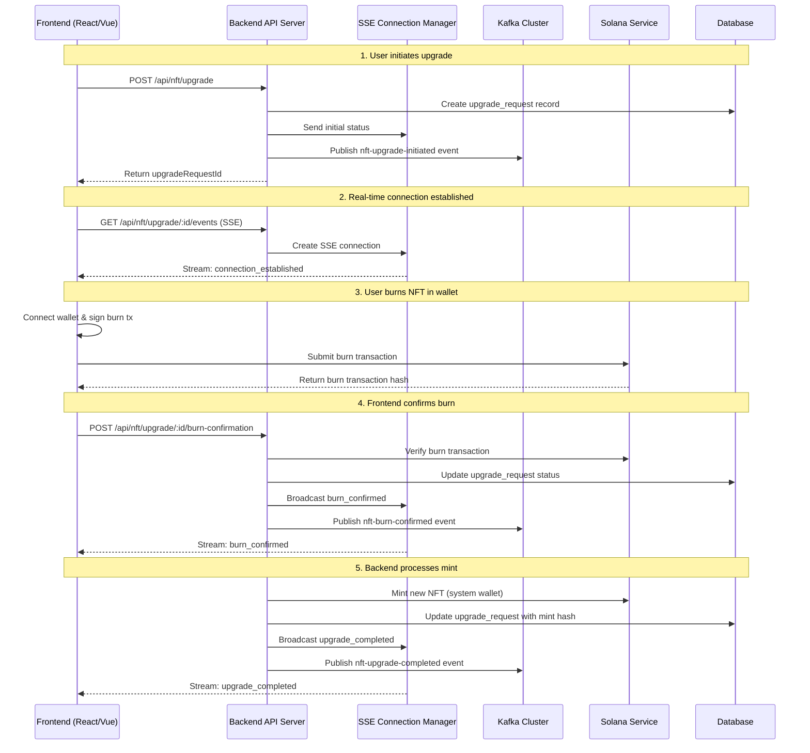
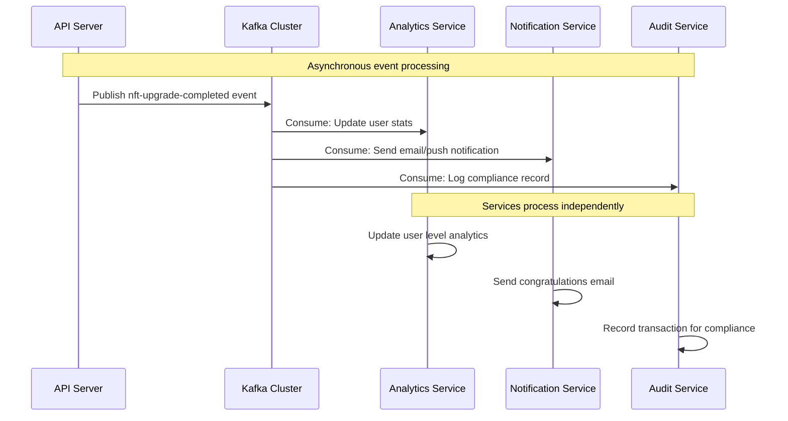

# Frontend-Backend Communication Architecture

## Overview

This document clarifies the communication patterns between frontend and backend in the AIW3 NFT system, explaining how Kafka, HTTP/2, and REST APIs work together.

## Key Architectural Principles

### 1. **Frontend ↔ Backend: Direct HTTP Communication**
- **Frontend NEVER connects directly to Kafka**
- All user-initiated requests go through HTTP/REST APIs
- Real-time updates use HTTP/2 Server-Sent Events (SSE)
- Kafka is purely a **backend-internal** messaging system

### 2. **Kafka Role: Backend Service Decoupling**
- Decouples backend microservices from each other
- Handles asynchronous processing between backend services
- Event sourcing and audit trails
- Does NOT decouple frontend from backend

## Communication Flow Diagrams

### User-Initiated NFT Upgrade Flow



### Backend Service Communication (Kafka-based)



## Communication Patterns Explained

### 1. **Frontend-Backend Direct Communication**

```typescript
// Frontend: Direct HTTP calls to backend
class NFTUpgradeClient {
  // REST API calls - synchronous request/response
  async initiateUpgrade(nftId: string, targetLevel: number) {
    const response = await fetch('/api/nft/upgrade', {
      method: 'POST',
      body: JSON.stringify({ currentNftId: nftId, targetLevel })
    });
    return response.json(); // Returns upgradeRequestId immediately
  }

  // SSE connection - real-time updates from server
  subscribeToUpdates(upgradeRequestId: string, onUpdate: Function) {
    const eventSource = new EventSource(`/api/nft/upgrade/${upgradeRequestId}/events`);
    eventSource.onmessage = (event) => {
      const data = JSON.parse(event.data);
      onUpdate(data); // Real-time status updates
    };
  }
}
```

### 2. **Backend Kafka Integration** 

```typescript
// Backend: Kafka for internal service communication
class NFTUpgradeService {
  async completeUpgrade(upgradeRequest: UpgradeRequest) {
    // Update database
    await this.updateUpgradeStatus(upgradeRequest.id, 'completed');
    
    // Send real-time update to frontend via SSE
    this.sseManager.broadcastToUser(upgradeRequest.userId, {
      type: 'upgrade_completed',
      message: 'Your NFT upgrade is complete!'
    });
    
    // Publish event for other backend services
    await this.kafkaProducer.send({
      topic: 'nft-upgrade-completed',
      messages: [{
        key: upgradeRequest.userId,
        value: JSON.stringify({
          userId: upgradeRequest.userId,
          oldLevel: upgradeRequest.currentLevel,
          newLevel: upgradeRequest.targetLevel,
          timestamp: new Date().toISOString()
        })
      }]
    });
  }
}

// Other backend services consume Kafka events
class AnalyticsService {
  async processUpgradeCompleted(event: NFTUpgradeCompletedEvent) {
    // Update user statistics
    await this.updateUserLevelStats(event.userId, event.newLevel);
    
    // Update leaderboards
    await this.updateLeaderboards(event.userId);
    
    // No direct communication with frontend needed
  }
}
```

## Concurrency Control for NFT Updates

### 1. **Database-Level Concurrency Control**

```sql
-- Optimistic locking with version control
CREATE TABLE user_nfts (
  id VARCHAR(36) PRIMARY KEY,
  user_id VARCHAR(36) NOT NULL,
  level INTEGER NOT NULL,
  status VARCHAR(20) NOT NULL,
  version INTEGER NOT NULL DEFAULT 1, -- Version for optimistic locking
  created_at TIMESTAMP DEFAULT NOW(),
  updated_at TIMESTAMP DEFAULT NOW(),
  
  UNIQUE INDEX idx_user_active_nft (user_id, status) WHERE status = 'active',
  INDEX idx_user_id (user_id),
  INDEX idx_status (status)
);

-- Upgrade request table with status constraints
CREATE TABLE upgrade_requests (
  id VARCHAR(36) PRIMARY KEY,
  user_id VARCHAR(36) NOT NULL,
  current_nft_id VARCHAR(36) NOT NULL,
  status VARCHAR(20) NOT NULL,
  created_at TIMESTAMP DEFAULT NOW(),
  
  -- Prevent multiple active upgrades per user
  UNIQUE INDEX idx_user_active_upgrade (user_id) WHERE status IN ('initiated', 'burn_pending', 'burn_confirmed', 'mint_pending'),
  
  CONSTRAINT fk_current_nft FOREIGN KEY (current_nft_id) REFERENCES user_nfts(id)
);
```

### 2. **Application-Level Concurrency Control**

```typescript
class NFTUpgradeService {
  // Distributed lock using Redis
  private async acquireUpgradeLock(userId: string): Promise<string | null> {
    const lockKey = `upgrade_lock:${userId}`;
    const lockValue = uuidv4();
    const ttl = 300; // 5 minutes
    
    const acquired = await this.redis.set(
      lockKey, 
      lockValue, 
      'PX', ttl * 1000, 
      'NX' // Only set if not exists
    );
    
    return acquired === 'OK' ? lockValue : null;
  }
  
  private async releaseUpgradeLock(userId: string, lockValue: string): Promise<void> {
    const lockKey = `upgrade_lock:${userId}`;
    
    // Lua script for atomic lock release
    const script = `
      if redis.call('get', KEYS[1]) == ARGV[1] then
        return redis.call('del', KEYS[1])
      else
        return 0
      end
    `;
    
    await this.redis.eval(script, 1, lockKey, lockValue);
  }

  async initiateUpgrade(userId: string, currentNftId: string, targetLevel: number): Promise<UpgradeRequest> {
    // Acquire distributed lock
    const lockValue = await this.acquireUpgradeLock(userId);
    if (!lockValue) {
      throw createUpgradeError(
        UpgradeErrorType.INVALID_NFT_STATE,
        'User already has an active upgrade process',
        false
      );
    }

    try {
      // Start database transaction
      return await this.db.transaction(async (trx) => {
        // Check for existing active upgrades with SELECT FOR UPDATE
        const activeUpgrades = await trx('upgrade_requests')
          .where('user_id', userId)
          .whereIn('status', ['initiated', 'burn_pending', 'burn_confirmed', 'mint_pending'])
          .forUpdate(); // Row-level lock
          
        if (activeUpgrades.length > 0) {
          throw createUpgradeError(
            UpgradeErrorType.INVALID_NFT_STATE,
            'User already has an active upgrade request',
            false
          );
        }

        // Verify NFT ownership with optimistic locking
        const currentNft = await trx('user_nfts')
          .where('id', currentNftId)
          .where('user_id', userId)
          .where('status', 'active')
          .forUpdate()
          .first();

        if (!currentNft) {
          throw createUpgradeError(
            UpgradeErrorType.INVALID_NFT_STATE,
            'NFT not found or not owned by user',
            false
          );
        }

        // Create upgrade request
        const upgradeRequest = await trx('upgrade_requests').insert({
          id: uuidv4(),
          user_id: userId,
          current_nft_id: currentNftId,
          target_level: targetLevel,
          status: 'initiated',
          created_at: new Date(),
          updated_at: new Date()
        }).returning('*');

        return upgradeRequest[0];
      });

    } finally {
      // Always release the lock
      await this.releaseUpgradeLock(userId, lockValue);
    }
  }
}
```

### 3. **Queue-Based Processing**

```typescript
// Use job queues for processing concurrent requests
class UpgradeQueueService {
  private queue = new Bull('nft-upgrade-queue', {
    redis: { host: 'localhost', port: 6379 },
    defaultJobOptions: {
      attempts: 3,
      backoff: 'exponential',
      delay: 2000
    }
  });

  constructor(private upgradeService: NFTUpgradeService) {
    // Process one upgrade per user at a time
    this.queue.process('process-upgrade', 1, this.processUpgrade.bind(this));
  }

  async queueUpgrade(userId: string, upgradeData: any): Promise<void> {
    await this.queue.add('process-upgrade', {
      userId,
      upgradeData,
      timestamp: Date.now()
    }, {
      // Ensure only one upgrade job per user
      jobId: `upgrade-${userId}`
    });
  }

  private async processUpgrade(job: Bull.Job): Promise<void> {
    const { userId, upgradeData } = job.data;
    
    try {
      await this.upgradeService.processUpgradeRequest(userId, upgradeData);
    } catch (error) {
      console.error(`Upgrade failed for user ${userId}:`, error);
      throw error; // Will trigger retry based on job configuration
    }
  }
}
```

## HTTP/2 Connection Management

### 1. **Connection Pooling and Limits**

```typescript
class SSEConnectionManager {
  private connections = new Map<string, SSEConnection>();
  private readonly maxConnectionsPerUser = 3; // Limit concurrent connections per user
  private readonly maxTotalConnections = 1000;

  addConnection(connection: SSEConnection): boolean {
    // Check per-user connection limit
    const userConnections = Array.from(this.connections.values())
      .filter(conn => conn.userId === connection.userId);
      
    if (userConnections.length >= this.maxConnectionsPerUser) {
      // Close oldest connection for this user
      const oldestConnection = userConnections
        .sort((a, b) => a.createdAt.getTime() - b.createdAt.getTime())[0];
      this.removeConnection(oldestConnection.id);
    }

    // Check total connection limit
    if (this.connections.size >= this.maxTotalConnections) {
      this.evictOldestConnection();
    }

    this.connections.set(connection.id, connection);
    return true;
  }
}
```

### 2. **Rate Limiting**

```typescript
// Rate limiting middleware
const upgradeRateLimit = rateLimit({
  windowMs: 60 * 1000, // 1 minute
  max: 5, // Maximum 5 upgrade requests per minute per IP
  keyGenerator: (req) => {
    return `${req.ip}:${req.user?.id || 'anonymous'}`;
  },
  message: {
    success: false,
    error: 'Too many upgrade requests, please try again later'
  }
});

// Apply to upgrade endpoints
router.post('/api/nft/upgrade', upgradeRateLimit, async (req, res) => {
  // Upgrade logic
});
```

## Summary

### **Communication Architecture:**

1. **Frontend ↔ Backend**: Direct HTTP/REST + HTTP/2 SSE
   - User requests via REST APIs
   - Real-time updates via Server-Sent Events
   - NO direct Kafka connection from frontend

2. **Backend Services ↔ Kafka**: Asynchronous messaging
   - Event-driven architecture between backend services
   - Decouples services for scalability and reliability
   - Analytics, notifications, audit trails

3. **Concurrency Control**:
   - Database constraints and transactions
   - Distributed locks (Redis)
   - Job queues for sequential processing
   - Connection pooling and rate limiting

### **Why This Architecture?**

- **Scalability**: HTTP/2 multiplexing + connection limits
- **Reliability**: Persistent state + retry mechanisms  
- **Performance**: Direct HTTP for user requests, async Kafka for backend processing
- **Security**: User authentication on HTTP endpoints, internal Kafka messaging
- **Maintainability**: Clear separation between user-facing and internal communications

The system safely handles concurrent NFT updates through multiple layers of protection while maintaining real-time user experience through optimized HTTP/2 connections.

