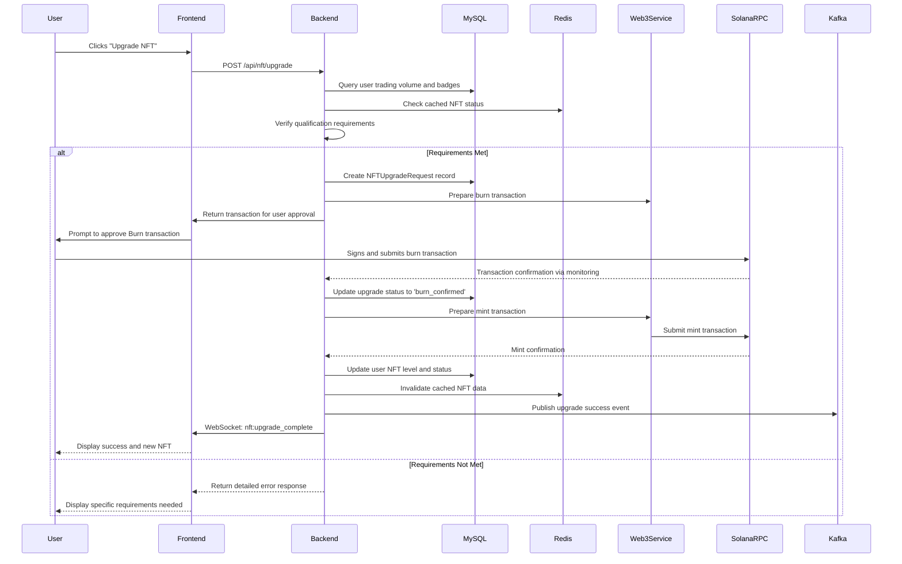
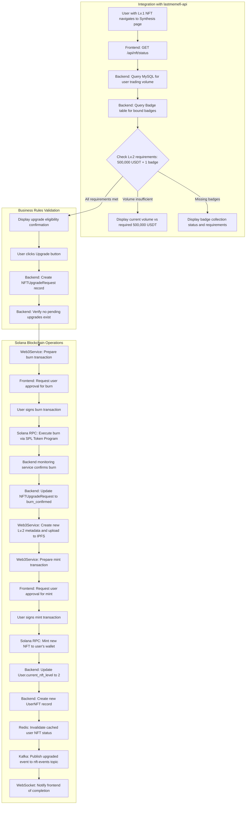
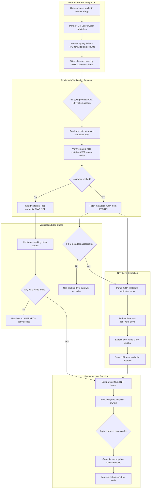

# Implementation Guide Index

<!-- Document Metadata -->
**Version:** v1.0.0  
**Last Updated:** 2025-08-07  
**Status:** Active  
**Purpose:** Navigation index for all AIW3 NFT implementation guides.

---

## Overview

The AIW3 NFT implementation has been organized into focused, single-responsibility guides to ensure clear separation of concerns and easier maintenance. Each guide covers a specific aspect of the implementation process.

## Implementation Guides

### 🏗️ [Backend Implementation Guide](./Backend-Implementation-Guide.md)
**Focus:** Backend services, APIs, and database integration
- NFTService creation and implementation
- NFTController API endpoints
- Database schema integration
- Service configuration and testing

### 🎨 [Frontend Implementation Guide](./Frontend-Implementation-Guide.md)  
**Focus:** User interface and frontend application development
- Personal Center implementation
- Wallet integration patterns
- API connectivity and state management
- Component development and user flows

### ⛓️ [Blockchain Integration Guide](./Blockchain-Integration-Guide.md)
**Focus:** Solana blockchain integration and operations
- Standard Solana programs integration
- Web3Service extension and configuration
- Transaction handling and monitoring
- Blockchain event processing

### 📋 [Process Flow Reference](./Process-Flow-Reference.md)
**Focus:** Complete system workflows and user interaction flows
- New user onboarding procedures
- NFT upgrade and burn-and-mint workflows  
- Error handling and recovery procedures
- System state management flows

## Supporting Documentation

### 📊 [Implementation Roadmap](./AIW3-NFT-Implementation-Roadmap.md)
Project phases, timeline, and dependencies for implementation planning.

### 🔌 [API Frontend Integration](./api-frontend/API-Frontend-Integration-Specification.md)
Complete API specifications, endpoints, and frontend integration patterns.

### 📝 [Issues Tracking](./issues-tracking/AIW3-NFT-Integration-Issues-PRs.md)
Development issues, PRs, and project tracking documentation.

## Quick Start

1. **Begin with Backend:** Start with the [Backend Implementation Guide](./Backend-Implementation-Guide.md) to set up core services
2. **Add Blockchain Integration:** Follow the [Blockchain Integration Guide](./Blockchain-Integration-Guide.md) for Solana connectivity
3. **Build Frontend:** Use the [Frontend Implementation Guide](./Frontend-Implementation-Guide.md) for UI development
4. **Reference Workflows:** Consult the [Process Flow Reference](./Process-Flow-Reference.md) for complete user flows

## Development Standards

For coding conventions, build commands, and development practices, see [AGENT.md](../../../AGENT.md).

## ⚡ Quick Development Reference

For instant access to build commands, test procedures, and coding conventions while implementing features, see **[AGENT.md](../AGENT.md)**.

## 📋 Official Testing & Acceptance Criteria


This document defines the acceptance criteria and testing standards that serve as the **definitive specification** for the NFT system implementation. Any feature or functionality not meeting these standards will be rejected during QA.

---

## Table of Contents

1.  [Standard Solana Programs Integration](#standard-solana-programs-integration)
    -   [Standard Program Dependencies](#1-standard-program-dependencies)
    -   [Backend Business Logic Implementation](#2-backend-business-logic-implementation)
    -   [Security Through Standard Programs](#3-security-through-standard-programs)
    -   [Integration Testing and Deployment](#4-integration-testing-and-deployment)
2.  [Backend Services](#backend-services)
    -   [1. NFT Service (`NFTService.js`)](#1-nft-service-nftservicejs)
    -   [2. API Endpoint Creation & Frontend Integration](#2-api-endpoint-creation--frontend-integration)
    -   [3. Monitoring Service](#3-monitoring-service)
3.  [Frontend Application Development](#frontend-application-development)
    -   [Personal Center Dashboard](#personal-center-dashboard)
    -   [Synthesis (Upgrade) Interface](#synthesis-upgrade-interface)
4.  [NFT Upgrade and Burn Strategy](#nft-upgrade-and-burn-strategy)
    -   [Recommended Model: Burn-and-Mint](#recommended-model-burn-and-mint)
    -   [Burn-and-Mint Workflow](#burn-and-mint-workflow)
5.  [Error Handling and Resilience](#error-handling-and-resilience)
6.  [Integration Process Flows](#integration-process-flows)
    -   [New User Onboarding and First NFT Claim](#1-new-user-onboarding-and-first-nft-claim)
    -   [NFT Synthesis (Upgrade) Flow](#2-nft-synthesis-upgrade-flow)

---

## Standard Solana Programs Integration

The AIW3 NFT system uses **only standard Solana programs** without requiring any custom smart contract development. This approach leverages battle-tested blockchain functionality while eliminating development complexity and security risks.

### 1. **Standard Program Dependencies**
- **Action:** Integrate with existing Solana programs using standard libraries and SDKs.
  - **SPL Token Program:** Use for all NFT minting, burning, and transfer operations
  - **Metaplex Token Metadata Program:** Use for NFT metadata management and creator verification
  - **Associated Token Account Program:** Use for user wallet NFT storage
- **Rationale:** Using standard programs eliminates custom development complexity, reduces security risks, and ensures compatibility with the entire Solana ecosystem.

### 2. **Backend Business Logic Implementation**
- **Action:** Implement all business rules in the backend service layer, not on-chain.
  - **Level Verification:** Backend verifies user qualifications before authorizing minting operations
  - **Upgrade Logic:** Backend orchestrates the burn-and-mint process using standard token operations
  - **Access Control:** Backend controls system wallet operations and user authorization
- **Rationale:** Off-chain business logic provides flexibility for rule changes while on-chain operations remain simple and standard.

### 3. **Security Through Standard Programs**
- **Action:** Leverage the security of battle-tested standard Solana programs.
  - **Proven Security:** SPL Token and Metaplex programs have been extensively audited and tested
  - **Access Controls:** Use standard token authority patterns for secure operations
  - **No Custom Attack Vectors:** Eliminates security risks from custom smart contract code
- **Rationale:** Standard programs provide enterprise-grade security without the risks and costs of custom smart contract development and auditing.

### 4. **Integration Testing and Deployment**
- **Action:** Test integration with standard Solana programs and deploy backend services.
  - **Standard Program Integration Tests:** Test interactions with SPL Token and Metaplex programs
  - **Backend Service Tests:** Test business logic and standard program interactions
  - **Deployment Scripts:** Automate backend service deployment and configuration
- **Rationale:** Testing focuses on integration with proven standard programs rather than custom contract logic, reducing complexity and risk.

---

## Backend Services

The backend is the intermediary between the user-facing frontend and the standard Solana programs.

### 1. **NFT Service (`NFTService.js`)** - 🚨 **TO BE CREATED**

**⚠️ IMPLEMENTATION STATUS: SERVICE DOES NOT EXIST**

**Step-by-Step Creation Process:**

1. **Create the service file:**
   ```bash
   cd $HOME/aiw3/lastmemefi-api
   touch api/services/NFTService.js
   ```

2. **Implement complete NFTService:**
   ```javascript
   // api/services/NFTService.js
   module.exports = {
     
     // Calculate user's total trading volume from Trades model
     calculateTradingVolume: async function(userId) {
       try {
         const query = `
           SELECT SUM(total_usd_price) as trading_volume 
           FROM trades 
           WHERE user_id = ? AND total_usd_price IS NOT NULL
         `;
         const result = await sails.sendNativeQuery(query, [userId]);
         return parseFloat(result.rows[0]?.trading_volume) || 0;
       } catch (error) {
         sails.log.error('Trading volume calculation failed:', error);
         return 0;
       }
     },

     // Check if user qualifies for NFT level
     checkNFTQualification: async function(userId, targetLevel) {
       try {
         // Get volume requirement for level
         const requiredVolume = this.getRequiredVolumeForLevel(targetLevel);
         
         // Calculate actual trading volume
         const tradingVolume = await this.calculateTradingVolume(userId);
         
         // Check existing NFTs
         const existingNFT = await UserNFT.findOne({
           user_id: userId,
           nft_level: { '>=': targetLevel },
           is_active: true
         });
         
         return {
           qualified: tradingVolume >= requiredVolume && !existingNFT,
           currentVolume: tradingVolume,
           requiredVolume: requiredVolume,
           targetLevel: targetLevel,
           hasExistingNFT: !!existingNFT
         };
       } catch (error) {
         sails.log.error('NFT qualification check failed:', error);
         return { qualified: false, reason: 'System error' };
       }
     },

     // Get required trading volume for NFT level
     getRequiredVolumeForLevel: function(level) {
       const requirements = {
         1: 100000,    // $100K for Level 1
         2: 500000,    // $500K for Level 2  
         3: 5000000,   // $5M for Level 3
         4: 10000000,   // $10M for Level 4
         5: 50000000   // $50M for Level 5
       };
       return requirements[level] || 0;
     }
   };
   ```

3. **Test the service:**
   ```bash
   # Start sails console
   sails console
   # Test in console:
   # NFTService.calculateTradingVolume(1)
   ```

- **Rationale:** A dedicated service encapsulates NFT logic, making the system modular and easier to maintain.

### 2. **API Endpoint Creation & Frontend Integration**
- **Action:** Develop a comprehensive REST API with standardized endpoints and real-time communication for seamless frontend integration.

#### API Endpoints Overview

**Reference**: Complete API specifications, endpoint documentation, request/response formats, WebSocket events, and frontend integration patterns are available in the [API Frontend Integration Specification](./api-frontend/API-Frontend-Integration-Specification.md).

#### NFT Controller Implementation

1. **Create NFTController:**
   ```bash
   cd $HOME/aiw3/lastmemefi-api
   touch api/controllers/NFTController.js
   ```

2. **Implement controller methods:**
   ```javascript
   // api/controllers/NFTController.js
   module.exports = {
     
     getUserNFTStatus: async function(req, res) {
       try {
         // Feature flag check
         if (!sails.config.nftFeatures?.enabled) {
           return res.badRequest('NFT features are currently disabled');
         }

         const userId = req.user.id;
         
         // Get user's current NFTs
         const userNFTs = await UserNFT.find({
           user_id: userId,
           is_active: true
         });

         // Check qualification for next level
         const currentLevel = userNFTs.length > 0 ? Math.max(...userNFTs.map(nft => nft.nft_level)) : 0;
         const nextLevel = currentLevel + 1;
         const qualification = await NFTService.checkNFTQualification(userId, nextLevel);

         return res.json({
           success: true,
           data: {
             currentNFTs: userNFTs,
             currentLevel: currentLevel,
             nextLevel: nextLevel,
             qualification: qualification
           }
         });
       } catch (error) {
         sails.log.error('Failed to get NFT status:', error);
         return res.serverError('Failed to get NFT status');
       }
     },

     claimInitialNFT: async function(req, res) {
       try {
         // Feature flag check
         if (!sails.config.nftFeatures?.enabled) {
           return res.badRequest('NFT features are currently disabled');
         }

         const userId = req.user.id;

         // Check if user already has an NFT
         const existingNFT = await UserNFT.findOne({
           user_id: userId,
           is_active: true
         });

         if (existingNFT) {
           return res.badRequest('User already has an NFT');
         }

         // Check qualification for Level 1
         const qualification = await NFTService.checkNFTQualification(userId, 1);
         
         if (!qualification.qualified) {
           return res.forbidden({
             message: 'Not qualified for NFT',
             qualification: qualification
           });
         }

         // TODO: Implement actual minting in Phase 2
         return res.json({
           success: true,
           message: 'NFT claiming will be implemented in Phase 2',
           qualification: qualification
         });
       } catch (error) {
         sails.log.error('Failed to claim NFT:', error);
         return res.serverError('Failed to claim NFT');
       }
     }
   };
   ```

3. **Add routes:**
   ```javascript
   // Add to config/routes.js
   'GET /api/nft/status': 'NFTController.getUserNFTStatus',
   'POST /api/nft/claim': 'NFTController.claimInitialNFT',
   ```

**Key Integration Features:**
- Standardized REST API endpoints for all NFT operations
- Real-time WebSocket events for status updates
- JWT authentication integration
- Comprehensive error handling patterns

- **Rationale:** Comprehensive API design with frontend integration support ensures seamless end-to-end functionality and developer productivity.

### 2. **Solana Integration**
- **Action:** Use the `@solana/web3.js` library to communicate with the Solana network.
  - **RPC Communication:** Connect to a Solana RPC node to read on-chain data and submit transactions.
  - **Standard Operations:** Use SPL Token Program instructions for minting, burning, and transferring NFTs.
  - **Metadata Management:** Use Metaplex Token Metadata Program for NFT metadata operations.
- **Rationale:** Direct integration with standard Solana programs allows the backend to verify on-chain state and execute transactions without custom smart contract complexity.

### 3. **Monitoring Service**
- **Action:** Develop a background service to monitor the blockchain for relevant events.
  - **Event Listener:** Use WebSocket connections to listen for `Mint` and `Burn` events related to the NFT collection.
  - **Cache Updates:** Update Redis NFT status cache in real-time as events occur using `RedisService.delCache()` for cache invalidation.
- **Rationale:** A monitoring service ensures that the off-chain database remains synchronized with the on-chain state, providing users with an accurate and up-to-date view of their assets.

---

## Frontend Application Development

This section outlines the structure and key components of the user-facing application. All frontend development revolves around the **Personal Center**, which serves as the core feature and central hub for all user interaction. The design must align with the user experience flows detailed in the `aiw3-prototypes`.

### 1. **The Personal Center: A Central Hub**

The Personal Center is the primary interface for users to manage their NFTs, track progress, and interact with the AIW3 community. It provides a consolidated view of a user's status and achievements.

**Key Features:**
- **NFT Status Display:** Clearly visualizes the user's currently held NFT, its tier, and associated benefits. It must handle two primary states based on the prototypes:
  - **Unlocked:** Displays the NFT the user owns, along with options for synthesis.
  - **Unlockable:** Shows the next available NFT tier and the requirements to obtain it.
- **Synthesis (Upgrade) Interface:** A dedicated module where users can initiate the burn-and-mint upgrade process. The UI must clearly communicate the requirements and outcomes, as seen in `4. Synthesis.png` and `5. VIP2 Synthesis Success.png`.
- **Badge Display:** A section to display collected badges (`6. Micro Badge.png`), which are prerequisites for certain NFT tier upgrades.
- **Community Hub Integration:** Features a link to the user's public-facing "Mini Homepage" (`9. Community-Mini Homepage.png`) to foster social interaction and display achievements to others.

### 2. **Wallet Integration**
- **Action:** Integrate a wallet adapter library (e.g., `@solana/wallet-adapter`).
  - **Supported Wallets:** Add support for popular wallets like Phantom, Solflare, and Backpack.
- **Rationale:** A robust wallet adapter is crucial for secure and seamless user interaction with the Solana blockchain.

### 3. **API Integration**
- **Action:** Connect the frontend components to the backend API endpoints.
  - **Data Fetching:** Use `GET /api/nft/status` to populate the Personal Center with the user's NFT data, progress, and eligibility.
  - **Transaction Submission:** When a user initiates an upgrade, call the `POST` endpoint to have the backend construct and submit the on-chain transaction.
- **Rationale:** API integration links the user interface to the underlying business logic, creating a fully functional application.

---

## Comprehensive NFT Business Flows

### Overview

This section is dedicated to ensuring every NFT-related business flow and process is thoroughly documented. It references the in-depth breakdown in the newly created **AIW3 NFT Business Flows and Processes** document, focusing purely on actionable components and major tasks relating to NFT management.

## Frontend Application

The frontend is the user's primary interface for interacting with the AIW3 NFT system.

### 1. **UI/UX Mockup Translation**
- **Action:** Convert the static prototype images into interactive UI components using a framework like React or Vue.
  - **Personal Center:** A dashboard displaying the user's current NFT, benefits, and progress.
  - **Synthesis Flow:** A step-by-step modal or page that guides the user through the process of unlocking a new tier.
- **Rationale:** A clean and intuitive UI is essential for a positive user experience, especially for complex processes like NFT upgrades.

### 2. **Wallet Integration**
- **Action:** Integrate a wallet adapter library (e.g., `@solana/wallet-adapter`).
  - **Supported Wallets:** Add support for popular wallets like Phantom, Solflare, and Backpack.
  - **Connection Management:** Handle wallet connection, disconnection, and account change events.
- **Rationale:** Wallet integration is the foundation of any dApp, allowing users to securely manage their keys and sign transactions.

### 3. **Component Development**
- **Action:** Build the core React/Vue components that make up the user interface.
  - `NftCard`: A reusable component to display an NFT's image, name, and level.
  - `ProgressBar`: A visual indicator of the user's progress toward the next tier's trading volume requirement.
  - `BenefitList`: A component that dynamically displays the benefits associated with the user's current NFT tier.
- **Rationale:** A component-based architecture promotes code reuse and makes the application easier to maintain and scale.

### 4. **API Integration**
- **Action:** Connect the frontend components to the backend REST API.
  - **Data Fetching:** Use a library like `axios` or `fetch` to call the `GET` endpoints and display the data.
  - **Transaction Submission:** When a user initiates an upgrade, call the `POST` endpoint to have the backend construct and submit the on-chain transaction.
- **Rationale:** API integration links the user interface to the underlying business logic, creating a fully functional application.

---

## NFT Upgrade and Burn Strategy

This section outlines the recommended strategy for handling NFT upgrades, focusing on a **Burn-and-Mint** model to ensure system integrity and prevent duplicate benefits.

### Burn-and-Mint Model

The most secure and straightforward approach is to require the user to **burn** their lower-level NFT before the system **mints** the new, higher-level NFT.

**Key Advantages:**
- **Prevents Double-Dipping:** It is impossible for a user to hold two different levels of Equity NFTs simultaneously, ensuring they cannot claim benefits from both.
- **Atomic State Transition:** The state change is clear and unambiguous. The user either has the old NFT or the new one, never both.
- **Simplified Auditing:** It is easy to verify on-chain that the old NFT was destroyed before the new one was created.


### Burn-and-Mint Workflow



### User Experience Considerations

- **Clear Communication:** The UI must clearly explain to the user that their old NFT will be permanently destroyed as part of the upgrade process.
- **Two-Step Approval:** The user should be required to approve two separate actions:
  1.  An initial confirmation in the UI (e.g., a checkbox saying, "I understand my Lv.1 NFT will be burned").
  2.  The final transaction approval in their wallet.
- **Transaction Status Tracking:** The frontend should provide real-time feedback on the status of the burn and mint transactions, so the user is not left wondering what is happening.

## Error Handling and Resilience

This section outlines the comprehensive error handling strategies and resilience patterns implemented throughout the AIW3 NFT system. For a complete reference, see the [AIW3 NFT Error Handling Reference](./AIW3-NFT-Error-Handling-Reference.md).

### Error Categories

1. **Transient Errors** (Automatic Retry)
   - Network timeouts and connectivity issues
   - Solana RPC rate limiting
   - IPFS via Pinata temporary unavailability
   - Lock timeouts due to high contention

2. **Permanent Errors** (User Action Required)
   - Invalid user wallet addresses
   - Insufficient system wallet balance
   - Malformed metadata or image data
   - Authentication/authorization failures

3. **Critical Errors** (Immediate Escalation)
   - System wallet private key compromise
   - Nonce desynchronization requiring manual fix
   - Database corruption or inconsistency
   - Security breach or unauthorized access

### Key Error Handling Patterns

#### 1. Exponential Backoff Retry
```javascript
async function withExponentialBackoff(fn, maxRetries = 3, initialDelay = 1000) {
  for (let attempt = 0; attempt <= maxRetries; attempt++) {
    try {
      return await fn();
    } catch (error) {
      if (!isRetryable(error) || attempt === maxRetries) throw error;
      await new Promise(resolve => 
        setTimeout(resolve, initialDelay * Math.pow(2, attempt)));
    }
  }
}
```

#### 2. Circuit Breaker Pattern
```javascript
class CircuitBreaker {
  constructor(failureThreshold = 5, resetTimeout = 60000) {
    this.failureThreshold = failureThreshold;
    this.resetTimeout = resetTimeout;
    this.failureCount = 0;
    this.lastFailureTime = null;
    this.state = 'CLOSED';
  }
  
  async execute(fn) {
    if (this.state === 'OPEN') {
      if (Date.now() - this.lastFailureTime > this.resetTimeout) {
        this.state = 'HALF-OPEN';
      } else {
        throw new Error('Circuit breaker is open');
      }
    }
    
    try {
      const result = await fn();
      if (this.state === 'HALF-OPEN') this.reset();
      return result;
    } catch (error) {
      this.recordFailure();
      throw error;
    }
  }
}
```

### Solana-Specific Error Handling

#### Common Solana Errors
- **Blockhash not found**: Refresh blockhash and retry
- **Insufficient lamports**: Check and top up system wallet
- **AccountInUse**: Implement proper account management
- **AccountNotFound**: Verify account creation

### IPFS Error Handling

#### Multiple Gateway Strategy
```javascript
const gateways = [
  'https://gateway.pinata.cloud/ipfs/',
  'https://ipfs.io/ipfs/',
  'https://cloudflare-ipfs.com/ipfs/'
];

async function fetchFromIPFS(hash) {
  let lastError;
  for (const gateway of gateways) {
    try {
      const response = await fetch(`${gateway}${hash}`);
      if (response.ok) return await response.json();
    } catch (error) {
      lastError = error;
    }
  }
  throw lastError || new Error('All IPFS gateways failed');
}
```

### Monitoring and Alerting

#### Key Metrics
- **API Error Rate**: By endpoint and error type
- **Solana RPC Performance**: Success rate and latency
- **IPFS Upload Success Rate**: Track failures and retries
- **Database Query Performance**: Slow queries and timeouts

#### Alert Thresholds
| Metric | Warning | Critical |
|--------|---------|----------|
| API Error Rate | > 1% | > 5% |
| Solana RPC Error Rate | > 2% | > 10% |
| IPFS Upload Failure Rate | > 5% | > 20% |
| Database Query Time | > 500ms | > 2000ms |

### Recovery Procedures

#### Failed NFT Mint Recovery
1. **Detect Failure**: Monitor for pending transactions exceeding expected confirmation time
2. **Verify State**: Check Solana blockchain for transaction status
3. **Recovery Actions**:
   - If transaction failed but not submitted: Retry with new blockhash
   - If transaction confirmed but NFT not in wallet: Resync wallet state
   - If IPFS upload failed: Retry upload with new CID

For complete implementation details and additional error handling patterns, refer to the [AIW3 NFT Error Handling Reference](./AIW3-NFT-Error-Handling-Reference.md).

---

## Detailed Process Flows

This section provides detailed, step-by-step flows for the key processes in the NFT system.

### 1. New User Onboarding and First NFT Claim

**Goal:** A new user joins the platform, claims their initial Lv.1 Equity NFT to an `unlocked` state, and then activates it.

```mermaid
flowchart TD
    A[User connects wallet to AIW3 for the first time] --> B[Wallet signature verification via existing SolanaChainAuth]
    B --> C{Check user in MySQL database}
    C -->|New User| D[Create User record with wallet_address]
    C -->|Existing User| E[Load user data and trading history]
    D --> F[Check if user qualifies for Lv.1 NFT]
    E --> F
    F --> G{Meets 100,000 USDT volume requirement?}
    G -->|Yes| H[Mark Lv.1 NFT as unlockable in UserNFTQualification table]
    G -->|No| I[Display volume requirement progress]
    H --> J[Frontend: Display Claim Your Lv.1 NFT button]
    J --> K[User clicks Claim]
    K --> L[Backend: Upload image to IPFS via Pinata]
    L --> M[Backend: Create and upload metadata JSON to IPFS]
    M --> N[Web3Service: Prepare mint transaction with metadata URI]
    N --> O[Frontend: Prompt user to approve transaction]
    O --> P[User approves via wallet]
    P --> Q[SPL Token Program mints NFT to user's ATA]
    Q --> R[Backend: Create UserNFT record in MySQL with 'unlocked' status]
    R --> S[Backend: Publish 'unlocked' event to Kafka nft-events topic]
    S --> T[Frontend: WebSocket notification and NFT display with 'Activate' button]
    T --> U[User clicks Activate]
    U --> V[Backend: Prepare on-chain activation transaction]
    V --> W[Frontend: Prompt user to approve activation]
    W --> X[User approves via wallet]
    X --> Y[On-chain activation logic executes]
    Y --> Z[Backend: Update UserNFT record to 'active' status]
    Z --> AA[Backend: Publish 'activated' event to Kafka]
    AA --> BB[Frontend: WebSocket notification and updated NFT display]
```



### 2. NFT Synthesis (Upgrade) Flow

**Goal:** An existing user with a Lv.1 NFT upgrades to a Lv.2 NFT.



### 3. Third-Party Verification Flow

**Goal:** An external partner (e.g., another dApp) wants to verify a user's NFT level to grant them special access.



---


