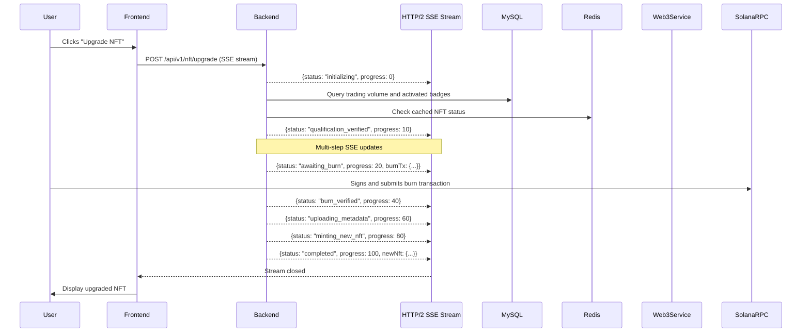
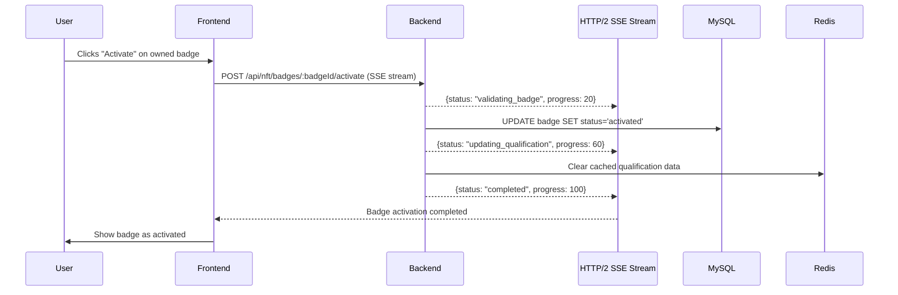

# HTTP/2 SSE Documentation Updates Plan

<!-- Document Metadata -->
**Version:** v1.1.0  
**Last Updated:** 2025-08-08  
**Status:** Active  
**Purpose:** Comprehensive update plan for integrating HTTP/2 Server-Sent Events into existing NFT Solana documentation

---

## Overview

This document outlines the specific changes needed to update existing AIW3 NFT Solana documentation to incorporate HTTP/2 Server-Sent Events (SSE) for multi-step business processes. The original design used traditional WebSocket/RESTful approaches, which need to be updated to reflect the HTTP/2 SSE architecture decision.

---

## Files Requiring Updates

### 1. Process-Flow-Reference.md
**Location:** `/docs/technical/implementation/Process-Flow-Reference.md`
**Update Priority:** HIGH
**Changes Required:**

#### Section: "NFT Upgrade Flow" (Lines 132-175)
**Current:** WebSocket events (`WebSocket: nft:upgrade_complete`)
**Update To:**


#### Section: "Badge Activation Flow" (Lines 93-127)
**Add HTTP/2 SSE Support:**


---

### 2. Frontend-Implementation-Guide.md
**Location:** `/docs/technical/implementation/Frontend-Implementation-Guide.md`
**Update Priority:** HIGH
**Changes Required:**

#### Section: "API Integration" (Lines 190-290)
**Add New Section:** "HTTP/2 SSE Integration"

```markdown
### 4. HTTP/2 SSE Integration

#### NFT Upgrade Hook with SSE
```jsx
import { useState, useRef, useCallback } from 'react';

export const useNFTUpgradeSSE = () => {
  // Implementation from HTTP2-SSE-Integration-Guide.md
  // Full implementation provided in the main SSE guide
};
```

#### Badge Activation with SSE
```jsx
export const useBadgeActivationSSE = () => {
  const [activationState, setActivationState] = useState({
    status: 'idle',
    progress: 0,
    message: ''
  });
  
  const activateBadgeWithSSE = useCallback(async (badgeId) => {
    const response = await fetch(`/api/nft/badges/${badgeId}/activate`, {
      method: 'POST',
      headers: {
        'Authorization': `Bearer ${getAuthToken()}`,
        'Accept': 'text/event-stream'
      }
    });
    
    const reader = response.body?.getReader();
    const decoder = new TextDecoder();
    
    while (true) {
      const { done, value } = await reader.read();
      if (done) break;
      
      const chunk = decoder.decode(value, { stream: true });
      // Process SSE events
    }
  }, []);
  
  return { activationState, activateBadgeWithSSE };
};
```
```

#### Section: "Component Development" (Lines 294-450)
**Update NFTStatusDisplay Component** to include SSE progress indicators:

```jsx
const NFTUpgradeProgress = ({ upgradeState }) => {
  return (
    <div className="upgrade-progress">
      <div className="progress-bar">
        <div 
          className="progress-fill"
          style={{ width: `${upgradeState.progress}%` }}
        />
      </div>
      <div className="status-message">
        {upgradeState.message}
      </div>
      {upgradeState.status === 'awaiting_burn' && (
        <WalletActionPrompt transaction={upgradeState.burnTransaction} />
      )}
    </div>
  );
};
```

---

### 3. Backend-Implementation-Guide.md
**Location:** `/docs/technical/implementation/Backend-Implementation-Guide.md`
**Update Priority:** HIGH
**Changes Required:**

#### Add New Section: "HTTP/2 SSE Endpoints" (After Line 200)

```markdown
## 5. HTTP/2 Server-Sent Events Endpoints

### 5.1 SSE Controller Pattern

```javascript
// api/controllers/SSEController.js
module.exports = {
  
  /**
   * Generic SSE endpoint pattern for multi-step processes
   */
  startSSEProcess: async function(req, res) {
    // Set SSE headers
    res.writeHead(200, {
      'Content-Type': 'text/event-stream',
      'Cache-Control': 'no-cache',
      'Connection': 'keep-alive',
      'Access-Control-Allow-Origin': '*'
    });
    
    const processId = await sails.helpers.generateProcessId();
    
    try {
      // Send initial status
      this.sendSSEUpdate(res, {
        processId,
        status: 'initializing',
        progress: 0
      });
      
      // Execute multi-step process
      await this.executeMultiStepProcess(res, processId);
      
    } catch (error) {
      this.sendSSEUpdate(res, {
        processId,
        status: 'error',
        error: error.message
      });
    } finally {
      res.end();
    }
  },
  
  sendSSEUpdate: function(res, data) {
    const eventData = JSON.stringify({
      ...data,
      timestamp: new Date().toISOString()
    });
    res.write(`data: ${eventData}\n\n`);
  }
};
```

### 5.2 SSE Connection Management

```javascript
// api/services/SSEConnectionManager.js
// Implementation from HTTP2-SSE-Integration-Guide.md
```
```

#### Section: "Service Layer Architecture" (Lines 150-200)
**Add SSE Service Pattern:**

```markdown
### SSE Service Integration

```javascript
// api/services/NFTUpgradeSSEService.js
module.exports = {
  
  /**
   * Execute NFT upgrade with SSE progress updates
   */
  executeUpgradeWithSSE: async function(userId, targetTierId, sseResponse) {
    const steps = [
      { name: 'qualification_check', weight: 10 },
      { name: 'prepare_burn', weight: 10 },
      { name: 'await_burn', weight: 20 },
      { name: 'upload_metadata', weight: 20 },
      { name: 'mint_nft', weight: 20 },
      { name: 'update_database', weight: 20 }
    ];
    
    let progress = 0;
    
    for (const step of steps) {
      await this.executeStep(step.name, userId, targetTierId);
      progress += step.weight;
      
      await this.sendSSEUpdate(sseResponse, {
        status: step.name,
        progress,
        message: this.getStepMessage(step.name)
      });
    }
  }
};
```
```

---

### 4. AIW3-NFT-Frontend-API-Reference.md
**Location:** `/docs/technical/implementation/api-frontend/AIW3-NFT-Frontend-API-Reference.md`
**Update Priority:** HIGH
**Changes Required:**

#### Section: "Core API Endpoints" (Lines 14-240)
**Add New Subsection:** "HTTP/2 SSE Streaming Endpoints"

```markdown
### 2.11 NFT Upgrade with SSE Stream
```http
POST /api/v1/nft/upgrade
Authorization: Bearer {jwt_token}
Accept: text/event-stream
Content-Type: application/json
```

#### Request
```json
{
  "target_tier_id": 2
}
```

#### SSE Response Stream
```
data: {"upgradeId":"upgrade_1691234567890_abc123","status":"initializing","progress":0,"message":"Starting NFT upgrade process...","timestamp":"2025-08-08T23:57:00Z"}

data: {"upgradeId":"upgrade_1691234567890_abc123","status":"qualification_verified","progress":10,"message":"Qualification verified successfully","timestamp":"2025-08-08T23:57:01Z"}

data: {"upgradeId":"upgrade_1691234567890_abc123","status":"awaiting_burn","progress":20,"message":"Please sign the burn transaction in your wallet","burnTransaction":{...},"timestamp":"2025-08-08T23:57:02Z"}

data: {"upgradeId":"upgrade_1691234567890_abc123","status":"burn_verified","progress":40,"message":"Old NFT burned successfully","burnTxSignature":"6yZ8X...","timestamp":"2025-08-08T23:57:30Z"}

data: {"upgradeId":"upgrade_1691234567890_abc123","status":"uploading_metadata","progress":60,"message":"Uploading new NFT metadata to IPFS...","timestamp":"2025-08-08T23:57:31Z"}

data: {"upgradeId":"upgrade_1691234567890_abc123","status":"minting_new_nft","progress":80,"message":"Minting new NFT to your wallet...","timestamp":"2025-08-08T23:57:35Z"}

data: {"upgradeId":"upgrade_1691234567890_abc123","status":"completed","progress":100,"message":"NFT upgrade completed successfully!","newNFT":{...},"timestamp":"2025-08-08T23:57:40Z"}
```

### 2.12 Badge Activation with SSE Stream
```http
POST /api/v1/nft/badges/:badgeId/activate
Authorization: Bearer {jwt_token}
Accept: text/event-stream
```

#### SSE Response Stream
```
data: {"badgeId":"badge_001","status":"validating","progress":20,"message":"Validating badge ownership..."}

data: {"badgeId":"badge_001","status":"activating","progress":60,"message":"Activating badge for upgrade use..."}

data: {"badgeId":"badge_001","status":"completed","progress":100,"message":"Badge activated successfully!"}
```
```

#### Section: "Real-Time Events (WebSocket)" (Lines 240-300)
**Update Title:** "Real-Time Events (HTTP/2 SSE + WebSocket Fallback)"

```markdown
## Real-Time Events (HTTP/2 SSE + WebSocket Fallback)

The AIW3 NFT system supports multiple real-time communication patterns:

1. **HTTP/2 Server-Sent Events (SSE)** - For multi-step processes like NFT upgrades
2. **WebSocket Events** - For general notifications and portfolio updates
3. **RESTful Polling** - Fallback for all real-time features

### SSE Event Format

All SSE events follow this structure:
```
data: {
  "processId": "upgrade_1691234567890_abc123",
  "status": "current_step",
  "progress": 75,
  "message": "Human-readable message",
  "timestamp": "2025-08-08T23:57:00Z",
  "data": {...} // Step-specific data
}
```
```

---

### 5. Blockchain-Integration-Guide.md
**Location:** `/docs/technical/implementation/Blockchain-Integration-Guide.md`
**Update Priority:** MEDIUM
**Changes Required:**

#### Section: "Transaction Handling" (Lines 264-296)
**Add SSE Integration Pattern:**

```markdown
### 3. HTTP/2 SSE Transaction Monitoring

```javascript
// Enhanced transaction handling with SSE updates
const handleTransactionWithSSE = async (transaction, sseResponse, processId) => {
  try {
    // Send transaction initiated status
    await sendSSEUpdate(sseResponse, {
      processId,
      status: 'transaction_submitted',
      progress: 50,
      transactionSignature: transaction.signature
    });
    
    // Monitor transaction confirmation
    const confirmation = await connection.confirmTransaction(transaction.signature);
    
    if (confirmation.value.err) {
      await sendSSEUpdate(sseResponse, {
        processId,
        status: 'transaction_failed',
        error: confirmation.value.err
      });
      throw new Error('Transaction failed');
    }
    
    // Send success status
    await sendSSEUpdate(sseResponse, {
      processId,
      status: 'transaction_confirmed',
      progress: 100,
      confirmations: confirmation.context.slot
    });
    
  } catch (error) {
    await sendSSEUpdate(sseResponse, {
      processId,
      status: 'transaction_error',
      error: error.message
    });
    throw error;
  }
};
```
```

---

### 6. Error-Handling-Reference.md
**Location:** `/docs/technical/operations/AIW3-NFT-Error-Handling-Reference.md`
**Update Priority:** MEDIUM
**Changes Required:**

#### Add New Section: "SSE Connection Error Handling"

```markdown
## 5. HTTP/2 SSE Error Handling

### 5.1 Connection Errors

```javascript
const handleSSEConnectionError = (error) => {
  switch (error.type) {
    case 'connection_timeout':
      return {
        action: 'retry_connection',
        message: 'Connection timed out. Retrying...',
        retryDelay: 2000
      };
      
    case 'stream_interrupted':
      return {
        action: 'resume_from_last_state',
        message: 'Connection interrupted. Resuming...',
        retryDelay: 1000
      };
      
    case 'server_error':
      return {
        action: 'fallback_to_polling',
        message: 'Server error. Switching to polling mode.',
        fallbackEndpoint: '/api/v1/nft/upgrade/:upgradeId/status'
      };
  }
};
```

### 5.2 Process State Recovery

```javascript
const recoverSSEProcess = async (processId, lastKnownState) => {
  try {
    // Check process status via REST endpoint
    const status = await fetch(`/api/v1/process/${processId}/status`);
    const data = await status.json();
    
    if (data.status === 'completed') {
      // Process completed while disconnected
      return { action: 'show_completion', data: data.result };
    }
    
    if (data.status === 'failed') {
      // Process failed while disconnected
      return { action: 'show_error', error: data.error };
    }
    
    // Process still running - reconnect to SSE
    return { action: 'reconnect_sse', resumeFrom: data.currentStep };
    
  } catch (error) {
    return { action: 'manual_refresh', error: error.message };
  }
};
```
```

---

## Implementation Timeline

### Phase 1: Core Documentation Updates (Week 1)
- [ ] Update Process-Flow-Reference.md with SSE diagrams
- [ ] Update Frontend-Implementation-Guide.md with SSE hooks
- [ ] Update Backend-Implementation-Guide.md with SSE patterns

### Phase 2: API Documentation Updates (Week 2)  
- [ ] Update AIW3-NFT-Frontend-API-Reference.md with SSE endpoints
- [ ] Update Error-Handling-Reference.md with SSE error patterns
- [ ] Create HTTP2-SSE-Integration-Guide.md (Already completed)

### Phase 3: Integration Documentation (Week 3)
- [ ] Update Blockchain-Integration-Guide.md with SSE transaction monitoring
- [ ] Create migration guide from WebSocket to SSE
- [ ] Update deployment guides with HTTP/2 requirements

### Phase 4: Validation & Testing (Week 4)
- [ ] Review all updated documentation for consistency
- [ ] Create SSE integration test examples
- [ ] Update README files with new architecture references

---

## Migration Strategy

### From WebSocket Events to HTTP/2 SSE

#### Before (WebSocket):
```javascript
// WebSocket event listening
socket.on('nft:upgrade_complete', (data) => {
  showUpgradeSuccess(data);
});
```

#### After (HTTP/2 SSE):
```javascript
// SSE stream processing
const { upgradeState, startUpgrade } = useNFTUpgradeSSE();

useEffect(() => {
  if (upgradeState.status === 'completed') {
    showUpgradeSuccess(upgradeState.data);
  }
}, [upgradeState.status]);
```

### Maintaining Backward Compatibility

During transition period, support both patterns:

```javascript
const useHybridRealTime = () => {
  const [preferSSE, setPreferSSE] = useState(true);
  
  if (preferSSE && window.fetch && 'ReadableStream' in window) {
    // Use HTTP/2 SSE for modern browsers
    return useNFTUpgradeSSE();
  } else {
    // Fallback to WebSocket or polling
    return useNFTUpgradeWebSocket();
  }
};
```

---

## Validation Checklist

Before completing the HTTP/2 SSE documentation update:

- [ ] All sequence diagrams updated to show SSE streams
- [ ] All API examples include SSE endpoint specifications  
- [ ] Error handling covers SSE-specific failure modes
- [ ] Frontend integration examples use modern React patterns
- [ ] Backend implementation follows Sails.js conventions
- [ ] Performance considerations documented
- [ ] Migration path from existing WebSocket implementation clear
- [ ] Backward compatibility strategy defined
- [ ] Testing guidelines provided for SSE endpoints

---

## Documentation Standards

### Consistency Rules
1. **SSE Endpoints**: Always show both request and response stream formats
2. **Error Handling**: Include both technical and user-facing error messages  
3. **Code Examples**: Use modern JavaScript (async/await, hooks, etc.)
4. **Diagrams**: Update all mermaid diagrams to show SSE streams explicitly
5. **API Specs**: Include proper HTTP headers for SSE connections

### Review Process
1. Technical accuracy review by backend team
2. Frontend implementation review by frontend team  
3. Documentation clarity review by technical writing team
4. Final approval by project architecture team

This comprehensive update plan ensures that all existing NFT Solana documentation properly reflects the HTTP/2 SSE architecture decision while maintaining consistency and clarity across all technical documents.
