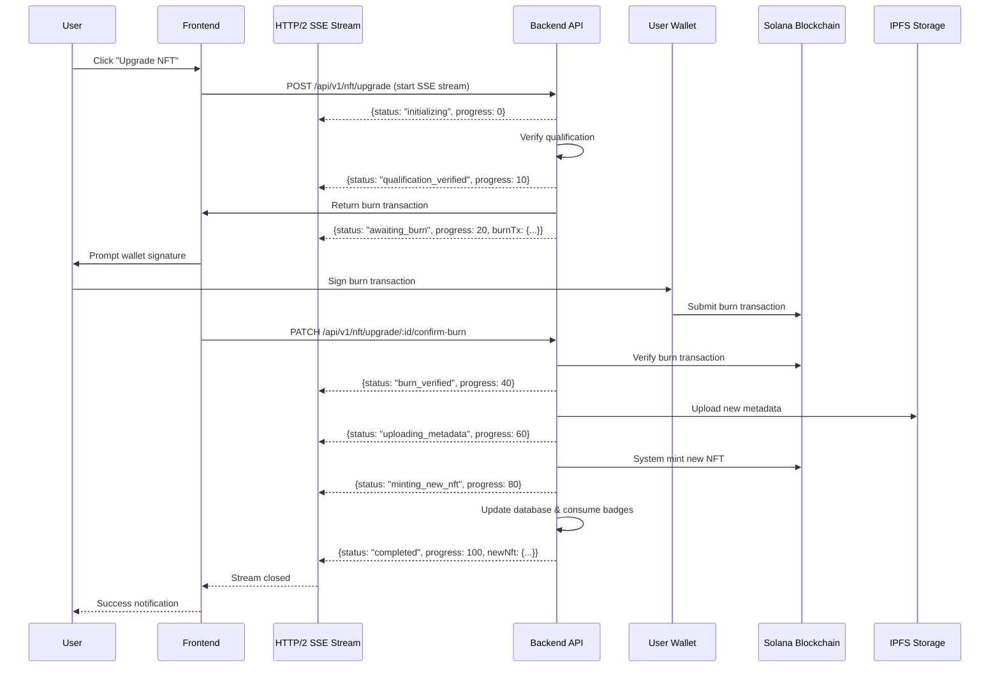
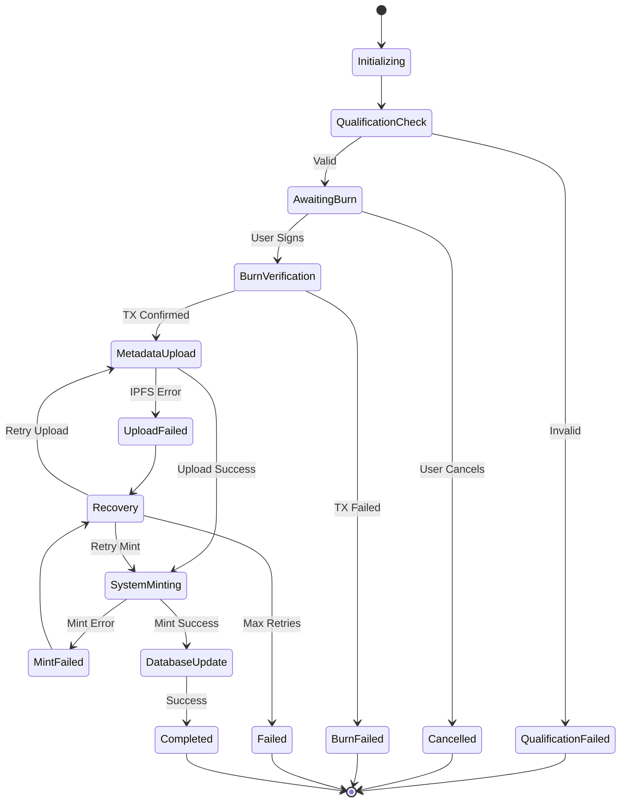

# HTTP/2 Server-Sent Events Integration Guide

<!-- Document Metadata -->
**Version:** v1.1.0  
**Last Updated:** 2025-08-08  
**Status:** Active  
**Purpose:** Implementation guide for HTTP/2 Server-Sent Events in multi-step NFT business processes

---

## Overview

This document provides comprehensive implementation guidelines for integrating HTTP/2 Server-Sent Events (SSE) into the AIW3 NFT system for multi-step business processes like NFT upgrades, claiming, and badge activation. HTTP/2 SSE provides superior user experience for interactive workflows that require real-time status updates and bi-directional communication.

---

## Table of Contents

1. [HTTP/2 SSE vs Traditional Approaches](#http2-sse-vs-traditional-approaches)
2. [Multi-Step Process Architecture](#multi-step-process-architecture)
3. [Backend Implementation](#backend-implementation)
4. [Frontend Integration](#frontend-integration)
5. [Error Handling & Recovery](#error-handling--recovery)
6. [Performance & Scalability](#performance--scalability)

---

## HTTP/2 SSE vs Traditional Approaches

### Comparison Matrix

| Feature | WebSocket | Polling | HTTP/2 SSE |
|---------|-----------|---------|-------------|
| **Connection Overhead** | High (persistent) | Low (per request) | Medium (per operation) |
| **Real-time Updates** | Excellent | Poor-Good | Excellent |
| **Server Resource Usage** | High | Medium | Low |
| **Multi-step Process Support** | Good | Poor | Excellent |
| **Error Recovery** | Complex | Simple | Simple |
| **Scalability** | Limited | High | High |
| **Browser Compatibility** | Universal | Universal | Universal (HTTP/2) |
| **Development Complexity** | High | Low | Medium |

### Why HTTP/2 SSE for NFT Multi-Step Processes

**Perfect for NFT Upgrade Workflow:**
- ✅ **Server Push** - Backend pushes status updates as each step completes
- ✅ **Connection Efficiency** - One connection per operation, not per user
- ✅ **Automatic Reconnection** - Browser handles reconnection automatically
- ✅ **Standard HTTP** - Uses familiar HTTP patterns with enhanced streaming
- ✅ **Resource Efficient** - No persistent per-user connections like WebSocket

---

## Multi-Step Process Architecture

### NFT Upgrade Process Flow with HTTP/2 SSE



### Process State Machine



---

## Backend Implementation

### 1. HTTP/2 SSE Endpoint Structure

```javascript
// api/controllers/NFTController.js
module.exports = {
  
  /**
   * NFT Upgrade with HTTP/2 Server-Sent Events
   * POST /api/v1/nft/upgrade
   */
  upgradeNFTWithSSE: async function(req, res) {
    const userId = req.user.id;
    const { targetTierId } = req.body;
    
    // Set up Server-Sent Events headers
    res.writeHead(200, {
      'Content-Type': 'text/event-stream',
      'Cache-Control': 'no-cache',
      'Connection': 'keep-alive',
      'Access-Control-Allow-Origin': '*',
      'Access-Control-Allow-Headers': 'Cache-Control'
    });
    
    const upgradeId = await sails.helpers.generateUpgradeId();
    
    try {
      // Step 1: Initialize upgrade process
      await this.sendSSEUpdate(res, {
        upgradeId,
        status: 'initializing',
        progress: 0,
        message: 'Starting NFT upgrade process...'
      });
      
      // Step 2: Verify qualification
      const qualification = await NFTService.verifyUpgradeQualification(userId, targetTierId);
      if (!qualification.qualified) {
        await this.sendSSEUpdate(res, {
          upgradeId,
          status: 'qualification_failed',
          progress: 0,
          error: qualification.error,
          requirements: qualification.missing
        });
        return res.end();
      }
      
      await this.sendSSEUpdate(res, {
        upgradeId,
        status: 'qualification_verified',
        progress: 10,
        message: 'Qualification verified successfully'
      });
      
      // Step 3: Create upgrade request and prepare burn transaction
      const upgradeRequest = await NFTUpgradeRequest.create({
        user: userId,
        targetTier: targetTierId,
        status: 'awaiting_burn',
        upgradeId: upgradeId
      }).fetch();
      
      const burnTransaction = await Web3Service.prepareBurnTransaction(
        req.user.wallet_address, 
        qualification.currentNFT.mintAddress
      );
      
      await this.sendSSEUpdate(res, {
        upgradeId,
        status: 'awaiting_burn',
        progress: 20,
        message: 'Please sign the burn transaction in your wallet',
        burnTransaction: burnTransaction,
        instructions: 'Approve the transaction to burn your current NFT'
      });
      
      // Wait for burn confirmation (via separate endpoint)
      const burnResult = await this.waitForBurnConfirmation(upgradeId, 300000); // 5 min timeout
      
      if (!burnResult.success) {
        await this.sendSSEUpdate(res, {
          upgradeId,
          status: 'burn_failed',
          progress: 20,
          error: burnResult.error
        });
        return res.end();
      }
      
      await this.sendSSEUpdate(res, {
        upgradeId,
        status: 'burn_verified',
        progress: 40,
        message: 'Old NFT burned successfully',
        burnTxSignature: burnResult.signature
      });
      
      // Step 4: Upload new metadata
      await this.sendSSEUpdate(res, {
        upgradeId,
        status: 'uploading_metadata',
        progress: 60,
        message: 'Uploading new NFT metadata to IPFS...'
      });
      
      const newMetadata = await NFTService.generateMetadata(userId, targetTierId);
      const ipfsResult = await IPFSService.uploadMetadata(newMetadata);
      
      await this.sendSSEUpdate(res, {
        upgradeId,
        status: 'metadata_uploaded',
        progress: 70,
        message: 'Metadata uploaded successfully',
        ipfsHash: ipfsResult.hash
      });
      
      // Step 5: System mints new NFT
      await this.sendSSEUpdate(res, {
        upgradeId,
        status: 'minting_new_nft',
        progress: 80,
        message: 'Minting new NFT to your wallet...'
      });
      
      const mintResult = await Web3Service.mintNFTFromSystem({
        recipientWallet: req.user.wallet_address,
        metadataUri: `ipfs://${ipfsResult.hash}`,
        level: targetTierId
      });
      
      // Step 6: Complete upgrade process
      await this.sendSSEUpdate(res, {
        upgradeId,
        status: 'updating_records',
        progress: 90,
        message: 'Updating your records...'
      });
      
      // Update database records
      await UserNFT.update(
        { user: userId, status: 'active' },
        { status: 'burned', burnedAt: new Date() }
      );
      
      await UserNFT.create({
        user: userId,
        nftTier: targetTierId,
        mintAddress: mintResult.mintAddress,
        status: 'active',
        transactionSignature: mintResult.signature,
        metadataUri: `ipfs://${ipfsResult.hash}`
      });
      
      // Consume activated badges
      await Badge.update(
        { user: userId, status: 'activated' },
        { status: 'consumed', consumedAt: new Date() }
      );
      
      // Clear caches
      await RedisService.delCache(`nft_qualification:${userId}`);
      await RedisService.delCache(`user_nfts:${userId}`);
      
      // Final success update
      await this.sendSSEUpdate(res, {
        upgradeId,
        status: 'completed',
        progress: 100,
        message: 'NFT upgrade completed successfully!',
        newNFT: {
          nftId: mintResult.nftId,
          tierName: qualification.targetTierName,
          mintAddress: mintResult.mintAddress,
          transactionSignature: mintResult.signature,
          benefits: await NFTService.getTierBenefits(targetTierId)
        }
      });
      
      // Publish Kafka event
      await KafkaService.sendMessage('nft-events', {
        eventType: 'nft_upgraded',
        userId: userId,
        upgradeId: upgradeId,
        fromTier: qualification.currentNFT.tier,
        toTier: targetTierId,
        newNFTId: mintResult.nftId
      });
      
    } catch (error) {
      sails.log.error('NFT upgrade SSE error:', error);
      await this.sendSSEUpdate(res, {
        upgradeId,
        status: 'error',
        progress: 0,
        error: error.message,
        message: 'Upgrade process failed. Please try again.'
      });
    } finally {
      res.end();
    }
  },
  
  /**
   * Confirm burn transaction (separate endpoint)
   * PATCH /api/v1/nft/upgrade/:upgradeId/confirm-burn
   */
  confirmBurnTransaction: async function(req, res) {
    const { upgradeId } = req.params;
    const { burnTxSignature } = req.body;
    
    try {
      // Verify burn transaction on blockchain
      const isValid = await Web3Service.verifyBurnTransaction(burnTxSignature);
      
      if (!isValid) {
        return res.badRequest('Invalid burn transaction signature');
      }
      
      // Update upgrade request
      await NFTUpgradeRequest.updateOne({ upgradeId })
        .set({
          burnTxSignature,
          status: 'burn_confirmed',
          burnConfirmedAt: new Date()
        });
      
      return res.ok({
        success: true,
        message: 'Burn transaction confirmed'
      });
      
    } catch (error) {
      sails.log.error('Burn confirmation error:', error);
      return res.serverError(error.message);
    }
  },
  
  /**
   * Send Server-Sent Event update
   */
  sendSSEUpdate: async function(res, data) {
    const eventData = JSON.stringify({
      ...data,
      timestamp: new Date().toISOString()
    });
    
    res.write(`data: ${eventData}\n\n`);
    
    // Log for monitoring
    sails.log.info('SSE Update:', data.status, data.progress);
  },
  
  /**
   * Wait for burn confirmation with timeout
   */
  waitForBurnConfirmation: async function(upgradeId, timeoutMs) {
    return new Promise((resolve) => {
      const startTime = Date.now();
      
      const checkConfirmation = async () => {
        const request = await NFTUpgradeRequest.findOne({ upgradeId });
        
        if (request?.status === 'burn_confirmed') {
          resolve({
            success: true,
            signature: request.burnTxSignature
          });
          return;
        }
        
        if (Date.now() - startTime > timeoutMs) {
          resolve({
            success: false,
            error: 'Burn confirmation timeout'
          });
          return;
        }
        
        // Check again in 2 seconds
        setTimeout(checkConfirmation, 2000);
      };
      
      checkConfirmation();
    });
  }
};
```

### 2. Helper Services

```javascript
// api/helpers/generate-upgrade-id.js
module.exports = {
  friendlyName: 'Generate upgrade ID',
  description: 'Generate unique upgrade ID for tracking multi-step processes',
  
  fn: async function() {
    const timestamp = Date.now();
    const random = Math.random().toString(36).substring(2, 8);
    return `upgrade_${timestamp}_${random}`;
  }
};
```

---

## Frontend Integration

### 1. React Hook for HTTP/2 SSE

```javascript
// hooks/useNFTUpgradeSSE.js
import { useState, useRef, useCallback } from 'react';

export const useNFTUpgradeSSE = () => {
  const [upgradeState, setUpgradeState] = useState({
    status: 'idle',
    progress: 0,
    message: '',
    error: null,
    upgradeId: null,
    data: null
  });
  
  const eventSourceRef = useRef(null);
  const [isUpgrading, setIsUpgrading] = useState(false);
  
  const startUpgrade = useCallback(async (targetTierId) => {
    if (isUpgrading) return;
    
    setIsUpgrading(true);
    setUpgradeState({
      status: 'connecting',
      progress: 0,
      message: 'Connecting to upgrade service...',
      error: null,
      upgradeId: null,
      data: null
    });
    
    try {
      // Start SSE connection with POST request
      const response = await fetch('/api/v1/nft/upgrade', {
        method: 'POST',
        headers: {
          'Authorization': `Bearer ${localStorage.getItem('jwt_token')}`,
          'Content-Type': 'application/json',
          'Accept': 'text/event-stream',
          'Cache-Control': 'no-cache'
        },
        body: JSON.stringify({ targetTierId })
      });
      
      if (!response.ok) {
        throw new Error(`Upgrade request failed: ${response.statusText}`);
      }
      
      // Create EventSource from response stream
      const reader = response.body?.getReader();
      if (!reader) {
        throw new Error('Stream not supported');
      }
      
      const decoder = new TextDecoder();
      
      const processStream = async () => {
        try {
          while (true) {
            const { done, value } = await reader.read();
            if (done) break;
            
            const chunk = decoder.decode(value, { stream: true });
            const lines = chunk.split('\n');
            
            for (const line of lines) {
              if (line.startsWith('data: ')) {
                try {
                  const eventData = JSON.parse(line.slice(6));
                  handleSSEMessage(eventData);
                } catch (parseError) {
                  console.error('Failed to parse SSE data:', parseError);
                }
              }
            }
          }
        } catch (streamError) {
          console.error('Stream processing error:', streamError);
          setUpgradeState(prev => ({
            ...prev,
            status: 'error',
            error: streamError.message
          }));
        } finally {
          setIsUpgrading(false);
        }
      };
      
      processStream();
      
    } catch (error) {
      console.error('Upgrade start error:', error);
      setUpgradeState(prev => ({
        ...prev,
        status: 'error',
        error: error.message
      }));
      setIsUpgrading(false);
    }
  }, [isUpgrading]);
  
  const handleSSEMessage = useCallback((eventData) => {
    setUpgradeState(prev => ({
      ...prev,
      status: eventData.status,
      progress: eventData.progress || prev.progress,
      message: eventData.message || '',
      error: eventData.error || null,
      upgradeId: eventData.upgradeId || prev.upgradeId,
      data: eventData
    }));
    
    // Handle specific status updates
    switch (eventData.status) {
      case 'awaiting_burn':
        // Trigger wallet interaction
        handleBurnTransaction(eventData.burnTransaction, eventData.upgradeId);
        break;
      case 'completed':
        // Show success notification
        showSuccessNotification(eventData.newNFT);
        break;
      case 'error':
      case 'qualification_failed':
      case 'burn_failed':
        // Show error notification
        showErrorNotification(eventData.error);
        break;
    }
  }, []);
  
  const handleBurnTransaction = async (burnTransaction, upgradeId) => {
    try {
      // Request wallet signature
      const signedTx = await window.solana.signTransaction(burnTransaction);
      const signature = await window.solana.connection.sendRawTransaction(signedTx.serialize());
      
      // Confirm burn to backend
      await fetch(`/api/v1/nft/upgrade/${upgradeId}/confirm-burn`, {
        method: 'PATCH',
        headers: {
          'Authorization': `Bearer ${localStorage.getItem('jwt_token')}`,
          'Content-Type': 'application/json'
        },
        body: JSON.stringify({ burnTxSignature: signature })
      });
      
    } catch (error) {
      console.error('Burn transaction failed:', error);
      setUpgradeState(prev => ({
        ...prev,
        status: 'burn_failed',
        error: error.message
      }));
      setIsUpgrading(false);
    }
  };
  
  const showSuccessNotification = (newNFT) => {
    // Implementation for success notification
    console.log('Upgrade successful:', newNFT);
  };
  
  const showErrorNotification = (error) => {
    // Implementation for error notification
    console.error('Upgrade failed:', error);
  };
  
  const cancelUpgrade = useCallback(() => {
    if (eventSourceRef.current) {
      eventSourceRef.current.close();
      eventSourceRef.current = null;
    }
    setIsUpgrading(false);
    setUpgradeState({
      status: 'cancelled',
      progress: 0,
      message: 'Upgrade cancelled',
      error: null,
      upgradeId: null,
      data: null
    });
  }, []);
  
  return {
    upgradeState,
    isUpgrading,
    startUpgrade,
    cancelUpgrade
  };
};
```

### 2. Upgrade Component

```javascript
// components/NFTUpgradeComponent.jsx
import React from 'react';
import { useNFTUpgradeSSE } from '../hooks/useNFTUpgradeSSE';

const NFTUpgradeComponent = ({ currentNFT, targetTier }) => {
  const { upgradeState, isUpgrading, startUpgrade, cancelUpgrade } = useNFTUpgradeSSE();
  
  const getStatusIcon = (status) => {
    const icons = {
      'idle': '⏸️',
      'connecting': '🔗',
      'initializing': '🚀',
      'qualification_verified': '✅',
      'awaiting_burn': '🔥',
      'burn_verified': '✅',
      'uploading_metadata': '📤',
      'metadata_uploaded': '✅',
      'minting_new_nft': '🏗️',
      'updating_records': '📝',
      'completed': '🎉',
      'error': '❌',
      'cancelled': '🛑'
    };
    return icons[status] || '⏳';
  };
  
  const getProgressBarColor = (status) => {
    if (status === 'completed') return 'bg-green-500';
    if (status.includes('error') || status.includes('failed')) return 'bg-red-500';
    if (status === 'awaiting_burn') return 'bg-yellow-500';
    return 'bg-blue-500';
  };
  
  return (
    <div className="nft-upgrade-component">
      <div className="upgrade-header">
        <h3>NFT Upgrade: {currentNFT?.tierName} → {targetTier?.tierName}</h3>
        {isUpgrading && (
          <button 
            onClick={cancelUpgrade}
            className="cancel-button"
            disabled={['burn_verified', 'minting_new_nft'].includes(upgradeState.status)}
          >
            Cancel
          </button>
        )}
      </div>
      
      {!isUpgrading ? (
        <div className="upgrade-start">
          <div className="tier-preview">
            <div className="current-tier">
              
              <p>{currentNFT.tierName}</p>
            </div>
            <div className="arrow">→</div>
            <div className="target-tier">
              
              <p>{targetTier.tierName}</p>
            </div>
          </div>
          
          <button 
            onClick={() => startUpgrade(targetTier.id)}
            className="start-upgrade-button"
          >
            Start Upgrade Process
          </button>
        </div>
      ) : (
        <div className="upgrade-progress">
          {/* Progress Bar */}
          <div className="progress-container">
            <div 
              className={`progress-bar ${getProgressBarColor(upgradeState.status)}`}
              style={{ width: `${upgradeState.progress}%` }}
            />
          </div>
          
          {/* Status Display */}
          <div className="status-display">
            <div className="status-icon">
              {getStatusIcon(upgradeState.status)}
            </div>
            <div className="status-info">
              <h4>{upgradeState.status.replace(/_/g, ' ').toUpperCase()}</h4>
              <p>{upgradeState.message}</p>
              {upgradeState.progress > 0 && (
                <span className="progress-text">{upgradeState.progress}%</span>
              )}
            </div>
          </div>
          
          {/* Special States */}
          {upgradeState.status === 'awaiting_burn' && (
            <div className="wallet-prompt">
              <div className="alert alert-warning">
                <h4>🔥 Wallet Action Required</h4>
                <p>Please approve the burn transaction in your Solana wallet to continue.</p>
                <ul>
                  <li>Your current {currentNFT.tierName} NFT will be burned</li>
                  <li>A new {targetTier.tierName} NFT will be minted to your wallet</li>
                  <li>This action cannot be undone</li>
                </ul>
              </div>
            </div>
          )}
          
          {upgradeState.status === 'completed' && upgradeState.data?.newNFT && (
            <div className="upgrade-success">
              <div className="alert alert-success">
                <h4>🎉 Upgrade Successful!</h4>
                <p>Your NFT has been upgraded to {upgradeState.data.newNFT.tierName}</p>
                <div className="new-nft-info">
                  <p><strong>New NFT ID:</strong> {upgradeState.data.newNFT.nftId}</p>
                  <p><strong>Transaction:</strong> {upgradeState.data.newNFT.transactionSignature}</p>
                  <div className="benefits">
                    <h5>New Benefits:</h5>
                    <ul>
                      {Object.entries(upgradeState.data.newNFT.benefits).map(([key, value]) => (
                        <li key={key}>{key}: {value}</li>
                      ))}
                    </ul>
                  </div>
                </div>
              </div>
            </div>
          )}
          
          {upgradeState.error && (
            <div className="upgrade-error">
              <div className="alert alert-error">
                <h4>❌ Upgrade Failed</h4>
                <p>{upgradeState.error}</p>
                <button 
                  onClick={() => startUpgrade(targetTier.id)}
                  className="retry-button"
                >
                  Try Again
                </button>
              </div>
            </div>
          )}
        </div>
      )}
    </div>
  );
};

export default NFTUpgradeComponent;
```

---

## Error Handling & Recovery

### Comprehensive Error Strategy

```javascript
// api/services/NFTUpgradeRecoveryService.js
module.exports = {
  
  /**
   * Handle upgrade failures with recovery mechanisms
   */
  handleUpgradeFailure: async function(upgradeId, failureStage, error) {
    const upgradeRequest = await NFTUpgradeRequest.findOne({ upgradeId });
    
    switch (failureStage) {
      case 'burn_failed':
        return await this.handleBurnFailure(upgradeRequest, error);
        
      case 'mint_failed':
        return await this.handleMintFailure(upgradeRequest, error);
        
      case 'metadata_upload_failed':
        return await this.handleMetadataFailure(upgradeRequest, error);
        
      default:
        return await this.handleGenericFailure(upgradeRequest, error);
    }
  },
  
  /**
   * Handle burn transaction failures
   */
  handleBurnFailure: async function(upgradeRequest, error) {
    await NFTUpgradeRequest.updateOne({ id: upgradeRequest.id })
      .set({ 
        status: 'burn_failed', 
        errorMessage: error.message,
        failedAt: new Date()
      });
    
    // Log for monitoring
    sails.log.error('NFT burn failed:', {
      upgradeId: upgradeRequest.upgradeId,
      userId: upgradeRequest.user,
      error: error.message
    });
    
    return {
      canRetry: true,
      retryAction: 'restart_from_burn',
      userMessage: 'Burn transaction failed. Please ensure you have sufficient SOL for fees and try again.'
    };
  },
  
  /**
   * Handle mint transaction failures (CRITICAL)
   */
  handleMintFailure: async function(upgradeRequest, error) {
    // This is critical - user's old NFT is burned but new one failed to mint
    await NFTUpgradeRequest.updateOne({ id: upgradeRequest.id })
      .set({ 
        status: 'mint_failed_critical', 
        errorMessage: error.message,
        requiresManualReview: true,
        failedAt: new Date()
      });
    
    // Create compensation request
    await NFTCompensationRequest.create({
      user: upgradeRequest.user,
      upgradeRequest: upgradeRequest.id,
      reason: 'mint_failure_after_burn',
      status: 'pending_review',
      originalTier: upgradeRequest.fromTier,
      targetTier: upgradeRequest.targetTier,
      burnTxSignature: upgradeRequest.burnTxSignature
    });
    
    // Alert support team
    await NotificationService.alertSupportTeam({
      type: 'critical_nft_failure',
      upgradeId: upgradeRequest.upgradeId,
      userId: upgradeRequest.user,
      details: 'NFT burned but mint failed - requires immediate attention'
    });
    
    // Log critical error
    sails.log.error('CRITICAL: NFT mint failed after burn:', {
      upgradeId: upgradeRequest.upgradeId,
      userId: upgradeRequest.user,
      burnTx: upgradeRequest.burnTxSignature,
      error: error.message
    });
    
    return {
      canRetry: true,
      retryAction: 'retry_mint_only',
      userMessage: 'Technical issue occurred during minting. Our team has been notified and will resolve this shortly.',
      requiresSupport: true
    };
  }
};
```

---

## Performance & Scalability

### Resource Management

```javascript
// api/services/SSEConnectionManager.js
module.exports = {
  
  activeConnections: new Map(),
  connectionStats: {
    total: 0,
    active: 0,
    completed: 0,
    failed: 0
  },
  
  /**
   * Register new SSE connection
   */
  registerConnection: function(upgradeId, userId, res) {
    const connection = {
      upgradeId,
      userId,
      response: res,
      startTime: Date.now(),
      lastActivity: Date.now()
    };
    
    this.activeConnections.set(upgradeId, connection);
    this.connectionStats.total++;
    this.connectionStats.active++;
    
    // Set up connection cleanup
    res.on('close', () => {
      this.unregisterConnection(upgradeId);
    });
    
    res.on('error', (error) => {
      sails.log.error('SSE connection error:', error);
      this.unregisterConnection(upgradeId);
    });
    
    // Auto-cleanup after timeout (15 minutes)
    setTimeout(() => {
      if (this.activeConnections.has(upgradeId)) {
        sails.log.warn('SSE connection timeout, closing:', upgradeId);
        this.unregisterConnection(upgradeId);
      }
    }, 15 * 60 * 1000);
  },
  
  /**
   * Unregister SSE connection
   */
  unregisterConnection: function(upgradeId) {
    const connection = this.activeConnections.get(upgradeId);
    if (connection) {
      const duration = Date.now() - connection.startTime;
      
      this.activeConnections.delete(upgradeId);
      this.connectionStats.active--;
      
      // Log connection metrics
      sails.log.info('SSE connection closed:', {
        upgradeId,
        duration: `${duration}ms`,
        activeConnections: this.connectionStats.active
      });
    }
  },
  
  /**
   * Get connection statistics
   */
  getStats: function() {
    return {
      ...this.connectionStats,
      activeConnections: Array.from(this.activeConnections.keys()),
      memoryUsage: process.memoryUsage(),
      uptime: process.uptime()
    };
  },
  
  /**
   * Health check for monitoring
   */
  healthCheck: function() {
    const stats = this.getStats();
    const isHealthy = stats.active < 1000 && stats.memoryUsage.heapUsed < 1024 * 1024 * 1024; // 1GB
    
    return {
      status: isHealthy ? 'healthy' : 'warning',
      stats,
      recommendations: isHealthy ? [] : [
        'Consider scaling up server resources',
        'Monitor connection cleanup processes'
      ]
    };
  }
};
```

### Monitoring Endpoint

```javascript
// api/controllers/MonitoringController.js
module.exports = {
  
  /**
   * SSE Health Check
   * GET /api/v1/monitoring/sse-health
   */
  sseHealthCheck: async function(req, res) {
    const health = SSEConnectionManager.healthCheck();
    
    res.status(health.status === 'healthy' ? 200 : 503).json({
      timestamp: new Date().toISOString(),
      service: 'sse-connections',
      ...health
    });
  }
};
```

---

## Documentation Updates Required

When implementing HTTP/2 SSE, the following documentation files need updates:

1. **Process-Flow-Reference.md** - Update NFT upgrade flow diagrams
2. **Frontend-Implementation-Guide.md** - Add HTTP/2 SSE integration examples
3. **Backend-Implementation-Guide.md** - Add SSE endpoint patterns
4. **AIW3-NFT-Frontend-API-Reference.md** - Add SSE API specifications
5. **Error-Handling-Reference.md** - Add SSE-specific error patterns

### Summary of Changes

- Replace WebSocket event examples with HTTP/2 SSE patterns
- Update API endpoint documentation to include streaming endpoints
- Add connection management and resource monitoring sections
- Include error recovery patterns specific to streaming connections
- Add performance benchmarks and scalability guidelines

This HTTP/2 SSE integration provides a superior user experience for multi-step NFT operations while maintaining better resource efficiency than traditional WebSocket approaches.
