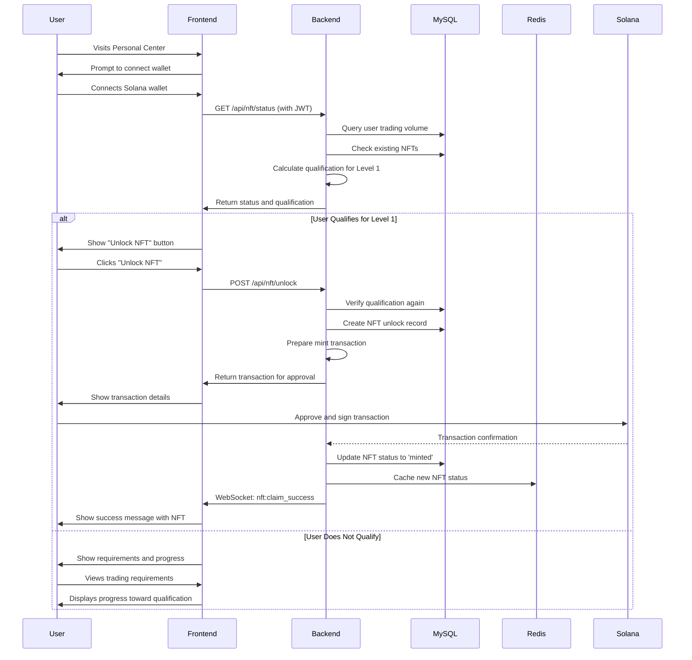
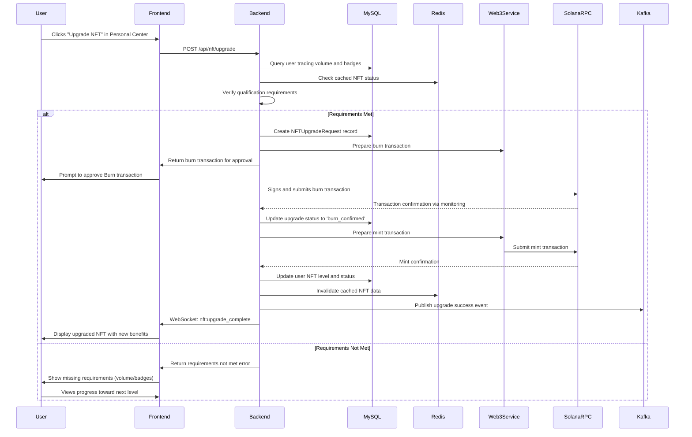
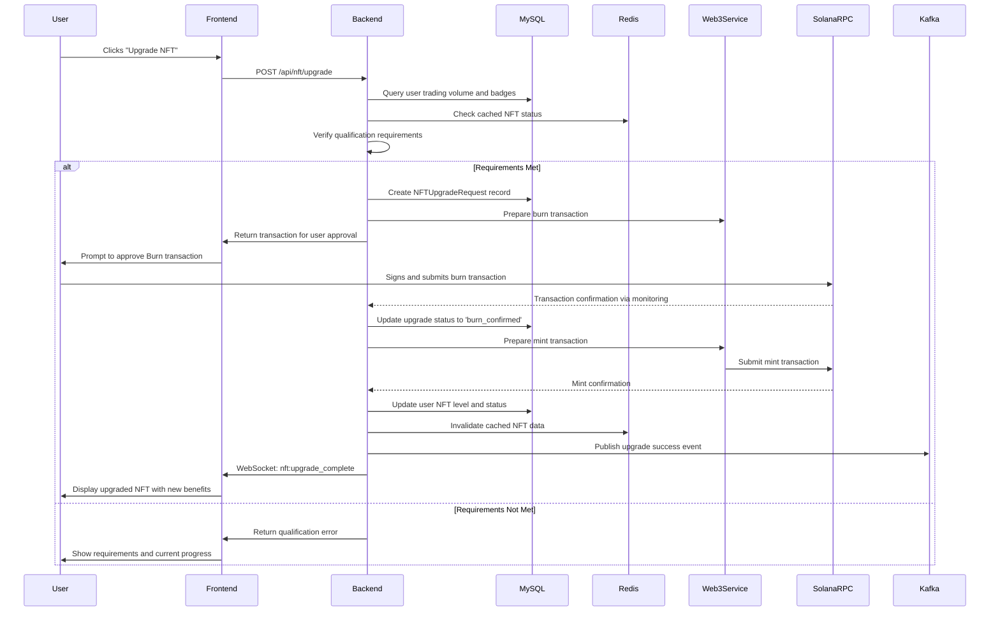
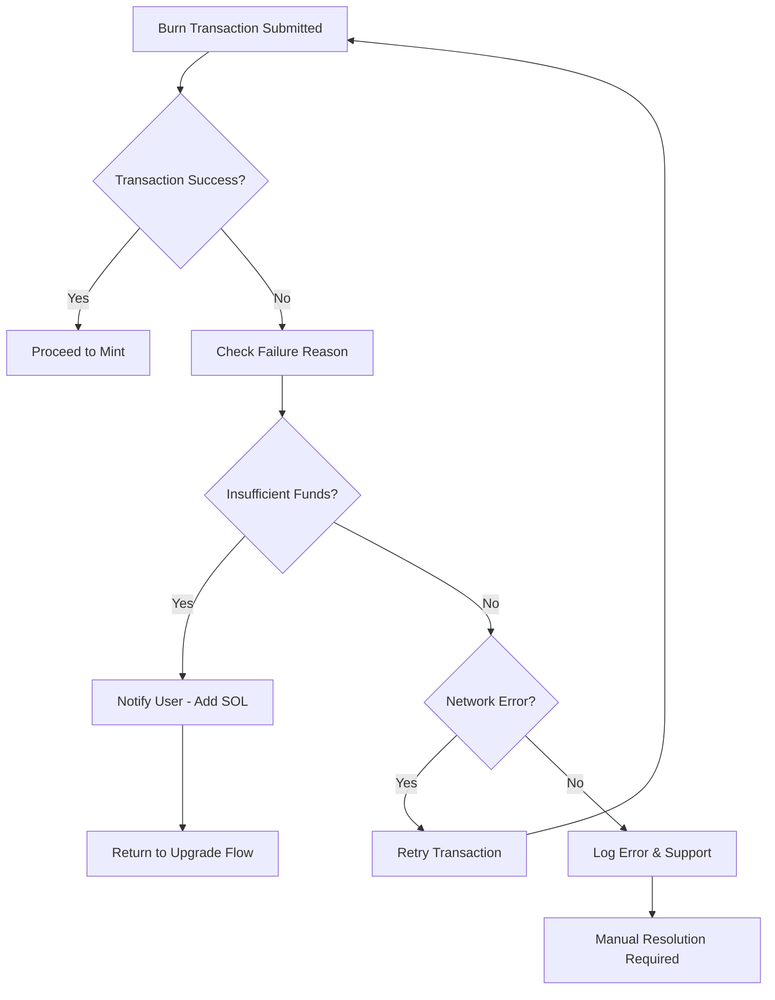
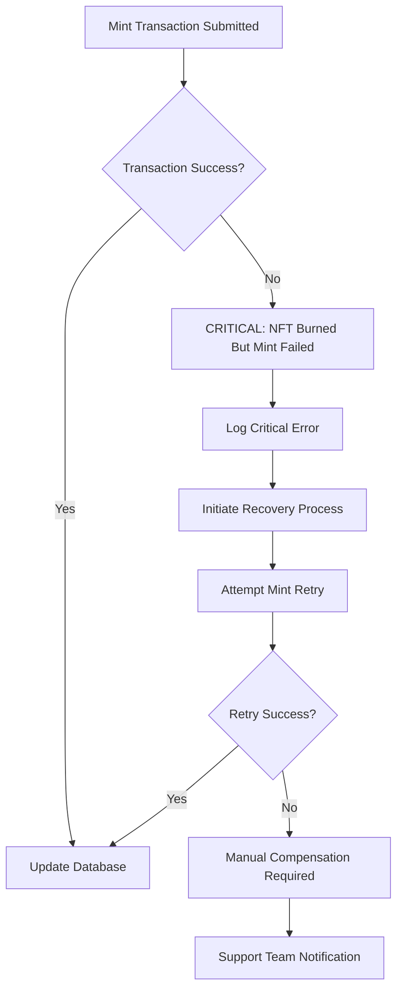

# Process Flow Reference

<!-- Document Metadata -->
**Version:** v1.0.0  
**Last Updated:** 2025-08-07  
**Status:** Active  
**Purpose:** Complete reference for all NFT system process flows and user interaction workflows.

---

## Overview

This document provides comprehensive documentation of all NFT-related process flows, user interaction workflows, and system procedures for the AIW3 NFT system. It serves as the definitive reference for understanding how users interact with the system and how the system responds to different scenarios.

---

## Table of Contents

1. [New User Onboarding Flow](#new-user-onboarding-flow)
2. [NFT Upgrade Flow](#nft-upgrade-flow)
3. [Burn-and-Mint Workflow](#burn-and-mint-workflow)
4. [Error Handling Procedures](#error-handling-procedures)
5. [System Recovery Flows](#system-recovery-flows)

---

## New User Onboarding Flow

### 1. New User Onboarding and First NFT Unlock

This flow guides new users through their first interaction with the AIW3 NFT system, from wallet connection to unlocking their initial NFT.

### 2. Qualification Check Process

**Prerequisites:**
- User has connected Solana wallet
- User is authenticated with JWT token
- Backend has access to user's trading history

**Process Steps:**
1. **Volume Calculation:** Backend calculates total USD trading volume from Trades table
2. **Requirement Check:** Compare volume against Level 1 requirement ($100K)
3. **Existing NFT Check:** Verify user doesn't already have an active NFT
4. **Qualification Response:** Return qualification status with details

**Success Criteria:**
- Trading volume ≥ $100,000
- No existing active NFT
- Valid authentication

---

## NFT Upgrade Flow

### 2. NFT Upgrade Flow

This flow handles the process of upgrading an existing NFT to a higher level through the burn-and-mint mechanism.

### 3. Upgrade Qualification Process

**Prerequisites:**
- User owns an active NFT at current level
- User has sufficient trading volume for target level
- User has required badges (if applicable)

**Volume Requirements:**
- Level 1: $100K USD
- Level 2: $500K USD  
- Level 3: $5M USD
- Level 4: $10M USD
- Level 5: $50M USD

**Process Validation:**
1. **Current NFT Check:** Verify user owns NFT at current level
2. **Volume Verification:** Calculate total trading volume meets target requirement
3. **Badge Requirements:** Check any required badges are collected
4. **Upgrade Eligibility:** Confirm user can upgrade to next level

---

## Burn-and-Mint Workflow

### Burn-and-Mint Model

The most secure and straightforward approach for NFT upgrades, requiring users to **burn** their lower-level NFT before the system **mints** the new, higher-level NFT.

**Key Advantages:**
- **Prevents Double-Dipping:** Impossible for users to hold multiple NFT levels simultaneously
- **Atomic State Transition:** Clear state change - user has old NFT or new one, never both
- **Simplified Auditing:** Easy to verify on-chain that old NFT was destroyed before new creation

### Detailed Burn-and-Mint Workflow

### Transaction Safety Measures

**Burn Transaction:**
- Verify user owns the NFT before burning
- Check NFT is at expected level
- Confirm transaction success before proceeding

**Mint Transaction:**
- Only proceed after burn confirmation
- Include new level metadata
- Verify mint success before database updates

**Rollback Procedures:**
- If mint fails after successful burn, initiate recovery process
- Log all transaction states for audit trail
- Implement compensation mechanisms for failed upgrades

---

## Error Handling Procedures

### 1. Transaction Failure Handling

**Burn Transaction Failures:**

**Mint Transaction Failures:**

### 2. Network Resilience

**Solana Network Issues:**
- Automatic retry with exponential backoff
- Switch to backup RPC endpoints
- Queue transactions during network outages

**IPFS Storage Issues:**
- Retry upload operations
- Use backup IPFS providers
- Cache metadata locally during outages

---

## System Recovery Flows

### 1. Incomplete Upgrade Recovery

**Scenario:** User's burn transaction succeeded but mint transaction failed.

**Recovery Process:**
1. **Detection:** Monitoring service detects incomplete upgrade
2. **Verification:** Confirm burn transaction on blockchain
3. **Retry Mint:** Attempt mint transaction with original parameters
4. **Fallback:** If mint continues to fail, initiate manual compensation
5. **Resolution:** Provide user with equivalent or superior NFT

### 2. Data Consistency Recovery

**Database-Blockchain Sync Issues:**
1. **Periodic Reconciliation:** Compare database records with blockchain state
2. **Discrepancy Detection:** Identify mismatches between systems
3. **Automatic Correction:** Update database to match blockchain truth
4. **Manual Review:** Flag complex discrepancies for human review

### 3. Cache Invalidation Recovery

**Redis Cache Issues:**
1. **Cache Miss Handling:** Fallback to database queries
2. **Selective Invalidation:** Clear specific user/NFT cache entries
3. **Bulk Refresh:** Rebuild cache from authoritative database
4. **Performance Monitoring:** Track cache hit rates and response times

---

## Related Documentation

- [Backend Implementation Guide](./Backend-Implementation-Guide.md) - Backend services that power these flows
- [Frontend Implementation Guide](./Frontend-Implementation-Guide.md) - UI components that implement these flows
- [Blockchain Integration Guide](./Blockchain-Integration-Guide.md) - Solana integration details
- [API Frontend Integration](./api-frontend/API-Frontend-Integration-Specification.md) - API endpoints used in flows
- [Error Handling Reference](../operations/AIW3-NFT-Error-Handling-Reference.md) - Comprehensive error handling strategies
