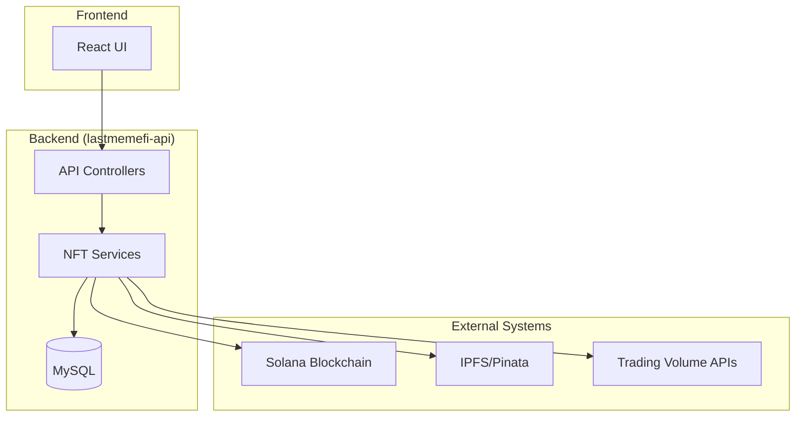

# AIW3 NFT System Integration Documentation

<!-- Document Metadata -->
**Version:** v1.1.0  
**Last Updated:** 2025-08-08  
**Status:** Active  
**Purpose:** Central navigation hub for all AIW3 NFT system integration documentation

---

## 📋 Overview

This directory contains comprehensive integration documentation for the AIW3 NFT system, organized by integration type and system boundaries. All documentation follows MECE principles with consolidated, non-redundant content.

### 🎯 Integration Scope

The AIW3 NFT system integrates with:
- **Blockchain Layer**: Solana network for NFT operations
- **Backend Systems**: lastmemefi-api extensions and services
- **External Services**: IPFS, trading volume APIs, real-time messaging
- **Legacy Systems**: Existing AIW3 infrastructure and data models

---

## 📁 Directory Structure

### `/external-systems/` - External Service Integrations

| Document | Purpose | Status |
|----------|---------|--------|
| **[Solana-Blockchain-Integration-Unified.md](./external-systems/Solana-Blockchain-Integration-Unified.md)** | **🌟 UNIFIED** - Complete Solana blockchain integration patterns | ✅ Active |
| [External-Systems-Integration-Overview.md](./external-systems/External-Systems-Integration-Overview.md) | High-level overview of all external integrations | ✅ Active |
| [IPFS-Pinata-Integration-Reference.md](./external-systems/IPFS-Pinata-Integration-Reference.md) | IPFS metadata storage via Pinata | ✅ Active |
| [AIW3-NFT-External-API-Integration.md](./external-systems/AIW3-NFT-External-API-Integration.md) | External API patterns (references unified docs) | ✅ Updated |
| [AIW3-NFT-Admin-Airdrop-Solana-Integration.md](./external-systems/AIW3-NFT-Admin-Airdrop-Solana-Integration.md) | Competition manager airdrop integration | ✅ Updated |

### `/legacy-systems/` - Backend & Legacy Integrations

| Document | Purpose | Status |
|----------|---------|--------|
| **[AIW3-NFT-Backend-Implementation-Unified.md](./legacy-systems/AIW3-NFT-Backend-Implementation-Unified.md)** | **🌟 UNIFIED** - Complete backend implementation guide | ✅ Active |
| [AIW3-NFT-Legacy-Backend-Integration.md](./legacy-systems/AIW3-NFT-Legacy-Backend-Integration.md) | Legacy system integration strategy | ✅ Active |
| [AIW3-NFT-Backend-API-Implementation.md](./legacy-systems/AIW3-NFT-Backend-API-Implementation.md) | Backend API patterns (references unified docs) | ✅ Updated |
| [legacy-existing-storage-solutions.md](./legacy-systems/legacy-existing-storage-solutions.md) | Existing storage system integration | ✅ Active |

---

## 🚀 Quick Start Guide

### For Frontend Developers
1. **Start here**: [External Systems Integration Overview](./external-systems/External-Systems-Integration-Overview.md)
2. **API Integration**: [Backend Implementation Unified Guide](./legacy-systems/AIW3-NFT-Backend-Implementation-Unified.md)
3. **Blockchain Operations**: [Solana Integration Unified Reference](./external-systems/Solana-Blockchain-Integration-Unified.md)

### For Backend Developers
1. **Start here**: [Backend Implementation Unified Guide](./legacy-systems/AIW3-NFT-Backend-Implementation-Unified.md)
2. **Service Extensions**: [Legacy Backend Integration](./legacy-systems/AIW3-NFT-Legacy-Backend-Integration.md)
3. **Blockchain Integration**: [Solana Integration Unified Reference](./external-systems/Solana-Blockchain-Integration-Unified.md)

### For DevOps/Infrastructure
1. **Start here**: [External Systems Integration Overview](./external-systems/External-Systems-Integration-Overview.md)
2. **Storage Integration**: [IPFS Pinata Integration](./external-systems/IPFS-Pinata-Integration-Reference.md)
3. **Trading Volume**: [Trading Volume Integration Analysis](./AIW3-NFT-Trading-Volume-Integration-Analysis.md)

### For Competition Managers
1. **Airdrop Operations**: [Admin Airdrop Solana Integration](./external-systems/AIW3-NFT-Admin-Airdrop-Solana-Integration.md)
2. **Backend API**: [Backend Implementation Unified Guide](./legacy-systems/AIW3-NFT-Backend-Implementation-Unified.md)
3. **Business Rules**: [NFT Business Rules](../business/AIW3-NFT-Business-Rules-and-Flows.md)

---

## 🎯 Integration Patterns

### Standard Integration Flow

### Key Integration Points
- **Authentication**: JWT + Solana wallet signatures
- **Data Flow**: MySQL → Services → Blockchain → IPFS
- **Real-time Updates**: Kafka events → WebSocket → Frontend
- **Error Handling**: Circuit breakers, retries, fallbacks
- **Caching**: Redis for performance optimization

---

## 📚 Related Documentation

### Business & Requirements
- [NFT Business Rules and Flows](../business/AIW3-NFT-Business-Rules-and-Flows.md)
- [System Architecture](../technical/architecture/AIW3-NFT-System-Design.md)
- [API Specification](../technical/implementation/api-frontend/AIW3-NFT-API-Specification.md)

### Implementation Guides
- [Implementation Roadmap](../technical/implementation/AIW3-NFT-Implementation-Roadmap.md)
- [Frontend Implementation](../technical/implementation/Frontend-Implementation-Guide.md)
- [Testing Strategy](../technical/quality/AIW3-NFT-Testing-Strategy.md)

### Operations & Deployment
- [Deployment Guide](../technical/operations/AIW3-NFT-Deployment-Guide.md)
- [Security Operations](../technical/security/AIW3-NFT-Security-Operations.md)
- [Error Handling Reference](../technical/operations/AIW3-NFT-Error-Handling-Reference.md)

---

## 🔄 Document Maintenance

### Update Frequency
- **Unified Documents**: Updated as needed for major changes
- **Reference Documents**: Updated to maintain links to unified sources
- **Overview Documents**: Updated quarterly or for major architectural changes

### Contribution Guidelines
1. **Single Source of Truth**: Update unified documents for implementation changes
2. **Reference Updates**: Update reference documents only for structural changes
3. **Cross-References**: Maintain consistent links between related documents
4. **Version Control**: Update version numbers and timestamps for significant changes

### Quality Standards
- **MECE Compliance**: Mutually exclusive, collectively exhaustive content
- **No Redundancy**: Single authoritative source for each pattern
- **Clear Navigation**: Logical document hierarchy and cross-references
- **Consistent Formatting**: Standardized code examples and documentation structure

---

**Last Updated**: 2025-08-08  
**Next Review**: 2025-09-08  
**Maintainer**: AIW3 Development Team
