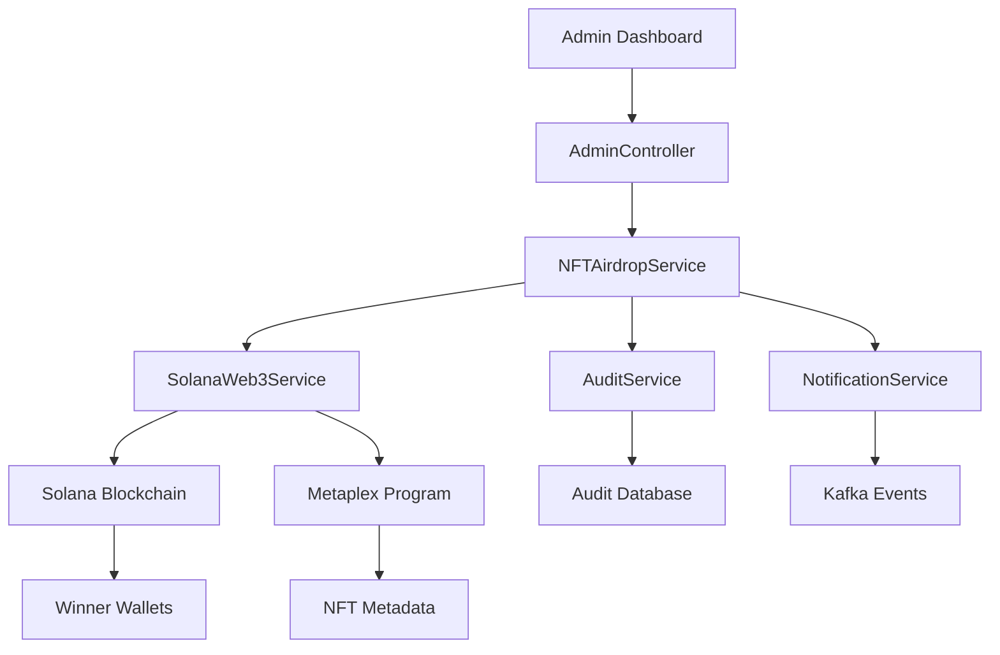

# AIW3 NFT Competition Manager Airdrop Solana Integration

## Overview

This document details the technical implementation of competition manager-controlled NFT airdrops for competition winners, including Solana blockchain integration, permission models, and operational procedures.

## 1. Airdrop Architecture

### 1.1 System Components



### 1.2 Permission Model

```javascript
// Role-based access control
const AIRDROP_PERMISSIONS = {
  COMPETITION_MANAGER: {
    can_airdrop: true,
    can_view_history: true, // Only for competitions they manage
    can_retry_failed: true, // Only for their airdrop operations
    max_recipients_per_batch: 50,
    scope: 'managed_competitions_only'
  },
  ADMIN: {
    can_airdrop: false, // Admins don't directly manage competitions
    can_view_history: true, // Can view all airdrop history
    can_retry_failed: false, // Don't handle competition operations
    max_recipients_per_batch: 0,
    scope: 'system_oversight_only'
  },
  USER: {
    can_airdrop: false,
    can_view_history: false,
    can_retry_failed: false,
    max_recipients_per_batch: 0,
    scope: 'none'
  }
};
```

## 2. NFTAirdropService Implementation

### 2.1 Core Service Structure

```javascript
// api/services/NFTAirdropService.js
module.exports = {

  /**
   * Execute bulk NFT airdrop to competition winners
   */
  async executeBulkAirdrop(params) {
    const { managerId, competitionId, nftTemplateId, recipients, metadata } = params;
    
    // Generate unique airdrop ID
    const airdropId = `airdrop_${Date.now()}_${competitionId}`;
    
    // Validate recipients and wallets
    const validatedRecipients = await this.validateRecipients(recipients);
    
    // Initialize airdrop record
    const airdropRecord = await AirdropOperations.create({
      airdrop_id: airdropId,
      manager_user_id: managerId,
      competition_id: competitionId,
      nft_template_id: nftTemplateId,
      total_recipients: validatedRecipients.length,
      status: 'processing',
      metadata: metadata,
      created_at: new Date()
    });

    const results = [];
    let successCount = 0;
    let failCount = 0;

    // Process each recipient
    for (const recipient of validatedRecipients) {
      try {
        // Mint NFT directly to winner's wallet
        const mintResult = await SolanaWeb3Service.mintCompetitionNFT({
          recipientWallet: recipient.wallet_address,
          nftTemplateId,
          competitionId,
          metadata: {
            ...metadata,
            winner_rank: recipient.rank,
            prize_tier: recipient.prize_tier,
            user_id: recipient.user_id
          }
        });

        // Record successful airdrop
        await UserNFTs.create({
          user_id: recipient.user_id,
          nft_id: mintResult.nft_id,
          nft_type: 'competition',
          tier_id: null, // Competition NFTs don't have tiers
          mint_address: mintResult.mint_address,
          metadata_uri: mintResult.metadata_uri,
          status: 'active',
          competition_id: competitionId,
          airdrop_id: airdropId,
          minted_at: new Date()
        });

        results.push({
          user_id: recipient.user_id,
          wallet_address: recipient.wallet_address,
          status: 'success',
          nft_id: mintResult.nft_id,
          mint_address: mintResult.mint_address,
          transaction_signature: mintResult.transaction_signature,
          minted_at: mintResult.minted_at
        });

        successCount++;

        // Send notification to winner
        await NotificationService.sendNFTAirdropNotification({
          userId: recipient.user_id,
          nftId: mintResult.nft_id,
          competitionId,
          prizeTier: recipient.prize_tier
        });

      } catch (error) {
        sails.log.error(`Airdrop failed for user ${recipient.user_id}:`, error);
        
        results.push({
          user_id: recipient.user_id,
          wallet_address: recipient.wallet_address,
          status: 'failed',
          error: error.message,
          failed_at: new Date()
        });

        failCount++;

        // Log failed airdrop for retry
        await AirdropFailures.create({
          airdrop_id: airdropId,
          user_id: recipient.user_id,
          wallet_address: recipient.wallet_address,
          error_message: error.message,
          retry_count: 0,
          created_at: new Date()
        });
      }
    }

    // Update airdrop record with final results
    await AirdropOperations.updateOne({ airdrop_id: airdropId }).set({
      successful_count: successCount,
      failed_count: failCount,
      status: failCount === 0 ? 'completed' : 'partial_failure',
      completed_at: new Date()
    });

    // Publish Kafka event for real-time updates
    await KafkaService.publishEvent('nft_airdrop_completed', {
      airdrop_id: airdropId,
      competition_id: competitionId,
      total_recipients: validatedRecipients.length,
      successful_count: successCount,
      failed_count: failCount,
      admin_user_id: adminUserId
    });

    return {
      airdrop_id: airdropId,
      total_recipients: validatedRecipients.length,
      successful_airdrops: successCount,
      failed_airdrops: failCount,
      results
    };
  },

  /**
   * Validate recipient data and wallet addresses
   */
  async validateRecipients(recipients) {
    const validated = [];
    
    for (const recipient of recipients) {
      // Validate required fields
      if (!recipient.user_id || !recipient.wallet_address) {
        throw new Error(`Missing required fields for recipient: ${JSON.stringify(recipient)}`);
      }

      // Validate Solana wallet address format
      if (!SolanaWeb3Service.isValidWalletAddress(recipient.wallet_address)) {
        throw new Error(`Invalid Solana wallet address: ${recipient.wallet_address}`);
      }

      // Check if user exists
      const user = await User.findOne({ user_id: recipient.user_id });
      if (!user) {
        throw new Error(`User not found: ${recipient.user_id}`);
      }

      validated.push({
        user_id: recipient.user_id,
        wallet_address: recipient.wallet_address,
        rank: recipient.rank || null,
        prize_tier: recipient.prize_tier || 'participant'
      });
    }

    return validated;
  },

  /**
   * Get airdrop operation history with filtering
   */
  async getAirdropHistory(params) {
    const { page, limit, competitionId, startDate, endDate } = params;
    
    let query = {};
    
    if (competitionId) {
      query.competition_id = competitionId;
    }
    
    if (startDate || endDate) {
      query.created_at = {};
      if (startDate) query.created_at['>='] = new Date(startDate);
      if (endDate) query.created_at['<='] = new Date(endDate);
    }

    const total = await AirdropOperations.count(query);
    const airdrops = await AirdropOperations.find(query)
      .sort('created_at DESC')
      .skip((page - 1) * limit)
      .limit(limit)
      .populate('admin_user_id');

    return {
      airdrops: airdrops.map(airdrop => ({
        airdrop_id: airdrop.airdrop_id,
        competition_id: airdrop.competition_id,
        admin_user_id: airdrop.admin_user_id.user_id,
        admin_username: airdrop.admin_user_id.email,
        total_recipients: airdrop.total_recipients,
        successful_count: airdrop.successful_count,
        failed_count: airdrop.failed_count,
        created_at: airdrop.created_at,
        status: airdrop.status
      })),
      pagination: {
        current_page: page,
        total_pages: Math.ceil(total / limit),
        total_records: total,
        per_page: limit
      }
    };
  },

  /**
   * Retry failed airdrop operations
   */
  async retryAirdropOperation(params) {
    const { airdropId, retryFailedOnly, adminUserId, adminNotes } = params;
    
    // Get original airdrop record
    const originalAirdrop = await AirdropOperations.findOne({ airdrop_id: airdropId });
    if (!originalAirdrop) {
      throw new Error(`Airdrop not found: ${airdropId}`);
    }

    // Get failed operations to retry
    const failedOperations = await AirdropFailures.find({ 
      airdrop_id: airdropId,
      status: 'failed'
    });

    if (failedOperations.length === 0) {
      return {
        airdrop_id: airdropId,
        retry_count: 0,
        message: 'No failed operations to retry'
      };
    }

    let retrySuccessCount = 0;
    let retryFailCount = 0;

    // Retry each failed operation
    for (const failedOp of failedOperations) {
      try {
        // Increment retry count
        await AirdropFailures.updateOne({ id: failedOp.id }).set({
          retry_count: failedOp.retry_count + 1,
          last_retry_at: new Date()
        });

        // Attempt to mint NFT again
        const mintResult = await SolanaWeb3Service.mintCompetitionNFT({
          recipientWallet: failedOp.wallet_address,
          nftTemplateId: originalAirdrop.nft_template_id,
          competitionId: originalAirdrop.competition_id,
          metadata: originalAirdrop.metadata
        });

        // Record successful retry
        await UserNFTs.create({
          user_id: failedOp.user_id,
          nft_id: mintResult.nft_id,
          nft_type: 'competition',
          mint_address: mintResult.mint_address,
          metadata_uri: mintResult.metadata_uri,
          status: 'active',
          competition_id: originalAirdrop.competition_id,
          airdrop_id: airdropId,
          minted_at: new Date()
        });

        // Mark as resolved
        await AirdropFailures.updateOne({ id: failedOp.id }).set({
          status: 'resolved',
          resolved_at: new Date()
        });

        retrySuccessCount++;

      } catch (error) {
        sails.log.error(`Retry failed for user ${failedOp.user_id}:`, error);
        
        // Update failure record
        await AirdropFailures.updateOne({ id: failedOp.id }).set({
          error_message: error.message,
          last_retry_at: new Date()
        });

        retryFailCount++;
      }
    }

    // Update original airdrop record
    await AirdropOperations.updateOne({ airdrop_id: airdropId }).set({
      successful_count: originalAirdrop.successful_count + retrySuccessCount,
      failed_count: originalAirdrop.failed_count - retrySuccessCount,
      last_retry_at: new Date(),
      retry_notes: adminNotes
    });

    return {
      airdrop_id: airdropId,
      retry_count: failedOperations.length,
      retry_successful: retrySuccessCount,
      retry_failed: retryFailCount,
      admin_notes: adminNotes
    };
  }

};
```

## 3. Solana Blockchain Integration

### 3.1 SolanaWeb3Service Extensions

```javascript
// api/services/SolanaWeb3Service.js - Competition NFT Minting
module.exports = {

  /**
   * Mint competition NFT directly to winner's wallet
   */
  async mintCompetitionNFT(params) {
    const { recipientWallet, nftTemplateId, competitionId, metadata } = params;
    
    try {
      // Get NFT template configuration
      const nftTemplate = await NFTTemplates.findOne({ template_id: nftTemplateId });
      if (!nftTemplate) {
        throw new Error(`NFT template not found: ${nftTemplateId}`);
      }

      // Prepare metadata for IPFS upload
      const nftMetadata = {
        name: `${nftTemplate.name} - ${metadata.prize_tier}`,
        description: `Competition NFT awarded for ${metadata.competition_name}`,
        image: nftTemplate.image_url,
        attributes: [
          { trait_type: "Competition", value: metadata.competition_name },
          { trait_type: "Prize Tier", value: metadata.prize_tier },
          { trait_type: "Rank", value: metadata.winner_rank },
          { trait_type: "Award Date", value: metadata.award_date },
          { trait_type: "Type", value: "Competition NFT" }
        ],
        properties: {
          category: "Competition",
          competition_id: competitionId,
          user_id: metadata.user_id,
          mint_type: "airdrop"
        }
      };

      // Upload metadata to IPFS
      const metadataUri = await IPFSService.uploadMetadata(nftMetadata);

      // Generate unique NFT ID
      const nftId = `comp_nft_${competitionId}_${metadata.user_id}_${Date.now()}`;

      // Mint NFT using Metaplex
      const mintResult = await this.mintNFTWithMetaplex({
        recipientWallet,
        metadataUri,
        nftId,
        nftType: 'competition'
      });

      return {
        nft_id: nftId,
        mint_address: mintResult.mint_address,
        metadata_uri: metadataUri,
        transaction_signature: mintResult.transaction_signature,
        minted_at: new Date()
      };

    } catch (error) {
      sails.log.error('Competition NFT minting failed:', error);
      throw new Error(`Failed to mint competition NFT: ${error.message}`);
    }
  },

  /**
   * Validate Solana wallet address format
   */
  isValidWalletAddress(address) {
    try {
      const publicKey = new PublicKey(address);
      return PublicKey.isOnCurve(publicKey);
    } catch (error) {
      return false;
    }
  },

  /**
   * Mint NFT for competition airdrop using unified Web3Service
   * 
   * 📋 IMPLEMENTATION NOTE: This method delegates to the unified Solana integration.
   * For complete implementation details, see:
   * → Solana-Blockchain-Integration-Unified.md
   */
  async mintNFTWithMetaplex(params) {
    const { recipientWallet, metadataUri, nftId, nftType } = params;
    
    try {
      // Use unified Web3Service for competition NFT minting
      const result = await Web3Service.mintCompetitionNFT({
        recipientWallet,
        competitionId: params.competitionId,
        nftType,
        managerId: params.managerId
      });
      
      return {
        mintAddress: result.mintAddress,
        signature: result.signature,
        metadataAddress: result.metadataAddress
      };
      
    } catch (error) {
      throw new Error(`Competition NFT minting failed: ${error.message}`);
    }
  }

};
```

## 4. Database Schema Extensions

### 4.1 Airdrop Operations Table

```sql
CREATE TABLE airdrop_operations (
  id INT PRIMARY KEY AUTO_INCREMENT,
  airdrop_id VARCHAR(255) UNIQUE NOT NULL,
  admin_user_id VARCHAR(255) NOT NULL,
  competition_id VARCHAR(255) NOT NULL,
  nft_template_id VARCHAR(255) NOT NULL,
  total_recipients INT NOT NULL,
  successful_count INT DEFAULT 0,
  failed_count INT DEFAULT 0,
  status ENUM('processing', 'completed', 'partial_failure', 'failed') DEFAULT 'processing',
  metadata JSON,
  created_at TIMESTAMP DEFAULT CURRENT_TIMESTAMP,
  completed_at TIMESTAMP NULL,
  last_retry_at TIMESTAMP NULL,
  retry_notes TEXT,
  
  INDEX idx_airdrop_competition (competition_id),
  INDEX idx_airdrop_admin (admin_user_id),
  INDEX idx_airdrop_status (status),
  INDEX idx_airdrop_created (created_at)
);
```

### 4.2 Airdrop Failures Table

```sql
CREATE TABLE airdrop_failures (
  id INT PRIMARY KEY AUTO_INCREMENT,
  airdrop_id VARCHAR(255) NOT NULL,
  user_id VARCHAR(255) NOT NULL,
  wallet_address VARCHAR(255) NOT NULL,
  error_message TEXT,
  retry_count INT DEFAULT 0,
  status ENUM('failed', 'resolved') DEFAULT 'failed',
  created_at TIMESTAMP DEFAULT CURRENT_TIMESTAMP,
  last_retry_at TIMESTAMP NULL,
  resolved_at TIMESTAMP NULL,
  
  INDEX idx_failure_airdrop (airdrop_id),
  INDEX idx_failure_user (user_id),
  INDEX idx_failure_status (status)
);
```

## 5. Security and Audit

### 5.1 Permission Validation

```javascript
// Middleware for admin airdrop operations
function validateAirdropPermissions(req, res, next) {
  const userRole = req.user.role;
  const operation = req.route.path;
  
  const requiredRoles = ['ADMIN', 'NFT_MANAGER'];
  
  if (!requiredRoles.includes(userRole)) {
    return res.forbidden({
      error: 'Insufficient permissions for NFT airdrop operations',
      required_roles: requiredRoles,
      user_role: userRole
    });
  }
  
  // Log access attempt
  AuditService.logAccessAttempt({
    user_id: req.user.id,
    operation,
    granted: true,
    timestamp: new Date()
  });
  
  next();
}
```

### 5.2 Audit Trail

```javascript
// api/services/AuditService.js
module.exports = {
  
  async logAirdropOperation(params) {
    const {
      admin_user_id,
      airdrop_id,
      competition_id,
      operation_type,
      total_recipients,
      successful_count,
      failed_count,
      retry_count,
      admin_notes
    } = params;
    
    await AuditLogs.create({
      event_type: 'NFT_AIRDROP',
      user_id: admin_user_id,
      operation_type,
      resource_id: airdrop_id,
      details: {
        competition_id,
        total_recipients,
        successful_count,
        failed_count,
        retry_count,
        admin_notes
      },
      timestamp: new Date(),
      ip_address: req.ip,
      user_agent: req.get('User-Agent')
    });
  }
  
};
```

## 6. Error Handling and Recovery

### 6.1 Failure Types and Recovery

```javascript
const AIRDROP_ERROR_TYPES = {
  INVALID_WALLET: {
    code: 'INVALID_WALLET',
    message: 'Invalid Solana wallet address',
    recoverable: false,
    action: 'Skip recipient'
  },
  INSUFFICIENT_SOL: {
    code: 'INSUFFICIENT_SOL',
    message: 'Insufficient SOL for transaction fees',
    recoverable: true,
    action: 'Retry after funding'
  },
  NETWORK_ERROR: {
    code: 'NETWORK_ERROR',
    message: 'Solana network connection failed',
    recoverable: true,
    action: 'Retry with exponential backoff'
  },
  MINT_FAILURE: {
    code: 'MINT_FAILURE',
    message: 'NFT minting transaction failed',
    recoverable: true,
    action: 'Retry up to 3 times'
  }
};
```

## 7. Monitoring and Alerts

### 7.1 Key Metrics

- Airdrop success rate
- Average processing time per recipient
- Failed transaction count
- Retry operation frequency
- Admin operation audit trail

### 7.2 Alert Thresholds

- Airdrop failure rate > 10%
- Processing time > 5 minutes per recipient
- Consecutive failures > 5
- Unauthorized access attempts

---

This completes the comprehensive admin airdrop NFT integration documentation, covering all aspects from API design to Solana blockchain implementation, security, and operational procedures.
