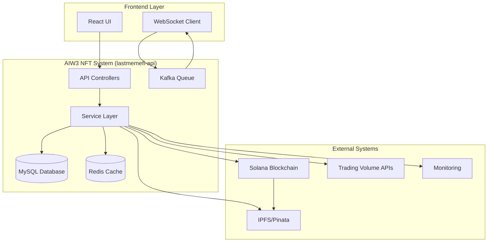

# External Systems Integration Overview

<!-- Document Metadata -->
**Version:** v1.0.0  
**Last Updated:** 2025-08-07  
**Status:** Active  
**Purpose:** Comprehensive overview of all external system integrations for the AIW3 NFT system.

---

## Table of Contents

1. [Overview](#overview)
2. [Solana Blockchain Integration](#solana-blockchain-integration)
3. [IPFS Storage Integration](#ipfs-storage-integration)
4. [Third-Party Services](#third-party-services)
5. [Integration Architecture](#integration-architecture)
6. [Security Considerations](#security-considerations)
7. [Monitoring and Observability](#monitoring-and-observability)

---

## Overview

The AIW3 NFT system integrates with multiple external systems to provide comprehensive NFT functionality. This document provides an overview of all external integrations and their roles in the system architecture.

### External System Categories

- **Blockchain Layer**: Solana network for NFT minting, burning, and ownership tracking
- **Storage Layer**: IPFS via Pinata for decentralized metadata and asset storage
- **Third-Party Services**: External APIs for enhanced functionality and verification
- **Infrastructure Services**: Monitoring, analytics, and operational tools

---

## Solana Blockchain Integration

### Core Integration Components

- **Solana Web3.js SDK**: Primary interface for blockchain interactions
- **SPL Token Program**: Standard program for token operations
- **Metaplex Token Metadata Program**: NFT metadata management
- **RPC Endpoints**: Network communication with Solana clusters

### Supported Networks

| Environment | Network | RPC Endpoint |
|------------|---------|--------------|
| Development | Devnet | `https://api.devnet.solana.com` |
| Staging | Testnet | `https://api.testnet.solana.com` |
| Production | Mainnet | `https://api.mainnet-beta.solana.com` |

### Key Operations

- **Minting**: Create new NFTs with metadata
- **Burning**: Destroy existing NFTs
- **Transfer**: Change NFT ownership
- **Query**: Read NFT status and metadata

**Reference**: [Solana-NFT-Technical-Reference.md](./Solana-NFT-Technical-Reference.md)

---

## IPFS Storage Integration

**Reference**: Complete IPFS via Pinata integration details, configuration, upload workflows, error handling, and performance optimization are documented in the [IPFS Pinata Integration Reference](./IPFS-Pinata-Integration-Reference.md).

**Key Integration Points**:
- Decentralized metadata and asset storage
- Pinata gateway for reliable content delivery
- Integration with existing AIW3 backend storage architecture

---

## Third-Party Services

### External API Integrations

| Service Type | Purpose | Integration Method |
|--------------|---------|-------------------|
| Price Oracles | Token/NFT valuation | REST API |
| Analytics | Usage tracking | SDK/Webhook |
| Verification | KYC/AML compliance | REST API |
| Notifications | User alerts | Webhook/WebSocket |

### Rate Limiting and Resilience

- **Retry Logic**: Exponential backoff for failed requests
- **Circuit Breakers**: Prevent cascading failures
- **Fallback Mechanisms**: Graceful degradation when services unavailable
- **Monitoring**: Track external service health and performance

---

## Integration Architecture

### System Integration Flow

### Integration Layers

| Layer | Components | Purpose |
|-------|------------|----------|
| **Frontend** | React UI, WebSocket | User interface and real-time updates |
| **API** | Controllers, Routes | Request handling and validation |
| **Service** | NFTService, Web3Service | Business logic orchestration |
| **Data** | MySQL, Redis | Persistent and cached data storage |
| **External** | Solana, IPFS, APIs | Blockchain and external services |

### Integration Patterns

- **Asynchronous Processing**: Non-blocking external system calls
- **Event-Driven Architecture**: Webhook and event-based communication
- **Caching Strategy**: Redis caching for frequently accessed external data
- **Message Queues**: Kafka for reliable external system communication

---

## Security Considerations

### Authentication and Authorization

- **API Keys**: Secure storage and rotation of external service credentials
- **Rate Limiting**: Prevent abuse of external service quotas
- **Network Security**: TLS encryption for all external communications
- **Access Control**: Principle of least privilege for external integrations

### Data Protection

- **Encryption**: End-to-end encryption for sensitive data
- **Data Residency**: Compliance with regional data protection requirements
- **Audit Logging**: Complete audit trail of external system interactions
- **Backup Strategy**: Redundant storage across multiple providers

---

## Monitoring and Observability

### Health Checks

- **Endpoint Monitoring**: Continuous monitoring of external service availability
- **Performance Metrics**: Response time and throughput tracking
- **Error Tracking**: Automated alerting for integration failures
- **SLA Monitoring**: Track adherence to external service SLAs

### Metrics and Alerting

| Metric | Threshold | Alert Level |
|--------|-----------|-------------|
| Solana RPC Response Time | > 2s | Warning |
| IPFS Upload Success Rate | < 95% | Critical |
| External API Error Rate | > 5% | Warning |
| Integration Uptime | < 99.5% | Critical |

### Dashboard Integration

- **Grafana Dashboards**: Real-time monitoring of external integrations
- **Prometheus Metrics**: Time-series data collection and analysis
- **Log Aggregation**: Centralized logging with ELK stack
- **Incident Response**: Automated escalation procedures

---

## Related Documentation

- [Solana NFT Technical Reference](./Solana-NFT-Technical-Reference.md) - Detailed Solana blockchain integration
- [IPFS Pinata Integration Reference](./IPFS-Pinata-Integration-Reference.md) - Complete IPFS integration guide
- [Legacy Systems Integration](../legacy-systems/) - Integration with existing AIW3 infrastructure
