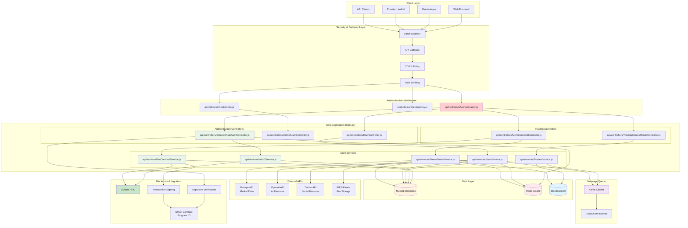
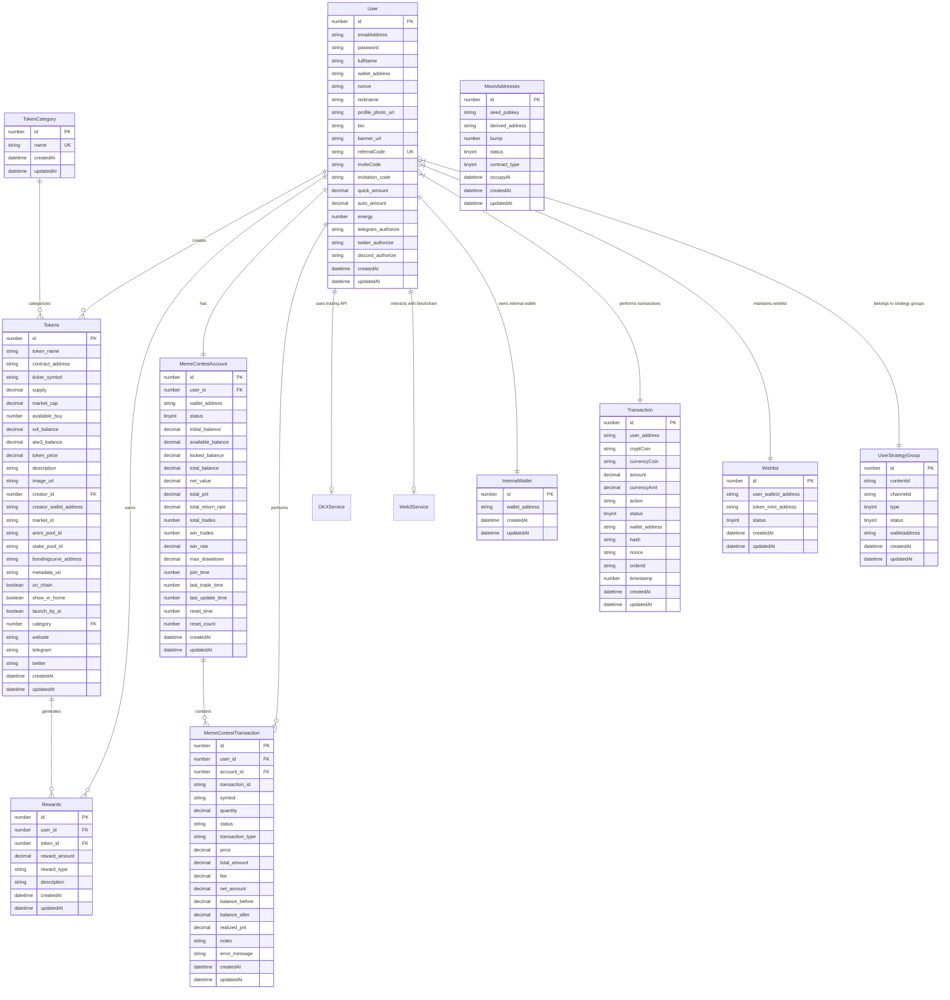

I'll analyze the repository structure to understand the wallet system architecture and then create a diagram for you.

Let me search for wallet-related components to understand the system better.

I used the tool find_direct_connections

I used the tool find_direct_connections

I used the tool nodes_semantic_search

I used the tool nodes_semantic_search

I used the tool nodes_semantic_search

Based on my analysis of the repository, I can now create an architectural diagram for this wallet system. The system is a comprehensive DeFi and AI agent platform built on Sails.js with Solana blockchain integration.

## Wallet System Architecture Diagram

## Key Components Overview

### **Authentication Layer**
- **`api/controllers/SolanaChainAuthController.js`**: Handles Phantom wallet authentication with signature verification
- **`api/policies/isAuthenticated.js`**: JWT token validation middleware
- **`api/policies/checkApiKey.js`**: API key validation for external access

### **Blockchain Integration**
- **`api/services/Web3Service.js`**: Solana network interaction and wallet balance management
- **`api/services/BetContractService.js`**: Smart contract operations for betting rounds
- Signature verification using nacl for transaction security

### **Trading System**
- **`api/controllers/MemeContestController.js`**: Meme token trading operations
- **`api/services/TradesService.js`**: Trade aggregation and analysis
- **`api/services/MemeTokenService.js`**: Token management and metadata handling

### **Data Architecture**
- **MySQL**: Primary transactional database for user data, trades, and tokens
- **Redis**: Session management and caching layer
- **Elasticsearch**: Search and analytics for trade data
- **Kafka**: Event streaming for real-time updates

### **Security Features**
- Multi-layer authentication (JWT, wallet signatures, API keys)
- CORS configuration for cross-origin requests
- Rate limiting and input validation
- Signature verification for blockchain transactions

This architecture supports a comprehensive wallet system with DeFi trading capabilities, AI agent management, and social features, all built on a secure and scalable foundation using Solana blockchain integration.
I'll analyze the wallet and private key relationships in this project by examining the codebase structure and relevant services. Let me start by exploring the project documentation and key components.

Now let me search for more specific information about wallet services and key management:

Let me examine the wallet and trading services more closely:

Let me examine the user authentication and wallet management models:

Let me examine the User model more closely and look for wallet-related fields:

Now let me check the internal_wallet model:

Let me search for OKX user configuration and API key management:

Let me search for user OKX configuration storage:

Let me search for user OKX credential models:

Let me search for OKX user configuration model directly:

Let me search for OKX user configuration files:

Let me search for files that might contain OKX user configurations:

Now let me examine the OKXUtil to understand the API key management:

Let me search for agent-related services and AI functionality:

Based on my comprehensive analysis of the AIW3 project codebase, I can now provide you with a detailed report on the wallet relationships and private key management in this system.

# AIW3 Wallet and Private Key Management - Comprehensive Report

## Overview
AIW3 is not primarily a distribution system as you described, but rather an AI-powered decentralized finance (DeFi) platform that integrates blockchain trading, AI agents, and social features. The wallet relationship is more complex than a simple distribution model.

## Wallet Architecture

### 1. User Authentication Wallets
**Service Type**: User-controlled private keys
**Purpose**: Primary authentication and identity verification
**Implementation**:
- Users authenticate using external wallets (Phantom, MetaMask)
- The `api/models/User.js::User` model stores `wallet_address` but NOT private keys
- Authentication uses signature verification through `api/controllers/VerifyController.js::VerifyController`
- Users sign nonces to prove wallet ownership without revealing private keys

### 2. System Operator Wallets  
**Service Type**: Hosted private keys (AIW3-controlled)
**Purpose**: Automated trading operations and contract interactions
**Implementation**:
- `api/services/BetContractService.js::operatorKeypair` and `api/services/BetContractService2.js::operatorKeypair`
- These use hardcoded private keys (`OPERATOR_PRIVATE_KEY`) for betting/trading contract operations
- AIW3 hosts these keys to execute automated transactions on behalf of the system

### 3. Exchange API Credentials
**Service Type**: Hosted credentials (AIW3-managed)
**Purpose**: Trading on centralized exchanges (OKX, Binance)
**Implementation**:
- `api/utils/OKXUtil.js` contains hardcoded API credentials (`API_Key`, `Secret_Key`, `Passphrase`)
- `api/services/OKXService.js::OKXService.configure` method allows dynamic API key configuration
- These are stored and managed by AIW3 for automated trading

## Services Requiring Different Key Management

### User-Controlled Private Keys Required For:
1. **Authentication & Login**: Users must sign messages with their own wallets
2. **Direct Blockchain Transactions**: When users want to interact directly with smart contracts
3. **Wallet Verification**: Proving ownership of assets or addresses

### AIW3-Hosted Keys Used For:
1. **Automated Trading**: The `api/services/BetContractService.js` operations
2. **Exchange Trading**: OKX API operations through `api/services/OKXService.js`
3. **System Operations**: Contract deployments and automated processes
4. **AI Agent Trading**: Agents executing trades on behalf of users

## Trading and Exchange Integration

### Exchange Operations
- **OKX Integration**: `api/services/OKXService.js` and `api/controllers/OKXController.js`
- **Trading Services**: `api/services/OkxTradingService.js` and `api/services/OkxTradingApiService.js`
- **User Revenue Tracking**: `api/models/OkxUserRevenue.js` tracks user earnings

### Key Management for Trading:
1. **User Authentication**: Users authenticate with their wallets but don't need to provide private keys
2. **Exchange API Keys**: Users may need to provide their exchange API credentials (stored by AIW3)
3. **Automated Execution**: AIW3 uses its hosted keys to execute trades via exchange APIs

## AI Agent System

### Agent Trading Operations
- **Agent Models**: `api/models/Agents.js`, `api/models/agent_trading_plugin.js`
- **Agent Controllers**: `api/controllers/AgentTradingController.js`
- **AI Integration**: `api/utils/GPTUtil.js`, `api/services/UserAgentsService.js`

### Agent Key Management:
- Agents operate using AIW3's hosted credentials
- Users don't need to provide private keys to agents
- Agents use the system's exchange API keys for trading

## Security Architecture

### Multi-Layer Security:
1. **Authentication Layer**: Wallet signature verification
2. **API Layer**: JWT tokens for session management  
3. **Exchange Layer**: Encrypted API credentials
4. **Blockchain Layer**: Smart contract interactions via hosted keys

## Summary

**AIW3 hosts approximately 2-3 different types of private keys:**
1. **Operator keypairs** for smart contract interactions (2 instances found)
2. **Exchange API credentials** for OKX/Binance trading
3. **System service keys** for various automated operations

**Users maintain control of:**
- Their authentication wallet private keys
- Direct blockchain transaction signing
- Optional: Their own exchange API keys (if they want direct control)

**AIW3 handles automatically:**
- All smart contract interactions via hosted operator keys
- Exchange trading via hosted API credentials  
- AI agent operations using system credentials
- Revenue distribution and tracking

The system is designed so users can participate without exposing their private keys to AIW3, while still benefiting from automated trading and AI agent services through AIW3's hosted infrastructure.

I'll help you create an ERD (Entity Relationship Diagram) for the wallets, services, and related entities in this repository. Let me first explore the codebase to understand the data structure and relationships.

I used the tool nodes_semantic_search

I used the tool get_folder_tree_structure

I used the tool get_code

I used the tool get_code

I used the tool get_code

I used the tool get_code

I used the tool get_code

I used the tool get_code

I used the tool nodes_semantic_search

I used the tool get_code

Now I have enough information to create a comprehensive ERD for the wallets, services, and related entities in this repository. Based on my analysis, I can see this is a cryptocurrency/trading platform with multiple interconnected entities.

## Entity Relationship Diagram (ERD) for LastMemefi-API

Here's the ERD showing the relationships between wallets, services, and related entities:

### Key Entity Relationships:

1. **User Entity**: Central entity containing wallet addresses, authentication data, and user preferences
   - Has one-to-one relationship with `api/models/MemeContestAccount.js`
   - Has one-to-many relationships with `api/models/Rewards.js`, `api/models/Tokens.js`

2. **Wallet Management**:
   - `api/models/User.js` contains primary wallet_address
   - `api/models/internal_wallet.js` manages internal wallet addresses
   - `api/models/Transaction.js` tracks all wallet transactions

3. **Token Ecosystem**:
   - `api/models/Tokens.js` defines token properties and creator relationships
   - `api/models/TokenCategory.js` provides token categorization
   - `api/models/Wishlist.js` tracks user token preferences

4. **Trading & Contest System**:
   - `api/models/MemeContestAccount.js` manages contest trading accounts
   - `api/models/MemeContestTransaction.js` tracks contest trades
   - `api/services/OKXService.js` provides external trading API integration

5. **Rewards System**:
   - `api/models/Rewards.js` tracks user rewards (milestone, transaction_bonus, referral_bonus)

6. **Blockchain Integration**:
   - `api/services/Web3Service.js` handles Solana blockchain interactions
   - `api/models/MoonAddresses.js` manages blockchain address derivation

This ERD represents a comprehensive cryptocurrency trading and meme token platform with integrated wallet management, contest trading, rewards system, and blockchain connectivity.

I'll help you understand the business logic, rules, and constraints by analyzing the repository structure and key components. Let me start by exploring the codebase to identify the main entities and their fields.

Now let me search for specific models and their fields to understand the business logic better:

Now let me examine the key models to understand their fields and business logic:

Let me examine other key models to understand the business logic:

Now let me explore more models to get a complete picture:

I used the tool get_code

Let me get the Tokens model as well:

Now let me explore some service files to understand business rules:

Let me get more information about trading constraints and validation:

Based on my analysis of the repository, I can now provide you with a comprehensive explanation of the business logic, rules, and constraints for each field across the main entities in the LastMeme API system:

## Core Business Entities and Field Explanations

### **1. Agents Model (`api/models/Agents.js`)**

**Financial Management Fields:**
- `contract_address` (64 chars): Blockchain contract identifier for agent monetization
- `credits_consumed`, `total_consumption_credit`, `remaining_credits` (decimal): Credit-based billing system where agents consume credits for operations
- **Business Rule**: Credits must be managed to prevent unlimited usage and ensure sustainable operations

**Agent Identity & Configuration:**
- `name` (255 chars), `description` (3000 chars), `personality` (1000 chars): Core agent branding
- `Instruction` (6000 chars): Detailed behavioral instructions for AI responses
- `knowledge_base` (text): Unlimited knowledge storage for agent expertise
- **Constraint**: Description limited to 3000 chars to prevent database bloat

**Social Media Integration:**
- `telegram_authorize`, `twitter_authorize`, `discord_authorize` (255 chars): OAuth tokens for platform integration
- **Business Rule**: At least one social platform must be configured for agent publishing

**Plugin System:**
- `use_twitter_plugin`, `use_onchain_plugin` (tinyint): Binary flags for feature enablement
- `twitter_plugin_use_preset`, `onchain_plugin_use_preset`: Configuration presets
- **Constraint**: Plugins require proper authorization tokens to function

**Status Management:**
- `framework` (tinyint, default: 1): AI framework identifier (1 = default system)
- `status` (tinyint, default: 0): Agent lifecycle status (0=active, 1=inactive)
- `is_deleted` (tinyint, default: 0), `is_open` (tinyint, default: 1): Soft deletion and visibility flags
- `ispublish` (tinyint): Publication status for marketplace visibility

### **2. User Model (`api/models/User.js`)**

**Authentication & Security:**
- `emailAddress` (200 chars): Optional email for traditional auth
- `wallet_address` (string): Primary blockchain-based authentication
- `nonce` (string): Cryptographic challenge for wallet signature verification
- **Business Rule**: Either email or wallet authentication required, wallet preferred

**Profile Management:**
- `nickname` (string), `updateNicknameAt` (datetime): User identity with change tracking
- **Constraint**: Nickname changes limited to once per 7 days (business rule from documentation)
- `bio` (500 chars), `banner_url`, `profile_photo_url`: User customization fields

**Referral System:**
- `referralCode` (unique string): Auto-generated unique code (REF + 5 random chars)
- `invitation_code` (string): Code used when signing up via referral
- **Business Logic**: Automatic referral code generation in `beforeCreate` lifecycle ensures every user can refer others

**Trading Configuration:**
- `quick_amount`, `auto_amount` (DECIMAL 30,10): Predefined trading amounts for rapid execution
- `energy` (number, required): User's available energy for operations
- **Constraint**: Energy system prevents spam and manages resource usage

**Financial Integration:**
- Stripe fields (`stripeCustomerId`, `hasBillingCard`, etc.): Payment processing integration
- **Business Rule**: Billing card required for premium features

### **3. Tokens Model (`api/models/Tokens.js`)**

**Core Token Properties:**
- `token_name`, `ticker_symbol`: Token identification
- `contract_address`: Blockchain contract reference
- `supply` (DECIMAL 30,10): Total token supply with high precision
- **Constraint**: High decimal precision (30,10) accommodates micro-transactions

**Market Mechanics:**
- `token_price` (DECIMAL 20,10): Current market price
- `market_cap` (DECIMAL 30,10): Calculated market capitalization
- `avaliable_buy` (number): Tokens available for purchase
- **Business Rule**: Market cap = supply × token_price

**Liquidity Management:**
- `sol_balance`, `aiw3_balance` (DECIMAL 30,10): Platform liquidity pools
- `market_id`, `amm_pool_id`, `bondingcurve_address`: DEX integration identifiers
- **Constraint**: Sufficient liquidity required for trading operations

**Token Lifecycle:**
- `on_chain` (boolean, default: true): Deployment status
- `launch_by_ai` (boolean, default: false): AI-created token flag
- `ai_create_status` (tinyint): AI creation workflow status (1=in progress, 2=completed)
- **Business Rule**: Tokens must be on-chain before trading

**Social Features:**
- `votes`, `vote_up`, `vote_down` (numbers): Community sentiment tracking
- `website`, `telegram`, `twitter`: Social media presence
- **Constraint**: Social links enhance token credibility and visibility

### **4. Trades Model (`api/models/Trades.js`)**

**Core Transaction Data:**
- `user_id` (required): Foreign key to User model
- `token_id` (required): Foreign key to Tokens model
- `amount` (DECIMAL 30,10, required): Quantity of tokens traded
- `price_per_token` (DECIMAL 20,10, required): Execution price
- `total_price` (DECIMAL 30,10, required): Total transaction value

**Transaction Validation:**
- `trade_type` (required): Must be 'buy', 'sell', 'BUY', or 'SELL'
- `wallet_address` (required): Executing wallet address
- `hash` (required): Blockchain transaction hash for verification
- **Business Rule**: `total_price` should equal `amount × price_per_token`

**Blockchain Integration:**
- `tokenMintAddress`: Solana token mint address
- `remaining_token` (DECIMAL 30,10): Available tokens after transaction
- `usd_price`, `total_usd_price`: USD value calculations
- **Constraint**: All trades must have valid blockchain confirmation

### **5. Trading Contest Configuration (`config/trading-contest.js`)**

**Contest Periods:**
- `startTime`, `endTime`: Contest duration with millisecond precision
- `status`: 'pending', 'active', 'ended' workflow
- **Business Rule**: Official contest period must be within main contest period

**Participant Rules:**
- `initialBalance`: 10,000 USDT starting balance
- `maxParticipants`: 0 (unlimited participation)
- **Constraint**: All participants start with equal virtual balance

**Trading Constraints:**
- `minOrderSize`: 0.001 (prevents micro-spam orders)
- `maxOrderSize`: 10,000 (risk management)
- `tradingFee`: 0.001 (0.1% fee structure)
- **Business Rule**: Order sizes must be within defined limits

**Reward Structure:**
- Volume-based tiers (1 to 1,000,000+ requirement)
- Ranking-based weekly rewards (1st place gets highest reward)
- **Constraint**: Higher volume requirements unlock larger reward pools

## Key Business Constraints & Rules

1. **Credit System**: Agents consume credits for operations, requiring balance management
2. **Social Integration**: At least one social platform required for agent functionality  
3. **Referral System**: Automatic unique code generation prevents conflicts
4. **Trading Limits**: Min/max order sizes prevent abuse and manage risk
5. **Energy System**: Prevents spam through resource limitation
6. **Precision Requirements**: High decimal precision for financial calculations
7. **Blockchain Verification**: All trades require valid blockchain confirmation
8. **Contest Fairness**: Equal starting balances and clear ranking criteria
9. **Profile Restrictions**: Nickname changes limited to maintain user identity stability
10. **Liquidity Requirements**: Sufficient pool balances required for trading operations

These constraints ensure system stability, prevent abuse, maintain fairness, and provide a robust foundation for the AI-powered trading and social platform.

I'll help you find business information about the wallet system in this repository. Let me start by searching for documentation and then explore the relevant nodes.

Now let me explore specific wallet-related nodes to understand the business logic better:

Let me check the Transaction model:

Let me search for wallet-related services and controllers:

Let me examine the Solana authentication controller and Web3 service:

Let me search for more wallet-related business information:

Let me check the User model to understand the wallet structure:

I used the tool get_code

Let me explore more business-related services:

Let me check the trading contest service to understand more business logic:

Now let me search for more information about the business model and features:

Based on my comprehensive analysis of the repository, I can provide you with detailed business information about this wallet system and the nodes that reflect these business aspects:

## Business Information About the Wallet System

This is a **comprehensive DeFi and AI agent platform** built on the Solana blockchain with the following key business components:

### **Core Business Model**

1. **Multi-Wallet Authentication System**
   - Supports Phantom, MetaMask, and Solana wallets
   - JWT tokens with 3-year expiry for session management
   - Reflected in: `api/controllers/SolanaChainAuthController.js::phantomSignInOrSignUp`, `api/services/Web3Service.js`

2. **AI Agent Trading Platform**
   - Users can create AI agents for automated trading
   - Plugin marketplace for extending agent capabilities
   - Agent performance tracking and monetization
   - Reflected in: `api/services/UserAgentsService.js`, `api/services/TradingContestService.js`

3. **Token Management & Trading**
   - Token creation and launch platform
   - Real-time trading execution on Solana
   - Market data integration via Birdeye API
   - Reflected in: `api/models/Trades.js`, `api/services/TradesService.js`

### **Revenue Streams**

1. **Transaction Fees**
   - Platform takes fees from trading transactions
   - Reflected in: `api/controllers/TransactionController.js`, `api/models/Transaction.js`

2. **Withdrawal Processing**
   - OKX integration for user withdrawals and revenue sharing
   - Reflected in: `api/services/OkxUserWithdrawalLogService.js`, `api/models/OkxUserRevenue.js`

3. **Trading Contest System**
   - Competitive trading with prizes and rewards
   - Complex margin and liquidation system
   - Reflected in: `api/services/TradingContestService.js`, `api/models/TradingPosition.js`

### **Key Business Features**

1. **Social Trading Platform**
   - Community boards and user following
   - Leaderboards and achievement systems
   - Referral program with unique codes
   - Reflected in: `api/models/User.js::generateReferralCode`

2. **Advanced Trading Infrastructure**
   - Multiple order types (limit, stop-loss, take-profit)
   - Risk management and liquidation systems
   - Portfolio tracking and analytics
   - Reflected in: `api/services/TradingContestService.js::calculateAccountStats`

3. **Blockchain Integration**
   - Solana Web3 integration for transaction processing
   - Smart contract interactions for betting/trading
   - Reflected in: `api/services/BetContractService.js`, `api/services/Web3Service.js`

### **Business Logic Nodes**

**Core Wallet & Authentication:**
- `api/models/User.js` - User profile with wallet addresses, referral codes
- `api/controllers/SolanaChainAuthController.js` - Phantom wallet authentication
- `api/services/Web3Service.js` - Solana blockchain interactions

**Transaction Processing:**
- `api/controllers/TransactionController.js` - Deposit/withdrawal management
- `api/models/Transaction.js` - Transaction records with status tracking
- `api/services/OkxUserWithdrawalLogService.js` - Withdrawal processing

**Trading & Revenue:**
- `api/services/TradingContestService.js` - Complex trading contest logic
- `api/models/TradingPosition.js` - Position management with P&L tracking
- `api/models/OkxUserRevenue.js` - Revenue sharing system

**Business Intelligence:**
- `api/services/TradesService.js` - Trade aggregation and analysis
- `api/models/TradingSettlement.js` - Settlement records with performance metrics

This platform operates as a **comprehensive DeFi ecosystem** combining AI automation, social trading, token launching, and competitive trading contests, with multiple revenue streams from transaction fees, withdrawal processing, and platform services.
